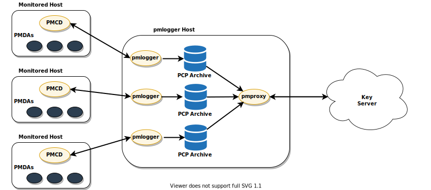

.. include:: ../../refs.rst

Scaling Guidelines
##################

This technical note explores the scalability of centralized time series analysis with `Performance Co-Pilot (PCP) <https://pcp.io>`_.

Architectures
*************

PCP supports multiple deployment architectures, based on the scale of the PCP deployment.
Each of the available architectures is described below this table which provides guidance on which deployment architecture suits best based on the number of monitored hosts.

+-------------+---------+------------+------------+---------------+-----------+-------------+
| Number of   | pmcd    | pmlogger   | pmproxy    | keyserver     | keyserver | Recommended |
|             |         |            |            |               |           |             |
| hosts (N)   | servers | servers    | servers    | servers       | cluster   | deployments |
+=============+=========+============+============+===============+===========+=============+
| 1 - 10      |    N    |   1 to N   |   1 to N   |       1       |    No     |  A, B or C  |
+-------------+---------+------------+------------+---------------+-----------+-------------+
| 10 - 100    |    N    | N/10 to N  |   1 to N   |   1 to N/10   |   Maybe   |  B, C or D  |
+-------------+---------+------------+------------+---------------+-----------+-------------+
| 100 - 1000  |    N    | N/100 to N | N/100 to N | N/100 to N/10 |    Yes    |    B or D   |
+-------------+---------+------------+------------+---------------+-----------+-------------+

A. Localhost setup
------------------

The simplest setup is where each service runs locally on the monitored machine.
This is the default deployment when each service is started with no configuration changes.
Scaling beyond the individual node is not attempted and we are unable to make use of the distributed analytic capabilities that PCP and Grafana offer in anything beyond an ad-hoc fashion.

B. Decentralized logging
------------------------

With one configuration change to the localhost setup to centralize only the key server, we achieve a decentralized logging setup.
In this model `pmlogger(1)`_ is run on each monitored host and retrieves metrics from a local `pmcd(1)`_ instance.
A local `pmproxy(1)`_ daemon exports the performance metrics to a central key server.

C. Centralized logging (pmlogger farm)
--------------------------------------

In cases where the resource usage on the monitored hosts is constrained, another deployment option is a **pmlogger farm**.
In this setup, a single logger host runs multiple `pmlogger(1)`_ processes, each configured to retrieve performance metrics from a different remote `pmcd(1)`_ host.
The centralized logger host is also configured to run the `pmproxy(1)`_ daemon, which discovers the resulting PCP archives logs and loads the metric data into a key server.

D. Federated setup (multiple pmlogger farms)
--------------------------------------------

For large scale deployments, we advise deploying multiple `pmlogger(1)`_ farms in a federated fashion.
For example, one `pmlogger(1)`_ farm per rack or data center.
Each pmlogger farm loads the metrics into a central key server.

.. figure:: federated-pmlogger-farm.svg

Key server deployment options
-----------------------------

The default deployment is a standalone Valkey key server on the localhost.
However, key servers can optionally run in a highly-available and highly scalable *clustered* fashion, where data is sharded across multiple hosts.
Another option is to deploy a key server cluster in the cloud, or to utilize a managed cluster from a cloud vendor.

.. note::

    For PCP versions before 5.3.0, *localhost* and *pmlogger farm* are the only recommended deployment architectures.

Sizing Factors
**************

Remote system size
------------------

The number of CPUs, disks, network interfaces and other hardware resources affects the amount of data collected by each pmlogger on the centralized logging host.
In the measurements below, every remote system has 64 CPUs, one disk and one network interface.
In these tests, the pmcd hosts are actually all instances of a container running pmcd, exposing only the pmcd tcp port.

Logged Metrics
--------------

The number and types of logged metrics play an important role.
In particular, the per-process ``proc.*`` metrics require a large amount of disk space (e.g. with the standard pcp-zeroconf setup, 10s logging interval, 11 MB without proc metrics vs. 155 MB with proc metrics - a factor of 10 times more).
Additionally, the number of instances for each metric, for example the number of CPUs, block devices and network interfaces also impacts the required storage capacity.

Logging Interval
----------------

The interval (how often metrics are logged), dramatically affects the storage requirements.
The expected daily PCP archive file sizes are written to the ``pmlogger.log`` file for each pmlogger instance.
These values are uncompressed estimates (see pmlogger ``-r`` option in `pmlogger(1)`_).
Since PCP archives compress very well (approximately 10:1), the actual long term disk space requirements can be determined for a particular site.

pmlogrewrite
------------

After every PCP upgrade a tool called `pmlogrewrite(1)`_ will run and will rewrite old archives if there were changes in the metric metadata from the previous version and the new version of PCP.
This process duration scales linear with the number of archives stored.

Configuration Options
*********************

sysctl and rlimit settings
--------------------------

When archive discovery is enabled, pmproxy requires 4 file descriptors for every pmlogger that it is monitoring/log-tailing, plus additional file descriptors for the daemon logs and pmproxy client sockets, if any.
Each pmlogger process uses about 20 file descriptors for the remote pmcd socket, archive files, daemon logs and others.
In total, this can exceed the default 1024 soft limit on a system running around 200 pmloggers.
The pmproxy daemon in pcp-5.3.0 and later automatically increases the soft limit to the hard limit.
On earlier versions of PCP, tuning will be required if a high number of pmloggers are to be deployed.

Local Archives
--------------

The `pmlogger(1)`_ daemon stores metrics of local and remote pmcds in ``/var/log/pcp/pmlogger``.
To control the logging interval, update the control file located at ``/etc/pcp/pmlogger/control.d`` and add ``-t X`` in the arguments, where ``X`` is the logging interval in seconds.
To configure which metrics should be logged, run ``pmlogconf /var/lib/pcp/config/pmlogger/<configfile>``.
To specify retention settings, i.e. when to purge old PCP archives, update the ``/etc/sysconfig/pmlogger_timers`` file and specify ``PMLOGGER_DAILY_PARAMS="-E -k X"``, where ``X`` is the amount of days to keep PCP archives.

Key Server
----------

The `pmproxy(1)`_ daemon sends logged metrics from `pmlogger(1)`_ to a key server such as `Valkey <https://valkey.io>`_.
To update the logging interval or the logged metrics, see the section above.
Two options are available to specify the retention settings in the pmproxy configuration file located at ``/etc/pcp/pmproxy/pmproxy.conf``:

* ``stream.expire`` specifies the duration when stale metrics should be removed, i.e. metrics which were not updated in a specified amount of time (in seconds)
* ``stream.maxlen`` specifies the maximum number of metric values for one metric per host. This setting should be the retention time divided by the logging interval, for example 20160 for 14 days of retention and 60s logging interval (60*60*24*14/60)

Results and Analysis
********************

Centralized logging (pmlogger farm)
-----------------------------------

The following results were gathered on a :ref:`pmlogger farm<C. Centralized logging (pmlogger farm)>` deployment,
with a default **pcp-zeroconf 5.3.2** installation (version 5.3.1-3 on RHEL), where each remote host is an identical container instance
running `pmcd(1)`_ on a server with 64 CPU cores, 376 GB RAM and 1 disk attached (as mentioned above, 64 CPUs increases per-CPU metric volume).
The key server is co-located on the same host as pmlogger and pmproxy, and ``proc`` metrics of remote nodes are *not* included.
The memory values refer to the RSS (Resident Set Size) value.

**10s logging interval:**

+-----------+----------------+----------+------------------+---------+--------------+---------+-----------+-----------------+-------------+
| Number of | PCP Archives   | pmlogger | pmlogger Network | pmproxy | keys Memory  | pmproxy | Disk IOPS | Disk Throughput | Disk        |
|           |                |          |                  |         |              |         |           |                 |             |
| Hosts     | Storage p. Day | Memory   | per Day (In)     | Memory  | per Day      | CPU%    | (write)   | (write)         | Utilization |
+===========+================+==========+==================+=========+==============+=========+===========+=================+=============+
| 10        | 91 MB          | 160 MB   | 2 MB             | 1.4 GB  | 2.6 GB       | 1%      | 25        | 19 MB/s         | 4%          |
+-----------+----------------+----------+------------------+---------+--------------+---------+-----------+-----------------+-------------+
| 50        | 522 MB         | 580 MB   | 9 MB             | 6.3 GB  | 12 GB        | 5%      | 70        | 52 MB/s         | 10%         |
+-----------+----------------+----------+------------------+---------+--------------+---------+-----------+-----------------+-------------+

**60s logging interval:**

+-----------+----------------+----------+------------------+---------+--------------+
| Number of | PCP Archives   | pmlogger | pmlogger Network | pmproxy | keys Memory  |
|           |                |          |                  |         |              |
| Hosts     | Storage p. Day | Memory   | per Day (In)     | Memory  | per Day      |
+===========+================+==========+==================+=========+==============+
| 10        | 20 MB          | 104 MB   | 0.38 MB          | 2.67 GB | 0.54 GB      |
+-----------+----------------+----------+------------------+---------+--------------+
| 50        | 120 MB         | 524 MB   | 1.75 MB          | 5.5 GB  | 2.65 GB      |
+-----------+----------------+----------+------------------+---------+--------------+
| 100       | 271 MB         | 1049 MB  | 3.48 MB          | 9 GB    | 5.3 GB       |
+-----------+----------------+----------+------------------+---------+--------------+

**Note:** pmproxy queues key server requests and employs pipelining to speed up queries.
This can result in bursts of high memory usage.
There are plans to optimize memory usage in future versions of PCP (`#1341 <https://github.com/performancecopilot/pcp/issues/1341>`_).
For further troubleshooting, please see the `High memory usage`_ section in the troubleshooting chapter.

Federated setup (multiple pmlogger farms)
-----------------------------------------

The following results were observed with a :ref:`federated setup<D. Federated setup (multiple pmlogger farms)>`
consisting of three :ref:`pmlogger farms<C. Centralized logging (pmlogger farm)>`, where each pmlogger farm
was monitoring 100 remote hosts, i.e. 300 hosts in total.
The setup of the pmlogger farms was identical to the configuration above (60s logging interval), except that the key servers were operating in cluster mode.

+----------------+----------+-------------------+---------+-------------+
| PCP Archives   | pmlogger | Network           | pmproxy | keys Memory |
|                |          |                   |         |             |
| Storage p. Day | Memory   | per Day (In/Out)  | Memory  | per Day     |
+================+==========+===================+=========+=============+
| 277 MB         | 1058 MB  | 15.6 MB / 12.3 MB | 6-8 GB  | 5.5 GB      |
+----------------+----------+-------------------+---------+-------------+

**Note:** All values are per host.

The network bandwidth is higher due to the inter-node communication of the key server cluster.

Troubleshooting
***************

High memory usage
-----------------

To troubleshoot high memory usage, please run ``pmrep :pmproxy`` and observe the *inflight* column.
This column shows how many key server requests are in-flight, i.e. they are queued (or sent) and no reply was received so far.
A high number indicates that a) the pmproxy process is busy processing new PCP archives and doesn't have spare CPU cycles to process key server requests and responses or b) the key server (or cluster) is overloaded and cannot process incoming requests on time.

.. note::

    For PCP versions before 5.3.0, please refer to `Appendix A`_.

Appendix A
**********

There are known memory leaks in `pmproxy(1)`_ in versions before 5.3.0, resulting in higher memory usage than expected.
As a workaround you can limit the memory usage of pmproxy by running: ``systemctl edit pmproxy`` and set:

.. code-block:: ini

    [Service]
    MemoryMax=10G

After saving the file, restart pmproxy by running ``systemctl restart pmproxy``.
