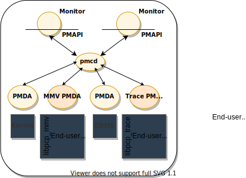
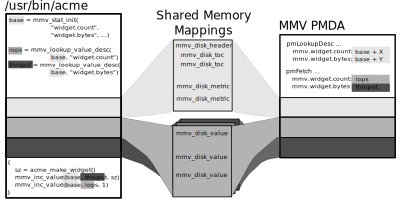
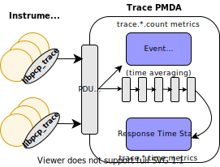
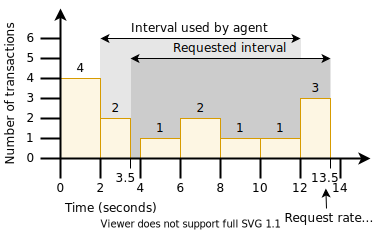

.. _InstrumentingApplications:

Instrumenting Applications
############################

.. contents::

This chapter provides an introduction to ways of instrumenting applications using PCP.

The first section covers the use of the Memory Mapped Value (MMV) Performance Metrics Domain Agent (PMDA) to generate customized metrics from an application. 
This provides a robust, extremely efficient mechanism for transferring custom instrumentation into the PCP infrastructure. It has been successfully deployed in 
production environments for many years, has proven immensely valuable in these situations, and can be used to instrument applications written in a number of 
programming languages.

The Memory Mapped Value library and PMDA is supported on every PCP platform, and is enabled by default.

.. note::
   A particularly expansive Java API is available from the separate `Parfait <https://code.google.com/archive/p/parfait/>`_ project. It supports both the existing 
   JVM instrumentation, and custom application metric extensions.

The chapter also includes information on how to use the MMV library (**libpcp_mmv**) for instrumenting an application. The example programs are installed in 
``${PCP_DEMOS_DIR}/mmv``.

The second section covers the design of the Trace PMDA, in an effort to explain how to configure the agent optimally for a particular problem domain. This information 
supplements the functional coverage which the man pages provide to both the agent and the library interfaces.

This part of the chapter also includes information on how to use the Trace PMDA and its associated library (**libpcp_trace**) for instrumenting applications. The 
example programs are installed in ``${PCP_DEMOS_DIR}/trace``.

.. warning::
   The current PCP trace library is a relatively heavy-weight solution, issuing multiple system calls per trace point, runs over a TCP/IP socket even locally and 
   performs no event batching. As such it is not appropriate for production application instrumentation at this stage.

A revised application tracing library and PMDA are planned which will be light-weight, suitable for production system tracing, and support event metrics and other 
advances in end-to-end distributed application tracing.

The application instrumentation libraries are designed to encourage application developers to embed calls in their code that enable application performance data to 
be exported. When combined with system-level performance data, this feature allows total performance and resource demands of an application to be correlated with 
application activity.

For example, developers can provide the following application performance metrics:

* Computation state (especially for codes with major shifts in resource demands between phases of their execution)
* Problem size and parameters, that is, degree of parallelism throughput in terms of sub-problems solved, iteration count, transactions, data sets inspected, and so on
* Service time by operation type

Application and Performance Co-Pilot Relationship
***************************************************

The relationship between an application, the **pcp_mmv** and **pcp_trace** instrumentation libraries, the MMV and Trace PMDAs, and the rest of the PCP 
infrastructure is shown in `Figure 4.1. Application and PCP Relationship`_:

.. _Figure 4.1. Application and PCP Relationship:

     Figure 4.1. Application and PCP Relationship

Once the application performance metrics are exported into the PCP framework, all of the PCP tools may be leveraged to provide performance monitoring and management, including:

* Two- and three-dimensional visualization of resource demands and performance, showing concurrent system activity and application activity.

* Transport of performance data over the network for distributed performance management.

* Archive logging for historical records of performance, most useful for problem diagnosis, postmortem analysis, performance regression testing, capacity planning,
  and benchmarking.

* Automated alarms when bad performance is observed. These apply both in real-time or when scanning archives of historical application performance.

Performance Instrumentation and Sampling
******************************************

The **pcp_mmv** library provides function calls to assist with extracting important performance metrics from a program into a shared, in-memory location such that 
the MMV PMDA can examine and serve that information on behalf of PCP client tool requests. The **pcp_mmv** library is described in the **mmv_stats_init(3)**, 
**mmv_lookup_value_desc(3)**, **mmv_inc_value(3)** man pages. Additionally, the format of the shared memory mappings is described in detail in **mmv(5)**.

MMV PMDA Design
*****************

An application instrumented with memory mapped values directly updates the memory that backs the metric values it exports. The MMV PMDA reads those values directly, 
from the **same** memory that the application is updating, when current values are sampled on behalf of PMAPI client tools. This relationship, and a simplified MMV 
API, are shown in `Figure 4.2. Memory Mapped Page Sharing`_.

.. _Figure 4.2. Memory Mapped Page Sharing:

     Figure 4.2. Memory Mapped Page Sharing

It is worth noting that once the metrics of an application have been registered via the **pcp_mmv** library initialisation API, subsequent interactions with the 
library are not intrusive to the instrumented application. At the points where values are updated, the only cost involved is the memory mapping update, which is a 
single memory store operation. There is no need to explicitly transfer control to the MMV PMDA, nor allocate memory, nor make system or library calls. The PMDA will 
only sample the values at times driven by PMAPI client tools, and this places no overhead on the instrumented application.

Memory Mapped Values API
*************************

The **libpcp_mmv** Application Programming Interface (API) can be called from C, C++, Perl and Python (a separate project, Parfait, services the needs of Java 
applications). Each language has access to the complete set of functionality offered by **libpcp_mmv**. In most cases, the calling conventions differ only slightly 
between languages - in the case of Java and Parfait, they differ significantly however.

Starting and Stopping Instrumentation
======================================

Instrumentation is begun with an initial call to **mmv_stats_init**, and ended with a call to **mmv_stats_stop**. These calls manipulate global state shared by the 
library and application. These are the only calls requiring synchonization and a single call to each is typically performed early and late in the life of the 
application (although they can be used to reset the library state as well, at any time). As such, the choice of synchonization primitive is left to the application, 
and none is currently performed by the library.

.. sourcecode:: none

 void *mmv_stats_init(const char *name, int cluster, mmv_stats_flags_t flags,
                      const mmv_metric_t *stats, int nstats,
                      const mmv_indom_t *indoms, int nindoms)

The *name* should be a simple symbolic name identifying the application. It is usually used as the first application-specific part of the exported metric names, as 
seen from the MMV PMDA. This behavior can be overriden using the *flags* parameter, with the MMV_FLAG_NOPREFIX flag. In the example below, full metric names such as 
**mmv.acme.products.count** will be created by the MMV PMDA. With the MMV_FLAG_NOPREFIX flag set, that would instead become **mmv.products.count**. It is recommended 
to not disable the prefix - doing so requires the applications to ensure naming conflicts do not arise in the MMV PMDA metric names.

The *cluster* identifier is used by the MMV PMDA to further distinguish different applications, and is directly used for the MMV PMDA PMID cluster field described in 
:ref:`Example 2.3. __pmID_int Structure <Example 2.3. __pmID_int Structure>`, for all MMV PMDA metrics.

All remaining parameters to **mmv_stats_init** define the metrics and instance domains that exist within the application. These are somewhat analogous to the final 
parameters of **pmdaInit(3)**, and are best explained using `Example 4.1. Memory Mapped Value Instance Structures`_ and `Example 4.2. Memory Mapped Value Metrics Structures`_. 
As mentioned earlier, the full source code for this example instrumented application can be found in ``${PCP_DEMOS_DIR}/mmv``.

.. _Example 4.1. Memory Mapped Value Instance Structures:

**Example 4.1. Memory Mapped Value Instance Structures**

.. sourcecode:: none

 #include <pcp/pmapi.h>
 #include <pcp/mmv_stats.h>
 
 static mmv_instances_t products[] = {
     {   .internal = 0, .external = "Anvils" },
     {   .internal = 1, .external = "Rockets" },
     {   .internal = 2, .external = "Giant_Rubber_Bands" },
 };
 #define ACME_PRODUCTS_INDOM 61
 #define ACME_PRODUCTS_COUNT (sizeof(products)/sizeof(products[0]))
 
 static mmv_indom_t indoms[] = {
     {   .serial = ACME_PRODUCTS_INDOM,
         .count = ACME_PRODUCTS_COUNT,
         .instances = products,
         .shorttext = "Acme products",
         .helptext = "Most popular products produced by the Acme Corporation",
     },
 };

The above data structures initialize an instance domain of the set of products produced in a factory by the fictional "Acme Corporation". These structures are 
directly comparable to several concepts we have seen already (and for good reason - the MMV PMDA must interpret the applications intentions and properly export 
instances on its behalf):

* mmv_instances_t maps to pmdaInstid, as in :ref:`Example 2.7. pmdaInstid Structure <Example 2.7. pmdaInstid Structure>`

* mmv_indom_t maps to pmdaIndom, as in :ref:`Example 2.8. pmdaIndom Structure <Example 2.8. pmdaIndom Structure>` - the major difference is the addition of oneline and long help text, the purpose of 
  which should be self-explanatory at this stage.

* *serial* numbers, as in :ref:`Example 2.9. __pmInDom_int Structure <Example 2.9. __pmInDom_int Structure>`

Next, we shall create three metrics, all of which use this instance domain. These are the **mmv.acme.products** metrics, and they reflect the rates at which products 
are built by the machines in the factory, how long these builds take for each product, and how long each product type spends queued (while waiting for factory capacity 
to become available).

.. _Example 4.2. Memory Mapped Value Metrics Structures:

**Example 4.2. Memory Mapped Value Metrics Structures**

.. sourcecode:: none

 static mmv_metric_t metrics[] = {
     {   .name = "products.count",
         .item = 7,
         .type = MMV_TYPE_U64,
         .semantics = MMV_SEM_COUNTER,
         .dimension = MMV_UNITS(0,0,1,0,0,PM_COUNT_ONE),
         .indom = ACME_PRODUCTS_INDOM,
         .shorttext = "Acme factory product throughput",
         .helptext =
 "Monotonic increasing counter of products produced in the Acme Corporation\n"
 "factory since starting the Acme production application.  Quality guaranteed.",
     },
     {   .name = "products.time",
         .item = 8,
         .type = MMV_TYPE_U64,
         .semantics = MMV_SEM_COUNTER,
         .dimension = MMV_UNITS(0,1,0,0,PM_TIME_USEC,0),
         .indom = ACME_PRODUCTS_INDOM,
         .shorttext = "Machine time spent producing Acme products",
         .helptext =
 "Machine time spent producing Acme Corporation products.  Does not include\n"
 "time in queues waiting for production machinery.",
     },
     {   .name = "products.queuetime",
         .item = 10,
         .type = MMV_TYPE_U64,
         .semantics = MMV_SEM_COUNTER,
         .dimension = MMV_UNITS(0,1,0,0,PM_TIME_USEC,0),
         .indom = ACME_PRODUCTS_INDOM,
         .shorttext = "Queued time while producing Acme products",
         .helptext =
 "Time spent in the queue waiting to build Acme Corporation products,\n"
 "while some other Acme product was being built instead of this one.",
     },
 };
 #define INDOM_COUNT (sizeof(indoms)/sizeof(indoms[0]))
 #define METRIC_COUNT (sizeof(metrics)/sizeof(metrics[0]))

As was the case with the "products" instance domain before, these metric-defining data structures are directly comparable to PMDA data structures described earlier:

* mmv_metric_t maps to a pmDesc structure, as in :ref:`Example 3.2. pmDesc Structure <Example 3.2. pmDesc Structure>`

* MMV_TYPE, MMV_SEM, and MMV_UNITS map to PMAPI constructs for type, semantics, dimensionality and scale, as in :ref:`Example 3.3. pmUnits and pmDesc Structures <Example 3.3. pmUnits and pmDesc Structures>`

* *item* number, as in :ref:`Example 2.3. __pmID_int Structure <Example 2.3. __pmID_int Structure>`

For the most part, all types and macros map directly to their core PCP counterparts, which the MMV PMDA will use when exporting the metrics. One important exception 
is the introduction of the metric type MMV_TYPE_ELAPSED, which is discussed further in Section 4.4.4, “`Elapsed Time Measures`_”.

The compound metric types - aggregate and event type metrics - are not supported by the MMV format.

Getting a Handle on Mapped Values
===================================

Once metrics (and the instance domains they use) have been registered, the memory mapped file has been created and is ready for use. In order to be able to update 
the individual metric values, however, we must find get a handle to the value. This is done using the **mmv_lookup_value_desc** function, as shown in 
`Example 4.3. Memory Mapped Value Handles`_.

.. _Example 4.3. Memory Mapped Value Handles:

**Example 4.3. Memory Mapped Value Handles**

.. sourcecode:: none

 #define ACME_CLUSTER 321        /* PMID cluster identifier */
 
 int
 main(int argc, char * argv[])
 {
     void *base;
     pmAtomValue *count[ACME_PRODUCTS_COUNT];
     pmAtomValue *machine[ACME_PRODUCTS_COUNT];
     pmAtomValue *inqueue[ACME_PRODUCTS_COUNT];
     unsigned int working;
     unsigned int product;
     unsigned int i;
 
     base = mmv_stats_init("acme", ACME_CLUSTER, 0,
                           metrics, METRIC_COUNT, indoms, INDOM_COUNT);
     if (!base) {
         perror("mmv_stats_init");
         return 1;
     }
 
     for (i = 0; i < ACME_PRODUCTS_COUNT; i++) {
         count[i] = mmv_lookup_value_desc(base,
                         "products.count", products[i].external);
         machine[i] = mmv_lookup_value_desc(base,
                         "products.time", products[i].external);
         inqueue[i] = mmv_lookup_value_desc(base,
                         "products.queuetime", products[i].external);
     }

Space in the mapping file for every value is set aside at initialization time (by the **mmv_stats_init** function) - that is, space for each and every metric, and 
each value (instance) of each metric when an instance domain is used. To find the handle to the space set aside for one individual value requires the tuple of base 
memory address of the mapping, metric name, and instance name. In the case of metrics with no instance domain, the final instance name parameter should be either 
NULL or the empty string.

Updating Mapped Values
=======================

At this stage we have individual handles (pointers) to each instrumentation point, we can now start modifying these values and observing changes through the PCP 
infrastructure. Notice that each handle is simply the canonical **pmAtomValue** pointer, as defined in :ref:`Example 3.18. pmAtomValue Structure <Example 3.18. pmAtomValue Structure>`, 
which is a union providing sufficient space to hold any single value.

This pointer can be either manipulated directly, or using helper functions provided by the **pcp_mmv** API, such as the **mmv_stats_inc** and **mmv_stats_set** functions.

.. _Example 4.4. Memory Mapped Value Updates:

**Example 4.4. Memory Mapped Value Updates**

.. sourcecode:: none

    while (1) {
        /* choose a random number between 0-N -> product */
        product = rand() % ACME_PRODUCTS_COUNT;

        /* assign a time spent "working" on this product */
        working = rand() % 50000;

        /* pretend to "work" so process doesn't burn CPU */
        usleep(working);

        /* update the memory mapped values for this one: */
        /* one more product produced and work time spent */
        mmv_inc_value(base, machine[product], working); /* API */
        count[product]->ull += 1;     /* or direct mmap update */

        /* all other products are "queued" for this time */
        for (i = 0; i < ACME_PRODUCTS_COUNT; i++)
            if (i != product)
                mmv_inc_value(base, inqueue[i], working);
    }

At this stage, it will be informative to compile and run the complete example program, which can be found in ``${PCP_DEMOS_DIR}/mmv/acme.c``. There is an associated 
**Makefile** to build it, in the same directory. Running the **acme** binary creates the instrumentation shown in `Example 4.5. Memory Mapped Value Reports`_, with 
live values letting us explore simple queueing effects in products being created on the ACME factory floor.

.. _Example 4.5. Memory Mapped Value Reports:

**Example 4.5. Memory Mapped Value Reports**

.. sourcecode:: none

 pminfo -m mmv.acme
 mmv.acme.products.queuetime PMID: 70.321.10
 mmv.acme.products.time PMID: 70.321.8
 mmv.acme.products.count PMID: 70.321.7
 
 pmval -f2 -s3 mmv.acme.products.time
 metric:    mmv.acme.products.time
 host:      localhost
 semantics: cumulative counter (converting to rate)
 units:     microsec (converting to time utilization)
 samples:   3
 interval:  1.00 sec
 
                Anvils               Rockets    Giant_Rubber_Bands 
                  0.37                  0.12                  0.50 
                  0.35                  0.25                  0.38 
                  0.57                  0.20                  0.23

Experimentation with the algorithm from `Example 4.4. Memory Mapped Value Updates`_ is encouraged. In particular, observe the effects of rate conversion (counter 
metric type) of a metric with units of "time" (PM_TIME_*). The reported values are calculated over a sampling interval, which also has units of "time", forming a 
utilization. This is extremely valuable performance analysis currency - comparable metrics would include processor utilization, disk spindle utilization, and so 
forth.

Elapsed Time Measures
========================

One problem with the instrumentation model embodied by the **pcp_mmv** library is providing timing information for long-running operations. For instrumenting 
long-running operations, like uploading downloading a file, the overall operation may be broken into smaller, discrete units of work which can be easily 
instrumented in terms of operations and throughput measures. In other cases, there are no divisible units for long-running operations (for example a black-box 
library call) and instrumenting these operations presents a challenge. Sometimes the best that can be done is adding the instrumentation point at the completion 
of the operation, and simply accept the "bursty" nature of this approach. In these problematic cases, the work completed in one sampling-interval may have begun 
several intervals before, from the point of view of the monitoring tool, which can lead to misleading results.

One technique that is available to combat this is through use of the MMV_TYPE_ELAPSED metric type, which provides the concept of a "timed section" of code. This 
mechanism stores the start time of an operation along with the mapped metric value (an "elapsed time" counter), via the **mmv_stats_interval_start** instrumentation 
function. Then, with help from the MMV PMDA which recognizes this type, the act of sampling the metric value causes an **interim** timestamp to be taken (by the 
MMV PMDA, not the application) and **combined** with the initial timestamp to form a more accurate reflection of time spent within the timed section, which 
effectively smooths out the bursty nature of the instrumentation.

The completion of each timed section of code is marked by a call to **mmv_stats_interval_end** which signifies to the MMV PMDA that the operation is not active, 
and no extra "in-progress" time should be applied to the exported value. At that time, the elapsed time for the entire operation is calculated and accounted toward 
metrics value.

Performance Instrumentation and Tracing
*****************************************

The **pcp_trace** library provides function calls for identifying sections of a program as transactions or events for examination by the trace PMDA, a user command 
called **pmdatrace**. The **pcp_trace** library is described in the **pmdatrace(3)** man page.

The monitoring of transactions using the Performance Co-Pilot (PCP) infrastructure begins with a **pmtracebegin** call. Time is recorded from there to the 
corresponding **pmtraceend** call (with matching tag identifier). A transaction in progress can be cancelled by calling **pmtraceabort**.

A second form of program instrumentation is available with the **pmtracepoint** function. This is a simpler form of monitoring that exports only the number of 
times a particular point in a program is passed. The **pmtraceobs** and **pmtracecount** functions have similar semantics, but the former allows an arbitrary 
numeric value to be passed to the trace PMDA.

The **pmdatrace** command is a PMDA that exports transaction performance metrics from application processes using the **pcp_trace** library; see the **pmdatrace(1)** 
man page for details.

Trace PMDA Design
********************

Trace PMDA design covers application interaction, sampling techniques, and configuring the trace PMDA.

Application Interaction
=========================

`Figure 4.3. Trace PMDA Overview`_ describes the general state maintained within the trace PMDA.

.. _Figure 4.3. Trace PMDA Overview:

   Figure 4.3. Trace PMDA Overview

Applications that are linked with the **libpcp_trace** library make calls through the trace Application Programming Interface (API). These calls result in 
interprocess communication of trace data between the application and the trace PMDA. This data consists of an identification tag and the performance data 
associated with that particular tag. The trace PMDA aggregates the incoming information and periodically updates the exported summary information to describe 
activity in the recent past.

As each protocol data unit (PDU) is received, its data is stored in the current working buffer. At the same time, the global counter associated with the particular 
tag contained within the PDU is incremented. The working buffer contains all performance data that has arrived since the previous time interval elapsed. For additional 
information about the working buffer, see Section 4.6.2.2, “`Rolling-Window Periodic Sampling`_”.

Sampling Techniques
====================

The trace PMDA employs a rolling-window periodic sampling technique. The arrival time of the data at the trace PMDA in conjunction with the length of the sampling 
period being maintained by the PMDA determines the recency of the data exported by the PMDA. Through the use of rolling-window sampling, the trace PMDA is able to 
present a more accurate representation of the available trace data at any given time than it could through use of simple periodic sampling.

The rolling-window sampling technique affects the metrics in `Example 4.6. Rolling-Window Sampling Technique`_:

.. _Example 4.6. Rolling-Window Sampling Technique:

**Example 4.6. Rolling-Window Sampling Technique**

.. sourcecode:: none

 trace.observe.rate
 trace.counter.rate
 trace.point.rate
 trace.transact.ave_time
 trace.transact.max_time
 trace.transact.min_time
 trace.transact.rate

The remaining metrics are either global counters, control metrics, or the last seen observation value. Section 4.7, “`Trace API`_”, documents in more detail all 
metrics exported by the trace PMDA.

Simple Periodic Sampling
--------------------------

The simple periodic sampling technique uses a single historical buffer to store the history of events that have occurred over the sampling interval. As events occur, 
they are recorded in the working buffer. At the end of each sampling interval, the working buffer (which at that time holds the historical data for the sampling 
interval just finished) is copied into the historical buffer, and the working buffer is cleared. It is ready to hold new events from the sampling interval now 
starting.

Rolling-Window Periodic Sampling
----------------------------------

In contrast to simple periodic sampling with its single historical buffer, the rolling-window periodic sampling technique maintains a number of separate buffers. 
One buffer is marked as the current working buffer, and the remainder of the buffers hold historical data. As each event occurs, the current working buffer is 
updated to reflect it.

At a specified interval, the current working buffer and the accumulated data that it holds is moved into the set of historical buffers, and a new working buffer is 
used. The specified interval is a function of the number of historical buffers maintained.

The primary advantage of the rolling-window sampling technique is seen at the point where data is actually exported. At this point, the data has a higher probability 
of reflecting a more recent sampling period than the data exported using simple periodic sampling.

The data collected over each sample duration and exported using the rolling-window sampling technique provides a more up-to-date representation of the activity 
during the most recently completed sample duration than simple periodic sampling as shown in `Figure 4.4. Sample Duration Comparison`_.

.. _Figure 4.4. Sample Duration Comparison:

   Figure 4.4. Sample Duration Comparison

The trace PMDA allows the length of the sample duration to be configured, as well as the number of historical buffers that are maintained. The rolling-window 
approach is implemented in the trace PMDA as a ring buffer (see `Figure 4.3. Trace PMDA Overview`_).

When the current working buffer is moved into the set of historical buffers, the least recent historical buffer is cleared of data and becomes the new working buffer.

Rolling-Window Periodic Sampling Example
------------------------------------------

Consider the scenario where you want to know the rate of transactions over the last 10 seconds. You set the sampling rate for the trace PMDA to 10 seconds and fetch 
the metric **trace.transact.rate**. So if in the last 10 seconds, 8 transactions took place, the transaction rate would be 8/10 or 0.8 transactions per second.

The trace PMDA does not actually do this. It instead does its calculations automatically at a subinterval of the sampling interval. Reconsider the 10-second scenario. 
It has a calculation subinterval of 2 seconds as shown in `Figure 4.5. Sampling Intervals`_.

.. _Figure 4.5. Sampling Intervals:

   Figure 4.5. Sampling Intervals

If at 13.5 seconds, you request the transaction rate, you receive a value of 0.7 transactions per second. In actual fact, the transaction rate was 0.8, but the 
trace PMDA did its calculations on the sampling interval from 2 seconds to 12 seconds, and not from 3.5 seconds to 13.5 seconds. For efficiency, the trace PMDA 
calculates the metrics on the last 10 seconds every 2 seconds. As a result, the PMDA is not driven each time a fetch request is received to do a calculation.

Configuring the Trace PMDA
============================

The trace PMDA is configurable primarily through command-line options. The list of command-line options in `Table 4.1. Selected Command-Line Options`_ is not 
exhaustive, but it identifies those options which are particularly relevant to tuning the manner in which performance data is collected.

.. _Table 4.1. Selected Command-Line Options:

**Table 4.1. Selected Command-Line Options**

.. list-table::
   :widths: 20 80

   * - **Option**           
     - **Description**
   * - Access controls	
     - The trace PMDA offers host-based access control. This control allows and disallows connections from instrumented applications running on specified hosts or 
       groups of hosts. Limits to the number of connections allowed from individual hosts can also be mandated.
   * - Sample duration	
     - The interval over which metrics are to be maintained before being discarded is called the sample duration.
   * - Number of historical buffers	
     - The data maintained for the sample duration is held in a number of internal buffers within the trace PMDA. These are referred to as historical buffers. This 
       number is configurable so that the rolling window effect can be tuned within the sample duration.
   * - Counter and observation metric units	
     - Since the data being exported by the **trace.observe.value** and **trace.counter.count** metrics are user-defined, the trace PMDA by default exports these 
       metrics with a type of “none.” A framework is provided that allows the user to make the type more specific (for example, bytes per second) and allows the 
       exported values to be plotted along with other performance metrics of similar units by tools like **pmchart**.
   * - Instance domain refresh	
     - The set of instances exported for each of the **trace** metrics can be cleared through the storable **trace.control.reset** metric.
     
Trace API
**********

The **libpcp_trace** Application Programming Interface (API) is called from C, C++, Fortran, and Java. Each language has access to the complete set of functionality 
offered by **libpcp_trace**. In some cases, the calling conventions differ slightly between languages. This section presents an overview of each of the different 
tracing mechanisms offered by the API, as well as an explanation of their mappings to the actual performance metrics exported by the trace PMDA.

Transactions
=============

Paired calls to the **pmtracebegin** and **pmtraceend** API functions result in transaction data being sent to the trace PMDA with a measure of the time interval 
between the two calls. This interval is the transaction service time. Using the **pmtraceabort** call causes data for that particular transaction to be discarded. 
The trace PMDA exports transaction data through the following **trace.transact** metrics listed in `Table 4.2. trace.transact Metrics`_:

.. _Table 4.2. trace.transact Metrics:

**Table 4.2. trace.transact Metrics**

.. list-table::
   :widths: 30 70

   * - **Metric**           
     - **Description**
   * - **trace.transact.ave_time**	
     - The average service time per transaction type. This time is calculated over the last sample duration.
   * - **trace.transact.count**	
     - The running count for each transaction type seen since the trace PMDA started.
   * - **trace.transact.max_time**
     - The maximum service time per transaction type within the last sample duration.
   * - **trace.transact.min_time**	
     - The minimum service time per transaction type within the last sample duration.
   * - **trace.transact.rate**
     - The average rate at which each transaction type is completed. The rate is calculated over the last sample duration.
   * - **trace.transact.total_time**	
     - The cumulative time spent processing each transaction since the trace PMDA started running.
     
Point Tracing
===============

Point tracing allows the application programmer to export metrics related to salient events. The **pmtracepoint** function is most useful when start and end points 
are not well defined. For example, this function is useful when the code branches in such a way that a transaction cannot be clearly identified, or when processing 
does not follow a transactional model, or when the desired instrumentation is akin to event rates rather than event service times. This data is exported through the 
trace.point metrics listed in `Table 4.3. trace.point Metrics`_:

.. _Table 4.3. trace.point Metrics:

**Table 4.3. trace.point Metrics**

.. list-table::
   :widths: 30 70

   * - **Metric**           
     - **Description**
   * - **trace.point.count**	
     - Running count of point observations for each tag seen since the trace PMDA started.
   * - **trace.point.rate**	
     - The average rate at which observation points occur for each tag within the last sample duration.
     
Observations and Counters
==========================

The **pmtraceobs** and **pmtracecount** functions have similar semantics to **pmtracepoint**, but also allow an arbitrary numeric value to be passed to the trace 
PMDA. The most recent value for each tag is then immediately available from the PMDA. Observation data is exported through the **trace.observe** metrics listed in 
`Table 4.4. trace.observe Metrics`_:

.. _Table 4.4. trace.observe Metrics:

**Table 4.4. trace.observe Metrics**

.. list-table::
   :widths: 30 70

   * - **Metric**           
     - **Description**
   * - **trace.observe.count**	
     - Running count of observations seen since the trace PMDA started.
   * - **trace.observe.rate**	
     - The average rate at which observations for each tag occur. This rate is calculated over the last sample duration.
   * - **trace.observe.value**	
     - The numeric value associated with the observation last seen by the trace PMDA.
   * - **trace.counter**	
     - Counter data is exported through the **trace.counter** metrics. The only difference between **trace.counter** and **trace.observe** metrics is that the 
       numeric value of **trace.counter** must be a monotonic increasing count.
       
Configuring the Trace Library
===============================

The trace library is configurable through the use of environment variables listed in `Table 4.5. Environment Variables`_ as well as through the state flags listed in 
`Table 4.6. State Flags`_. Both provide diagnostic output and enable or disable the configurable functionality within the library.

.. _Table 4.5. Environment Variables:

**Table 4.5. Environment Variables**

.. list-table::
   :widths: 30 70

   * - **Name**           
     - **Description**
   * - **PCP_TRACE_HOST**	
     - The name of the host where the trace PMDA is running.
   * - **PCP_TRACE_PORT**	
     - TCP/IP port number on which the trace PMDA is accepting client connections.
   * - **PCP_TRACE_TIMEOUT**	
     - The number of seconds to wait until assuming that the initial connection is not going to be made, and timeout will occur. The default is three seconds.
   * - **PCP_TRACE_REQTIMEOUT**	
     - The number of seconds to allow before timing out on awaiting acknowledgement from the trace PMDA after trace data has been sent to it. This variable has no 
       effect in the asynchronous trace protocol (refer to `Table 4.6. State Flags`_).
   * - **PCP_TRACE_RECONNECT**	
     - A list of values which represents the backoff approach that the **libpcp_trace** library routines take when attempting to reconnect to the trace PMDA after 
       a connection has been lost. The list of values should be a positive number of seconds for the application to delay before making the next reconnection attempt. 
       When the final value in the list is reached, that value is used for all subsequent reconnection attempts.

The `Table 4.6. State Flags`_ are used to customize the operation of the **libpcp_trace** routines. These are registered through the **pmtracestate** call, and they 
can be set either individually or together.

.. _Table 4.6. State Flags:

**Table 4.6. State Flags**

.. list-table::
   :widths: 30 70

   * - **Flag**           
     - **Description**
   * - **PMTRACE_STATE_NONE**	
     - The default. No state flags have been set, the fault-tolerant, synchronous protocol is used for communicating with the trace PMDA, and no diagnostic messages 
       are displayed by the **libpcp_trace** routines.
   * - **PMTRACE_STATE_API**	
     - High-level diagnostics. This flag simply displays entry into each of the API routines.
   * - **PMTRACE_STATE_COMMS**	
     - Diagnostic messages related to establishing and maintaining the communication channel between application and PMDA.
   * - **PMTRACE_STATE_PDU** 	
     - The low-level details of the trace protocol data units (PDU) is displayed as each PDU is transmitted or received.
   * - **PMTRACE_STATE_PDUBUF**	
     - The full contents of the PDU buffers are dumped as PDUs are transmitted and received.
   * - **PMTRACE_STATE_NOAGENT**	
     - Interprocess communication control. If this flag is set, it causes interprocess communication between the instrumented application and the trace PMDA to be 
       skipped. This flag is a debugging aid for applications using **libpcp_trace**.
   * - **PMTRACE_STATE_ASYNC**	
     - Asynchronous trace protocol. This flag enables the asynchronous trace protocol so that the application does not block awaiting acknowledgement PDUs from the 
       trace PMDA. In order for the flag to be effective, it must be set before using the other **libpcp_trace** entry points.
