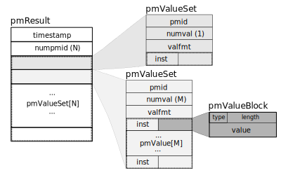
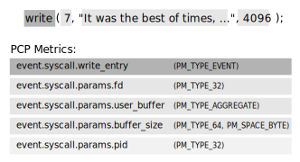
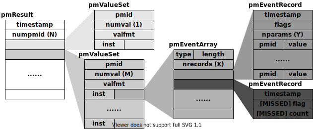

.. _PMAPI:

PMAPI--The Performance Metrics API
######################################

.. contents::

This chapter describes the Performance Metrics Application Programming Interface (PMAPI) provided with Performance Co-Pilot (PCP).

The PMAPI is a set of functions and data structure definitions that allow client applications to access performance data from one or more Performance Metrics 
Collection Daemons (PMCDs) or from PCP archives. The PCP utilities are all written using the PMAPI.

The most common use of PCP includes running performance monitoring utilities on a workstation (the monitoring system) while performance data is retrieved from one 
or more remote collector systems by a number of PCP processes. These processes execute on both the monitoring system and the collector systems. The collector 
systems are typically servers, and are the targets for the performance investigations.

In the development of the PMAPI the most important question has been, “How easily and quickly will this API enable the user to build new performance tools, or 
exploit existing tools for newly available performance metrics?” The PMAPI and the standard tools that use the PMAPI have enjoyed a symbiotic evolution throughout 
the development of PCP.

It will be convenient to differentiate between code that uses the PMAPI and code that implements the services of the PMAPI. The former will be termed “above the 
PMAPI” and the latter “below the PMAPI.”

Naming and Identifying Performance Metrics
*******************************************

Across all of the supported performance metric domains, there are a large number of performance metrics. Each metric has its own description, format, and semantics. 
PCP presents a uniform interface to these metrics above the PMAPI, independent of the source of the underlying metric data. For example, the performance metric 
**hinv.physmem** has a single 32-bit unsigned integer value, representing the number of megabytes of physical memory in the system, while the performance metric 
**disk.dev.total** has one 32-bit unsigned integer value per disk spindle, representing the cumulative count of I/O operations involving each associated disk 
spindle. These concepts are described in greater detail in Section 2.3, “:ref:`Domains, Metrics, Instances and Labels`”.

For brevity and efficiency, internally PCP avoids using names for performance metrics, and instead uses an identification scheme that unambiguously associates a 
single integer with each known performance metric. This integer is known as a Performance Metric Identifier, or PMID. For functions using the PMAPI, a PMID is 
defined and manipulated with the typedef **pmID**.

Below the PMAPI, the integer value of the PMID has an internal structure that reflects the details of the PMCD and PMDA architecture, as described in 
Section 2.3.3, “:ref:`Metrics`”.

Above the PMAPI, a Performance Metrics Name Space (PMNS) is used to provide a hierarchic classification of external metric names, and a one-to-one mapping of 
external names to internal PMIDs. A more detailed description of the PMNS can be found in the *Performance Co-Pilot User's and Administrator's Guide*.

The default PMNS comes from the performance metrics source, either a PMCD process or a PCP archive. This PMNS always reflects the available metrics from the 
performance metrics source.

Performance Metric Instances
******************************

When performance metric values are returned across the PMAPI to a requesting application, there may be more than one value for a particular metric; for example, 
independent counts for each CPU, or each process, or each disk, or each system call type, and so on. This multiplicity of values is not enumerated in the Name 
Space, but rather when performance metrics are delivered across the PMAPI.

The notion of **metric instances** is really a number of related concepts, as follows:

* A particular performance metric may have a set of associated values or instances.

* The instances are differentiated by an instance identifier.

* An instance identifier has an internal encoding (an integer value) and an external encoding (a corresponding external name or label).

* The set of all possible instance identifiers associated with a performance metric on a particular host constitutes an *instance domain*.

* Several performance metrics may share the same instance domain.

Consider `Example 3.1. Metrics Sharing the Same Instance Domain`_:

.. _Example 3.1. Metrics Sharing the Same Instance Domain:

**Example 3.1. Metrics Sharing the Same Instance Domain**

.. sourcecode:: none

 $ pminfo -f filesys.free

 filesys.free
    inst [1 or “/dev/disk0”] value 1803
    inst [2 or “/dev/disk1”] value 22140
    inst [3 or “/dev/disk2”] value 157938

The metric **filesys.free** has three values, currently 1803, 22140, and 157938. These values are respectively associated with the instances identified by the 
internal identifiers 1, 2 and 3, and the external identifiers **/dev/disk0, /dev/disk1**, and **/dev/disk2**. These instances form an instance domain that is shared 
by the performance metrics **filesys.capacity, filesys.used, filesys.free, filesys.mountdir**, and so on.

Each performance metric is associated with an instance domain, while each instance domain may be associated with many performance metrics. Each instance domain is 
identified by a unique value, as defined by the following **typedef** declaration:

.. sourcecode:: none

        typedef unsigned long pmInDom;

The special instance domain **PM_INDOM_NULL** is reserved to indicate that the metric has a single value (a singular instance domain). For example, the performance 
metric **mem.freemem** always has exactly one value. Note that this is semantically different to a performance metric like **kernel.percpu.cpu.sys** that has a 
non-singular instance domain, but may have only one value available; for example, on a system with a single processor.

In the results returned above the PMAPI, each individual instance within an instance domain is identified by an internal integer instance identifier. The special 
instance identifier **PM_IN_NULL** is reserved for the single value in a singular instance domain. Performance metric values are delivered across the PMAPI as a 
set of instance identifier and value pairs.

The instance domain of a metric may change with time. For example, a machine may be shut down, have several disks added, and be rebooted. All performance metrics 
associated with the instance domain of disk devices would contain additional values after the reboot. The difficult issue of transient performance metrics means 
that repeated requests for the same PMID may return different numbers of values, or some changes in the particular instance identifiers returned. This means 
applications need to be aware that metric instantiation is guaranteed to be valid only at the time of collection.

.. note::
   Some instance domains are more dynamic than others. For example, consider the instance domains behind the performance metrics **proc.memory.rss** 
   (one instance per process), **swap.free** (one instance per swap partition) and **kernel.percpu.cpu.intr** (one instance per CPU).
   
Current PMAPI Context
***********************

When performance metrics are retrieved across the PMAPI, they are delivered in the context of a particular source of metrics, a point in time, and a profile of 
desired instances. This means that the application making the request has already negotiated across the PMAPI to establish the context in which the request should 
be executed.

A metric's source may be the current performance data from a particular host (a live or real-time source), or a set of archives of performance data collected 
by **pmlogger** at some remote host or earlier time (a retrospective or archive source). The metric's source is specified when the PMAPI context is created by 
calling the **pmNewContext** function. This function returns an opaque handle which can be used to identify the context.

The collection time for a performance metric is always the current time of day for a real-time source, or current position for an archive source. For archives, 
the collection time may be set to an arbitrary time within the bounds of the set of archives by calling the **pmSetMode** function.

The last component of a PMAPI context is an instance profile that may be used to control which particular instances from an instance domain should be retrieved. 
When a new PMAPI context is created, the initial state expresses an interest in all possible instances, to be collected at the current time. The instance profile 
can be manipulated using the **pmAddProfile** and **pmDelProfile** functions.

The current context can be changed by passing a context handle to **pmUseContext**. If a live context connection fails, the **pmReconnectContext** function can be 
used to attempt to reconnect it.

Performance Metric Descriptions
********************************

For each defined performance metric, there exists metadata describing it.

* A performance metric description (**pmDesc** structure) that describes the format and semantics of the performance metric.

* Help text associated with the metric and any associated instance domain.

* Performance metric labels (name:value pairs in **pmLabelSet** structures) associated with the metric and any associated instances.

The **pmDesc** structure, in `Example 3.2. pmDesc Structure`_, provides all of the information required to interpret and manipulate a performance metric through 
the PMAPI. It has the following declaration:

.. _Example 3.2. pmDesc Structure:

**Example 3.2. pmDesc Structure**

.. sourcecode:: none

 /* Performance Metric Descriptor */
 typedef struct {
     pmID    pmid;   /* unique identifier */
     int     type;   /* base data type (see below) */
     pmInDom indom;  /* instance domain */
     int     sem;    /* semantics of value (see below) */
     pmUnits units;  /* dimension and units (see below) */
 } pmDesc;

The **type** field in the **pmDesc** structure describes various encodings of a metric's value. Its value will be one of the following constants:

.. sourcecode:: none

 /* pmDesc.type - data type of metric values */
 #define PM_TYPE_NOSUPPORT -1   /* not in this version */
 #define PM_TYPE_32        0    /* 32-bit signed integer */
 #define PM_TYPE_U32       1    /* 32-bit unsigned integer */
 #define PM_TYPE_64        2    /* 64-bit signed integer */
 #define PM_TYPE_U64       3    /* 64-bit unsigned integer */
 #define PM_TYPE_FLOAT     4    /* 32-bit floating point */
 #define PM_TYPE_DOUBLE    5    /* 64-bit floating point */
 #define PM_TYPE_STRING    6    /* array of char */
 #define PM_TYPE_AGGREGATE 7    /* arbitrary binary data */
 #define PM_TYPE_AGGREGATE_STATIC 8 /* static pointer to aggregate */
 #define PM_TYPE_EVENT     9    /* packed pmEventArray */
 #define PM_TYPE_UNKNOWN   255  /* used in pmValueBlock not pmDesc */

By convention **PM_TYPE_STRING** is interpreted as a classic C-style null byte terminated string.

Event records are encoded as a packed array of strongly-typed, well-defined records within a **pmResult** structure, using a container metric with a value of type 
**PM_TYPE_EVENT**.

If the value of a performance metric is of type **PM_TYPE_STRING, PM_TYPE_AGGREGATE, PM_TYPE_AGGREGATE_STATIC**, or **PM_TYPE_EVENT**, the interpretation of that 
value is unknown to many PCP components. In the case of the aggregate types, the application using the value and the Performance Metrics Domain Agent (PMDA) 
providing the value must have some common understanding about how the value is structured and interpreted. Strings can be manipulated using the standard C libraries. 
Event records contain timestamps, event flags and event parameters, and the PMAPI provides support for unpacking an event record - see the **pmUnpackEventRecords(3)** 
man page for details. Further discussion on event metrics and event records can be found in Section 3.6, “`Performance Event Metrics`_”.

**PM_TYPE_NOSUPPORT** indicates that the PCP collection framework knows about the metric, but the corresponding service or application is either not configured or 
is at a revision level that does not provide support for this performance metric.

The semantics of the performance metric is described by the **sem** field of a **pmDesc** structure and uses the following constants:

.. sourcecode:: none

 /* pmDesc.sem - semantics of metric values */
 #define PM_SEM_COUNTER  1  /* cumulative count, monotonic increasing */
 #define PM_SEM_INSTANT  3  /* instantaneous value continuous domain */
 #define PM_SEM_DISCRETE 4  /* instantaneous value discrete domain */

Each value for a performance metric is assumed to be drawn from a set of values that can be described in terms of their dimensionality and scale by a compact 
encoding, as follows:

* The dimensionality is defined by a power, or index, in each of three orthogonal dimensions: Space, Time, and Count (dimensionless). For example, I/O throughput 
  is Space1.Time-1, while the running total of system calls is Count1, memory allocation is Space1, and average service time per event is Time1.Count-1.

* In each dimension, a number of common scale values are defined that may be used to better encode ranges that might otherwise exhaust the precision of a 32-bit 
  value. For example, a metric with dimension Space1.Time-1 may have values encoded using the scale megabytes per second.

This information is encoded in the **pmUnits** data structure, shown in `Example 3.3. pmUnits and pmDesc Structures`_. It is embedded in the pmDesc structure :

The structures are as follows:

.. _Example 3.3. pmUnits and pmDesc Structures:

**Example 3.3. pmUnits and pmDesc Structures**

.. sourcecode:: none

 /*
  * Encoding for the units (dimensions and
  * scale) for Performance Metric Values
  *
  * For example, a pmUnits struct of
  * { 1, -1, 0, PM_SPACE_MBYTE, PM_TIME_SEC, 0 }
  * represents Mbytes/sec, while 
  * { 0, 1, -1, 0, PM_TIME_HOUR, 6 }
  * represents hours/million-events
  */
 typedef struct {
     int pad:8;
     int scaleCount:4; /* one of PM_COUNT_* below */
     int scaleTime:4;  /* one of PM_TIME_* below */
     int scaleSpace:4; /* one of PM_SPACE_* below */    
     int dimCount:4;   /* event dimension */
     int dimTime:4;    /* time dimension */
     int dimSpace:4;   /* space dimension
 } pmUnits;   /* dimensional units and scale of value */
 /* pmUnits.scaleSpace */
 #define PM_SPACE_BYTE 0  /* bytes */
 #define PM_SPACE_KBYTE 1 /* kibibytes (1024) */
 #define PM_SPACE_MBYTE 2 /* mebibytes (1024^2) */
 #define PM_SPACE_GBYTE 3 /* gibibytes (1024^3) */
 #define PM_SPACE_TBYTE 4 /* tebibytes (1024^4) */
 #define PM_SPACE_PBYTE 5 /* pebibytes (1024^5) */
 #define PM_SPACE_EBYTE 6 /* exbibytes (1024^6) */
 #define PM_SPACE_ZBYTE 7 /* zebibytes (1024^7) */
 #define PM_SPACE_YBYTE 8 /* yobibytes (1024^8) */
 /* pmUnits.scaleTime */
 #define PM_TIME_NSEC 0   /* nanoseconds */
 #define PM_TIME_USEC 1   /* microseconds */
 #define PM_TIME_MSEC 2   /* milliseconds */
 #define PM_TIME_SEC 3    /* seconds */
 #define PM_TIME_MIN 4    /* minutes */
 #define PM_TIME_HOUR 5   /* hours */
 /*
  * pmUnits.scaleCount (e.g. count events, syscalls,
  * interrupts, etc.) -- these are simply powers of 10,
  * and not enumerated here.
  * e.g. 6 for 10^6, or -3 for 10^-3
  */
 #define PM_COUNT_ONE 0 /* 1 */

Metric and instance domain help text are simple ASCII strings. As a result, there are no special data structures associated with them. There are two forms of help 
text available for each metric and instance domain, however - one-line and long form.

**Example 3.4. Help Text Flags**

.. sourcecode:: none

 #define PM_TEXT_ONELINE 1
 #define PM_TEXT_HELP    2

Labels are stored and communicated within PCP using JSONB formatted strings in the **json** field of a **pmLabelSet** structure. This format is a restricted form 
of JSON suitable for indexing and other operations. In JSONB form, insignificant whitespace is discarded, and order of label names is not preserved. Within the 
PMCS, however, a lexicographically sorted key space is always maintained. Duplicate label names are not permitted. The label with highest precedence in the label 
hierarchy (context level labels, domain level labels, and so on) is the only one presented.

**Example 3.5. pmLabel and pmLabelSet Structures**

.. sourcecode:: none

 typedef struct {
     uint     name : 16;      /* label name offset in JSONB string */
     uint     namelen : 8;    /* length of name excluding the null */
     uint     flags : 8;      /* information about this label */
     uint     value : 16;     /* offset of the label value */
     uint     valuelen : 16;  /* length of value in bytes */
 } pmLabel;
 
 /* flags identifying label hierarchy classes. */
 #define PM_LABEL_CONTEXT        (1<<0)
 #define PM_LABEL_DOMAIN         (1<<1)
 #define PM_LABEL_INDOM          (1<<2)
 #define PM_LABEL_CLUSTER        (1<<3)
 #define PM_LABEL_ITEM           (1<<4)
 #define PM_LABEL_INSTANCES      (1<<5)
 /* flag identifying extrinsic labels. */
 #define PM_LABEL_OPTIONAL       (1<<7)
 
 typedef struct { 
     uint     inst;          /* PM_IN_NULL or the instance ID */ 
     int      nlabels;       /* count of labels or error code */
     char     *json;         /* JSONB formatted labels string */
     uint     jsonlen : 16;  /* JSON string length byte count */
     uint     padding : 16;  /* zero, reserved for future use */
     pmLabel  *labels;       /* indexing into the JSON string */
 } pmLabelSet;

The **pmLabel labels** array provides name and value indexes and lengths in the json string.

The **flags** field is a bitfield identifying the hierarchy level and whether this name:value pair is intrinsic (optional) or extrinsic (part of the mandatory, 
identifying metadata for the metric or instance). All other fields are offsets and lengths in the JSONB string from an associated **pmLabelSet** structure.

Performance Metrics Values
****************************

An application may fetch (or store) values for a set of performance metrics, each with a set of associated instances, using a single **pmFetch** (or **pmStore**) 
function call. To accommodate this, values are delivered across the PMAPI in the form of a tree data structure, rooted at a **pmResult** structure. This encoding 
is illustrated in `Figure 3.1. A Structured Result for Performance Metrics from pmFetch`_, and uses the component data structures in 
`Example 3.6. pmValueBlock and pmValue Structures`_:

.. _Example 3.6. pmValueBlock and pmValue Structures:

**Example 3.6. pmValueBlock and pmValue Structures**

.. sourcecode:: none

 typedef struct {
     int inst;                 /* instance identifier */
     union {
         pmValueBlock *pval;   /* pointer to value-block */
         int           lval;   /* integer value insitu */
     } value;
 } pmValue;
 
.. _Figure 3.1. A Structured Result for Performance Metrics from pmFetch:

   Figure 3.1. A Structured Result for Performance Metrics from pmFetch

The internal instance identifier is stored in the **inst** element. If a value for a particular metric-instance pair is a 32-bit integer (signed or unsigned), then 
it will be stored in the **lval** element. If not, the value will be in a **pmValueBlock** structure, as shown in `Example 3.7. pmValueBlock Structure`_, and will 
be located via **pval**:

The **pmValueBlock** structure is as follows:

.. _Example 3.7. pmValueBlock Structure:

**Example 3.7. pmValueBlock Structure**

.. sourcecode:: none

 typedef struct {
     unsigned int    vlen : 24;    /* bytes for vtype/vlen + vbuf */
     unsigned int    vtype : 8;    /* value type */
     char            vbuf[1];      /* the value */
 } pmValueBlock;

The length of the **pmValueBlock** (including the **vtype** and **vlen** fields) is stored in **vlen**. Despite the prototype declaration of **vbuf**, this array 
really accommodates **vlen** minus **sizeof(vlen)** bytes. The **vtype** field encodes the type of the value in the **vbuf[]** array, and is one of the 
**PM_TYPE_\*** macros defined in **<pcp/pmapi.h>**.

A **pmValueSet** structure, as shown in `Example 3.8. pmValueSet Structure`_, contains all of the values to be returned from **pmFetch** for a single performance 
metric identified by the **pmid** field.

.. _Example 3.8. pmValueSet Structure:

**Example 3.8. pmValueSet Structure**

.. sourcecode:: none

 typedef struct {
     pmID    pmid;          /* metric identifier */
     int     numval;        /* number of values */
     int     valfmt;        /* value style, insitu or ptr */
     pmValue vlist[1];      /* set of instances/values */ 
 } pmValueSet;

If positive, the **numval** field identifies the number of value-instance pairs in the **vlist** array (despite the prototype declaration of size 1). If **numval** 
is zero, there are no values available for the associated performance metric and **vlist[0]** is undefined. A negative value for **numval** indicates an error 
condition (see the **pmErrStr(3)** man page) and **vlist[0]** is undefined. The **valfmt** field has the value **PM_VAL_INSITU** to indicate that the values for the 
performance metrics should be located directly via the **lval** member of the **value** union embedded in the elements of **vlist**; otherwise, metric values are 
located indirectly via the **pval** member of the elements of **vlist**.

The **pmResult** structure, as shown in `Example 3.9. pmResult Structure`_, contains a time stamp and an array of **numpmid** pointers to **pmValueSet**.

.. _Example 3.9. pmResult Structure:

**Example 3.9. pmResult Structure**

.. sourcecode:: none

 /* Result returned by pmFetch() */
 typedef struct {
     struct timeval timestamp;    /* stamped by collector */
     int            numpmid;      /* number of PMIDs */
     pmValueSet     *vset[1];     /* set of value sets */
 } pmResult

There is one **pmValueSet** pointer per PMID, with a one-to-one correspondence to the set of requested PMIDs passed to **pmFetch**.

Along with the metric values, the PMAPI returns a time stamp with each **pmResult** that serves to identify when the performance metric values were collected. The 
time is in the format returned by **gettimeofday** and is typically very close to the time when the metric values were extracted from their respective domains.

.. note::
   There is a question of exactly when individual metrics may have been collected, especially given their origin in potentially different performance metric 
   domains, and variability in metric updating frequency by individual PMDAs. PCP uses a pragmatic approach, in which the PMAPI implementation returns all metrics 
   with values accurate as of the time stamp, to the maximum degree possible, and PMCD demands that all PMDAs deliver values within a small realtime window. The 
   resulting inaccuracy is small, and the additional burden of accurate individual timestamping for each returned metric value is neither warranted nor practical 
   (from an implementation viewpoint).

The PMAPI provides functions to extract, rescale, and print values from the above structures; refer to Section 3.8.11, “`PMAPI Ancillary Support Services`_”.

Performance Event Metrics
**************************

In addition to performance metric values which are sampled by monitor tools, PCP supports the notion of performance event metrics which occur independently to any 
sampling frequency. These event metrics (PM_TYPE_EVENT) are delivered using a novel approach which allows both sampled and event trace data to be delivered via the 
same live wire protocol, the same on-disk archive format, and fundamentally using the same PMAPI services. In other words, a monitor tool may be sample and trace, 
simultaneously, using the PMAPI services discussed here.

Event metrics are characterised by certain key properties, distinguishing them from the other metric types (counters, instantaneous, and discrete):

* Occur at times outside of any monitor tools control, and often have a fine-grained timestamp associated with each event.

* Often have parameters associated with the event, which further describe each individual event, as shown in `Figure 3.2. Sample write(2) syscall entry point encoding`_.

* May occur in very rapid succession, at rates such that both the collector and monitor sides may not be able to track all events. This property requires the PCP 
  protocol to support the notion of "dropped" or "missed" events.

* There may be inherent relationships between events, for example the start and commit (or rollback) of a database transaction could be separate events, linked by 
  a common transaction identifier (which would likely also be one of the parameters to each event). Begin-end and parent-child relationships are relatively common, 
  and these properties require the PCP protocol to support the notion of "flags" that can be associated with events.

These differences aside, the representation of event metrics within PCP shares many aspects of the other metric types - event metrics appear in the Name Space (as 
do each of the event parameters), each has an associated Performance Metric Identifier and Descriptor, may have an instance domain associated with them, and may be 
recorded by **pmlogger** for subsequent replay.

.. _Figure 3.2. Sample write(2) syscall entry point encoding:

   Figure 3.2. Sample write(2) syscall entry point encoding

Event metrics and their associated information (parameters, timestamps, flags, and so on) are delivered to monitoring tools alongside sampled metrics as part of 
the **pmResult** structure seen previously in `Example 3.9. pmResult Structure`_.

The semantics of **pmFetch(3)** specifying an event metric PMID are such that all events observed on the collector since the previous fetch (by this specific 
monitor client) are to transferred to the monitor. Each event will have the metadata described earlier encoded with it (timestamps, flags, and so on) for each event. 
The encoding of the series of events involves a compound data structure within the **pmValueSet** associated with the event metric PMID, as illustrated in 
`Figure 3.3. Result Format for Event Performance Metrics from pmFetch`_.

.. _Figure 3.3. Result Format for Event Performance Metrics from pmFetch:

  Figure 3.3. Result Format for Event Performance Metrics from pmFetch

At the highest level, the "series of events" is encapsulated within a **pmEventArray** structure, as in `Example 3.10. pmEventArray and pmEventRecord Structures`_:

.. _Example 3.10. pmEventArray and pmEventRecord Structures:

**Example 3.10. pmEventArray and pmEventRecord Structures**

.. sourcecode:: none

 typedef struct {
     pmTimeval      er_timestamp;  /* 2 x 32-bit timestamp format */
     unsigned int     er_flags;      /* event record characteristics */
     int              er_nparams;    /* number of ea_param[] entries */
     pmEventParameter er_param[1];
 } pmEventRecord;
 
 typedef struct {
     unsigned int     ea_len :  24;  /* bytes for type/len + records */
     unsigned int     ea_type : 8;   /* value type */
     int              ea_nrecords;   /* number of ea_record entries */
     pmEventRecord    ea_record[1];
 } pmEventArray;

Note that in the case of dropped events, the **pmEventRecord** structure is used to convey the number of events dropped - *er_flags* is used to indicate the 
presence of dropped events, and *er_nparams* is used to hold a count. Unsurprisingly, the parameters (*er_param*) will be empty in this situation.

The **pmEventParameter** structure is as follows:

.. _Example 3.11. pmEventParameter Structure:

**Example 3.11. pmEventParameter Structure**

.. sourcecode:: none

 typedef struct {
     pmID             ep_pmid;       /* parameter identifier */
     unsigned int     ep_type;       /* value type */
     int              ep_len;        /* bytes for type/len + vbuf */
     /* actual value (vbuf) here */
 } pmEventParameter;
 
Event Monitor Considerations
===============================

In order to simplify the decoding of event record arrays, the PMAPI provides the **pmUnpackEventRecords** function for monitor tools. This function is passed a 
pointer to a **pmValueSet** associated with an event metric (within a **pmResult**) from a **pmFetch(3)**. For a given instance of that event metric, it returns an 
array of "unpacked" **pmResult** structures for each event.

The control information (flags and optionally dropped events) is included as derived metrics within each result structure. As such, these values can be queried 
similarly to other metrics, using their names - **event.flags** and **event.missed**. Note that these metrics will only exist after the first call to 
**pmUnpackEventRecords**.

An example of decoding event metrics in this way is presented in `Example 3.12. Unpacking Event Records from an Event Metric pmValueSet`_:

.. _Example 3.12. Unpacking Event Records from an Event Metric pmValueSet:

**Example 3.12. Unpacking Event Records from an Event Metric pmValueSet**

.. sourcecode:: none

 enum { event_flags = 0, event_missed = 1 };
 static char *metadata[] = { "event.flags", "event.missed" };
 static pmID metapmid[2];

 void dump_event(pmValueSet *vsp, int idx)
 {
     pmResult    **res;
     int	        r, sts, nrecords; 
 
     nrecords = pmUnpackEventRecords(vsp, idx, &res);
     if (nrecords < 0)
         fprintf(stderr, " pmUnpackEventRecords: %s\n", pmErrStr(nrecords));
     else
         printf(" %d event records\n", nrecords);

     if ((sts = pmLookupName(2, &metadata, &metapmid)) < 0) {
         fprintf(stderr, "Event metadata error: %s\n", pmErrStr(sts));
         exit(1);
     }
 
     for (r = 0; r < nrecords; r++)
         dump_event_record(res, r);
 
     if (nrecords >= 0)
         pmFreeEventResult(res);
 }
 
 void dump_event_record(pmResult *res, int r)
 {
     int         p;
 
     pmPrintStamp(stdout, &res[r]->timestamp);
     if (res[r]->numpmid == 0)
        	printf(" ==> No parameters\n");
     for (p = 0; p < res[r]->numpmid; p++) {
         pmValueSet  *vsp = res[r]->vset[p];
 
         if (vsp->numval < 0) {
             int error = vsp->numval;
             printf("%s: %s\n", pmIDStr(vsp->pmid), pmErrStr(error));
         } else if (vsp->pmid == metapmid[event_flags]) {
             int flags = vsp->vlist[0].value.lval;
             printf(" flags 0x%x (%s)\n", flags, pmEventFlagsStr(flags));
         } else if (vsp->pmid == metapmid[event_missed]) {
             int count = vsp->vlist[0].value.lval;
             printf(" ==> %d missed event records\n", count);
         } else {
             dump_event_record_parameters(vsp);
         }
     }
 }
 
 void dump_event_record_parameters(pmValueSet *vsp)
 {
     pmDesc      desc;
     char        *name;
     int         sts, j;
 
     if ((sts = pmLookupDesc(vsp->pmid, &desc)) < 0) {
         fprintf(stderr, "pmLookupDesc: %s\n", pmErrStr(sts));
     } else
     if ((sts = pmNameID(vsp->pmid, &name)) < 0) {
         fprintf(stderr, "pmNameID: %s\n", pmErrStr(sts));
     } else {
         printf("parameter %s", name);
         for (j = 0; j < vsp->numval; j++) {
             pmValue *vp = &vsp->vlist[j];
             if (vsp->numval > 1) {
                 printf("[%d]", vp->inst);
                 pmPrintValue(stdout, vsp->valfmt, desc.type, vp, 1);
                 putchar('\n');
             }
         }
         free(name);
     }
 }
 
Event Collector Considerations
================================

There is a feedback mechanism that is inherent in the design of the PCP monitor-collector event metric value exchange, which protects both monitor and collector 
components from becoming overrun by high frequency event arrivals. It is important that PMDA developers are aware of this mechanism and all of its implications.

Monitor tools can query new event arrival on whatever schedule they choose. There are no guarantees that this is a fixed interval, and no way for the PMDA to 
attempt to dictate this interval (nor should there be).

As a result, a PMDA that provides event metrics must:

* Track individual client connections using the per-client PMDA extensions (PMDA_INTERFACE_5 or later).

* Queue events, preferably in a memory-efficient manner, such that each interested monitor tool (there may be more than one) is informed of those events that 
  arrived since their last request.

* Control the memory allocated to in-memory event storage. If monitors are requesting new events too slowly, compared to event arrival on the collector, the 
  "missed events" feedback mechanism must be used to inform the monitor. This mechanism is also part of the model by which a PMDA can fix the amount of memory it 
  uses. Once a fixed space is consumed, events can be dropped from the tail of the queue for each client, provided a counter is incremented and the client is 
  subsequently informed.
  
.. note::
   It is important that PMDAs are part of the performance solution, and not part of the performance problem! With event metrics, this is much more difficult to 
   achieve than with counters or other sampled values.
   
There is certainly elegance to this approach for event metrics, and the way they dovetail with other, sampled performance metrics is unique to PCP. Notice also 
how the scheme naturally allows multiple monitor tools to consume the same events, no matter what the source of events is. The downside to this flexibility is 
increased complexity in the PMDA when event metrics are used.

This complexity comes in the form of event queueing and memory management, as well as per-client state tracking. Routines are available as part of the **pcp_pmda** 
library to assist, however - refer to the man page entries for **pmdaEventNewQueue(3)** and **pmdaEventNewClient(3)** for further details.

One final set of helper APIs is available to PMDA developers who incorporate event metrics. There is a need to build the **pmEventArray** structure, introduced in 
`Example 3.10. pmEventArray and pmEventRecord Structures`_. This can be done directly, or using the helper routine **pmdaEventNewArray(3)**. If the latter, simpler 
model is chosen, the closely related routines **pmdaEventAddRecord, pmdaEventAddParam** and **pmdaEventAddMissedRecord** would also usually be used.

Depending on the nature of the events being exported by a PMDA, it can be desirable to perform **filtering** of events on the collector system. This reduces the 
amount of event traffic between monitor and collector systems (which may be filtered further on the monitor system, before presenting results). Some PMDAs have had 
success using the **pmStore(3)** mechanism to allow monitor tools to send a filter to the PMDA - using either a special control metric for the store operation, or 
the event metric itself. The filter sent will depend on the event metric, but it might be a regular expression, or a tracing script, or something else.

This technique has also been used to **enable** and **disable** event tracing entirely. It is often appropriate to make use of authentication and user credentials 
when providing such a facility (PMDA_INTERFACE_6 or later).

PMAPI Programming Style and Interaction
*****************************************

The following sections describe the PMAPI programming style:

* Variable length argument and results lists

* Python specific issues

* PMAPI error handling

Variable Length Argument and Results Lists
===========================================

All arguments and results involving a “list of something” are encoded as an array with an associated argument or function value to identify the number of elements 
in the array. This encoding scheme avoids both the **varargs** approach and sentinel-terminated lists. Where the size of a result is known at the time of a call, 
it is the caller's responsibility to allocate (and possibly free) the storage, and the called function assumes that the resulting argument is of an appropriate size.

Where a result is of variable size and that size cannot be known in advance (for example, **pmGetChildren, pmGetInDom, pmNameInDom, pmNameID, pmLookupText**, 
**pmLookupLabels** and **pmFetch**), the underlying implementation uses dynamic allocation through **malloc** in the called function, with the caller responsible 
for subsequently calling **free** to release the storage when no longer required.

In the case of the result from **pmFetch**, there is a function (**pmFreeResult**) to release the storage, due to the complexity of the data structure and the 
need to make multiple calls to **free** in the correct sequence. Similarly, the **pmLookupLabels** function has an associated function (**pmFreeLabelSets**) to 
release the storage.

As a general rule, if the called function returns an error status, then no allocation is done, the pointer to the variable sized result is undefined, and **free**, 
**pmFreeLabelSets**, or **pmFreeResult** should not be called.

Python Specific Issues
========================

A pcp client may be written in the python language by making use of the python bindings for PMAPI. The bindings use the python ctypes module to provide an interface 
to the PMAPI C language data structures. The primary imports that are needed by a client are:

* cpmapi which provides access to PMAPI constants
  
  .. sourcecode:: none

     import cpmapi as c_api

* pmapi which provides access to PMAPI functions and data structures

  .. sourcecode:: none

     from pcp import pmapi
    
* pmErr which provides access to the python bindings exception handler

  .. sourcecode:: none

     from pcp.pmapi import pmErr
    
* pmgui which provides access to PMAPI record mode functions

  .. sourcecode:: none

     from pcp import pmgui

Creating and destroying a PMAPI context in the python environment is done by creating and destroying an object of the pmapi class. This is done in one of two ways, 
either directly:

.. sourcecode:: none

 context = pmapi.pmContext()

or by automated processing of the command line arguments (refer to the **pmGetOptions** man page for greater detail).

.. sourcecode:: none

 options = pmapi.pmOptions(...)
 context = pmapi.pmContext.fromOptions(options, sys.argv)

Most PMAPI C functions have python equivalents with similar, although not identical, call signatures. Some of the python functions do not return native python 
types, but instead return native C types wrapped by the ctypes library. In most cases these types are opaque, or nearly so; for example *pmid*:

.. sourcecode:: none

 pmid = context.pmLookupName("mem.freemem")
 desc = context.pmLookupDescs(pmid)
 result = context.pmFetch(pmid)
 ...

See the comparison of a standalone C and python client application in `Example 3.25. PMAPI Error Handling`_.

PMAPI Error Handling
=====================

Where error conditions may arise, the functions that compose the PMAPI conform to a single, simple error notification scheme, as follows:

* The function returns an **int**. Values greater than or equal to zero indicate no error, and perhaps some positive status: for example, the number of items processed.

* Values less than zero indicate an error, as determined by a global table of error conditions and messages.

A PMAPI library function along the lines of **strerror** is provided to translate error conditions into error messages; see the **pmErrStr(3)** and **pmErrStr_r(3)** 
man pages. The error condition is returned as the function value from a previous PMAPI call; there is no global error indicator (unlike **errno**). This is to 
accommodate multi-threaded performance tools.

The available error codes may be displayed with the following command:

.. sourcecode:: none

    pmerr -l

Where possible, PMAPI routines are made as tolerant to failure as possible. In particular, routines which deal with compound data structures - results structures, 
multiple name lookups in one call and so on, will attempt to return all data that can be returned successfully, and errors embedded in the result where there were 
(partial) failures. In such cases a negative failure return code from the routine indicates catastrophic failure, otherwise success is returned and indicators for 
the partial failures are returned embedded in the results.

PMAPI Procedural Interface
*****************************

The following sections describe all of the PMAPI functions that provide access to the PCP infrastructure on behalf of a client application:

* PMAPI Name Space services
* PMAPI metric description services
* PMAPI instance domain services
* PMAPI context services
* PMAPI timezone services
* PMAPI metrics services
* PMAPI fetchgroup services
* PMAPI record-mode services
* PMAPI archive-specific services
* PMAPI time control services
* PMAPI ancillary support services

PMAPI Name Space Services
============================

The functions described in this section provide Performance Metrics Application Programming Interface (PMAPI) Name Space services.

pmGetChildren Function
------------------------

.. sourcecode:: none

 int pmGetChildren(const char*name, char***offspring)
 Python:
 [name1, name2...] = pmGetChildren(name)

Given a full pathname to a node in the current PMNS, as identified by *name*, return through *offspring* a list of the relative names of all the immediate descendents 
of *name* in the current PMNS. As a special case, if *name* is an empty string, (that is, **""** but not **NULL** or **(char \*)0**), the immediate descendents of 
the root node in the PMNS are returned.

For the python bindings a tuple containing the relative names of all the immediate descendents of *name* in the current PMNS is returned.

Normally, **pmGetChildren** returns the number of descendent names discovered, or a value less than zero for an error. The value zero indicates that the *name* is 
valid, and associated with a leaf node in the PMNS.

The resulting list of pointers (*offspring*) and the values (relative metric names) that the pointers reference are allocated by **pmGetChildren** with a single 
call to **malloc**, and it is the responsibility of the caller to issue a **free** (*offspring*) system call to release the space when it is no longer required. 
When the result of **pmGetChildren** is less than one, *offspring* is undefined (no space is allocated, and so calling **free** is counterproductive).

The python bindings return a tuple containing the relative names of all the immediate descendents of *name*, where *name* is a full pathname to a node in the 
current PMNS.

pmGetChildrenStatus Function
-----------------------------

.. sourcecode:: none

 int pmGetChildrenStatus(const char *name, char ***offspring, int **status)
 Python:
 ([name1, name2...],[status1, status2...]) = pmGetChildrenStatus(name)

The **pmGetChildrenStatus** function is an extension of **pmGetChildren** that optionally returns status information about each of the descendent names.

Given a fully qualified pathname to a node in the current PMNS, as identified by *name*, **pmGetChildrenStatus** returns by means of *offspring* a list of the 
relative names of all of the immediate descendent nodes of *name* in the current PMNS. If *name* is the empty string (""), it returns the immediate descendents of 
the root node in the PMNS.

If *status* is not NULL, then **pmGetChildrenStatus** also returns the status of each child by means of *status*. This refers to either a leaf node (with value 
**PMNS_LEAF_STATUS**) or a non-leaf node (with value **PMNS_NONLEAF_STATUS**).

Normally, **pmGetChildrenStatus** returns the number of descendent names discovered, or else a value less than zero to indicate an error. The value zero indicates 
that name is a valid metric name, being associated with a leaf node in the PMNS.

The resulting list of pointers (*offspring*) and the values (relative metric names) that the pointers reference are allocated by **pmGetChildrenStatus** with a 
single call to **malloc**, and it is the responsibility of the caller to **free** (*offspring*) to release the space when it is no longer required. The same holds true 
for the *status* array.

The python bindings return a tuple containing the relative names and statuses of all the immediate descendents of *name*, where *name* is a full pathname to a node 
in the current PMNS.

pmGetPMNSLocation Function
----------------------------

.. sourcecode:: none

 int pmGetPMNSLocation(void)
 Python:
 int loc = pmGetPMNSLocation()

If an application needs to know where the origin of a PMNS is, **pmGetPMNSLocation** returns whether it is an archive (**PMNS_ARCHIVE**), a local PMNS file 
(**PMNS_LOCAL**), or a remote PMCD (**PMNS_REMOTE**). This information may be useful in determining an appropriate error message depending on PMNS location.

The python bindings return whether a PMNS is an archive *cpmapi.PMNS_ARCHIVE*, a local PMNS file *cpmapi.PMNS_LOCAL*, or a remote PMCD *cpmapi.PMNS_REMOTE*. 
The constants are available by importing cpmapi.

pmLoadNameSpace Function
-----------------------------

.. sourcecode:: none

 int pmLoadNameSpace(const char *filename)
 Python:
 int status = pmLoadNameSpace(filename)

In the highly unusual situation that an application wants to force using a local Performance Metrics Name Space (PMNS), the application can load the PMNS using 
**pmLoadNameSpace**.

The *filename* argument designates the PMNS of interest. For applications that do not require a tailored Name Space, the special value **PM_NS_DEFAULT** may be used 
for *filename*, to force a default local PMNS to be established. Externally, a PMNS is stored in an ASCII format.

The python bindings load a local tailored Name Space from *filename*.

.. note::
   Do not use this routine in monitor tools. The distributed PMNS services avoid the need for a local PMNS; so applications should **not** use **pmLoadNameSpace**. 
   Without this call, the default PMNS is the one at the source of the performance metrics (PMCD or an archive).
   
pmLookupName Function
-----------------------

.. sourcecode:: none

 int pmLookupName(int numpmid, char *namelist[], pmID pmidlist[])
 Python:
 c_uint pmid [] = pmLookupName("MetricName")
 c_uint pmid [] = pmLookupName(("MetricName1", "MetricName2", ...))

Given a list in *namelist* containing *numpmid* full pathnames for performance metrics from the current PMNS, **pmLookupName** returns the list of associated PMIDs 
through the *pmidlist* parameter. Invalid metrics names are translated to the error PMID value of **PM_ID_NULL**.

The result from **pmLookupName** is the number of names translated in the absence of errors, or an error indication. Note that argument definition and the error 
protocol guarantee a one-to-one relationship between the elements of *namelist* and *pmidlist*; both lists contain exactly *numpmid* elements.

The python bindings return an array of associated PMIDs corresponding to a tuple of *MetricNames*. The returned *pmid* tuple is passed to **pmLookupDescs** and 
**pmFetch**.

pmNameAll Function
--------------------

.. sourcecode:: none

 int pmNameAll(pmID pmid, char ***nameset)
 Python:
 [name1, name2...] = pmNameAll(pmid)

Given a performance metric ID in *pmid*, **pmNameAll** determines all the corresponding metric names, if any, in the PMNS, and returns these through *nameset*.

The resulting list of pointers *nameset* and the values (relative names) that the pointers reference are allocated by **pmNameAll** with a single call to **malloc**. 
It is the caller's responsibility to call **free** and release the space when it is no longer required.

In the absence of errors, **pmNameAll** returns the number of names in **nameset**.

For many PMNS instances, there is a 1:1 mapping between a name and a PMID, and under these circumstances, **pmNameID** provides a simpler interface in the absence 
of duplicate names for a particular PMID.

The python bindings return a tuple of all metric names having this identical *pmid*.

pmNameID Function
-------------------

.. sourcecode:: none

 int pmNameID(pmID pmid, char **name)
 Python:
 "metric name" = pmNameID(pmid)

Given a performance metric ID in *pmid*, **pmNameID** determines the corresponding metric name, if any, in the current PMNS, and returns this through *name*.

In the absence of errors, **pmNameID** returns zero. The *name* argument is a null byte terminated string, allocated by **pmNameID** using **malloc**. It is the 
caller's responsibility to call **free** and release the space when it is no longer required.

The python bindings return a metric name corresponding to a *pmid*.

pmTraversePMNS Function
---------------------------

.. sourcecode:: none

 int pmTraversePMNS(const char *name, void (*dometric)(const char *))
 Python:
 int status = pmTraversePMNS(name, traverse_callback)

The function **pmTraversePMNS** may be used to perform a depth-first traversal of the PMNS. The traversal starts at the node identified by *name* --if *name* is an 
empty string, the traversal starts at the root of the PMNS. Usually, *name* would be the pathname of a non-leaf node in the PMNS.

For each leaf node (actual performance metrics) found in the traversal, the user-supplied function **dometric** is called with the full pathname of that metric in 
the PMNS as the single argument; this argument is a null byte-terminated string, and is constructed from a buffer that is managed internally to **pmTraversePMNS**. 
Consequently, the value is valid only during the call to **dometric**--if the pathname needs to be retained, it should be copied using **strdup** before returning 
from **dometric**; see the **strdup(3)** man page.

The python bindings perform a depth first traversal of the PMNS by scanning *namespace*, depth first, and call a python function *traverse_callback* for each node.

pmUnloadNameSpace Function
----------------------------

.. sourcecode:: none

 int pmUnloadNameSpace(void)
 Python:
 pmUnLoadNameSpace("NameSpace")

If a local PMNS was loaded with **pmLoadNameSpace**, calling **pmUnloadNameSpace** frees up the memory associated with the PMNS and force all subsequent Name Space 
functions to use the distributed PMNS. If **pmUnloadNameSpace** is called before calling **pmLoadNameSpace**, it has no effect.

As discussed in Section 3.8.1.4, “`pmLoadNameSpace Function`_” there are few if any situations where clients need to call this routine in modern versions of PCP.

PMAPI Metrics Description Services
======================================

The functions described in this section provide Performance Metrics Application Programming Interface (PMAPI) metric description services.

pmLookupDesc Function
-----------------------

.. sourcecode:: none

 int pmLookupDesc(pmID pmid, pmDesc *desc)
 Python:
 pmDesc* pmdesc = pmLookupDesc(c_uint pmid)
 (pmDesc* pmdesc)[] = pmLookupDescs(c_uint pmids[N])
 (pmDesc* pmdesc)[] = pmLookupDescs(c_uint pmid)

Given a Performance Metric Identifier (PMID) as *pmid*, **pmLookupDesc** returns the associated **pmDesc** structure through the parameter *desc* from the current 
PMAPI context. For more information about **pmDesc**, see Section 3.4, “`Performance Metric Descriptions`_”.

The python bindings return the metric description structure **pmDesc** corresponding to *pmid*. The returned *pmdesc* is passed to **pmExtractValue** and 
**pmLookupInDom**. The python bindings provide an entry **pmLookupDescs** that is similar to pmLookupDesc but does a metric description lookup for each element 
in a PMID array *pmids*.

pmLookupInDomText Function
----------------------------

.. sourcecode:: none

 int pmLookupInDomText(pmInDom indom, int level, char **buffer)
 Python:
 "metric description" = pmGetInDomText(pmDesc pmdesc)

Provided the source of metrics from the current PMAPI context is a host, retrieve descriptive text about the performance metrics instance domain identified by *indom*.

The *level* argument should be **PM_TEXT_ONELINE** for a one-line summary, or **PM_TEXT_HELP** for a more verbose description suited to a help dialogue. The space 
pointed to by *buffer* is allocated in **pmLookupInDomText** with **malloc**, and it is the responsibility of the caller to free unneeded space; see the **malloc(3)** 
and **free(3)** man pages.

The help text files used to implement **pmLookupInDomText** are often created using **newhelp** and accessed by the appropriate PMDA response to requests forwarded 
to the PMDA by PMCD. Further details may be found in Section 2.4.4, ":ref:`PMDA Help Text`" .

The python bindings lookup the description text about the performance metrics pmDesc *pmdesc*. The default is a one line summary; for a more verbose description 
add an optional second parameter *cpmapi.PM_TEXT_HELP*. The constant is available by importing cpmapi.

pmLookupText Function
-----------------------

.. sourcecode:: none

 int pmLookupText(pmID pmid, int level, char **buffer)
 Python:
 "metric description" = pmLookupText(c_uint pmid)

Retrieve descriptive text about the performance metric identified by *pmid*. The argument *level* should be **PM_TEXT_ONELINE** for a one-line summary, or 
**PM_TEXT_HELP** for a more verbose description, suited to a help dialogue.

The space pointed to by *buffer* is allocated in **pmLookupText** with **malloc**, and it is the responsibility of the caller to **free** the space when it is no 
longer required; see the **malloc(3)** and **free(3)** man pages.

The help text files used to implement **pmLookupText** are created using **newhelp** and accessed by the appropriate PMDA in response to requests forwarded to the 
PMDA by PMCD. Further details may be found in Section 2.4.4, “:ref:`PMDA Help Text`”.

The python bindings lookup the description text about the performance metrics pmID *pmid*. The default is a one line summary; for a more verbose description add an 
optional second parameter *cpmapi.PM_TEXT_HELP*. The constant is available by importing cpmapi.

pmLookupLabels Function
-------------------------

.. sourcecode:: none

 int pmLookupLabels(pmID pmid, pmLabelSet **labelsets)
 Python:
 (pmLabelSet* pmlabelset)[] pmLookupLabels(c_uint pmid)

Retrieve **name:value** pairs providing additional identity and descriptive metadata about the performance metric identified by *pmid*.

The space pointed to by *labelsets* is allocated in **pmLookupLabels** with potentially multiple calls to **malloc** and it is the responsibility of the caller to 
**pmFreeLabelSets** the space when it is no longer required; see the **malloc(3)** and **pmFreeLabelSets(3)** man pages.

Additional helper interfaces are also available, used internally by **pmLookupLabels** and to help with post-processing of *labelsets*. See the **pmLookupLabels(3)** 
and **pmMergeLabelSets(3)** man pages.

PMAPI Instance Domain Services
================================

The functions described in this section provide Performance Metrics Application Programming Interface (PMAPI) instance domain services.

pmGetInDom Function
---------------------

.. sourcecode:: none

 int pmGetInDom(pmInDom indom, int **instlist, char ***namelist)
 Python:
 ([instance1, instance2...] [name1, name2...]) pmGetInDom(pmDesc pmdesc)

In the current PMAPI context, locate the description of the instance domain *indom*, and return through *instlist* the internal instance identifiers for all 
instances, and through *namelist* the full external identifiers for all instances. The number of instances found is returned as the function value (or less than 
zero to indicate an error).

The resulting lists of instance identifiers (*instlist* and *namelist*), and the names that the elements of *namelist* point to, are allocated by **pmGetInDom** 
with two calls to **malloc**, and it is the responsibility of the caller to use **free** (*instlist*) and **free** (*namelist*) to release the space when it is no 
longer required. When the result of **pmGetInDom** is less than one, both *instlist* and *namelist* are undefined (no space is allocated, and so calling **free** 
is a bad idea); see the **malloc(3)** and **free(3)** man pages.

The python bindings return a tuple of the instance identifiers and instance names for an instance domain *pmdesc*.

pmLookupInDom Function
------------------------

.. sourcecode:: none

 int pmLookupInDom(pmInDom indom, const char *name)
 Python:
 int instid = pmLookupInDom(pmDesc pmdesc, "Instance")

For the instance domain *indom*, in the current PMAPI context, locate the instance with the external identification given by *name*, and return the internal 
instance identifier.

The python bindings return the instance id corresponding to *"Instance"* in the instance domain *pmdesc*.

pmNameInDom Function
----------------------

.. sourcecode:: none

 int pmNameInDom(pmInDom indom, int inst, char **name)
 Python:
 "instance id" = pmNameInDom(pmDesc pmdesc, c_uint instid)

For the instance domain *indom*, in the current PMAPI context, locate the instance with the internal instance identifier given by *inst*, and return the full 
external identification through *name*. The space for the value of *name* is allocated in **pmNameInDom** with **malloc**, and it is the responsibility of the 
caller to free the space when it is no longer required; see the **malloc(3)** and **free(3)** man pages.

The python bindings return the text name of an instance corresponding to an instance domain *pmdesc* with instance identifier *instid*.

PMAPI Context Services
========================

`Table 3.1. Context Components of PMAPI Functions`_ shows which of the three components of a PMAPI context (metrics source, instance profile, and collection time) 
are relevant for various PMAPI functions. Those PMAPI functions not shown in this table either manipulate the PMAPI context directly, or are executed independently 
of the current PMAPI context.

.. _Table 3.1. Context Components of PMAPI Functions:

**Table 3.1. Context Components of PMAPI Functions**

.. list-table::
   :widths: 40 15 15 15 15

   * - **Function name**           
     - **Metrics Source**
     - **Instance Profile**
     - **Collection Time**
     - **Notes**                                   
   * - **pmAddProfile**
     - Yes
     - Yes
     - 
     - 
   * - **pmDelProfile**
     - Yes
     - Yes
     - 
     - 
   * - **pmDupContext**	
     - Yes
     - Yes
     - Yes
     - 
   * - **pmFetch**
     - Yes
     - Yes
     - Yes
     - 
   * - **pmFetchArchive**
     - Yes	 	
     -  
     - Yes	
     - ( 1 ) 
   * - **pmGetArchiveEnd**	
     - Yes	 	 	
     - 
     - 
     - ( 1 ) 
   * - **pmGetArchiveLabel**	
     - Yes
     - 
     - 
     - ( 1 ) 
   * - **pmGetChildren**	
     - Yes
     - 
     - 
     - 	 	 	 
   * - **pmGetChildrenStatus**	
     - Yes
     - 
     - 
     - 
   * - **pmGetContextHostName**	
     - Yes
     - 
     - 
     - 	 	 	 
   * - **pmGetPMNSLocation**
     - Yes	 	 	 
     - 
     - 
     - 
   * - **pmGetInDom**	
     - Yes	 	
     - 
     - Yes
     - ( 2 ) 
   * - **pmGetInDomArchive**	
     - Yes
     - 
     - 
     - ( 1 ) 
   * - **pmLookupDesc**	
     - Yes
     - 
     - 	
     - ( 3 ) 
   * - **pmLookupInDom**
     - Yes
     - 
     - Yes
     - ( 2 ) 
   * - **pmLookupInDomArchive**	
     - Yes	 	 
     - 
     - 
     - ( 1,2 ) 
   * - **pmLookupInDomText**
     - Yes
     - 
     - 
     - 
   * - **pmLookupLabels**
     - Yes
     - 
     - 
     - 	 
   * - **pmLookupName**
     - Yes
     - 
     - 
     - 
   * - **pmLookupText**
     - Yes
     - 
     - 
     - 	
   * - **pmNameAll**
     - Yes
     - 
     - 
     - 
   * - **pmNameID**
     - Yes
     - 
     - 
     - 		 
   * - **pmNameInDom**
     - Yes
     - 
     - Yes
     - ( 2 )
   * - **pmNameInDomArchive**	
     - Yes	 	 	
     - 
     - 
     - ( 1,2 )
   * - **pmSetMode**
     - Yes
     - 
     - Yes
     - 
   * - **pmStore**	
     - Yes 
     - 
     - 
     - ( 4 )
   * - **pmTraversePMNS**
     - Yes 
     - 
     - 
     - 

Notes:

1. Operation supported only for PMAPI contexts where the source of metrics is an archive.

2. A specific instance domain is included in the arguments to these functions, and the result is independent of the instance profile for any PMAPI context.

3. The metadata that describes a performance metric is sensitive to the source of the metrics, but independent of any instance profile and of the collection time.

4. This operation is supported only for contexts where the source of the metrics is a host. Further, the instance identifiers are included in the argument to the 
   function, and the effects upon the current values of the metrics are immediate (retrospective changes are not allowed). Consequently, from the current PMAPI 
   context, neither the instance profile nor the collection time influence the result of this function.

pmNewContext Function
-----------------------

.. sourcecode:: none

 int pmNewContext(int type, const char *name)

The **pmNewContext** function may be used to establish a new PMAPI context. The source of metrics is identified by *name*, and may be a host specification (*type* 
is **PM_CONTEXT_HOST**) or a comma-separated list of names referring to a set of archives (*type* is **PM_CONTEXT_ARCHIVE**). Each element of the list may 
either be the base name common to all of the physical files of an archive or the name of a directory containing archives.

A host specification usually contains a simple hostname, an internet address (IPv4 or IPv6), or the path to the PMCD Unix domain socket. It can also specify 
properties of the connection to PMCD, such as the protocol to use (secure and encrypted, or native) and whether PMCD should be reached via a **pmproxy** host. 
Various other connection attributes, such as authentication information (user name, password, authentication method, and so on) can also be specified. Further 
details can be found in the **PCPIntro(3)** man page, and the companion *Performance Co-Pilot Tutorials and Case Studies* document.

In the case where *type* is **PM_CONTEXT_ARCHIVE**, there are some restrictions on the archives within the specified set:

* The archives must all have been generated on the same host.

* The archives must not overlap in time.

* The archives must all have been created using the same time zone.

* The pmID of each metric should be the same in all of the archives. Multiple pmIDs are currently tolerated by using the first pmID defined for each metric and ignoring subsequent pmIDs.

* The type of each metric must be the same in all of the archives.

* The semantics of each metric must be the same in all of the archives.

* The units of each metric must be the same in all of the archives.

* The instance domain of each metric must be the same in all of the archives.

In the case where *type* is **PM_CONTEXT_LOCAL**, *name* is ignored, and the context uses a stand-alone connection to the PMDA methods used by PMCD. When this 
type of context is in effect, the range of accessible performance metrics is constrained to DSO PMDAs listed in the **pmcd** configuration file ``${PCP_PMCDCONF_PATH}``. 
The reason this is done, as opposed to all of the DSO PMDAs found below ``${PCP_PMDAS_DIR}`` for example, is that DSO PMDAs listed there are very likely to have 
their metric names reflected in the local Name Space file, which will be loaded for this class of context.

The initial instance profile is set up to select all instances in all instance domains, and the initial collection time is the current time at the time of each 
request for a host, or the time at the start of the first log for a set of archives. In the case of archives, the initial collection time results in the earliest 
set of metrics being returned from the set of archives at the first **pmFetch**.

Once established, the association between a PMAPI context and a source of metrics is fixed for the life of the context; however, functions are provided to 
independently manipulate both the instance profile and the collection time components of a context.

The function returns a “handle” that may be used in subsequent calls to **pmUseContext**. This new PMAPI context stays in effect for all subsequent context 
sensitive calls across the PMAPI until another call to **pmNewContext** is made, or the context is explicitly changed with a call to **pmDupContext** or 
**pmUseContext**.

For the python bindings creating and destroying a PMAPI context is done by creating and destroying an object of the pmapi class.

pmDestroyContext Function
--------------------------

.. sourcecode:: none

 int pmDestroyContext(int handle)

The PMAPI context identified by *handle* is destroyed. Typically, this implies terminating a connection to PMCD or closing an archive file, and orderly clean-up. 
The PMAPI context must have been previously created using **pmNewContext** or **pmDupContext**.

On success, **pmDestroyContext** returns zero. If *handle* was the current PMAPI context, then the current context becomes undefined. This means the application 
must explicitly re-establish a valid PMAPI context with **pmUseContext**, or create a new context with **pmNewContext** or **pmDupContext**, before the next PMAPI 
operation requiring a PMAPI context.

For the python bindings creating and destroying a PMAPI context is done by creating and destroying an object of the pmapi class.

pmDupContext Function
-----------------------

.. sourcecode:: none

 int pmDupContext(void)

Replicate the current PMAPI context (source, instance profile, and collection time). This function returns a handle for the new context, which may be used with 
subsequent calls to **pmUseContext**. The newly replicated PMAPI context becomes the current context.

pmUseContext Function
-----------------------

.. sourcecode:: none

 int pmUseContext(int handle)

Calling **pmUseContext** causes the current PMAPI context to be set to the context identified by *handle*. The value of *handle* must be one returned from an 
earlier call to **pmNewContext** or **pmDupContext**.

Below the PMAPI, all contexts used by an application are saved in their most recently modified state, so **pmUseContext** restores the context to the state it was 
in the last time the context was used, not the state of the context when it was established.

pmWhichContext Function
-------------------------

.. sourcecode:: none

 int pmWhichContext(void)
 Python:
 int ctx_idx = pmWhichContext()

Returns the handle for the current PMAPI context (source, instance profile, and collection time).

The python bindings return the handle of the current PMAPI context.

pmAddProfile Function
----------------------

.. sourcecode:: none

 int pmAddProfile(pmInDom indom, int numinst, int instlist[])
 Python:
 int status = pmAddProfile(pmDesc pmdesc, [c_uint instid])

Add new instance specifications to the instance profile of the current PMAPI context. At its simplest, instances identified by the *instlist* argument for the 
*indom* instance domain are added to the instance profile. The list of instance identifiers contains *numinst* values.

If *indom* equals **PM_INDOM_NULL**, or *numinst* is zero, then all instance domains are selected. If *instlist* is NULL, then all instances are selected. To 
enable all available instances in all domains, use this syntax:

.. sourcecode:: none

 pmAddProfile(PM_INDOM_NULL, 0, NULL).

The python bindings add the list of instances *instid* to the instance profile of the instance *pmdesc*.

pmDelProfile Function
----------------------

.. sourcecode:: none

 int pmDelProfile(pmInDom indom, int numinst, int instlist[])
 Python:
 int status = pmDelProfile(pmDesc pmdesc, c_uint instid)
 int status = pmDelProfile(pmDesc pmdesc, [c_uint instid])

Delete instance specifications from the instance profile of the current PMAPI context. In the simplest variant, the list of instances identified by the *instlist* 
argument for the *indom* instance domain is removed from the instance profile. The list of instance identifiers contains *numinst* values.

If *indom* equals **PM_INDOM_NULL**, then all instance domains are selected for deletion. If *instlist* is NULL, then all instances in the selected domains are 
removed from the profile. To disable all available instances in all domains, use this syntax:

.. sourcecode:: none

 pmDelProfile(PM_INDOM_NULL, 0, NULL)

The python bindings delete the list of instances *instid* from the instance profile of the instance domain *pmdesc*.

pmSetMode Function
--------------------

.. sourcecode:: none

 int pmSetMode(int mode, const struct timeval *when, int delta)
 Python:
 int status = pmSetMode(mode, timeVal timeval, int delta)

This function defines the collection time and mode for accessing performance metrics and metadata in the current PMAPI context. This mode affects the semantics of 
subsequent calls to the following PMAPI functions: **pmFetch, pmFetchArchive, pmLookupDesc, pmGetInDom, pmLookupInDom** , and **pmNameInDom**.

The **pmSetMode** function requires the current PMAPI context to be of type **PM_CONTEXT_ARCHIVE**.

The *when* parameter defines a time origin, and all requests for metadata (metrics descriptions and instance identifiers from the instance domains) are processed 
to reflect the state of the metadata as of the time origin. For example, use the last state of this information at, or before, the time origin.

If the *mode* is **PM_MODE_INTERP** then, in the case of **pmFetch**, the underlying code uses an interpolation scheme to compute the values of the metrics from 
the values recorded for times in the proximity of the time origin.

If the *mode* is **PM_MODE_FORW**, then, in the case of **pmFetch**, the collection of recorded metric values is scanned forward, until values for at least one of 
the requested metrics is located after the time origin. Then all requested metrics stored in the PCP archive at that time are returned with a corresponding time 
stamp. This is the default mode when an archive context is first established with **pmNewContext**.

If the *mode* is **PM_MODE_BACK**, then the situation is the same as for **PM_MODE_FORW**, except a **pmFetch** is serviced by scanning the collection of recorded 
metrics backward for metrics before the time origin.

After each successful **pmFetch**, the time origin is reset to the time stamp returned through the **pmResult**.

The **pmSetMode** parameter *delta* defines an additional number of time unit that should be used to adjust the time origin (forward or backward) after the new 
time origin from the **pmResult** has been determined. This is useful when moving through archives with a mode of **PM_MODE_INTERP**. The high-order bits of the 
*mode* parameter field is also used to optionally set the units of time for the **delta** field. To specify the units of time, use the **PM_XTB_SET** macro with 
one of the values **PM_TIME_NSEC, PM_TIME_MSEC, PM_TIME_SEC**, or so on as follows:

.. sourcecode:: none

 PM_MODE_INTERP | PM_XTB_SET(PM_TIME_XXXX)

If no units are specified, the default is to interpret *delta* as milliseconds.

Using these mode options, an application can implement replay, playback, fast forward, or reverse for performance metric values held in a set of PCP archives 
by alternating calls to **pmSetMode** and **pmFetch**.

In `Example 3.13. Dumping Values in Temporal Sequence`_, the code fragment may be used to dump only those values stored in correct temporal sequence, for the 
specified performance metric **my.metric.name**:

.. _Example 3.13. Dumping Values in Temporal Sequence:

**Example 3.13. Dumping Values in Temporal Sequence**

.. sourcecode:: none

    int     sts;
    pmID    pmid;
    char    *name = “my.metric.name”;

    sts = pmNewContext(PM_CONTEXT_ARCHIVE, “myarchive”);
    sts = pmLookupName(1, &name, &pmid);
    for ( ; ; ) {
        sts = pmFetch(1, &pmid, &result);
        if (sts < 0)
            break;
        /* dump value(s) from result->vset[0]->vlist[] */
        pmFreeResult(result);
   }

Alternatively, the code fragment in `Example 3.14. Replaying Interpolated Metrics`_ may be used to replay interpolated metrics from an archive in reverse 
chronological order, at ten-second intervals (of recorded time):

.. _Example 3.14. Replaying Interpolated Metrics:

**Example 3.14. Replaying Interpolated Metrics**

.. sourcecode:: none

    int             sts;
    pmID            pmid;
    char            *name = “my.metric.name”;
    struct timeval  endtime;

    sts = pmNewContext(PM_CONTEXT_ARCHIVE, “myarchive”);
    sts = pmLookupName(1, &name, &pmid);
    sts = pmGetArchiveEnd(&endtime);
    sts = pmSetMode(PM_MODE_INTERP, &endtime, -10000);
    while (pmFetch(1, &pmid, &result) != PM_ERR_EOL) {
        /*
         * process interpolated metric values as of result->timestamp
         */
        pmFreeResult(result);
   }

The python bindings define the collection *time* and *mode* for reading archive files. *mode* can be one of: c_api.PM_MODE_LIVE, c_api.PM_MODE_INTERP, c_api.FORW, 
c_api.BACK. wjocj are available by importing cpmapi.

pmReconnectContext Function
-----------------------------

.. sourcecode:: none

 int pmReconnectContext(int handle)
 Python:
 int status = pmReconnectContext()

As a result of network, host, or PMCD (Performance Metrics Collection Daemon) failure, an application's connection to PMCD may be established and then lost.

The function **pmReconnectContext** allows an application to request that the PMAPI context identified by *handle* be re-established, provided the associated PMCD 
is accessible.

.. note::
  *handle* may or may not be the current context.

To avoid flooding the system with reconnect requests, **pmReconnectContext** attempts a reconnection only after a suitable delay from the previous attempt. This 
imposed restriction on the reconnect re-try time interval uses a default exponential back-off so that the initial delay is 5 seconds after the first unsuccessful 
attempt, then 10 seconds, then 20 seconds, then 40 seconds, and then 80 seconds thereafter. The intervals between reconnection attempts may be modified using the 
environment variable **PMCD_RECONNECT_TIMEOUT** and the time to wait before an attempted connection is deemed to have failed is controlled by the **PMCD_CONNECT_TIMEOUT** 
environment variable; see the **PCPIntro(1)** man page.

If the reconnection succeeds, **pmReconnectContext** returns *handle*. Note that even in the case of a successful reconnection, **pmReconnectContext** does not 
change the current PMAPI context.

The python bindings reestablish the connection for the context.

pmGetContextHostName Function
-------------------------------

.. sourcecode:: none

 const char *pmGetContextHostName(int id)
 char *pmGetContextHostName_r(int id, char *buf, int buflen)
 Python:
 "hostname" = pmGetContextHostName()

Given a valid PCP context identifier previously created with **pmNewContext** or **pmDupContext**, the **pmGetContextHostName** function provides a possibility to 
retrieve a host name associated with a context regardless of the context type.

This function will use the **pmcd.hostname** metric if it is available, and so is able to provide an accurate hostname in the presence of connection tunnelling 
and port forwarding.

If *id* is not a valid PCP context identifier, this function returns a zero length string and therefore never fails.

In the case of **pmGetContextHostName**, the string value is held in a single static buffer, so concurrent calls may not produce the desired results. The 
**pmGetContextHostName_r** function allows a buffer and length to be passed in, into which the message is stored; this variant uses no shared storage and can be 
used in a thread-safe manner.

The python bindings query the current context hostname.

PMAPI Timezone Services
========================

The functions described in this section provide Performance Metrics Application Programming Interface (PMAPI) timezone services.

pmNewContextZone Function
----------------------------

.. sourcecode:: none

 int pmNewContextZone(void)
 Python:
 pmNewContextZone()

If the current PMAPI context is an archive, the **pmNewContextZone** function uses the timezone from the archive label record in the first archive of the set to 
set the current reporting timezone. The current reporting timezone affects the timezone used by **pmCtime** and **pmLocaltime**.

If the current PMAPI context corresponds to a host source of metrics, **pmNewContextZone** executes a **pmFetch** to retrieve the value for the metric **pmcd.timezone** 
and uses that to set the current reporting timezone.

In both cases, the function returns a value to identify the current reporting timezone that may be used in a subsequent call to **pmUseZone** to restore this reporting timezone.

**PM_ERR_NOCONTEXT** indicates the current PMAPI context is not valid. A return value less than zero indicates a fatal error from a system call, most likely **malloc**.

pmNewZone Function
--------------------

.. sourcecode:: none

 int pmNewZone(const char *tz)
 Python:
 int tz_handle = pmNewZone(int tz)

The **pmNewZone** function sets the current reporting timezone, and returns a value that may be used in a subsequent call to **pmUseZone** to restore this 
reporting timezone. The current reporting timezone affects the timezone used by **pmCtime** and **pmLocaltime**.

The *tz* argument defines a timezone string, in the format described for the **TZ** environment variable. See the **environ(7)** man page.

A return value less than zero indicates a fatal error from a system call, most likely **malloc**.

The python bindings create a new zone handle and set reporting timezone for the timezone defined by *tz*.

pmUseZone Function
--------------------

.. sourcecode:: none

 int pmUseZone(const int tz_handle)
 Python:
 int status = pmUseZone(int tz_handle)

In the **pmUseZone** function, *tz_handle* identifies a reporting timezone as previously established by a call to **pmNewZone** or **pmNewContextZone**, and this 
becomes the current reporting timezone. The current reporting timezone effects the timezone used by **pmCtime** and **pmLocaltime**).

A return value less than zero indicates the value of *tz_handle* is not legal.

The python bindings set the current reporting timezone defined by timezone *tz_handle*.

pmWhichZone Function
----------------------

.. sourcecode:: none

 int pmWhichZone(char **tz)
 Python:
 "zone string" = pmWhichZone()

The **pmWhichZone** function returns the handle of the current timezone, as previously established by a call to **pmNewZone** or **pmNewContextZone**. If the call 
is successful (that is, there exists a current reporting timezone), a non-negative integer is returned and tz is set to point to a static buffer containing the 
timezone string itself. The current reporting timezone effects the timezone used by **pmCtime** and **pmLocaltime**.

A return value less than zero indicates there is no current reporting timezone.

The python bindings return the current reporting timezone.

PMAPI Metrics Services
========================

The functions described in this section provide Performance Metrics Application Programming Interface (PMAPI) metrics services.

pmFetch Function
------------------

.. sourcecode:: none

 int pmFetch(int numpmid, pmID pmidlist[], pmResult **result)
 Python:
 pmResult* pmresult = pmFetch(c_uint pmid[])

The most common PMAPI operation is likely to be calls to **pmFetch**, specifying a list of PMIDs (for example, as constructed by **pmLookupName**) through *pmidlist* 
and *numpmid*. The call to **pmFetch** is executed in the context of a source of metrics, instance profile, and collection time, previously established by calls to 
the functions described in Section 3.8.4, “`PMAPI Context Services`_”.

The principal result from **pmFetch** is returned as a tree structured *result*, described in the Section 3.5, “`Performance Metrics Values`_”.

If one value (for example, associated with a particular instance) for a requested metric is unavailable at the requested time, then there is no associated **pmValue** 
structure in the result. If there are no available values for a metric, then *numval* is zero and the associated **pmValue[]** instance is empty; *valfmt* is 
undefined in these circumstances, but *pmid* is correctly set to the PMID of the metric with no values.

If the source of the performance metrics is able to provide a reason why no values are available for a particular metric, this reason is encoded as a standard 
error code in the corresponding *numval*; see the **pmerr(1)** and **pmErrStr(3)** man pages. Since all error codes are negative, values for a requested metric 
are unavailable if *numval* is less than or equal to zero.

The argument definition and the result specifications have been constructed to ensure that for each PMID in the requested *pmidlist* there is exactly one 
**pmValueSet** in the result, and that the PMIDs appear in exactly the same sequence in both *pmidlist* and *result*. This makes the number and order of entries 
in *result* completely deterministic, and greatly simplifies the application programming logic after the call to **pmFetch**.

The result structure returned by **pmFetch** is dynamically allocated using one or more calls to **malloc** and specialized allocation strategies, and should be 
released when no longer required by calling **pmFreeResult**. Under no circumstances should **free** be called directly to release this space.

As common error conditions are encoded in the result data structure, only serious events (such as loss of connection to PMCD, **malloc** failure, and so on) would 
cause an error value to be returned by **pmFetch**. Otherwise, the value returned by the **pmFetch** function is zero.

In `Example 3.15. PMAPI Metrics Services`_, the code fragment dumps the values (assumed to be stored in the *lval* element of the **pmValue** structure) of 
selected performance metrics once every 10 seconds:

.. _Example 3.15. PMAPI Metrics Services:

**Example 3.15. PMAPI Metrics Services**

.. sourcecode:: none

    int       i, j, sts;
    pmID      pmidlist[10];
    pmResult  *result;
    time_t    now;

    /* set up PMAPI context, numpmid and pmidlist[] ... */
    while ((sts = pmFetch(10, pmidlist, &result)) >= 0) {
        now = (time_t)result->timestamp.tv_sec;
        printf("\n@ %s", ctime(&now));
        for (i = 0; i < result->numpmid; i++) {
            printf("PMID: %s", pmIDStr(result->vset[i]->pmid));
            for (j = 0; j < result->vset[i]->numval; j++) {
                printf(" 0x%x", result->vset[i]->vlist[j].value.lval);
                putchar('\n');
            }
        }
        pmFreeResult(result);
        sleep(10);
    }

.. note::
   If a response is not received back from PMCD within 10 seconds, the **pmFetch** times out and returns **PM_ERR_TIMEOUT**. This is most likely to occur when the 
   PMAPI client and PMCD are communicating over a slow network connection, but may also occur when one of the hosts is extremely busy. The time out period may be 
   modified using the **PMCD_REQUEST_TIMEOUT** environment variable; see the **PCPIntro(1)** man page.

The python bindings fetch a pmResult corresponding to a *pmid* list, which is returned from **pmLookupName**. The returned *pmresult* is passed to **pmExtractValue**.

pmFreeResult Function
-----------------------

.. sourcecode:: none

 void pmFreeResult(pmResult *result)
 Python:
 pmFreeResult(pmResult* pmresult)

Release the storage previously allocated for a result by **pmFetch**.

The python bindings free a *pmresult* previously allocated by **pmFetch**.

pmStore Function
-------------------

.. sourcecode:: none

 int pmStore(const pmResult *request)
 Python:
 pmResult* pmresult = pmStore(pmResult* pmresult)

In some special cases it may be helpful to modify the current values of performance metrics in one or more underlying domains, for example to reset a counter to 
zero, or to modify a *metric*, which is a control variable within a Performance Metric Domain.

The **pmStore** function is a lightweight inverse of **pmFetch**. The caller must build the **pmResult** data structure (which could have been returned from an 
earlier **pmFetch** call) and then call **pmStore**. It is an error to pass a *request* to **pmStore** in which the **numval** field within any of the **pmValueSet** 
structure has a value less than one.

The current PMAPI context must be one with a host as the source of metrics, and the current value of the nominated metrics is changed. For example, **pmStore** 
cannot be used to make retrospective changes to information in a PCP archive.

PMAPI Fetchgroup Services
==========================

The fetchgroup functions implement a registration-based mechanism to fetch groups of performance metrics, including automation for general unit, rate, type 
conversions and convenient instance and value encodings. They constitute a powerful and compact alternative to the classic Performance Metrics Application 
Programming Interface (PMAPI) sequence of separate lookup, check, fetch, iterate, extract, and convert functions.

A fetchgroup consists of a PMAPI context and a list of metrics that the application is interested in fetching. For each metric of interest, a conversion 
specification and a destination **pmAtomValue** pointer is given. Then, at each subsequent fetchgroup-fetch operation, all metrics are fetched, decoded/converted, 
and deposited in the desired field of the destination **pmAtomValues**. See `Example 3.18. pmAtomValue Structure`_ for more on that data type. Similarly, a 
per-metric-instance status value is optionally available for detailed diagnostics reflecting fetch/conversion.

The **pmfetchgroup(3)** man pages give detailed information on the C API; we only list some common cases here. The simplified Python binding to the same API is 
summarized below. One difference is that runtime errors in C are represented by status integers, but in Python are mapped to **pmErr** exceptions. Another is that 
supplying metric type codes are mandatory in the C API but optional in Python, since the latter language supports dynamic typing. Another difference is Python's 
wrapping of output metric values in callable "holder" objects. We demonstrate all of these below.

Fetchgroup setup
-------------------

To create a fetchgroup and its private PMAPI context, the **pmCreateFetchGroup** function is used, with parameters similar to **pmNewContext** 
(see Section 3.8.4.1, “`pmNewContext Function`_”).

.. sourcecode:: none

 int sts;
 pmFG fg;
 sts = pmCreateFetchGroup(& fg, PM_CONTEXT_ARCHIVE, "./foo.meta");
 assert(sts == 0);            
 Python
 fg = pmapi.fetchgroup(c_api.PM_CONTEXT_ARCHIVE, './foo.meta')

If special PMAPI query, PMNS enumeration, or configuration upon the context is needed, the private context may be carefully accessed.

.. sourcecode:: none

 int ctx = pmGetFetchGroupContext(fg);
 sts = pmUseContext(ctx);
 assert(sts == 0);
 sts = pmSetMode(...);
 Python
 ctx = fg.get_context()
 ctx.pmSetMode(...)

A fetchgroup is born empty. It needs to be extended with metrics to read. Scalars are easy. We specify the metric name, an instance-domain instance if necessary, 
a unit-scaling and/or rate-conversion directive if desired, and a type code (see `Example 3.2. pmDesc Structure`_). In C, the value destination is specified by 
pointer. In Python, a value-holder is returned.

.. sourcecode:: none

 static pmAtomValue ncpu, loadavg, idle;
 sts = pmExtendFetchGroup_item(fg, "hinv.ncpu", NULL, NULL,
                               & ncpu, PM_TYPE_32, NULL);
 assert (sts == 0);
 sts = pmExtendFetchGroup_item(fg, "kernel.all.load", "5 minute", NULL,
                               & loadavg, PM_TYPE_DOUBLE, NULL);
 assert (sts == 0);
 sts = pmExtendFetchGroup_item(fg, "kernel.all.cpu.idle", NULL, "s/100s",
                               & idle, PM_TYPE_STRING, NULL);
 assert (sts == 0);
 Python
 ncpu = fg.extend_item('hinv.cpu')
 loadavg = fg.extend_item('kernel.all.load', instance='5 minute')
 idle = fg.extend_item('kernel.all.cpu.idle, scale='s/100s')

Registering metrics with whole instance domains are also possible; these result in a vector of **pmAtomValue** instances, instance names and codes, and status 
codes, so the fetchgroup functions take more optional parameters. In Python, a value-holder-iterator object is returned.

.. sourcecode:: none

 enum { max_disks = 100 };            
 static unsigned num_disks;
 static pmAtomValue disk_reads[max_disks];
 static int disk_read_stss[max_disks];
 static char *disk_names[max_disks];
 sts = pmExtendFetchGroup_indom(fg, "disk.dm.read", NULL,
                                NULL, disk_names, disk_reads, PM_TYPE_32,
                                disk_read_stss, max_disks, & num_disks,
                                NULL);
 Python
 values = fg.extend_indom('disk.dm.read')
 
Registering interest in the future fetch-operation timestamp is also possible. In python, a datetime-holder object is returned.

.. sourcecode:: none

 struct timeval tv;
 sts = pmExtendFetchGroup_timestamp(fg, & tv);
 Python
 tv = fg.extend_timestamp()
 
Fetchgroup operation
---------------------------

Now it's time for the program to process the metrics. In the C API, each metric value is put into status integers (if requested), and one field of the **pmAtomValue** 
union - whichever was requested with the **PM_TYPE_\*** code. In the Python API, each metric value is accessed by calling the value-holder objects.

.. sourcecode:: none

 sts = pmFetchGroup(fg);
 assert (sts == 0);
 printf("%s", ctime(& tv.tv_sec));
 printf("#cpus: %d, loadavg: %g, idle: %s\n", ncpu.l, loadavg.d, idle.cp);
 for (i=0; i<num_disks; i++)
     if (disk_read_stss[i] == 0)
         printf("disk %s reads %d\n", disk_names[i], disk_reads[i].l);
 Python
 fg.fetch()
 print(tv())        
 print("#cpus: %d, loadavg: %g, idle: %d\n" % (ncpu(), loadavg(), idle()))
 for icode, iname, value in values():
     print('disk %s reads %d' % (iname, value()))

The program may fetch and process the values only once, or in a loop. The program need not - *must not* - modify or free any of the output values/pointers supplied 
by the fetchgroup functions.

Fetchgroup shutdown
----------------------

Should the program wish to shut down a fetchgroup explicitly, thereby closing the private PMAPI context, there is a function for that.

.. sourcecode:: none

 sts = pmDestroyFetchGroup(fg);
 Python
 del fg # or nothing
 
PMAPI Record-Mode Services
=============================

The functions described in this section provide Performance Metrics Application Programming Interface (PMAPI) record-mode services. These services allow a monitor 
tool to establish connections to **pmlogger** co-processes, which they create and control for the purposes of recording live performance data from (possibly) 
multiple hosts. Since **pmlogger** records for one host only, these services can administer a group of loggers, and set up archive folios to track the logs. Tools 
like **pmafm** can subsequently use those folios to replay recorded data with the initiating tool. **pmchart** uses these concepts when providing its Record mode 
functionality.

pmRecordAddHost Function
--------------------------

.. sourcecode:: none

 int pmRecordAddHost(const char *host, int isdefault, pmRecordHost **rhp)
 Python:
 (int status, pmRecordHost* rhp) = pmRecordAddHost("host string", 1, "configure string")

The **pmRecordAddHost** function adds hosts once **pmRecordSetup** has established a new recording session. The **pmRecordAddHost** function along with the 
**pmRecordSetup** and **pmRecordControl** functions are used to create a PCP archive.

**pmRecordAddHost** is called for each host that is to be included in the recording session. A new **pmRecordHost** structure is returned via *rhp*. It is assumed 
that PMCD is running on the host as this is how **pmlogger** retrieves the required performance metrics.

If this host is the default host for the recording session, *isdefault* is nonzero. This ensures that the corresponding archive appears first in the PCP archive 
*folio*. Hence the tools used to replay the archive *folio* make the correct determination of the archive associated with the default host. At most one host per 
recording session may be nominated as the default host.

The calling application writes the desired **pmlogger** configuration onto the stdio stream returned via the **f_config** field in the **pmRecordHost** structure.

**pmRecordAddHost** returns 0 on success and a value less than 0 suitable for decoding with **pmErrStr** on failure. The value **EINVAL** has the same 
interpretation as **errno** being set to **EINVAL**.

pmRecordControl Function
-------------------------------

.. sourcecode:: none

 int pmRecordControl(pmRecordHost *rhp, int request, const char *options)
 Python:
 int status = pmRecordControl("host string", 1, "configure string")

Arguments may be optionally added to the command line that is used to launch **pmlogger** by calling the **pmRecordControl** function with a request of 
**PM_REC_SETARG**. The **pmRecordControl** along with the **pmRecordSetup** and **pmRecordAddHost** functions are used to create a PCP archive.

The argument is passed via *options* and one call to **pmRecordControl** is required for each distinct argument. An argument may be added for a particular **pmlogger** 
instance identified by *rhp*. If the *rhp* argument is NULL, the argument is added for all **pmlogger** instances that are launched in the current recording session.

Independent of any calls to **pmRecordControl** with a request of **PM_REC_SETARG**, each **pmlogger** instance is automatically launched with the following arguments: 
**-c, -h, -l, -x**, and the basename for the PCP archive.

To commence the recording session, call **pmRecordControl** with a request of **PM_REC_ON**, and *rhp* must be NULL. This launches one **pmlogger** process for each 
host in the recording session and initializes the **fd_ipc, logfile, pid**, and **status** fields in the associated **pmRecordHost** structure(s).

To terminate a **pmlogger** instance identified by *rhp*, call **pmRecordControl** with a request of **PM_REC_OFF**. If the rhp argument to **pmRecordControl** is 
NULL, the termination request is broadcast to all **pmlogger** processes in the current recording session. An informative dialogue is generated directly by each 
**pmlogger** process.

To display the current status of the **pmlogger** instance identified by *rhp*, call **pmRecordControl** with a request of **PM_REC_STATUS**. If the *rhp* 
argument to **pmRecordControl** is NULL, the status request is broadcast to all **pmlogger** processes in the current recording session. The display is generated 
directly by each **pmlogger** process.

To detach a **pmlogger** instance identified by *rhp*, allow it to continue independent of the application that launched the recording session and call 
**pmRecordControl** with a request of **PM_REC_DETACH**. If the *rhp* argument to **pmRecordControl** is NULL, the detach request is broadcast to all **pmlogger** 
processes in the current recording session.

**pmRecordControl** returns 0 on success and a value less than 0 suitable for decoding with **pmErrStr** on failure. The value **EINVAL** has the same 
interpretation as **errno** being set to **EINVAL**.

**pmRecordControl** returns **PM_ERR_IPC** if the associated **pmlogger** process has already exited.

pmRecordSetup Function
---------------------------

.. sourcecode:: none

 FILE *pmRecordSetup(const char *folio, const char *creator, int replay)
 Python:
 int status = pmRecordSetup("folio string", "creator string", int replay)

The **pmRecordSetup** function along with the **pmRecordAddHost** and **pmRecordControl** functions may be used to create a PCP archive on the fly to support 
record-mode services for PMAPI client applications.

Each record mode session involves one or more PCP archives; each is created using a dedicated **pmlogger** process, with an overall Archive Folio format as 
understood by the **pmafm** command, to name and collect all of the archives associated with a single recording session.

The **pmRecordHost** structure is used to maintain state information between the creator of the recording session and the associated **pmlogger** process(es). 
The structure, shown in `Example 3.16. pmRecordHost Structure`_, is defined as:

.. _Example 3.16. pmRecordHost Structure:

**Example 3.16. pmRecordHost Structure**

.. sourcecode:: none

 typedef struct {
     FILE   *f_config;    /* caller writes pmlogger configuration here */
     int    fd_ipc;       /* IPC channel to pmlogger */
     char   *logfile;     /* full pathname for pmlogger error logfile */
     pid_t  pid;          /* process id for pmlogger */
     int    status;       /* exit status, -1 if unknown */
 } pmRecordHost;

In `Procedure 3.1. Creating a Recording Session`_, the functions are used in combination to create a recording session.

.. _Procedure 3.1. Creating a Recording Session:

**Procedure 3.1. Creating a Recording Session**

1. Call **pmRecordSetup** to establish a new recording session. A new Archive Folio is created using the name *folio*. If the *folio* file or directory already 
   exists, or if it cannot be created, this is an error. The application that is creating the session is identified by creator (most often this would be the same 
   as the global PMAPI application name, as returned **pmGetProgname()**). If the application knows how to create its own configuration file to replay the recorded 
   session, replay should be nonzero. The **pmRecordSetup** function returns a stdio stream onto which the application writes the text of any required replay 
   configuration file.
   
2. For each host that is to be included in the recording session, call **pmRecordAddHost**. A new **pmRecordHost** structure is returned via *rhp*. It is assumed 
   that PMCD is running on the host as this is how **pmlogger** retrieves the required performance metrics. See Section 3.8.8.1, “`pmRecordAddHost Function`_” 
   for more information.

3. Optionally, add arguments to the command line that is used to launch **pmlogger** by calling **pmRecordControl** with a request of **PM_REC_SETARG**. 
   The argument is passed via options and one call to **pmRecordControl** is required for each distinct argument. See Section 3.8.8.2, “`pmRecordControl Function`_” 
   for more information.

4. To commence the recording session, call **pmRecordControl** with a request of **PM_REC_ON**, and *rhp* must be NULL.

5. To terminate a **pmlogger** instance identified by *rhp*, call **pmRecordControl** with a request of **PM_REC_OFF**.

6. To display the current status of the **pmlogger** instance identified by *rhp*, call **pmRecordControl** with a request of **PM_REC_STATUS**.

7. To detach a **pmlogger** instance identified by *rhp*, allow it to continue independent of the application that launched the recording session, call 
   **pmRecordControl** with a request of **PM_REC_DETACH**.

The calling application should not close any of the returned stdio streams; **pmRecordControl** performs this task when recording is commenced.

Once **pmlogger** has been started for a recording session, **pmlogger** assumes responsibility for any dialogue with the user in the event that the application 
that launched the recording session should exit, particularly without terminating the recording session.

By default, information and dialogues from **pmlogger** is displayed using **pmconfirm**. This default is based on the assumption that most applications launching 
a recording session are GUI-based. In the event that **pmconfirm** fails to display the information (for example, because the **DISPLAY** environment variable is 
not set), **pmlogger** writes on its own stderr stream (not the stderr stream of the launching process). The output is assigned to the **xxxxxx.host.log** file. 
For convenience, the full pathname to this file is provided via the **logfile** field in the **pmRecordHost** structure.

If the *options* argument to **pmRecordControl** is not NULL, this string may be used to pass additional arguments to **pmconfirm** in those cases where a 
dialogue is to be displayed. One use of this capability is to provide a -geometry string to control the placement of the dialogue.

Premature termination of a launched **pmlogger** process may be determined using the **pmRecordHost** structure, by calling **select** on the **fd_ipc** 
field or polling the **status** field that will contain the termination status from **waitpid** if known, or -1.

These functions create a number of files in the same directory as the *folio* file named in the call to **pmRecordSetup**. In all cases, the *xxxxxx* component is 
the result of calling **mkstemp**.

* If replay is nonzero, *xxxxxx* is the creator's replay configuration file, else an empty control file, used to guarantee uniqueness.

* The *folio* file is the PCP Archive Folio, suitable for use with the **pmafm** command.

* The **xxxxxx.host.config** file is the **pmlogger** configuration for each host. If the same host is used in different calls to **pmRecordAddHost** within the 
  same recording session, one of the letters 'a' through 'z' is appended to the *xxxxxx* part of all associated file names to ensure uniqueness.

   **xxxxxx.host.log** is stdout and stderr for the **pmlogger** instance for each host.

* The **xxxxxx.host.{0,meta,index}** files comprise a single PCP archive for each host.

**pmRecordSetup** may return NULL in the event of an error. Check **errno** for the real cause. The value **EINVAL** typically means that the order of calls to 
these functions is not correct; that is, there is an obvious state associated with the current recording session that is maintained across calls to the functions.

For example, calling **pmRecordControl** before calling **pmRecordAddHost** at least once, or calling **pmRecordAddHost** before calling **pmRecordSetup** would 
produce an **EINVAL** error.

PMAPI Archive-Specific Services
=================================

The functions described in this section provide archive-specific services.

pmGetArchiveLabel Function
----------------------------

.. sourcecode:: none

 int pmGetArchiveLabel(pmLogLabel *lp)
 Python:
 pmLogLabel loglabel = pmGetArchiveLabel()

Provided the current PMAPI context is associated with a set of PCP archives, the **pmGetArchiveLabel** function may be used to fetch the label record from the 
first archive in the set of archives. The structure returned through *lp* is as shown in `Example 3.17. pmLogLabel Structure`_:

.. _Example 3.17. pmLogLabel Structure:

**Example 3.17. pmLogLabel Structure**

.. sourcecode:: none
 
 /*
  * Label Record at the start of every log file - as exported above the PMAPI ...
  */
 #define PM_TZ_MAXLEN    40
 #define PM_LOG_MAXHOSTLEN   64
 #define PM_LOG_MAGIC    0x50052600
 #define PM_LOG_VERS01   0x1
 #define PM_LOG_VERS02   0x2
 #define PM_LOG_VOL_TI   -2      /* temporal index */
 #define PM_LOG_VOL_META -1      /* meta data */
 typedef struct {
     int            ll_magic;          /* PM_LOG_MAGIC | log format version no. */
     pid_t          ll_pid;            /* PID of logger */
     struct timeval ll_start;          /* start of this log */
     char           ll_hostname[PM_LOG_MAXHOSTLEN]; /* name of collection host */
     char           ll_tz[PM_TZ_MAXLEN];            /* $TZ at collection host */
 } pmLogLabel;

The python bindings get the label record from the archive.

pmGetArchiveEnd Function
--------------------------

.. sourcecode:: none
 
 int pmGetArchiveEnd(struct timeval *tvp)
 Python:
 timeval tv = status = pmGetArchiveEnd()

Provided the current PMAPI context is associated with a set of PCP archives, **pmGetArchiveEnd** finds the logical end of the last archive file in the set 
(after the last complete record in the archive), and returns the last recorded time stamp with *tvp*. This timestamp may be passed to **pmSetMode** to reliably 
position the context at the last valid log record, for example, in preparation for subsequent reading in reverse chronological order.

For archives that are not concurrently being written, the physical end of file and the logical end of file are co-incident. However, if an archive is 
being written by **pmlogger** at the same time that an application is trying to read the archive, the logical end of file may be before the physical end of file 
due to write buffering that is not aligned with the logical record boundaries.

The python bindings get the last recorded timestamp from the archive.

pmGetInDomArchive Function
----------------------------

.. sourcecode:: none

 int pmGetInDomArchive(pmInDom indom, int **instlist, char ***namelist )
 Python:
 ((instance1, instance2...) (name1, name2...)) pmGetInDom(pmDesc pmdesc)

Provided the current PMAPI context is associated with a set of PCP archives, **pmGetInDomArchive** scans the metadata to generate the union of all instances 
for the instance domain *indom* that can be found in the set of archives, and returns through *instlist* the internal instance identifiers, and through *namelist* 
the full external identifiers.

This function is a specialized version of the more general PMAPI function **pmGetInDom**.

The function returns the number of instances found (a value less than zero indicates an error).

The resulting lists of instance identifiers (*instlist* and *namelist*), and the names that the elements of *namelist* point to, are allocated by **pmGetInDomArchive** 
with two calls to **malloc**, and it is the responsibility of the caller to use **free**(*instlist*) and **free**(*namelist*) to release the space when it is no 
longer required; see the **malloc(3)** and **free(3)** man pages.

When the result of **pmGetInDomArchive** is less than one, both *instlist* and *namelist* are undefined (no space is allocated; so calling **free** is a singularly bad idea).

The python bindings return a tuple of the instance IDs and names for the union of all instances for the instance domain *pmdesc* that can be found in the archive.

pmLookupInDomArchive Function
-------------------------------

.. sourcecode:: none

 int pmLookupInDomArchive(pmInDom indom, const char *name)
 Python:
 c_uint instid = pmLookupInDomArchive(pmDesc pmdesc, "Instance")

Provided the current PMAPI context is associated with a set of PCP archives, **pmLookupInDomArchive** scans the metadata for the instance domain *indom*, 
locates the first instance with the external identification given by *name*, and returns the internal instance identifier.

This function is a specialized version of the more general PMAPI function **pmLookupInDom**.

The **pmLookupInDomArchive** function returns a positive instance identifier on success.

The python bindings return the instance id in *pmdesc* corresponding to *Instance*.

pmNameInDomArchive Function
-----------------------------

.. sourcecode:: none

 int pmNameInDomArchive(pmInDom indom, int inst, char **name)
 Python:
 "instance id" = pmNameInDomArchive(pmDesc pmdesc, c_uint instid)

Provided the current PMAPI context is associated with a set of PCP archives, **pmNameInDomArchive** scans the metadata for the instance domain *indom*, 
locates the first instance with the internal instance identifier given by **inst**, and returns the full external instance identification through *name*. This 
function is a specialized version of the more general PMAPI function **pmNameInDom**.

The space for the value of *name* is allocated in **pmNameInDomArchive** with **malloc**, and it is the responsibility of the caller to free the space when it is 
no longer required; see the **malloc(3)** and **free(3)** man pages.

The python bindings return the text name of an instance corresponding to an instance domain *pmdesc* with instance identifier *instid*.

pmFetchArchive Function
---------------------------

.. sourcecode:: none

 int pmFetchArchive(pmResult **result)
 Python:
 pmResult* pmresult = pmFetchArchive()

This is a variant of **pmFetch** that may be used only when the current PMAPI context is associated with a set of PCP archives. The *result* is instantiated 
with all of the metrics (and instances) from the next archive record; consequently, there is no notion of a list of desired metrics, and the instance profile is 
ignored.

It is expected that **pmFetchArchive** would be used to create utilities that scan archives (for example, **pmdumplog** and **pmlogsummary**), and the more 
common access to the archives would be through the **pmFetch** interface.

PMAPI Time Control Services
=============================

The PMAPI provides a common framework for client applications to control time and to synchronize time with other applications. The user interface component of 
this service is fully described in the companion *Performance Co-Pilot User's and Administrator's Guide*. See also the **pmtime(1)** man page.

This service is most useful when processing sets of PCP archives, to control parameters such as the current archive position, update interval, replay rate, 
and timezone, but it can also be used in live mode to control a subset of these parameters. Applications such as **pmchart, pmgadgets, pmstat**, and **pmval** 
use the time control services to connect to an instance of the time control server process, **pmtime**, which provides a uniform graphical user interface to the 
time control services.

A full description of the PMAPI time control functions along with code examples can be found in man pages as listed in `Table 3.2. Time Control Functions in PMAPI`_:

.. _Table 3.2. Time Control Functions in PMAPI:

**Table 3.2. Time Control Functions in PMAPI**

.. list-table::
   :widths: 30 70

   * - **Man Page**           
     - **Synopsis of Time Control Function**
   * - **pmCtime(3)**	
     - Formats the date and time for a reporting timezone.
   * - **pmLocaltime(3)**	
     - Converts the date and time for a reporting timezone.
   * - **pmParseTimeWindow(3)**
     - Parses time window command line arguments.
   * - **pmTimeConnect(3)**
     - Connects to a time control server via a command socket.
   * - **pmTimeDisconnect(3)**	
     - Closes the command socket to the time control server.
   * - **pmTimeGetPort(3)**	
     - Obtains the port name of the current time control server.
   * - **pmTimeRecv(3)**	
     - Blocks until the time control server sends a command message.
   * - **pmTimeSendAck(3)**	
     - Acknowledges completion of the step command.
   * - **pmTimeSendBounds(3)**	
     - Specifies beginning and end of archive time period.
   * - **pmTimeSendMode(3)**	
     - Requests time control server to change to a new VCR mode.
   * - **pmTimeSendPosition(3)**	
     - Requests time control server to change position or update intervals.
   * - **pmTimeSendTimezone(3)**	
     - Requests time control server to change timezones.
   * - **pmTimeShowDialog(3)**	
     - Changes the visibility of the time control dialogue.
   * - **pmTimeGetStatePixmap(3)**	
     - Returns array of pixmaps representing supplied time control state.
     
PMAPI Ancillary Support Services
==================================

The functions described in this section provide services that are complementary to, but not necessarily a part of, the distributed manipulation of performance 
metrics delivered by the PCP components.

pmGetConfig Function
--------------------------

.. sourcecode:: none

 char *pmGetConfig(const char *variable)
 Python:
 "env variable value = pmGetConfig("env variable")

The **pmGetConfig** function searches for a variable first in the environment and then, if one is not found, in the PCP configuration file and returns the string 
result. If a variable is not already in the environment, it is added with a call to the **setenv** function before returning.

The default location of the PCP configuration file is **/etc/pcp.conf**, but this location may be changed by setting **PCP_CONF** in the environment to a new 
location, as described in the **pcp.conf(5)** man page.

If the variable is not found in either the environment or the PCP configuration file (or the PCP configuration file is not found and **PCP_CONF** is not set in 
the environment), then a fatal error message is printed and the process will exit. Although this sounds drastic, it is the only course of action available because 
the PCP configuration or installation is fatally flawed.

If this function returns, the returned value points to a string in the environment; and so although the function returns the same type as the **getenv** function 
(which should probably be a **const char \***), changing the content of the string is not recommended.

The python bindings return a value for environment variable *"env variable"* from environment or pcp config file.

pmErrStr Function
--------------------

.. sourcecode:: none

 const char *pmErrStr(int code)
 char *pmErrStr_r(int code, char *buf, int buflen);
 Python:
 "error string text" = pmErrStr(int error_code)

This function translates an error code into a text string, suitable for generating a diagnostic message. By convention within PCP, all error codes are negative. 
The small values are assumed to be negated versions of the platform error codes as defined in **errno.h**, and the strings returned are according to **strerror**. 
The large, negative error codes are PMAPI error conditions, and **pmErrStr** returns an appropriate PMAPI error string, as determined by *code*.

In the case of **pmErrStr**, the string value is held in a single static buffer, so concurrent calls may not produce the desired results. The **pmErrStr_r** 
function allows a buffer and length to be passed in, into which the message is stored; this variant uses no shared storage and can be used in a thread-safe manner.

The python bindings return the error string corresponding to the *error code*.

pmExtractValue Function
------------------------

.. sourcecode:: none

 int pmExtractValue(int valfmt, const pmValue *ival, int itype,
 pmAtomValue *oval, int otype)
 Python:
 pmAtomValue atomval = pmExtractValue(int valfmt, const pmValue * ival,
  	       int itype,
  	       pmAtomValue *oval,
	         int otype)

The **pmValue** structure is embedded within the **pmResult** structure, which is used to return one or more performance metrics; see the **pmFetch** man page.

All performance metric values may be encoded in a **pmAtomValue** union, defined in `Example 3.18. pmAtomValue Structure`_:

.. _Example 3.18. pmAtomValue Structure:

**Example 3.18. pmAtomValue Structure**

.. sourcecode:: none

 /* Generic Union for Value-Type conversions */
 typedef union {
     __int32_t  l;     /* 32-bit signed */
     __uint32_t ul;    /* 32-bit unsigned */
     __int64_t  ll;    /* 64-bit signed */
     __uint64_t ull;   /* 64-bit unsigned */
     float      f;     /* 32-bit floating point */
     double     d;     /* 64-bit floating point */
     char       *cp;   /* char ptr */
     void       *vp;   /* void ptr */
 } pmAtomValue;

The **pmExtractValue** function provides a convenient mechanism for extracting values from the **pmValue** part of a **pmResult** structure, optionally converting 
the data type, and making the result available to the application programmer.

The *itype* argument defines the data type of the input value held in *ival* according to the storage format defined by *valfmt* (see the **pmFetch** man page). 
The *otype* argument defines the data type of the result to be placed in *oval*. The value for *itype* is typically extracted from a **pmDesc** structure, 
following a call to **pmLookupDesc** for a particular performance metric.

`Table 3.3. PMAPI Type Conversion`_ defines the various possibilities for the type conversion. The input type (*itype*) is shown vertically, and the output type 
(*otype*) horizontally. The following rules apply:

* Y means the conversion is always acceptable.
* N means conversion can never be performed (function returns **PM_ERR_CONV**).
* P means the conversion may lose accuracy (but no error status is returned).
* T means the result may be subject to high-order truncation (if this occurs the function returns **PM_ERR_TRUNC**).
* S means the conversion may be impossible due to the sign of the input value (if this occurs the function returns **PM_ERR_SIGN**).

If an error occurs, *oval* is set to zero (or NULL).

.. note::
  Note that some of the conversions involving the **PM_TYPE_STRING** and **PM_TYPE_AGGREGATE** types are indeed possible, but are marked N; the rationale is that 
  **pmExtractValue** should not attempt to duplicate functionality already available in the C library through **sscanf** and **sprintf**. No conversion involving 
  the type **PM_TYPE_EVENT** is supported.

.. _Table 3.3. PMAPI Type Conversion:

**Table 3.3. PMAPI Type Conversion**

+-------+----+------+----+------+-------+------+--------+------+-------+
| TYPE  | 32 | U32  | 64 | U64  | FLOAT | DBLE | STRING | AGGR | EVENT |
+=======+====+======+====+======+=======+======+========+======+=======+
| 32    | Y  | S    | Y  | S    | P     | P    | N      | N    | N     |
+-------+----+------+----+------+-------+------+--------+------+-------+
| U32   | T  | Y    | Y  | Y    | P     | P    | N      | N    | N     |
+-------+----+------+----+------+-------+------+--------+------+-------+
| 64    | T  | T,S  | Y  | S    | P     | P    | N      | N    | N     |
+-------+----+------+----+------+-------+------+--------+------+-------+
| u64   | T  | T    | T  | Y    | P     | P    | N      | N    | N     |
+-------+----+------+----+------+-------+------+--------+------+-------+
| FLOAT | P,T| P,T,S| P,T| P,T,S| Y     | Y    | N      | N    | N     |
+-------+----+------+----+------+-------+------+--------+------+-------+
| DBLE  | P,T| P,T,S| P,T| P,T,S| P     | Y    | N      | N    | N     |
+-------+----+------+----+------+-------+------+--------+------+-------+
| STRING| N  | N    | N  | N    | N     | N    | Y      | N    | N     |
+-------+----+------+----+------+-------+------+--------+------+-------+
| AGGR  | N  | N    | N  | N    | N     | N    | N      | Y    | N     |
+-------+----+------+----+------+-------+------+--------+------+-------+
| EVENT | N  | N    | N  | N    | N     | N    | N      | N    | N     |
+-------+----+------+----+------+-------+------+--------+------+-------+

In the cases where multiple conversion errors could occur, the first encountered error is returned, and the order of checking is not defined.

If the output conversion is to one of the pointer types, such as *otype* **PM_TYPE_STRING** or **PM_TYPE_AGGREGATE**, then the value buffer is allocated by 
**pmExtractValue** using **malloc**, and it is the caller's responsibility to free the space when it is no longer required; see the **malloc(3)** and **free(3)** 
man pages.

Although this function appears rather complex, it has been constructed to assist the development of performance tools that convert values, whose type is known only 
through the **type** field in a **pmDesc** structure, into a canonical type for local processing.

The python bindings extract a value from a pmValue struct *ival* stored in format *valfmt* (see **pmFetch**), and convert its type from *itype* to *otype*.

pmConvScale Function
----------------------

.. sourcecode:: none

 int
 pmConvScale(int type, const pmAtomValue *ival, const pmUnits *iunit,
 pmAtomValue *oval, pmUnits *ounit)
 Python:
 pmAtomValue atomval = pmConvScale(int itype, pmAtomValue value,
  	       pmDesc* pmdesc , int descidx, int otype)

Given a performance metric value pointed to by *ival*, multiply it by a scale factor and return the value in *oval*. The scaling takes place from the units defined 
by *iunit* into the units defined by *ounit*. Both input and output units must have the same dimensionality.

The performance metric type for both input and output values is determined by *type*, the value for which is typically extracted from a **pmDesc** structure, 
following a call to **pmLookupDesc** for a particular performance metric.

**pmConvScale** is most useful when values returned through **pmFetch** (and possibly extracted using **pmExtractValue**) need to be normalized into some canonical 
scale and units for the purposes of computation.

The python bindings convert a *value* pointed to by *pmdesc* entry *descidx* to a different scale *otype*.

pmUnitsStr Function
---------------------

.. sourcecode:: none

 const char *pmUnitsStr(const pmUnits *pu)
 char *pmUnitsStr_r(const pmUnits *pu, char *buf, int buflen)
 Python:
 "units string" = pmUnitsStr(pmUnits pmunits)

As an aid to labeling graphs and tables, or for error messages, **pmUnitsStr** takes a dimension and scale specification as per *pu*, and returns the corresponding 
text string.

*pu* is typically from a **pmDesc** structure, for example, as returned by **pmLookupDesc**.

If *\*pu* were **{1, -2, 0, PM_SPACE_MBYTE, PM_TIME_MSEC, 0}**, then the result string would be **Mbyte/sec^2**.

In the case of **pmUnitsStr**, the string value is held in a single static buffer; so concurrent calls may not produce the desired results. The **pmUnitsStr_r** 
function allows a buffer and length to be passed in, into which the units are stored; this variant uses no shared storage and can be used in a thread-safe manner.

The python bindings translate a pmUnits struct *pmunits* to a readable string.

pmIDStr Function
------------------

.. sourcecode:: none

 const char *pmIDStr(pmID pmid)
 char *pmIDStr_r(pmID pmid, char *buf, int buflen)
 Python:
 "ID string" = pmIDStr(int pmID)

For use in error and diagnostic messages, return a human readable version of the specified PMID, with each of the internal **domain, cluster**, and **item** 
subfields appearing as decimal numbers, separated by periods.

In the case of **pmIDStr**, the string value is held in a single static buffer; so concurrent calls may not produce the desired results. The **pmIDStr_r** function 
allows a buffer and length to be passed in, into which the identifier is stored; this variant uses no shared storage and can be used in a thread-safe manner.

The python bindings translate a pmID *pmid* to a readable string.

pmInDomStr Function
----------------------

.. sourcecode:: none

 const char *pmInDomStr(pmInDom indom)
 char *pmInDomStr_r(pmInDom indom, char *buf, int buflen)
 Python:
 "indom" = pmGetInDom(pmDesc pmdesc)

For use in error and diagnostic messages, return a human readable version of the specified instance domain identifier, with each of the internal **domain** and 
**serial** subfields appearing as decimal numbers, separated by periods.

In the case of **pmInDomStrr**, the string value is held in a single static buffer; so concurrent calls may not produce the desired results. The **pmInDomStr_r** 
function allows a buffer and length to be passed in, into which the identifier is stored; this variant uses no shared storage and can be used in a thread-safe manner.

The python bindings translate an instance domain ID pointed to by a pmDesc **pmdesc** to a readable string.

pmTypeStr Function
---------------------

.. sourcecode:: none

 const char *pmTypeStr(int type)
 char *pmTypeStr_r(int type, char *buf, int buflen)
 Python:
 "type" = pmTypeStr(int type)

Given a performance metric type, produce a terse ASCII equivalent, appropriate for use in error and diagnostic messages.

Examples are “32” (for **PM_TYPE_32**), “U64” (for **PM_TYPE_U64**), “AGGREGATE” (for **PM_TYPE_AGGREGATE**), and so on.

In the case of **pmTypeStr**, the string value is held in a single static buffer; so concurrent calls may not produce the desired results. The **pmTypeStr_r** 
function allows a buffer and length to be passed in, into which the identifier is stored; this variant uses no shared storage and can be used in a thread-safe manner.

The python bindings translate a performance metric type to a readable string. Constants are available for the types, e.g. c_api.PM_TYPE_FLOAT, by importing cpmapi.

⁠pmAtomStr Function
--------------------

.. sourcecode:: none

 const char *pmAtomStr(const pmAtomValue *avp, int type)
 char *pmAtomStr_r(const pmAtomValue *avp, int typechar *buf, int buflen)
 Python:
 "value" = pmAtomStr(atom, type)

Given the **pmAtomValue** identified by *avp*, and a performance metric *type*, generate the corresponding metric value as a string, suitable for diagnostic or 
report output.

In the case of **pmAtomStr**, the string value is held in a single static buffer; so concurrent calls may not produce the desired results. The **pmAtomStr_r** 
function allows a buffer and length to be passed in, into which the identifier is stored; this variant uses no shared storage and can be used in a thread-safe manner.

The python bindings translate a pmAtomValue **atom** having performance metric **type** to a readable string. Constants are available for the types, e.g. c_api.PM_TYPE_U32, by importing cpmapi.

pmNumberStr Function
----------------------

.. sourcecode:: none

 const char *pmNumberStr(double value)
 char *pmNumberStr_r(double value, char *buf, int buflen)

The **pmNumberStr** function returns the address of a static 8-byte buffer that holds a null-byte terminated representation of value suitable for output with fixed-width fields.

The value is scaled using multipliers in powers of one thousand (the decimal kilo) and has a bias that provides greater precision for positive numbers as opposed 
to negative numbers. The format depends on the sign and magnitude of *value*.

pmPrintValue Function
----------------------

.. sourcecode:: none

 void pmPrintValue(FILE *f, int valfmt, int type, const pmValue *val,
 int minwidth)
 Python:
 pmPrintValue(FILE* file, pmResult pmresult, pmdesc, vset_index, vlist_index, min_width)

The value of a single performance metric (as identified by *val*) is printed on the standard I/O stream identified by *f*. The value of the performance metric is 
interpreted according to the format of *val* as defined by *valfmt* (from a **pmValueSet** within a **pmResult**) and the generic description of the metric's type 
from a **pmDesc** structure, passed in through.

If the converted value is less than *minwidth* characters wide, it will have leading spaces to pad the output to a width of *minwidth* characters.

`Example 3.19. Using pmPrintValue to Print Values`_ illustrates using **pmPrintValue** to print the values from a **pmResult** structure returned via **pmFetch**:

.. _Example 3.19. Using pmPrintValue to Print Values:

**Example 3.19. Using pmPrintValue to Print Values**

.. sourcecode:: none

    int         numpmid, i, j, sts;
    pmID        pmidlist[10];
    pmDesc      desc[10];
    pmResult    *result;

    /* set up PMAPI context, numpmid and pmidlist[] ... */
    /* get metric descriptors */
    for (i = 0; i < numpmid; i++) {
        if ((sts = pmLookupDesc(pmidlist[i], &desc[i])) < 0) {
            printf("pmLookupDesc(pmid=%s): %s\n",
                          pmIDStr(pmidlist[i]), pmErrStr(sts));
            exit(1);
        }
    }
    if ((sts = pmFetch(numpmid, pmidlist, &result)) >= 0) {
        /* once per metric */
        for (i = 0; i < result->numpmid; i++) {
            printf("PMID: %s", pmIDStr(result->vset[i]->pmid));
            /* once per instance for this metric */
            for (j = 0; j < result->vset[i]->numval; j++) {
                printf(" [%d]", result->vset[i]->vlist[j].inst);
                pmPrintValue(stdout, result->vset[i]->valfmt,
                             desc[i].type,
                             &result->vset[i]->vlist[j],
                             8);
            }
            putchar('\n');
        }
        pmFreeResult(result);
    }
    else
        printf("pmFetch: %s\n", pmErrStr(sts));

Print the value of a *pmresult* pointed to by *vset_index/vlist_index* and described by *pmdesc*. The format of a pmResult is described in *pmResult* The python 
bindings can use sys.\__\stdout\__ as a value for file to display to stdout.

pmflush Function
------------------

.. sourcecode:: none

 int pmflush(void);
 Python:
 int status = pmflush()

The **pmflush** function causes the internal buffer which is shared with **pmprintf** to be either displayed in a window, printed on standard error, or flushed to 
a file and the internal buffer to be cleared.

The **PCP_STDERR** environment variable controls the output technique used by **pmflush**:

* If **PCP_STDERR** is unset, the text is written onto the stderr stream of the caller.

* If **PCP_STDERR** is set to the literal reserved word **DISPLAY**, then the text is displayed as a GUI dialogue using **pmconfirm**.

The **pmflush** function returns a value of zero on successful completion. A negative value is returned if an error was encountered, and this can be passed to 
**pmErrStr** to obtain the associated error message.

pmprintf Function
------------------

.. sourcecode:: none

 int pmprintf(const char *fmt, ... /*args*/);
 Python:
 pmprintf("fmt", ... /*args*/);

The **pmprintf** function appends the formatted message string to an internal buffer shared by the **pmprintf** and **pmflush** functions, without actually 
producing any output. The *fmt* argument is used to control the conversion, formatting, and printing of the variable length *args* list.

The **pmprintf** function uses the **mkstemp** function to securely create a **pcp**-prefixed temporary file in ``${PCP_TMP_DIR}``. This temporary file is deleted 
when **pmflush** is called.

On successful completion, **pmprintf** returns the number of characters transmitted. A negative value is returned if an error was encountered, and this can be 
passed to **pmErrStr** to obtain the associated error message.

pmSortInstances Function
--------------------------

.. sourcecode:: none

 void pmSortInstances(pmResult *result)
 Python:
 pmSortInstances (pmResult* pmresult)

The **pmSortInstances** function may be used to guarantee that for each performance metric in the result from **pmFetch**, the instances are in ascending internal 
instance identifier sequence. This is useful when trying to compute rates from two consecutive **pmFetch** results, where the underlying instance domain or metric 
availability is not static.

pmParseInterval Function
--------------------------

.. sourcecode:: none

 int pmParseInterval(const char *string, struct timeval *rslt, char **errmsg)
 Python:
 (struct timeval, "error message") = pmParseInterval("time string")

The **pmParseInterval** function parses the argument string specifying an interval of time and fills in the **tv_sec** and **tv_usec** components of the **rslt** 
structure to represent that interval. The input string is most commonly the argument following a **-t** command line option to a PCP application, and the syntax 
is fully described in the **PCPIntro(1)** man page.

**pmParseInterval** returns 0 and *errmsg* is undefined if the parsing is successful. If the given string does not conform to the required syntax, the function 
returns -1 and a dynamically allocated error message string in *errmsg*.

The error message is terminated with a newline and includes the text of the input string along with an indicator of the position at which the error was detected as 
shown in the following example:

.. sourcecode:: none

              4minutes 30mumble
                         ^ -- unexpected value

In the case of an error, the caller is responsible for calling **free** to release the space allocated for *errmsg*.

pmParseMetricSpec Function
----------------------------

.. sourcecode:: none

 int pmParseMetricSpec(const char *string, int isarch, char *source,
                       pmMetricSpec **rsltp, char **errmsg)
 Python:
 (pmMetricSpec metricspec, "error message") = 
                       pmParseMetricSpec("metric specification", isarch, source)

The **pmParseMetricSpec** function accepts a *string* specifying the name of a PCP performance metric, and optionally the source (either a hostname, a set of PCP 
archives, or a local context) and instances for that metric. The syntax is described in the **PCPIntro(1)** man page.

If neither host nor archive component of the metric specification is provided, the **isarch** and **source** arguments are used to fill in the returned **pmMetricSpec** 
structure. In `Example 3.20. pmMetricSpec Structure`_, the **pmMetricSpec** structure, which is returned via *rsltp*, represents the parsed string.

.. _Example 3.20. pmMetricSpec Structure:

**Example 3.20. pmMetricSpec Structure**

.. sourcecode:: none
 
 typedef struct {
     int     isarch;      /* source type: 0 -> host, 1 -> archive, 2 -> local context */
     char    *source;     /* name of source host or archive */
     char    *metric;     /* name of metric */
     int     ninst;       /* number of instances, 0 -> all */
     char    *inst[1];    /* array of instance names */
 } pmMetricSpec;

The **pmParseMetricSpec** function returns 0 if the given string was successfully parsed. In this case, all the storage allocated by **pmParseMetricSpec** can be 
released by a single call to the **free** function by using the address returned from **pmMetricSpec** via *rsltp*. The convenience macro **pmFreeMetricSpec** is a 
thinly disguised wrapper for **free**.

The **pmParseMetricSpec** function returns 0 if the given string was successfully parsed. It returns **PM_ERR_GENERIC** and a dynamically allocated error message 
string in *errmsg* if the given string does not parse. In this situation, the error message string can be released with the **free** function.

In the case of an error, *rsltp* is undefined. In the case of success, *errmsg* is undefined. If *rsltp->ninst* is 0, then *rsltp->inst[0]* is undefined.

PMAPI Programming Issues and Examples
***************************************

The following issues and examples are provided to enable you to create better custom performance monitoring tools.

The source code for a sample client (**pmclient**) using the PMAPI is shipped as part of the PCP package. See the **pmclient(1)** man page, and the source code, 
located in ``${PCP_DEMOS_DIR}/pmclient``.

Symbolic Association between a Metric's Name and Value
=========================================================

A common problem in building specific performance tools is how to maintain the association between a performance metric's name, its access (instantiation) method, 
and the application program variable that contains the metric's value. Generally this results in code that is easily broken by bug fixes or changes in the 
underlying data structures. The PMAPI provides a uniform method for instantiating and accessing the values independent of the underlying implementation, although 
it does not solve the name-variable association problem. However, it does provide a framework within which a manageable solution may be developed.

Fundamentally, the goal is to be able to name a metric and reference the metric's value in a manner that is independent of the order of operations on other metrics; 
for example, to associate the **LOADAV** macro with the name **kernel.all.load**, and then be able to use **LOADAV** to get at the value of the corresponding metric.

The one-to-one association between the ordinal position of the metric names is input to **pmLookupName** and the PMIDs returned by this function, and the one-to-one 
association between the PMIDs input to **pmFetch** and the values returned by this function provide the basis for an automated solution.

The tool **pmgenmap** takes the specification of a list of metric names and symbolic tags, in the order they should be passed to **pmLookupName** and **pmFetch**. 
For example, **pmclient**:

.. sourcecode:: none

           cat ${PCP_DEMOS_DIR}/pmclient/pmnsmap.spec
 pmclient_init {
     hinv.ncpu			NUMCPU
 }
 
 pmclient_sample {
     kernel.all.load	LOADAV
     kernel.percpu.cpu.user	CPU_USR
     kernel.percpu.cpu.sys	CPU_SYS
     mem.freemem		FREEMEM
     disk.all.total		DKIOPS
 }

This **pmgenmap** input produces the C code in `Example 3.21. C Code Produced by pmgenmap Input`_. It is suitable for including with the **#include** statement:

.. _Example 3.21. C Code Produced by pmgenmap Input:

**Example 3.21. C Code Produced by pmgenmap Input**

.. sourcecode:: none

 /*
  * Performance Metrics Name Space Map
  * Built by runme.sh from the file
  * pmnsmap.spec
  * on Thu Jan  9 14:13:49 EST 2014
  *
  * Do not edit this file!
  */
 
 char *pmclient_init[] = {
 #define NUMCPU	0
	       "hinv.ncpu",
 
 };
    
 
 char *pmclient_sample[] = {
 #define LOADAV	0
	       "kernel.all.load",
 #define CPU_USR	1
  	     "kernel.percpu.cpu.user",
 #define CPU_SYS	2
	       "kernel.percpu.cpu.sys",
 #define FREEMEM	3
	       "mem.freemem",
 #define DKIOPS	4
	       "disk.all.total",
 
 };
 
Initializing New Metrics
==========================

Using the code generated by **pmgenmap**, you are now able to easily initialize the application's metric specifications as shown in 
`Example 3.22. Initializing Metric Specifications`_:

.. _Example 3.22. Initializing Metric Specifications:

**Example 3.22. Initializing Metric Specifications**

.. sourcecode:: none

 /* C code fragment from pmclient.c */
 numpmid = sizeof(pmclient_sample) / sizeof(char *);
 if ((pmidlist = (pmID *)malloc(numpmid * sizeof(pmidlist[0]))) == NULL) {...}
 if ((sts = pmLookupName(numpmid, pmclient_sample, pmidlist)) < 0) {...}

 # The equivalent python code would be
 pmclient_sample = ("kernel.all.load", "kernel.percpu.cpu.user",
	       "kernel.percpu.cpu.sys", "mem.freemem", "disk.all.total")
 pmidlist = context.pmLookupName(pmclient_sample)

At this stage, **pmidlist** contains the PMID for the five metrics of interest.

Iterative Processing of Values
===============================

Assuming the tool is required to report values every *delta* seconds, use code similar to that in `Example 3.23. Iterative Processing`_:

.. _Example 3.23. Iterative Processing:

**Example 3.23. Iterative Processing**

.. sourcecode:: none
 
 /* censored C code fragment from pmclient.c */
 while (samples == -1 || samples-- > 0) {
    if ((sts = pmFetch(numpmid, pmidlist, &crp)) < 0) { ... }
    for (i = 0; i < numpmid; i++)
       if ((sts = pmLookupDesc(pmidlist[i], &desclist[i])) < 0) { ... }
    ...
    pmExtractValue(crp->vset[FREEMEM]->valfmt, crp->vset[FREEMEM]->vlist,
                   desclist[FREEMEM].type, &tmp, PM_TYPE_FLOAT);
    pmConvScale(PM_TYPE_FLOAT, &tmp, &desclist[FREEMEM].units,
                     &atom, &mbyte_scale);
    ip->freemem = atom.f;
    ...
    __pmtimevalSleep(delta);
 }

 # The equivalent python code would be
 FREEMEM = 3
 desclist = context.pmLookupDescs(metric_names)
 while (samples > 0):
     crp = context.pmFetch(metric_names)
     val = context.pmExtractValue(crp.contents.get_valfmt(FREEMEM),
                              crp.contents.get_vlist(FREEMEM, 0),
                              desclist[FREEMEM].contents.type,
                              c_api.PM_TYPE_FLOAT)
     atom = ctx.pmConvScale(c_api.PM_TYPE_FLOAT, val, desclist, FREEMEM,
      			   c_api.PM_SPACE_MBYTE)
     (tvdelta, errmsg) = c_api.pmParseInterval(delta)
     c_api.pmtimevalSleep(delta)
     
Accommodating Program Evolution
=================================

The flexibility provided by the PMAPI and the **pmgenmap** utility is demonstrated by `Example 3.24. Adding a Metric`_. Consider the requirement for reporting a 
third metric **mem.physmem**. This example shows how to add the line to the specification file:

.. _Example 3.24. Adding a Metric:

**Example 3.24. Adding a Metric**

.. sourcecode:: none
 
 mem.freemem PHYSMEM

Then regenerate the **#include** file, and augment pmclient.c:

.. sourcecode:: none

   pmExtractValue(crp->vset[PHYSMEM]->valfmt, crp->vset[PHYSMEM]->vlist,
                  desclist[PHYSMEM].type, &tmp, PM_TYPE_FLOAT);
   pmConvScale(PM_TYPE_FLOAT, &tmp, &desclist[PHYSMEM].units,
                    &atom, &mbyte_scale);
 
 
 # The equivalent python code would be:
 val = context.pmExtractValue(crp.contents.get_valfmt(PHYSMEM),
			crp.contents.get_vlist(PHYSMEM, 0),
			desclist[PHYSMEM].contents.type,
			c_api.PM_TYPE_FLOAT);
      
Handling PMAPI Errors
========================

In `Example 3.25. PMAPI Error Handling`_, the simple but complete PMAPI application demonstrates the recommended style for handling PMAPI error conditions. The 
python bindings use the exception mechanism to raise an exception in error cases. The python client can handle this condition by catching the **pmErr** exception. 
For simplicity, no command line argument processing is shown here - in practice most tools use the **pmGetOptions** helper interface to assist with initial context 
creation and setup.

.. _Example 3.25. PMAPI Error Handling:

**Example 3.25. PMAPI Error Handling**

.. sourcecode:: none

 #include <pcp/pmapi.h>

 int
 main(int argc, char* argv[])
 {
     int                 sts = 0;
     char                *host = "local:";
     char                *metric = "mem.freemem";
     pmID                pmid;
     pmDesc              desc;
     pmResult            *result;
 
     sts = pmNewContext(PM_CONTEXT_HOST, host);
     if (sts < 0) {
         fprintf(stderr, "Error connecting to pmcd on %s: %s\n",
                 host, pmErrStr(sts));
         exit(1);
     }
     sts = pmLookupName(1, &metric, &pmid);
     if (sts < 0) {
         fprintf(stderr, "Error looking up %s: %s\n", metric,
                 pmErrStr(sts));
         exit(1);
     }
     sts = pmLookupDesc(pmid, &desc);
     if (sts < 0) {
         fprintf(stderr, "Error getting descriptor for %s:%s: %s\n",
                 host, metric, pmErrStr(sts));
         exit(1);
     }
     sts = pmFetch(1, &pmid, &result);
     if (sts < 0) {
         fprintf(stderr, "Error fetching %s:%s: %s\n", host, metric,
                 pmErrStr(sts));
         exit(1);
     }
     sts = result->vset[0]->numval;
     if (sts < 0) {
         fprintf(stderr, "Error fetching %s:%s: %s\n", host, metric,
                 pmErrStr(sts));
         exit(1);
     }
     fprintf(stdout, "%s:%s = ", host, metric);
     if (sts == 0)
         puts("(no value)");
     else {
         pmValueSet      *vsp = result->vset[0];
         pmPrintValue(stdout, vsp->valfmt, desc.type,
                              &vsp->vlist[0], 5);
         printf(" %s\n", pmUnitsStr(&desc.units));
     }
     return 0;
 }

The equivalent python code would be:

.. sourcecode:: none

 import sys
 import traceback
 from pcp import pmapi
 from cpmapi import PM_TYPE_U32
 
 try:
     context = pmapi.pmContext()
     pmid = context.pmLookupName("mem.freemem")
     desc = context.pmLookupDescs(pmid)
     result = context.pmFetch(pmid)
     freemem = context.pmExtractValue(result.contents.get_valfmt(0),
                                  result.contents.get_vlist(0, 0),
                                  desc[0].contents.type,
                                  PM_TYPE_U32)
     print("freemem is " + str(int(freemem.ul)))
 
 except(pmapi.pmErr, error):
     print("%s: %s" % (sys.argv[0], error.message()))
 except(Exception, error):
     sys.stderr.write(str(error) + "\n")
     sys.stderr.write(traceback.format_exc() + "\n")
     
Compiling and Linking PMAPI Applications
==========================================

Typical PMAPI applications require the following line to include the function prototype and data structure definitions used by the PMAPI.

.. sourcecode:: none

 #include <pcp/pmapi.h>

Some applications may also require these header files: **<pcp/libpcp.h>** and **<pcp/pmda.h>**.

The run-time environment of the PMAPI is mostly found in the **libpcp** library; so to link a generic PMAPI application requires something akin to the following command:

.. sourcecode:: none

           cc mycode.c -lpcp
