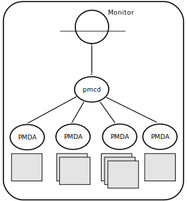
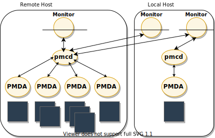
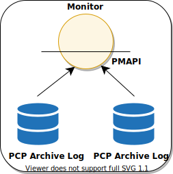

.. _ProgrammingPcp:

Programming Performance Co-Pilot
##################################

.. contents::

Performance Co-Pilot (PCP) provides a systems-level suite of tools that cooperate to deliver distributed, integrated performance management services. PCP is 
designed for the in-depth analysis and sophisticated control that are needed to understand and manage the hardest performance problems in the most complex systems.

PCP provides unparalleled power to quickly isolate and understand performance behavior, resource utilization, activity levels and performance bottlenecks.

Performance data may be collected and exported from multiple sources, most notably the hardware platform, the operating system kernel, layered services, and 
end-user applications.

There are several ways to extend PCP by programming certain of its components:

* By writing a Performance Metrics Domain Agent (PMDA) to collect performance metrics from an uncharted performance domain (Chapter 2, :ref:`Writing a PMDA`)

* By creating new analysis or visualization tools using documented functions from the Performance Metrics Application Programming Interface (PMAPI) (Chapter 3, :ref:`PMAPI--The Performance Metrics API`)

* By adding performance instrumentation to an application using facilities from PCP libraries, which offer both sampling and event tracing models.

Finally, the topic of customizing an installation is covered in the chapter on customizing and extending PCP service in the *Performance Co-Pilot User's and Administrator's Guide*.

PCP Architecture
*****************

This section gives a brief overview of PCP architecture.

PCP consists of numerous monitoring and collecting tools. **Monitoring tools** such as **pmval** and **pminfo** report on metrics, but have minimal interaction with 
target systems. **Collection tools**, called PMDAs, extract performance values from target systems, but do not provide user interfaces.

Systems supporting PCP services are broadly classified into two categories:

1. Collector:
   Hosts that have the PMCD and one or more PMDAs running to collect and export performance metrics
   
2. Monitor:
   Hosts that import performance metrics from one or more collector hosts to be consumed by tools to monitor, manage, or record the performance of the collector 
   hosts

Each PCP enabled host can operate as a collector, or a monitor, or both.

:ref:`Figure 1.1. PCP Global Process Architecture` shows the architecture of PCP. The monitoring tools consume and process performance data using a public interface, 
the Performance Metrics Application Programming Interface (PMAPI).

Below the PMAPI level is the PMCD process, which acts in a coordinating role, accepting requests from clients, routing requests to one or more PMDAs, aggregating 
responses from the PMDAs, and responding to the requesting client.

Each performance metric domain (such as the operating system kernel or a database management system) has a well-defined name space for referring to the specific 
performance metrics it knows how to collect.

.. _Figure 1.1. PCP Global Process Architecture:

   Figure 1.1. PCP Global Process Architecture
   
Distributed Collection
==========================

The performance metrics collection architecture is distributed, in the sense that any monitoring tool may be executing remotely. However, a PMDA is expected to be 
running on the operating system for which it is collecting performance measurements; there are some notable PMDAs such as Cisco and Cluster that are exceptions, 
and collect performance data from remote systems.

As shown in :ref:`Figure 1.2. Process Structure for Distributed Operation`, monitoring tools communicate only with PMCD. The PMDAs are controlled by PMCD and 
respond to requests from the monitoring tools that are forwarded by PMCD to the relevant PMDAs on the collector host.

.. _Figure 1.2. Process Structure for Distributed Operation:

   Figure 1.2. Process Structure for Distributed Operation

The host running the monitoring tools does not require any collection tools, including PMCD, since all requests for metrics are sent to the PMCD process on the 
collector host.

The connections between monitoring tools and PMCD processes are managed in **libpcp**, below the PMAPI level; see the **PMAPI(3)** man page. Connections between 
PMDAs and PMCD are managed by the PMDA functions; see the **PMDA(3)** and **pmcd(1)** man pages. There can be multiple monitor clients and multiple PMDAs on the 
one host, but there may be only one PMCD process.

Name Space
============

Each PMDA provides a domain of metrics, whether they be for the operating system, a database manager, a layered service, or an application module. These metrics 
are referred to by name inside the user interface, and with a numeric Performance Metric Identifier (PMID) within the underlying PMAPI.

The PMID consists of three fields: the domain, the cluster, and the item number of the metric. The domain is a unique number assigned to each PMDA. For example, 
two metrics with the same domain number must be from the same PMDA. The cluster and item numbers allow metrics to be easily organized into groups within the PMDA, 
and provide a hierarchical taxonomy to guarantee uniqueness within each PMDA.

The Performance Metrics Name Space (PMNS) describes the exported performance metrics, in particular the mapping from PMID to external name, and vice-versa.

Distributed PMNS
==================
Performance metric namespace (PMNS) operations are directed by default to the host or set of archives that is the source of the desired performance metrics.

In :ref:`Figure 1.2. Process Structure for Distributed Operation`, both Performance Metrics Collection Daemon (PMCD) processes would respond to PMNS queries from 
monitoring tools by referring to their local PMNS. If different PMDAs were installed on the two hosts, then the PMNS used by each PMCD would be different, to 
reflect variations in available metrics on the two hosts.

Although extremely rarely used, the **-n** *pmnsfile* command line option may be used with many PCP monitoring tools to force use of a local PMNS file in preference 
to the PMNS at the source of the metrics.

Retrospective Sources of Performance Metrics
==============================================

The distributed collection architecture described in the previous section is used when PMAPI clients are requesting performance metrics from a real-time or live source.

The PMAPI also supports delivery of performance metrics from a historical source in the form of a PCP archive. Archives are created using the **pmlogger** 
utility, and are replayed in an architecture as shown in :ref:`Figure 1.3. Architecture for Retrospective Analysis`.

.. _Figure 1.3. Architecture for Retrospective Analysis:

    Figure 1.3. Architecture for Retrospective Analysis
    
Overview of Component Software
********************************
Performance Co-Pilot (PCP) is composed of text-based tools, optional graphical tools, and related commands. Each tool or command is fully documented by a man page. 
These man pages are named after the tools or commands they describe, and are accessible through the **man** command. For example, to see the **pminfo(1)** man page 
for the **pminfo** command, enter this command::

 man pminfo
 
A list of PCP developer tools and commands, grouped by functionality, is provided in the following section.

Application and Agent Development
=====================================
The following PCP tools aid the development of new programs to consume performance data, and new agents to export performance data within the PCP framework:

**chkhelp**

Checks the consistency of performance metrics help database files.

**dbpmda**

Allows PMDA behavior to be exercised and tested. It is an interactive debugger for PMDAs.

**mmv**

Is used to instrument applications using Memory Mapped Values (MMV). These are values that are communicated with pmcd instantly, and very efficiently, using a shared memory mapping. It is a program instrumentation library.

**newhelp**

Generates the database files for one or more source files of PCP help text.

**pmapi**

Defines a procedural interface for developing PCP client applications. It is the Performance Metrics Application Programming Interface (PMAPI).

**pmclient**

Is a simple client that uses the PMAPI to report some high-level system performance metrics. The source code for **pmclient** is included in the distribution.

**pmda**

Is a library used by many shipped PMDAs to communicate with a **pmcd** process. It can expedite the development of new and custom PMDAs.

**pmgenmap**

Generates C declarations and **cpp** macros to aid the development of customized programs that use the facilities of PCP. It is a program development tool.

PMDA Development
******************

A collection of Performance Metrics Domain Agents (PMDAs) are provided with PCP to extract performance metrics. Each PMDA encapsulates domain-specific knowledge 
and methods about performance metrics that implement the uniform access protocols and functional semantics of the PCP. There is one PMDA for the operating system, 
another for process specific statistics, one each for common DBMS products, and so on. Thus, the range of performance metrics can be easily extended by implementing 
and integrating new PMDAs. Chapter 2, :ref:`Writing a PMDA`, is a step-by-step guide to writing your own PMDA.

⁠Overview
===========

Once you are familiar with the PCP and PMDA frameworks, you can quickly implement a new PMDA with only a few data structures and functions. This book contains 
detailed discussions of PMDA architecture and the integration of PMDAs into the PCP framework. This includes integration with PMCD. However, details of extracting 
performance metrics from the underlying instrumentation vary from one domain to another and are not covered in this book.

A PMDA is responsible for a set of performance metrics, in the sense that it must respond to requests from PMCD for information about performance metrics, instance 
domains, and instantiated values. The PMCD process generates requests on behalf of monitoring tools that make requests using PMAPI functions.

You can incorporate new performance metrics into the PCP framework by creating a PMDA, then reconfiguring PMCD to communicate with the new PMDA.

Building a PMDA
=================

A PMDA interacts with PMCD across one of several well-defined interfaces and protocol mechanisms. These implementation options are described in the 
*Performance Co-Pilot User's and Administrator's Guide*.

.. note::
   It is strongly recommended that code for a new PMDA be based on the source of one of the existing PMDAs below the ``${PCP_PMDAS_DIR}`` directory.
   
In-Process (DSO) Method
------------------------

This method of building a PMDA uses a Dynamic Shared Object (DSO) that is attached by PMCD, using the platform-specific shared library manipulation interfaces such 
as **dlopen(3)**, at initialization time. This is the highest performance option (there is no context switching and no interprocess communication (IPC) between the 
PMCD and the PMDA), but is operationally intractable in some situations. For example, difficulties arise where special access permissions are required to read the 
instrumentation behind the performance metrics (**pmcd** does not run as root), or where the performance metrics are provided by an existing process with a different 
protocol interface. The DSO PMDA effectively executes as part of PMCD; so great care is required when crafting a PMDA in this manner. Calls to **exit(1)** in the 
PMDA, or a library it uses, would cause PMCD to exit and end monitoring of that host. Other implications are discussed in Section 2.2.3, “:ref:`Daemon PMDA`”.

Daemon Process Method
-----------------------

Functionally, this method may be thought of as a DSO implementation with a standard **main** routine conversion wrapper so that communication with PMCD uses 
message passing rather than direct procedure calls. For some very basic examples, see the ``${PCP_PMDAS_DIR}/trivial/trivial.c`` and ``${PCP_PMDAS_DIR}/simple/simple.c`` source files.

The daemon PMDA is actually the most common, because it allows multiple threads of control, greater (different user) privileges when executing, and provides more 
resilient error encapsulation than the DSO method.

.. note:: Of particular interest for daemon PMDA writers, the ``${PCP_PMDAS_DIR}/simple`` PMDA has implementations in C, Perl and Python.

Client Development and PMAPI
*****************************

Application developers are encouraged to create new PCP client applications to monitor, display, and analyze performance data in a manner suited to their particular 
site, application suite, or information processing environment.

PCP client applications are programmed using the Performance Metrics Application Programming Interface (PMAPI), documented in Chapter 3, :ref:`PMAPI--The Performance Metrics API`. 
The PMAPI, which provides performance tool developers with access to all of the historical and live distributed services of PCP, is the interface used by the 
standard PCP utilities.

Library Reentrancy and Threaded Applications
*********************************************

While the core PCP library (**libpcp**) is thread safe, the layered PMDA library (**libpcp_pmda**) is not. This is a deliberate design decision to trade-off 
commonly required performance and efficiency against the less common requirement for multiple threads of control to call the PCP libraries.

The simplest and safest programming model is to designate at most one thread to make calls into the PCP PMDA library.
