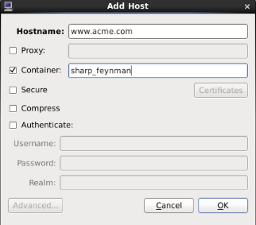
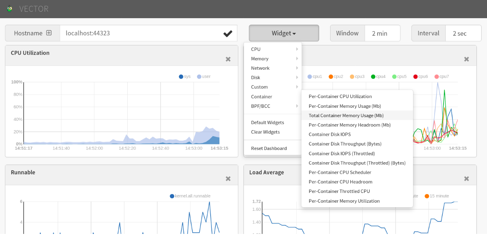

.. _AnalyzeLinuxContainers:

Analyzing Linux Containers
####################################

.. contents::

Container engines like Docker, LXC, Rocket and others build on two Linux kernel facilities - cgroups and namespaces. In order to understand the performance characteristics of containerized environments, we need some background kernel knowledge to see how these concepts affect both the system itself, and system-level analysis tools like PCP.

Getting Started
****************
1. If you don't have some handy containers, create and start one or two containers for experimentation.

2. To observe running containers:

    Using Docker: **docker ps -a** 

    Under libpod: **podman ps -a** 

    With LXC: **lxc-ls** and **lxc-info**

3. Check local PCP collector installation (requires the pcp-verify utility)::

    $ pcp verify --containers

4. Request networking metrics for a host and then a container running on the host::

    $ pminfo --fetch containers.name containers.state.running

    containers.name
        inst [0 or "f4d3b90bea15..."] value "sharp_feynman"
        inst [1 or "d43eda0a7e7d..."] value "cranky_colden"
        inst [2 or "252b56e79da5..."] value "desperate_turing"

    containers.state.running
        inst [0 or "f4d3b90bea15..."] value 1
        inst [1 or "d43eda0a7e7d..."] value 0
        inst [2 or "252b56e79da5..."] value 1

    $ pmprobe -I network.interface.up
    network.interface.up 5 "p2p1" "wlp2s0" "lo" "docker0" "veth2234780"

    $ pmprobe -I --container sharp_feynman network.interface.up
    network.interface.up 2 "lo" "eth0"

    $ pmprobe -I --container f4d3b90bea15 network.interface.up
    network.interface.up 2 "lo" "eth0"

.. note::

   These commands all query the same pmcd process - from the host running the container engine. In other words, 
   there is no need to install any PCP software inside the monitored containers.

Control Groups
******************

Control Groups are a Linux kernel mechanism for aggregating or partitioning sets of tasks, and their children, into hierarchical groups with specialized behaviour. This is the underlying technology used for controlling the set of processes within each container.

Recall that the concept of a "container" is a user-space construct only, and it is the role of the container engine to ensure the kernel cgroup hierarchies are constructed and managed appropriately for the containers it provides.

A cgroup **subsystem** is kernel code that makes use of the task grouping facilities provided by cgroups to treat groups of tasks in particular ways. A subsystem is typically a "resource controller" that schedules a resource or applies per-cgroup limits. Examples of cgroup subsystems used by container engines include the virtual memory subsystem (*memory*), the processor accounting subsystem (*cpuacct*), the block accounting cgroup (*blkio*), and several others.

Within the scope of individual cgroup subsystems, hierarchies can be created, managed and shaped in terms of the tasks within them. A **hierarchy** is a set of cgroups arranged in a tree, such that every task in the system is in exactly one of the cgroups in the hierarchy, and a set of subsystems; each *subsystem* has system-specific state attached to each cgroup in the hierarchy.

Each hierarchy has an instance of the cgroup virtual filesystem associated with it.

These can be interrogated by querying the PCP **cgroup.subsys** and **cgroup.mounts** metrics:: 

    $ pminfo --fetch cgroup.subsys.num_cgroups

    cgroup.mounts.subsys
        inst [0 or "/sys/fs/cgroup/systemd"] value "?"
        inst [1 or "/sys/fs/cgroup/cpuset"] value "cpuset"
        inst [2 or "/sys/fs/cgroup/cpu,cpuacct"] value "cpu,cpuacct"
        inst [3 or "/sys/fs/cgroup/memory"] value "memory"
        inst [4 or "/sys/fs/cgroup/devices"] value "devices"
        inst [5 or "/sys/fs/cgroup/freezer"] value "freezer"
        inst [6 or "/sys/fs/cgroup/net_cls,net_prio"] value "net_cls,net_prio"
        inst [7 or "/sys/fs/cgroup/blkio"] value "blkio"
        inst [8 or "/sys/fs/cgroup/perf_event"] value "perf_event"
        inst [9 or "/sys/fs/cgroup/hugetlb"] value "hugetlb"

    cgroup.subsys.num_cgroups
        inst [0 or "cpuset"] value 1
        inst [1 or "cpu"] value 77
        inst [2 or "cpuacct"] value 77
        inst [3 or "memory"] value 3
        inst [4 or "devices"] value 3
        inst [5 or "freezer"] value 3
        inst [6 or "net_cls"] value 1
        inst [7 or "blkio"] value 77
        inst [8 or "perf_event"] value 1
        inst [9 or "net_prio"] value 1
        inst [10 or "hugetlb"] value 1

Userspace code (i.e. container engines like Docker and LXC) can create and destroy cgroups by name in an instance of the cgroup virtual file system, specify and query to which cgroup a task is assigned, and list the task PIDs assigned to a cgroup. Those creations and assignments only affect the hierarchy associated with that instance of the cgroup file system.

Namespaces
*************

Completely distinct to cgroups, at least within the kernel, is the concept of namespaces. Namespaces allow different processes to have differing views of several aspects of the kernel, such as the hostname (UTS namespace), network interfaces (NET namespace), process identifiers (PID namespace), mounted filesystems (MNT namespace) and so on.

When processes share a namespace, they share the same view of a resource. For example, objects created in one IPC namespace are visible to all other processes that are members of that namespace, but are not visible to processes having another IPC namespace. So for our purposes, all processes running in one container can thus have a different view to the IPC resources visible to a process running on the host or a different container.

Returning to the first networking example in this tutorial, we can see how namespaces become important from a performance tooling point of view. For network metrics within a container, we want to be able to report values for the set of network interfaces visible within that container, instead of the set from the host itself.

Finally, it is important to note that namespaces are not a complete abstraction, in that many aspects of the underlying host remain visible from within the container. This affects performance tools in that the values exported for some metrics can be adjusted and fine-tuned relative to the container, while others cannot.

Containers and PCP
********************

Core Extensions
=================

All connections made to the PCP metrics collector daemon (*pmcd*) are made using the PCP protocol, which is TCP/IP based and thus (importantly for containers) connection-oriented. 

Each individual monitoring tool has a unique connection to *pmcd* and can request values for a specific, custom set of metrics. This includes being able to request metric values related to a specific, named container. 

.. note::
   
   PCP differs to the design of several other monitoring systems in this regard, which write or send out a specified set of system-wide values, on a set interval.

From a user point of view, this boils down to being able to specify a container via the interface (whether command line or graphical) of the PCP monitoring tools and to have that container name transfered to the PCP collector system. This allows for filtering and fine-tuning of the metric values it returns, such that the values are specific to the named container.

Elevated Privileges
========================

Support for containers was first added in the 3.10.2 version of PCP (released in January 2015). This version includes the *pmdaroot* daemon - a critical component of the container support, it must be enabled in order to monitor containers.

It performs privileged operations on behalf of other PCP agents and plays a pivotal role in informing the other agents about various attributes of the active containers that it discovers on the PCP collector system.

Verify that there is a *pmdaroot* line in ``/etc/pcp/pmcd/pmcd.conf`` and that the *pcp* command reports that it is running.

Container-specific Metric Values
=================================

With that core functionality in place, several kernel agents have been taught to customize the metric values they report when the monitoring of a named container has been requested. These include the network, filesys, ipc, and other metrics in *pmdalinux*, as well as the per-process and cgroup metrics in *pmdaproc*.

To request container-specific process and control group metrics::

    $ pminfo -t --fetch --container sharp_feynman cgroup.memory.stat.cache proc.psinfo.rss pmcd.hostname

    cgroup.memory.stat.cache [Number of bytes of page cache memory]
        inst [2 or "/system.slice/docker-f4d3b90bea15..."] value 9695232

    proc.psinfo.rss [resident set size (i.e. physical memory) of the process]
        inst [21967 or "021967 dd if=/dev/random of=/tmp/bits count=200k"] value 676
        inst [27996 or "027996 /bin/bash"] value 2964

    pmcd.hostname [local hostname]
        value "f4d3b90bea15"

Performance Metric Domain Agents
==================================

As the underlying container technologies have matured, instrumentation has been added for analysis. For example, **podman** and **docker** have APIs to extract operational metrics, and these are available from **pmdapodman** and **pmdadocker**.

Additionally, components of container infrastructure usually expose metrics via a /metrics HTTP endpoint in the OpenMetrics (Prometheus) format. These metrics can be observed using PCP tools via **pmdaopenmetrics**.

Next Steps
*************

Web and Graphical Tools
==========================

	
In the PCP strip chart utility *pmchart*, connections to containers can be established using the "Add Host" dialog.

    Figure. Add Host Dialog

This can be accessed via the "New Chart" or "Open View" menu entries.

 * Specify the name of the PCP Collector system where *pmcd* is running.

 * Press the "Advanced" push button to enable additional connection attributes to be specified.
 
 * Select the "Container" check box, and enter a container name.

 * Press "OK" to establish a connection to the container on host.

PCP container metric charts using `Vector <https://grafana-pcp.readthedocs.io/en/latest/>`_

    Figure. Metric charts using Vector

