.. _AutomatedReasoningBasics:

Automated Reasoning with pmie
##################################

.. contents::

Overview
**********

The Performance Metrics Inference Engine (pmie) is the tool within PCP that is designed for automated filtering and reasoning about performance.

*pmie* evaluates a set of assertions against a time-series of performance metric values collected in real-time from PMCD on one or more hosts or from one or more PCP archives.

For those assertions that are found to be true, *pmie* is able to print messages, activate alarms, write syslog entries and launch arbitrary programs.

Typical *pmie* usage might include:

    * monitoring for exceptional performance conditions
    
    * raising alarms
    
    * automated filtering of acceptable performance
    
    * early warning of pending performance problems
    
    * "call home" to the support center
    
    * retrospective performance audits
    
    * evaluating assertions about "before and after" performance in the context of upgrades or system reconfiguration
    
    * hypothesis evaluation for capacity planning
    
    * as part of the post mortem analysis following a system failure

pmie basics
***************

The simplest rules test thresholds and are formed from expressions involving performance metrics and constants. For example, the following statement::

    If the context switch rate exceeds 2000 switches per second
    then activate an alarm notifier

may be translated into the following *pmie* rule:

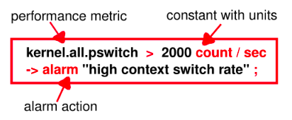

where the "alarm" action launches an information dialog with the specified message.

Generate a lot of context switches, and watch them::

    $ . /etc/pcp.env
    $ pmie -v -c $PCP_DEMOS_DIR/pmie/pswitch.pmie &
    $ pmchart -t 1sec -c $PCP_DEMOS_DIR/pmie/pswitch.view &
    $ while true; do sleep 0; done &
    $ jobs
    [1]- Running     pmie -v -c $PCP_DEMOS_DIR/pmie/pswitch.pmie &
    [2]- Running     pmchart -t 0.5sec -c $PCP_DEMOS_DIR/pmie/pswitch.view &
    [3]+ Running     while true; do sleep 0; done &

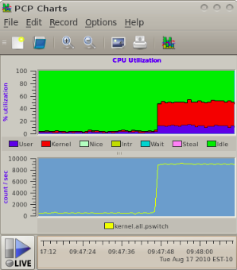

.. Important:: 

    The above test case can be quite intrusive on low processor count machines, so remember to terminate it when you've finished this tutorial.

.. sourcecode::

    $ jobs
    ...
    [3]+ Running     while true; do sleep 0; done &
    $ fg %3

Action repetition and launching arbitrary actions
***************************************************

Sometimes it is useful for an action not to be repeated for a time. For example, the English statement::

    If the context switch rate exceeds 2000 switches per second
    then launch top in an xterm window
    but hold off repetition of the action for 5 minutes

may be translated into the following pmie rule:

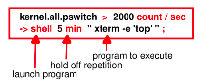

.. Note:: 
   The **shell** keyword introduces an arbitrary action in which any program can be launched.

Rule evaluation over sets of values
**************************************

Each *pmie* rule may be evaluated over a set of performance metric values.

Conceptually these sets of values are constructed for a single performance metric by taking the cross product of observed values over the three dimensions of: **hosts**, **instances** and **times**.

The default host is:

 * The host named in the **-h** command line option to *pmie*, or

 * The host associated with the archive named in the first **-a** command line option to *pmie*, or

 * The local host if neither **-h** nor **-a** appears on the command line.

By default, a metric name represents the set of values formed by the cross product of the default host for pmie, all instances and the current time.  If there is only one instance, then the set contains a singular value.

For example- **filesys.free** is the most recent set of values for the amount of free space on every mounted file system on the default host, and may be represented by the shaded rectangle in the following figure:

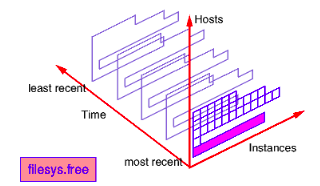

One or more suffix of the form **#instance** (where *instance* is the external instance identifier) after a metric name restricts the set of values on the default host for *pmie*, to the **nominated** instances and the current time. If *instance* includes any special characters then it should be enclosed in single quotes.

For example- **filesys.free #'/usr'** is the most recent value for the amount of free space on the /usr file system on the default host, and may be represented as follows:

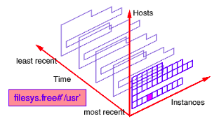

One or more suffix of the form **:hostname** after a metric name changes the set of values to include **all** instances on the **nominated** hosts, at the current time.

For example **filesys.free :otherhost** is the most recent set of values for the amount of free space on every mounted file system on the host **otherhost**, and may be represented as follows:

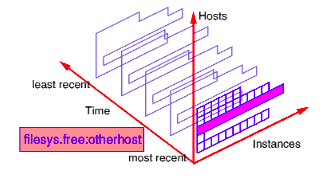

A suffix of the form **@N..M** after a metric name changes the set of values to be that formed by **all** instances on the default host for pmie, at the sample times **N, N+1, ... M back** from the current time.

And finally more than one type of suffix may be used to control enumeration in each of the three axis directions.

For example **filesys.free #'/usr' @0..3** refers to the default host, restricts the instances and enumerates the time. This may be represented as follows:

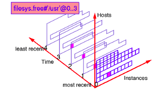

Forms of pmie predicate
*************************

Existential quantification
============================

* The predicate **some_inst** *expr* is true if there is some instance of a metric that makes *expr* true.

* Existential quantification over hosts and consecutive samples is also supported by **some_host** *expr* and **some_sample** *expr*.

* For example, the English statement::

        if some disk is doing a lot of I/O
        then launch a visible alarm

  may be translated into the following pmie rule:

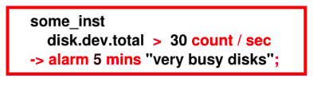

Universal quantification
===========================

* The predicate **all_inst** *expr* is true if *expr* is true for every instance of a metric.

* Universal quantification over hosts and consecutive samples is also supported by **all_host** *expr* and **all_sample** *expr*.

* Quantification predicates may be nested.

* For example, the English statement::

        if for every one of the last 5 samples,
        some disk (but not necessarily the same disk) is doing a lot of I/O
        then launch a visible alarm

  may be translated into the following pmie rule:

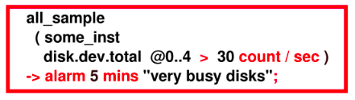

* Note that reversing the nesting of the universal and existential predicates produces a rule which has slightly different English semantics, namely::

        if the same disk has been doing a lot of I/O
        for every one of the last 5 samples,
        then launch a visible alarm

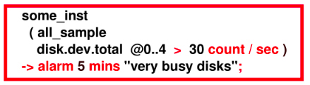

Percentile quantification
============================

* The predicate **N%_inst** *expr* is true if *expr* is true for *N* percent of the instances of a metric.

* Percentile quantification over hosts and consecutive samples is also supported by **N%_host** *expr* and **N%_sample** *expr*.

* For example, the English phrase::

        if at least 30% of the disks are doing a lot of I/O
        then launch a visible alarm

  may be translated into the following pmie expression:

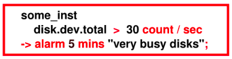

Other predicates
==================

.. list-table::
   :widths: 30 70

   * - Instance quantification		
     - match_inst, nomatch_inst
   * - Value aggregation	
     - avg_inst, sum_inst, avg_host, sum_host, avg_sample, sum_sample
   * - Value extrema	
     - min_inst, max_inst, min_host, max_host, min_sample, max_sample
   * - Value set cardinality		
     - count_inst, count_host, count_sample
   * - Trends	
     - rising, falling, rate

pmie expressions
******************

*pmie* expressions are very similar to the C programming language; especially with regard to arithmetic, relational and Boolean operators, and the use of parenthesis for grouping.

The *pmie* language allows macro definition and textual substitution for common expressions and metric names.

.. sourcecode::

    // Macro for later use ...
    bc = "buffer_cache";

    // Using the above macro
    // If the buffer cache is in use (more than 50 read requests)
    // with hit ratio less than 90%, then popup an alarm
    $bc.getblks > 50 && $bc.getfound / $bc.getblks < 0.9
        -> alarm "poor buffer cache hit rate";

All calculations are done in double precision, where default units are **bytes**, **seconds** and **counts**. Note that this can sometimes cause surprises::

    mem.freemem > 10;

will always be true, unlike::

    mem.freemem > 10 Mbyte;

Metrics with "counter" semantics have their units, semantics and values converted to rates.  

For example, the metric ``network.interface.total.bytes`` measures the number of bytes passed across all of the configured network interfaces. The metric is a counter and the units are **bytes**. If *pmie* finds the value of ``network.interface.total.bytes`` to be 10000 and 15000 on consecutive fetches 5 seconds apart, then the *pmie* expression::

    kernel.interface.total.bytes;

would have the value **1000** and the units of **bytes/second**.

Actions and parameter substitution of predicate context
************************************************************

The available pmie actions are:

.. list-table::
   :widths: 30 70

   * - alarm		
     - popup alarm notifier
   * - shell	
     - launch any program
   * - syslog
     - write an entry in the system log
   * - print
     - print message to standard output

Within the arguments that follow the action keyword, parameter substitution may be used to incorporate some context from the predicate in the arguments to the actions.

For example, when using **some_host** or **some_inst** in a predicate, it is most helpful to know "which hosts" or "which instances" made the condition true.

The following substitutions are available:

 * **%h** appearing in an action is replaced by the qualifying hosts
 * **%i** appearing in an action is replaced by the qualifying instances
 * **%v** appearing in an action is replaced by value of the left-most top-level expression in the expression tree that represents the parsed condition

Performance audit using archives
************************************

In this exercise, we shall use **pmie** to investigate performance from a PCP archive.

Use *pmdumplog* to report the details of when the archive was created and from which host the archive was created::

    $ . /etc/pcp.env
    $ tar xzf $PCP_DEMOS_DIR/tutorials/pmie.tar.gz
    $ pmdumplog -L pmie/babylon.perdisk
    Log Label (Log Format Version 2)
    Performance metrics from host babylon
    commencing Wed Jan 25 08:17:48.460 1995
    ending     Wed Jan 25 14:12:48.457 1995
    Archive timezone: PST8PDT
    PID for pmlogger: 18496

Yes, PCP archives from that long ago still work today!

From running the command::

    $ dkvis -a pmie/babylon.perdisk &

we can visually determine which disks and which controllers are active.

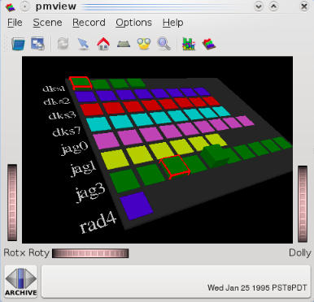

This is easy, which is good. However, consider the situation where we have a large number of separate archives, possibly collected from different machines and with different disk configurations.  We'd like to be able to quickly process these archives, and filter out the extraneous information, to focus on those times at which the disks were busy, how busy they were, etc.

Using the pmie configuration file in pmie/disk.pmie as a starting point, run this against the archive::

    $ pmie -t 5min -a pmie/babylon.perdisk < pmie/disk.pmie

Copy the configuration file and extend it by adding new rules to report different messages for each of the following:

    1. some disk is doing more than 30 reads per second (make use of the **disk.dev.read** metric)

    2. some disk is doing more than 30 writes per second (make use of the **disk.dev.write** metric)
    
    3. some disk has a high I/O rate (consider a high I/O rate to be when the transfers are greater than 40 per second), and where reads contribute greater than ninety-five percent of the total transfers

    4. some disk has a high I/O rate (as defined above) and the system's 1 minute load average is greater than 5 (make use of the "1 minute" instance for the **kernel.all.load** metric).

Use the *pmie/babylon.perdisk* archive extracted earlier to cross check your rules as you add each one.

**Hints:**

    * Make sure you sample the archive every 5 minutes (**-t 5min** on the command line).

    * You'll need to use existential quantification (the **some_inst** keyword) in all of the rules.

    * When producing the final rule, start with the load average metric using the command::

        $ pminfo -f kernel.all.load

     Notice there are three values corresponding to the 1, 5 and 15 minute load average.
     
     For *pmie* the metric **kernel.all.load** is a set of **three** values, one for each instance at each point of time.  To choose **one** instance append the # qualifier to the name of the metric and the name of a particular instance, e.g. **kernel.all.load #'1 minute'**.

    * The *pmie(1)* man page describes the pmie language in detail.

    * You may find it helpful to use *dkvis* to visually predict when the rules should be triggered.  Using the **PCP Archive Time Control** dialog, you can position the *dkvis* display at the time where pmie is reporting interesting activity.

Influence of the update interval
************************************

As a final exercise, investigate the effects of using different update intervals on the *pmie* command line (the **-t** option) with the initial configuration file and archive from the previous exercise.

Try each of the following::

    $ pmie -t 5min -a pmie/babylon.perdisk < pmie/disk.pmie
    $ pmie -t 6min -a pmie/babylon.perdisk < pmie/disk.pmie
    $ pmie -t 10min -a pmie/babylon.perdisk < pmie/disk.pmie

Why does the number of reported incidents decline as the rule evaluation interval increases?

Repeat the exercise but use pmchart::

    $ pmchart -t 5min -a pmie/babylon.perdisk &

Use the **New Chart...** command of the **File** menu to plot the **disk.dev.total** metric for the disk **jag3d5**:

    * Enter the name disk.dev.total into the Metric Selection dialog.

    * There should be 54 instances of the metric listed. Find the instance jag3d5, select it, and press OK.

Use the PCP Archive Time Control dialog to change the **Interval**.

By using **smaller** values of the update interval, can you deduce the sampling rate of the data in the PCP archive?

**Hint:**

* From a PCP archive you can get a dump of the raw data and timestamps when the data for a particular metric was collected using the command::

    $ pmdumplog pmie/babylon.perdisk disk.dev.total | more

