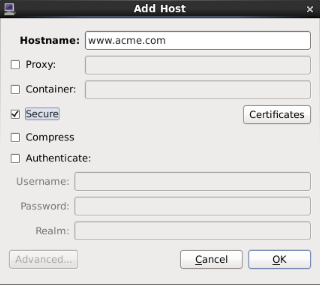

.. _EncryptedConnections:

Establishing Secure Connections
################################################

.. contents::

Overview
**********

The Performance Co-Pilot includes facilities for establishing secure connections between remote collector and monitoring components.

All connections made to the PCP metrics collector daemon (*pmcd*) are made using the PCP protocol, which is TCP/IP based.  Protocol proxying and the PCP REST APIs are served by the *pmproxy* daemon - the REST API can be accessed over HTTPS following the setup instructions described here.

Both the *pmcd* and *pmproxy* daemons are capable of simultaneous TLS and non-TLS communications on a single port (by default, port 44321 for *pmcd* and 44322 for *pmproxy*). This means that you do not have to choose between TLS or non-TLS communications for your PCP Collector systems; both can be used at the same time.

PCP installations using the scalable timeseries querying capabilities use Redis server(s). The process of configuring Redis and PCP is purposefully very similar, for convenience, however Redis configuration is not specifically covered here.

The cryptographic services used to augment the PCP and HTTP protocols are provided by OpenSSL, a library implementing Transport Layer Security (TLS) and base cryptographic functions. Check local PCP collector installation is built with TLS support::

    $ pcp verify --secure

If this produces warnings then your local installation does not support TLS.

Enabling TLS: Steps Involved
******************************

Before the PCP tools can be requested to communicate with TLS, certificates must be properly configured on the collector host.

This typically involves:

    1. Obtain and install certificates for your PCP collector systems, and configure each system to trust the certification authority's (CA's) certificate. Alternatively, the less secure option of generating a self-signed certificate may be appropriate for installations where using trusted certificates is impractical (such as testing). This tutorial uses the latter approach to demonstrate the concepts.

    2. Enable encrypted connections in the pmcd and pmproxy daemons by configuring the PCP collector system with the certificate. This is achieved by editing the PCP ``/etc/pcp/tls.conf`` file to specify location of certificate files and other information.

    3. Ensure that each user monitoring a PCP collector system securely obtains and installs a personal certificate for the tools that will communicate with that collector. This is done by provision of monitor certificates.

Certificate Authority
***********************

The process of obtaining trusted certificates from a certificate authority is beyond the scope of this document, and will differ depending on whether the certificate authority is internal or external to your organisation.

However, at a high-level: a certificate request (CR) must be generated, then sent to the certificate authority (CA) you will be using. The CA will generate a new trusted certificate and send it to you.

Collector Setup
*****************

All PCP collector systems must have valid certificates in order to participate in secure PCP protocol exchanges. Take note that the *pmproxy* daemon operates as both a client and a server from the perspective of TLS. Certificates are stored in the filesystem, and can be created using the *openssl* command line utility.

Certificates should now be requested from your local trusted certificate authority (CA). Alternatively, it is possible to generate a "self-signed" certificate using a local CA as follows::

    # mkdir -p /etc/pcp/tls
    # cat > /etc/pcp/tls/openssl.cnf << _END_
    [ server_cert ]
    keyUsage = digitalSignature, keyEncipherment
    nsCertType = server
    [ client_cert ]
    keyUsage = digitalSignature, keyEncipherment
    nsCertType = client
    _END_
    # openssl genrsa -out /etc/pcp/tls/ca.key

After customising the certificate subject names (-subj option below), enter::

    # openssl req \
        -x509 -new -nodes -sha256 -days 3650 -key /etc/pcp/tls/ca.key \
        -subj '/O=PCP Authority/CN=Certificate Authority' \
        -out /etc/pcp/tls/ca.crt

Create a server certificate (adjusting the -subj option)::

    # openssl genrsa -out /etc/pcp/tls/server.key 2048
    # openssl req \
        -new -sha256 -subj '/O=PCP Authority/CN=PCP Collector' \
        -key /etc/pcp/tls/server.key | \
        openssl x509 \
            -req -sha256 -days 365 \
            -CA /etc/pcp/tls/ca.crt \
            -CAkey /etc/pcp/tls/ca.key \
            -extfile /etc/pcp/tls/openssl.cnf -extensions server_cert \
            -out /etc/pcp/tls/server.crt
    
Create a client certificate (adjusting the -subj option)::

    # openssl genrsa -out /etc/pcp/tls/client.key 2048
    # openssl req \
        -new -sha256 -subj '/O=PCP Authority/CN=PCP Monitor' \
        -key /etc/pcp/tls/client.key | \
        openssl x509 \
            -req -sha256 -days 365 \
            -CA /etc/pcp/tls/ca.crt \
            -CAkey /etc/pcp/tls/ca.key \
            -extfile /etc/pcp/tls/openssl.cnf -extensions client_cert \
            -out /etc/pcp/tls/client.crt

Ensure the unprivileged PCP user account has appropriate access::

    # chown -R pcp:pcp /etc/pcp/tls

Finally, update the PCP configuration file with this information::

    # cat > /etc/pcp/tls.conf << _END_
    tls-ca-cert-file = /etc/pcp/tls/ca.crt
    tls-key-file = /etc/pcp/tls/server.key
    tls-cert-file = /etc/pcp/tls/server.crt
    tls-client-key-file = /etc/pcp/tls/client.key
    tls-client-cert-file = /etc/pcp/tls/client.crt
    _END_

.. note::
 
At this stage, attempts to restart the PCP Collector infrastructure will begin to take notice of the new configuration. Detailed diagnostics are available in the daemon log files, located below ``$PCP_LOG_DIR``.

Monitor Setup
***************

PCP Monitoring (client) tools require a trusted certificate to validate the server in a TLS connection. This certificate must be installed beforehand.

Once certificates are in place, we are ready to attempt to establish secure connections between remote PCP monitor and collector hosts. This can be achieved by specifically requesting a secure connection for individual host connections, in tools that support this explicitly (e.g. pmchart below). Alternatively, an environment variable can be set to request that all client connections within that shell environment be made securely. This environment variable can have the value **enforce** meaning "all connections must be secure, fail if this cannot be achieved", or **relaxed** meaning "establish secure connections only for remote collector systems that are configured, fallback to insecure connections if not".

Create a client certificate as a local user (adjusting and -subj option)::

    $ mkdir -p ~/.pcp/tls
    $ openssl genrsa -out ~/.pcp/tls/client.key 2048
    $ openssl req \
        -new -sha256 -subj '/O=PCP Authority/CN=PCP User Monitor' \
        -key ~/.pcp/tls/client.key | \
        sudo openssl x509 \
            -req -sha256 -days 365 \
            -CA /etc/pcp/tls/ca.crt \
            -CAkey /etc/pcp/tls/ca.key \
            -extfile /etc/pcp/tls/openssl.cnf -extensions client_cert \
            -out ~/.pcp/tls/client.crt

Create a TLS configuration file with this information::

    home=`echo ~`
    $ cat > ~/.pcp/tls.conf << _END_
    tls-ca-cert-file = /etc/pcp/tls/ca.crt
    tls-key-file = $home/.pcp/tls/client.key
    tls-cert-file = $home/.pcp/tls/client.crt
    _END_

To establish a secure connection, in a shell enter::

    $ export PCP_SECURE_SOCKETS=enforce
    $ export PCP_TLSCONF_PATH=~/.pcp/tls.conf
    $ pminfo --host localhost -f kernel.all.load

    kernel.all.load
        inst [1 or "1 minute"] value 1.26
        inst [5 or "5 minute"] value 1.29
        inst [15 or "15 minute"] value 1.28

Graphical Monitor Tools
=========================

In the PCP strip chart utility pmchart encrypted connections can be established using the "Add Host" dialog. This can be accessed via the "New Chart" or "Open View" menu entries.

 * Specify the name of the PCP Collector system where *pmcd* is running.

 * Press the "Advanced..." button in the bottom left.

 * Select the "Encrypt" check box.

 * Press "OK" to establish a new secure connection to the host.

    Figure. Add Host dialog

.. Note::
 
  While you must still use ``PCP_TLSCONF_PATH`` it is not necessary to use the ``PCP_SECURE_SOCKETS`` environment variable described above with *pmchart*. However, if the latter is used, secure connections will become the default mode for all connections established by *pmchart* too.
