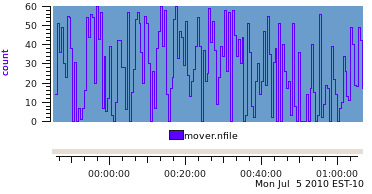
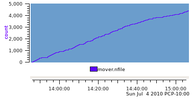
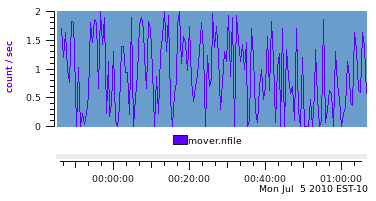
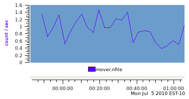
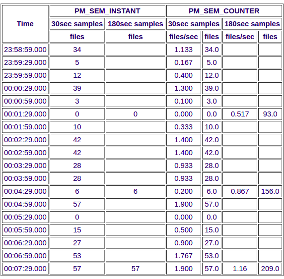
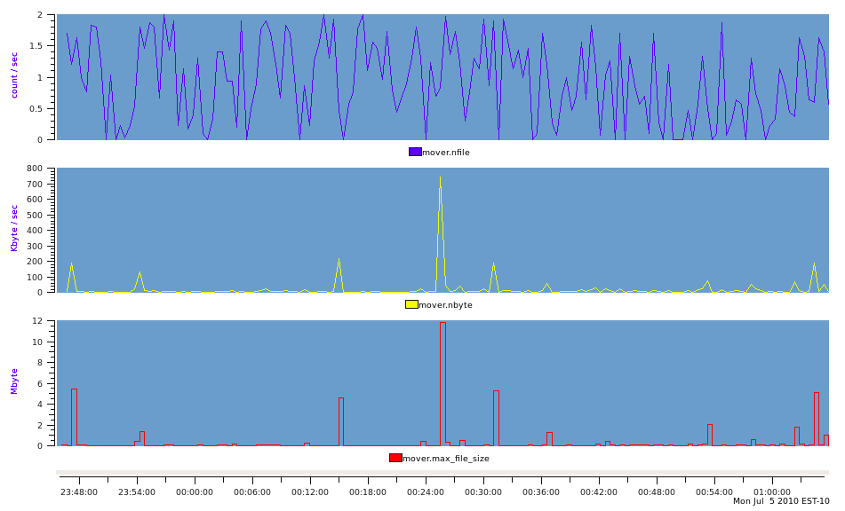
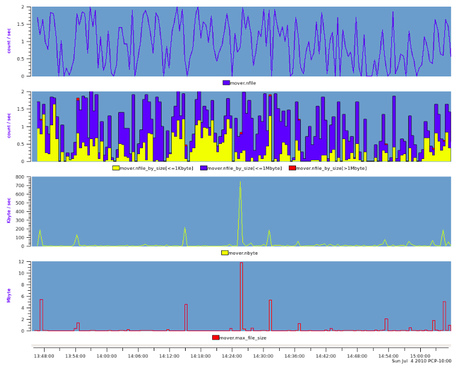

.. _ImportData:

Importing data and creating PCP archives
################################################

.. contents::

Overview
***********

The services needed to build an import tool are included in the *libpcp_import* package and a Perl wrapper is provided in the **PCP::LogImport** module. The C and Perl APIs are effectively identical. Refer to the **LOGIMPORT** (3) manual page for an overview of these services. The examples in this document will be given in Perl.

Several import tools are already provided with PCP, namely:

.. list-table::
   :widths: 20 80

   * - **Tool**           
     - **Function**
   * - **sheet2pcp**	
     - Import data from a spreadsheet in CSV, OpenOffice or Microsoft Office format.
   * - **sar2pcp**	
     - Import data from the sadc (System Activity Reporting Collector) that is part of the sysstat package and modelled on the classical Unix sar tools.
   * - **iostat2pcp**	
     - Import data from output of the iostat command that is part of the sysstat package and modelled on the Berkeley Unix command of the same name.

These scripts are all written in Perl, and we shall refer to them in this document to present examples of specific aspects of the LOGIMPORT services or the issues to be considered when building an import tool.

For the most part in this document we'll be developing an import tool for log files from a file migration application. Some sample log lines are shown below::

    2010-07-04 13:46:29 14 files (6, 8, 0) 142512 bytes (92098)
    2010-07-04 13:46:59 51 files (28, 23, 0) 132761 bytes (33239)
    2010-07-04 13:47:29 36 files (23, 12, 1) 5733152 bytes (5688400)
    2010-07-04 13:47:59 49 files (40, 9, 0) 118418 bytes (70669)
    2010-07-04 13:48:29 30 files (7, 23, 0) 210531 bytes (52261)
    2010-07-04 13:48:59 23 files (6, 17, 0) 81048 bytes (15175)
    2010-07-04 13:49:29 55 files (31, 24, 0) 190841 bytes (27908)
    2010-07-04 13:49:59 54 files (49, 5, 0) 14078 bytes (1213)
    2010-07-04 13:50:29 38 files (19, 19, 0) 82398 bytes (16781)
    2010-07-04 13:50:59 0 files (0, 0, 0) 0 bytes (0)
    2010-07-04 13:51:29 31 files (8, 23, 0) 202755 bytes (41984)
    2010-07-04 13:51:59 0 files (0, 0, 0) 0 bytes (0)
    2010-07-04 13:52:29 7 files (4, 3, 0) 15954 bytes (8789)

Each line begins with a date and time, then the count of the number of files migrated over the last time interval, then three counts in parenthesis corresponding to the number of small files (less than 1024 bytes), medium files (less than 1024*1024 bytes) and large (more than 1024*1024 bytes) files that were migrated, then the total number of bytes moved and finally the size (in bytes) of the largest file moved.

Prerequisites
**************

The input data stream needs to conform to some basic principles before we can consider importing information to PCP:

 * **Timestamps:** A PCP archive is a time-series of observations, hence we need a date and time stamp for each observation. In the simplest case there is a representation of the date and time in the input records. Sometimes the date and time appears as a text string, sometimes it is encoded in a binary file and sometimes it requires some guesswork to reconstruct the date and time of each observation (see *iostat2pcp* for example). In all cases, it will be necessary to have the datestamp available in the internal system clock format, namely seconds and microseconds since the "epoch". Fortunately the Perl module **Date::Parse** does a reasonable job of parsing dates and times in text format, although some preprocessing of the date may be required to force into an ISO 8601 compatible format (see **dodate()** in *sheet2pcp*, *iostat2pcp* and *sar2pcp* for a number of examples).

 * **Regular format:** Some file formats (often application logs) can be quite difficult to parse and extract the data you wish to import into PCP. Pre-processing can help remove ambiguities, cull irrelevant information and make life generally easier. As an example, *sar2pcp* uses *sadf* to translate the binary data file from sadc into an XML stream that is much easier to process.

Identify PCP Metrics and Metadata
***********************************

Incremental development is encouraged. So we shall start with one metric being the number of files migrated.

* The first task is to assign a name – the rules must conform to those for the Performance Metrics Name Space (PMNS), namely a number of components separated by periods "." with each component starting with an alphabetic followed by zero or more characters drawn from the alphabetics, digits and the underscore "_" character. For our metrics we'll use the prefix mover. and so the first metric will be known as mover.nfile.

* Next the metadata for each metric must be defined. This is basically the fields of a **pmDesc** data structure as defined in **pmLookupDesc** (3). The following table describes the information required, some of the options and the values chosen for **mover.nfile**.

.. list-table::
   :widths: 20 50 30

   * - **Metadata**           
     - **Options**
     - **mover.nfile**
   * - Unique Performance Metric Identifier (PMID)		
     - **PM_ID_NULL** for a default assignment, else use the **pmID_build** macro as described in **pmiAddMetric** (3).
     - **PM_ID_NULL**
   * - (Data) Type	
     - **PM_TYPE_32** for a 32-bit integer, etc. See **pmLookupDesc** (3) for a full list and description.
     - **PM_TYPE_U32**
   * - Instance Domain (indom)		
     - If there is only one value for the metric, then this should be **PM_INDOM_NULL**, else it should be a value constructed using the **pmInDom_build** macro, see **pmiAddMetric** (3).	
     - **PM_INDOM_NULL**
   * - Semantics		
     - Defines how to interpret consecutive values. If the values are from a counter that is monotonically increasing, use **PM_SEM_COUNTER**. If there is no relationship between one observation and the next, use **PM_SEM_INSTANT**. As a special case, if the value is most unlikely to change over time (e.g. a configuration parameter), then use **PM_SEM_DISCRETE**.	
     - **PM_SEM_INSTANT**
   * - Units	
     - The interpretation of values for each metric is defined by classifying the metric along three orthogonal axes, namely space, time and count (for events, messages, calls, packets, etc.). For each axis, we need to specify the **dimension** (0 for not appropriate, -1 if the value is "per unit" along this axis or 1 if the value is measured in units along this axis) and the **scale** (if the dimension is not zero) to define the absolute magnitude of values along this axis. Refer to **pmLookupDesc** (3) for a full list of the available options. Use a **pmiUnits** (3) constructor to build a units value.	
     - **pmiUnits(0,0,1,0,0,PM_COUNT_ONE)**

Getting Started Scripting
****************************

The basic algorithm follows this template:

    * Define metadata

    * Loop over input data
        
        * output values
        
        * write PCP archive record

For our sample file migration data, the following minimalist Perl script will do the job::

    use strict;
    use warnings;
    use Date::Parse;
    use Date::Format;
    use PCP::LogImport;

    pmiStart("mover_v1", 0);
    pmiAddMetric("mover.nfile",
            PM_ID_NULL, PM_TYPE_U32, PM_INDOM_NULL,
            PM_SEM_INSTANT, pmiUnits(0,0,1,0,0,PM_COUNT_ONE));

    open(INFILE, "<mover.log");
    while (<INFILE>) {
        my @part;
        chomp;
        @part = split(/\s+/, $_);
        pmiPutValue("mover.nfile", "", $part[2]);
        pmiWrite(str2time($part[0] . "T" . $part[1], "UTC"), 0);
    }

    pmiEnd();

The resultant archive contains one metric::

    $ pminfo -d -a mover_v1

    mover.nfile
        Data Type: 32-bit unsigned int  InDom: PM_INDOM_NULL 0xffffffff
            Semantics: instant  Units: count

And when plotted with *pmchart* produces a graph like this.

Revisiting the Metadata
**************************

The number of files migrated in this example could be exported as either the instantaneous value over the previous sample interval, or accumulated as a running total. If the running total is used and the semantics of the **mover.nfile** metric remains **PM_SEM_INSTANT** the resultant archive produces a graph like this, which is not generally useful for analysis!

So we change the data semantics to be **PM_SEM_COUNTER** and rely on the fact that most PCP monitoring tools will automatically rate convert counters before displaying them. This produces a very similar graph to the first one (the plot style is the only difference) when the output archive is replayed with the same sample interval as found in the input log file (30 seconds).

The real difference in the choice of data semantics can seen when the sample interval for replay is longer than the sample interval in the PCP archive. Using a replay interval of 180 seconds (6 times the sample interval in the archive), produces the following graph for the **PM_SEM_INSTANT** data.

.. figure:: ../../images/mover_3.png

And the **PM_SEM_COUNTER** data is displayed like this.

For the **PM_SEM_INSTANT** metric, the only choice available to *pmchart* (and indeed any PCP reporting tool) is to use the most recent observed value at each reporting interval. In the example above, this means 5 data values from the archive are skipped and the 6th value is used for each reporting interval. By comparison, for a **PM_SEM_COUNTER** metric, all the reporting tools sample the metric at the start of the interval and at the end of the interval and then report the linearly interpolated rate over the interval, which includes the "history" of what was observed in each of the 6 archive intervals for each reporting interval.

This can be seen more clearly when the data is tabulated rather than plotted.

Where the semantics of the data matches that of a free-running counter and where the total can easily be extracted from the input data source, it is **always** better to export PCP metrics with the semantics of **PM_SEM_COUNTER**. Note that the base value for a counter is arbitrary and zero works just fine.

Using similar arguments we can identify two additional singular metrics that can be extracted from the log as **mover.nbyte** (a free-running counter of the number of bytes migrated) and **mover.max_file_size** (an instantaneous metric reporting the size of the largest file migrated in the previous interval). With these additions, our minimalist Perl script has become::

    use strict;
    use warnings;
    use Date::Parse;
    use Date::Format;
    use PCP::LogImport;

    my $nfile = 0;
    my $nbyte = 0;

    pmiStart("mover_v3", 0);
    pmiAddMetric("mover.nfile",
            PM_ID_NULL, PM_TYPE_U32, PM_INDOM_NULL,
            PM_SEM_COUNTER, pmiUnits(0,0,1,0,0,PM_COUNT_ONE));
    pmiAddMetric("mover.nbyte",
            PM_ID_NULL, PM_TYPE_U64, PM_INDOM_NULL,
            PM_SEM_COUNTER, pmiUnits(1,0,0,PM_SPACE_BYTE,0,0));
    pmiAddMetric("mover.max_file_size",
            PM_ID_NULL, PM_TYPE_U64, PM_INDOM_NULL,
            PM_SEM_INSTANT, pmiUnits(1,0,0,PM_SPACE_BYTE,0,0));

    open(INFILE, "<mover.log");
    while (<INFILE>) {
        my @part;
        chomp;
        s/[(),]//g;		# remove all (, ) and ,
        @part = split(/\s+/, $_);
        $nfile += $part[2];
        pmiPutValue("mover.nfile", "", $nfile);
        $nbyte += $part[7];
        pmiPutValue("mover.nbyte", "", $nbyte);
        pmiPutValue("mover.max_file_size", "", $part[9]);
        pmiWrite(str2time($part[0] . "T" . $part[1], "UTC"), 0);
    }

    pmiEnd();

This produces a PCP archive that can be plotted with *pmchart* to produce the following graph.

Multi-valued Metrics and Instance Domains
*********************************************

Metrics that have more than one value are supported in PCP through the concept of an Instance Domain (or **indom**) which is a set with an internal unique identifier (an integer) and a unique external name (a string) for each instance that may have an associated values. There can be many Instance Domains. And many metrics can be associated with the same Instance Domain.

The remaining metric in our example is **mover.nfile_by_size** which has the same metadata as **mover.nfile** except there is an associated Instance Domain to accommodate the 3 values ("<=1Kbyte", "<=1Mbyte" and ">1Mbyte"). The Instance Domain identifier is constructed using the **pmInDom_build** macro, and then used in calls to **pmiAddInstance** (3) to make the association for each metric-instance pair. The relevant metadata declarations are as follows::

    my $sz_indom = pmInDom_build(PMI_DOMAIN, 0);
    my @nfile_by_size = (0,0,0);

    pmiAddMetric("mover.nfile_by_size",
                PM_ID_NULL, PM_TYPE_U32, $sz_indom,
            PM_SEM_COUNTER, pmiUnits(0,0,1,0,0,PM_COUNT_ONE));
    pmiAddInstance($sz_indom, "<=1Kbyte", 0);
    pmiAddInstance($sz_indom, "<=1Mbyte", 1);
    pmiAddInstance($sz_indom, ">1Mbyte", 2);

And then in the loop, these additional calls to **pmiPutValue** (3) are required::

    $nfile_by_size[0] += $part[4];
    pmiPutValue("mover.nfile_by_size", "<=1Kbyte", $nfile_by_size[0]);
    $nfile_by_size[1] += $part[5];
    pmiPutValue("mover.nfile_by_size", "<=1Mbyte", $nfile_by_size[1]);
    $nfile_by_size[2] += $part[6];
    pmiPutValue("mover.nfile_by_size", ">1Mbyte", $nfile_by_size[2]);

This produces our final PCP archive that can be plotted with *pmchart* to produce the following graph.

Handles
*********

If there is a lot of data and/or a lot of PCP metrics, the calls to **pmiPutValue** (3) in the inner loop of the import application may become expensive as a consequence of the repeated text-based lookup for a metric name and an instance name.

The **LOGIMPORT** (3) infrastructure provides a "handles" mechanism that may be used to improve efficiency. **pmiGetHandle** (3) may be used to obtain a "handle" for a metric-instance pair (once the metric and instance have been defined), then **pmiPutValueHandle** (3) may be used instead of **pmiPutValue** (3).

Timezones
***********

The interpretation of the timestamps in the output PCP archive is dependent on the timezone in which PCP believes the archive was created.

Since many import log files do not report the timezone, the **LOGIMPORT** (3) services assume a default timezone of **UTC**. An alternative timezone may be specified using **pmiSetTimezone** (3), but a corresponding adjustment needs to be made to the date and time conversions when arriving at the timestamp for each sample, e.g. using **str2time()** and/or **ctime()**. Unfortunately the format for the timezone offset is not handled the same in all places – for the ugly details, refer to the **–Z** command line processing and the **do_label()** procedure in the complete mover2pcp example code.

Bells and Whistles
********************

The Perl code we've been using thus far is minimalist and needs several extensions to make the application robust. Specifically these include:

 * For singular metrics, wrap the **pmiAddMetric** (3) calls in error handling logic, handle the per-metric metadata variations and create the handle for later use, see the **def_single** () procedure.
  
 * The **def_multi** () procedure performs a similar function for multi-valued metrics, except the handle creation is deferred until each instance is processed.

 * For each metric-instance pair associated with a multi-valued metric, the **def_metric_inst** () procedure maintains a cache of indoms and instances for those indoms so that internal instance identifiers can be allocated automatically and **pmiAddInstance** (3) is only called the first time each unique instance is observed for each instance domain. Also there is error checking logic here and a new handle is allocated for each metric-instance pair.

 * The **put()** procedure is a wrapper around **pmiPutValueHandle** (3) that includes some error handling and stepping through the array of handles created earlier.

 * Timezone and archive label details are addressed in the **do_label** () procedure.

 * Add error checking at the end of the loop after each value has been added to the next output record.
