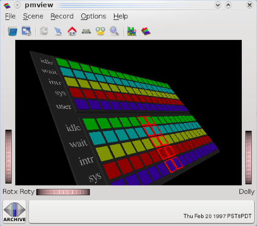
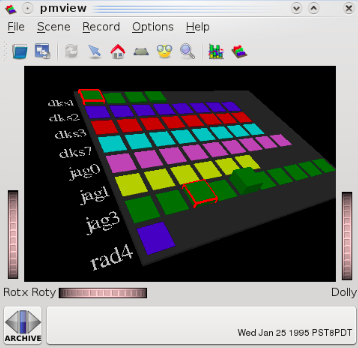
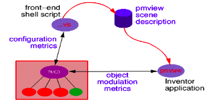

.. _Use3DViews:

Using 3D views
################

.. contents::

Overview
*********

Visual tools take advantage of common cognitive skills, especially for visual pattern matching and scene change discrimination. The motivation for visualization of performance data is very similar to that used for engineering visualization, visual simulation, and database mining through visualization - visually rich representations of complex data sets are powerful aids to understanding and detection of unexpected relationships.

Extract the PCP archives and configuration files we will use in this tutorial into the current working directory::

    $ . /etc/pcp.env
    $ tar xzf $PCP_DEMOS_DIR/tutorials/pmview.tar.gz

Live monitoring and user interface concepts
*********************************************

The mpvis command monitors the CPU utilization for each CPU::

    $ mpvis

* Move the cursor over each block in the scene. Take time to read the (changed) text box above the 3D scene and understand what it is telling you. In particular, identify the source of the metric, the name of the metric, the instance of the metric, the current value.

* Click on the "Live" button or Ctrl-T or **Options -> Show Time Control** from the menu bar. In the PCP Live Time Control dialog, experiment with changing the update Interval (this is the interval at which new metric values are fetched from pmcd).

* Quit with **File -> Quit** or Ctrl-Q.

Retrospective monitoring and tool drill-down
**********************************************

The dkvis command monitors the per-disk I/O activity::

    $ dkvis -a pmie/babylon.perdisk

* In the dkvis window (above the top left-hand corner of the scene) change the **Scale** to be 5 using either the thumbwheel or the text box to the right of the thumbwheel.

* In the associated **PCP Archive Time Control** dialog, changing the update **Interval** to 2 minutes (remember to Enter after you have changed the **Interval** text box).

* Double click the **Play** button. When the replay finished, drag the slider in the **PCP Archive Time Control** dialog back to near the middle of the range and release the slider.

* Back in the *dkvis* window, move the cursor over each block in the scene. Take time to read the (changed) text box above the 3D scene and understand what it's telling you. In particular, identify the source of the metric, the name of the metric, the instance of the metric, the current value.

* Select all of the blocks for controller **dks1** (use "Shift-select" to do multiple selections), and then **Launch -> pmchart** from the main menu. In the pmchart window use **File -> Open View** from the menu bar to add the **LoadAvg** view. This is a "drill-down" example.

* Use the **PCP Archive Time Control** dialog again - this time notice that you're controlling movement through both *dkvis* and *pmchart* using the same time control window (that's because pmchart was launched from dkvis).

* Quit from *dkvis*. Notice that pmchart and the pmtime dialog remain. Quit from *pmchart*.

The "vis" tools
******************

Try some of the other "vis" tools. All of these are "front-ends" to *pmview* as shown in this diagram:

In a command shell enter::

    $ osvis

Move the cursor over each baseplane for more information. Now enter::

    $ pmafm pmie/godzillaweb.folio replay

pmafm is a folio manager which allows you to work with a folio of archives for many visualisation tools; in this case, with the folio godzillaweb.

Simple scene construction
*****************************

The text file pmview/example.view specifies a *pmview* configuration having one baseplane with one bar containing three metrics (5, 10, and 15 minute load averages), and separate bars for each of the disk read and write metrics.

To display this scene, run::

    $ pmview < pmie/example.view

As a learning exercise, copy example.view and modify the configuration so that instead of having the disk metrics as two separate blocks (bars), they appear as a single stacked bar showing both metrics, one on top of the other.

**Hints:**

* The *osvis* tool we saw earlier uses stacked bars for memory and CPU utilization.

* The configuration generated by **any** *pmview* front-end script can be viewed using a **-V** option to the front-end tool, and a **-C** option means quit after generating the configuration (do not launch pmview). So the following may be helpful::
  
    $ osvis -V -C 
    
* The *pmview(1)* man page describes the *pmview* configuration format in detail. Look for the **_stack** object.