.. _UseCharts:

Using Charts
#######################

.. contents::

Main Window
*************

* On starting the PCP Chart (pmchart) tool with no command line arguments, the initial display shows a menu, toolbar, and a live time axis.

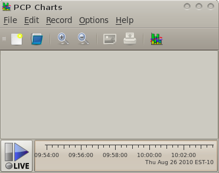

* The vacant area above the time axis is the blank canvas for the charts.

* The time axis along the bottom of the window scrolls with the current time, updated every second, by default (this is also called the *sample interval*).

* To the left of the time axis is the time control status button.

* The blue arrow signifies that (live) time is moving forward. Pressing the button once will show the Time Control tool, *pmtime*, pressing it a second time hides it.

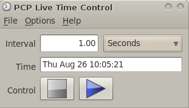

* The time controls allow to modify various aspects of the flow of time in the charts, and clearly displays the current time position.

* A VCR paradigm is used to allow stopping and starting the flow of time, and in the case of historical data (PCP archives), allow movement both forwards and backwards through time, and allow fast, slow, or step-by-step updates to the displayed data.

Views
*******

* A view is a complete specification of every aspect of one or more charts, each of which can contains one or more plots. Views are stored as plain text files in the local filesystem.

* The toolbar along the top of the window has a blue folder icon for Views. The **File** menu provides access to the same functionality via the "Open View" item.

* Click on the blue Views folder to bring up the “Open View” window.

* This window initially displays a list of common performance views (these are the pre-installed System Views). These views have been found to be useful by others over many years, and will be able to run on any host or archive that provides the metrics and instances that they wish to plot - they will never specify specific hostnames, nor will they request any specific geometry or screen position.

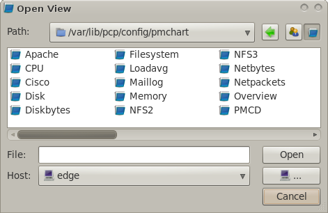

* Select CPU and Disk from the list (Ctrl-Click allows multiple selections to be made), then press OK.

* The chart canvas in the main window is now filled with the two selected Views, showing several aspects of processor and disk utilisation.

Recording
***********
A recording captures live performance data from the current View into an archive folio. 
A folio is a group of one or more performance data archives (sometimes refered to as "logs"), a copy of the current View specification, 
and a configuration file for the pmlogger process which does the actual recording. A folio contains enough state to be able to replay the recording at any time in the future, exactly as it was recorded.

Setup recording for later playback
====================================

* From the main menu, select Record, and then Start to initiate a recording.

* The Live Time Control button in the botton left now displays a red light, indicating that recording is in progress.

Generating load for later playback
====================================

As a simple example of both the recording functionality, and of using pmchart to monitor different subsystems simultaneously, we'll generate some local disk I/O and see how this affects the disk and CPU utilisation charts we have already opened.

In a command shell enter::

    $ find / -xdev >/dev/null 2>&1

This command scans every inode on the root filesystem, which is usually a local disk.

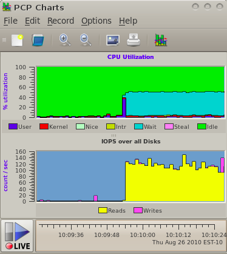

**Observations from the charts:**

* There is a large increase in disk read operations as each inode is read in from disk (yellow plot in the Disk chart).

* At the same time, there is a small increase in processor utilisation, in both kernel and user mode (red and navy blue in the CPU chart).

* Since we account for all CPU time, these increases in system and user time cause a corresponding decrease in the idle time (green area in the CPU chart).

* There is also now an increase in the amount of time spent executing interrupt handlers (yellow plot in the CPU chart) since the device must generate an interrupt completion event for every I/O.

* On systems that support a separate I/O wait CPU utilisation metric (Linux 2.6+ and IRIX), we also see a significant amount of time is spent with outstanding I/O requests (cyan plot in the CPU chart).

Saving Views
***************

* Views can be saved to (text) files for use on subsequent invocations of pmchart, or for use with different hosts or archives.

* From the *File* menu select the *Save View* option. Save the current two charts to a View named ``/tmp/ExampleView``.

* In a command shell, take a look through the saved View configuration::

    $ cat /tmp/ExampleView

    #kmchart

    version 1

    chart title "CPU Utilization [%h]" style utilization

        plot legend "User" color #2d2de2 metric kernel.all.cpu.user

        plot legend "Kernel" color #e71717 metric kernel.all.cpu.sys

        plot legend "Nice" color #c2f3c2 metric kernel.all.cpu.nice

        plot legend "Intr" color #cdcd00 metric kernel.all.cpu.intr

        plot legend "Wait" color #00cdcd metric kernel.all.cpu.wait.total

        plot legend "Idle" color #16d816 metric kernel.all.cpu.idle

    chart title "IOPS over all Disks [%h]" style stacking

        plot legend "Reads" color #ffff00 metric disk.all.read

        plot legend "Writes" color #ee82ee metric disk.all.write

Custom Charts
****************

* From the Edit menu select the Chart item.

* A tabbed window with all settings for the Disk chart is displayed. In the tree view on the left side of the window are the metrics from our selected Disk chart.

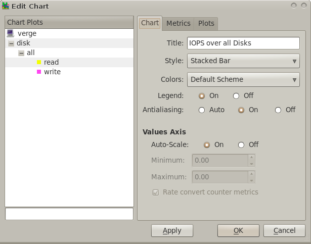

* The three tabs on the right side of the window show the current settings for this chart in three categories:

    * Properties relating to the entire chart (Title, Legend settings, Y-Axis scaling, etc);

    * Available metrics (performance data) for plotting in the chart

    * Properties related to each individual chart plot (color, label)

* Dismiss the Edit Chart dialog – instead of modifying our existing charts, we'll build one from the ground up.

* Click on the *New Chart* option in the toolbar to display the chart creation window.

* It looks just like the chart editing window we've just seen, except initially we have no metrics selected in the chart, and default values for all of the chart properties.

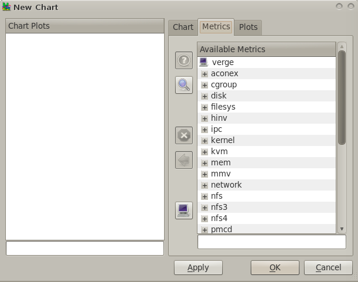

* In the Available Metrics list on the Metrics tab, expand the kernel, all, load trees from your local hosts metric namespace, and then select the three load averages (1, 5, 15 minutes).  Since these are leaf nodes in the namespace, and identify valid values for plotting, several buttons now become enabled – in particular the “Add Metric” button and the “Metric Info” button.

.. figure:: ../../images/kernel_pmchart.png

* Click on the “Metric Info” button to view the metric descriptor (pminfo) and current values (pmval) for disk.all.total.  Dismiss that dialog, and then press the “Add Metric” button, to add this metric into the list of metrics for our new chart.

* A default color is selected (this is chosen from the charts Color scheme, which can be set on the first tab) – this color can also be explicitly set by:

    * selecting the metric from the Chart Plots tree
    
    * selecting a new color from the color palette on the Plot tab
    
    * pressing the Apply color button

* This change can also be reverted by using the revert color button, which returns it to its previous color (displayed alongside that button).

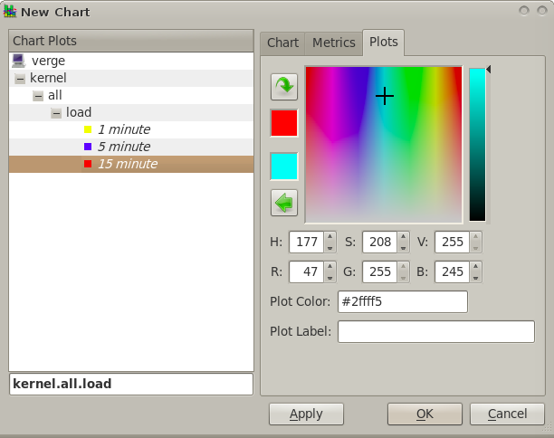

* Set the label for the plots as “1 Min”, “5 Min” and “15 Min”, then press OK.

* A new chart will appear at the bottom of the main window with one plot, and on the next sample interval current values will be plotted.

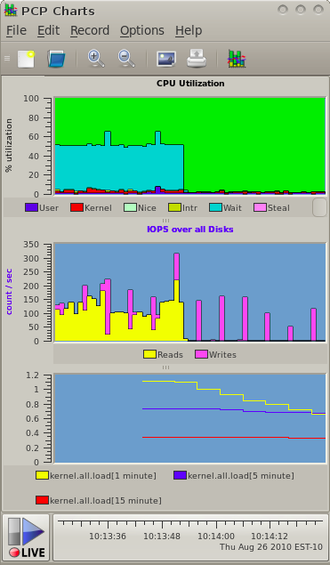

Playback Recording
********************

* Click on the Record menu, then Stop.

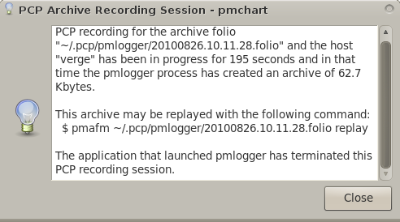
 
The dialog shown explains the status of your recording session (started earlier).

* End your pmchart process now, open a command shell and run::

    $ pmafm ~/.pcp/pmlogger/20100826.10.11.28.folio replay

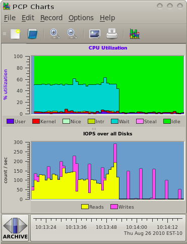

* Click on the "Archive" Time Control push button in the bottom right corner to show the Time Controls.

Time Control
===============

* We are now presented with the Time Control window, which is actually a separate process (pmtime).  This program controls the flow of time in pmchart.

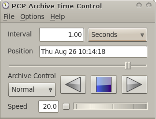

* There are several modes of playback available in archive mode:

    * Normal mode, where time updates are sent to the client at a continuous rate (usually not too different to the original live recording), as determined by the "Speed" wheel setting.

    * Step mode, where time is only advanced/retreated (by clicking on the Step button) one sample at a time.
    
    * Fast mode, where time is moved quickly in either a fast forward or fast rewind direction, and the visible charts are updated as quickly as possible.

  The Speed setting can be changed by directly editing the text entry box, or more simply by selecting and rotating the wheel either left or right.  Speed is only relevent in Normal mode.

* Press the Play button.

  We now see the pmchart Disk and CPU charts displaying the recorded data, one sample after another, and the chart appears to be moving from right to left as time advances at the leading (right) edge of the time axis.

  We can increase the speed of the playback by moving the Time Controls wheel from left to right, and vice-versa to reduce the playback speed.

* Press the Stop button.

  We have now effectively paused, showing a number of Visible Points from the current sample time (displayed in both the Time Control window and the time axis, in the bottom right of the pmchart display) backward in time.

* Use the Position slider in the Time Control window to move toward the end of the archive.

* Press the Back button.
  
  Now time appears to be moving backward, with time updates scrolling past in the pmchart time axis from left to right, until we reach the start of the archive.  At that point, playback will stop and the Time Controls will be updated accordingly.

