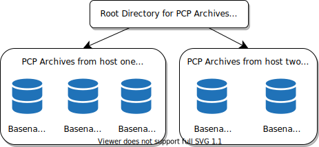

.. _ArchiveLogging:

Archive Logging
################

.. contents::

Performance monitoring and management in complex systems demands the ability to accurately capture performance characteristics for subsequent review, analysis, and comparison. Performance Co-Pilot (PCP) provides extensive support for the creation and management of archives that capture a user-specified profile of performance information to support retrospective performance analysis.

The following major sections are included in this chapter:

Section 6.1, “`Introduction to Archive Logging`_”, presents the concepts and issues involved with creating and using archives.

Section 6.2, “`Using Archives with Performance Tools`_”, describes the interaction of the PCP tools with archives.

Section 6.3, “`Cookbook for Archive Logging`_”, shows some shortcuts for setting up useful PCP archives.

Section 6.4, “`Other Archive Logging Features and Services`_”, provides information about other archive logging features and services.

Section 6.5, “`Archive Logging Troubleshooting`_”, presents helpful directions if your archive logging implementation is not functioning correctly.

Introduction to Archive Logging
********************************

Within the PCP, the **pmlogger** utility may be configured to collect archives of performance metrics. The archive creation process is simple and very flexible, incorporating the following features:

* Archive creation at either a PCP collector (typically a server) or a PCP monitor system (typically a workstation), or at some designated PCP archive logger host.

* Concurrent independent archiving, both local and remote. The performance analyst can activate a private **pmlogger** instance to collect only the metrics of interest for the problem at hand, 
  independent of other archiving on the workstation or remote host.
  
* Independent determination of logging frequency for individual metrics or metric instances. For example, you could log the “5 minute” load average every half hour, the 
  write I/O rate on the DBMS transaction log spindle every 10 seconds, and aggregate I/O rates on the other disks every minute.

* Dynamic adjustment of what is to be logged, and how frequently, via **pmlc**. This feature may be used to disable logging or to increase the sample interval during 
  periods of low activity or chronic high activity. A local **pmlc** may interrogate and control a remote **pmlogger**, subject to the access control restrictions 
  implemented by **pmlogger**.

* Self-contained archives that include all system configuration and metadata required to interpret the values in the archives. These archives can be kept for analysis at a much 
  later time, potentially after the hardware or software has been reconfigured and the archives have been stored as discrete, autonomous files for remote analysis. The archives 
  are endian-neutral and platform independent - there is no requirement that the monitor host machine used for analysis be similar to the collector machine in any way, 
  nor do they have to have the same versions of PCP. PCP archives created over 15 years ago can still be replayed with the current versions of PCP!

* **cron**-based scripts to expedite the operational management, for example, archives rotation, consolidation, and culling. Another helper tool, **pmlogconf** can be used to 
  generate suitable logging configurations for a variety of situations.

* Archive folios as a convenient aggregation of multiple archives. Archive folios may be created with the **mkaf** utility and processed with the **pmafm** tool.

⁠Archives and the PMAPI
=======================

Critical to the success of the PCP archive logging scheme is the fact that the library routines providing access to real-time feeds of performance metrics also provide 
access to the archives.

Live feeds (or real-time) sources of performance metrics and archives are literally interchangeable, with a single Performance Metrics Application Programming Interface 
(PMAPI) that preserves the same semantics for both styles of metric source. In this way, applications and tools developed against the PMAPI can automatically process 
either live or historical performance data.

⁠Retrospective Analysis Using Archives
======================================

One of the most important applications of archive logging services provided by PCP is in the area of retrospective analysis. In many cases, understanding today's 
performance problems can be assisted by side-by-side comparisons with yesterday's performance. With routine creation of performance archives, you can concurrently 
replay pictures of system performance for two or more periods in the past.

Archives are also an invaluable source of intelligence when trying to diagnose what went wrong, as in a performance post-mortem. Because the PCP archives are 
entirely self-contained, this analysis can be performed off-site if necessary.

Each archive contains metric values from only one host. However, many PCP tools can simultaneously visualize values from multiple archives collected from different hosts.

The archives can be replayed using the inference engine (**pmie** is an application that uses the PMAPI). This allows you to automate the regular, first-level analysis of system performance.

Such analysis can be performed by constructing suitable expressions to capture the essence of common resource saturation problems, then periodically creating an archive 
and playing it against the expressions. For example, you may wish to create a daily performance audit (perhaps run by the cron command) to detect performance regressions.

For more about pmie, see Chapter 5, :ref:`Performance Metrics Inference Engine`.

⁠Using Archives for Capacity Planning
=====================================

By collecting performance archives with relatively long sampling periods, or by reducing the daily archives to produce summary logs, the capacity planner can collect 
the base data required for forward projections, and can estimate resource demands and explore “what if” scenarios by replaying data using visualization tools and the 
inference engine.

Using Archives with Performance Tools
**************************************

Most PCP tools default to real-time display of current values for performance metrics from PCP collector host(s). However, most PCP tools also have the capability to 
display values for performance metrics retrieved from PCP archive(s). The following sections describe plans, steps, and general issues involving archives and 
the PCP tools.

⁠Coordination between pmlogger and PCP tools
============================================

Most commonly, a PCP tool would be invoked with the **-a** option to process sets of archives some time after pmlogger had finished creating the archive. 
However, a tool such as **pmchart** that uses a Time Control dialog (see Section 3.3, “:ref:`Time Duration and Control`”) stops when the end of a set of archives is 
reached, but could resume if more data is written to the PCP archive.

.. note::
   **pmlogger** uses buffered I/O to write the archive so that the end of the archive may be aligned with an I/O buffer boundary, rather than with a logical 
   archive record. If such an archive was read by a PCP tool, it would appear truncated and might confuse the tool. These problems may be avoided by sending 
   **pmlogger** a **SIGUSR1** signal, or by using the **flush** command of **pmlc** to force **pmlogger** to flush its output buffers.

⁠Administering PCP Archives Using cron Scripts
==============================================

Many operating systems support the **cron** process scheduling system.

PCP supplies shell scripts to use the **cron** functionality to help manage your archives. The following scripts are supplied:

+---------------------+------------------------------------------------------------------------------------------------------------------------------------------+
| Script              | Description                                                                                                                              |
+=====================+==========================================================================================================================================+
| pmlogger_daily(1)   | Performs a daily housecleaning of archives and notices.                                                                                  |
+---------------------+------------------------------------------------------------------------------------------------------------------------------------------+
| pmlogger_merge(1)   | Merges archives and is called by **pmlogger_daily**.                                                                                     |
+---------------------+------------------------------------------------------------------------------------------------------------------------------------------+
| pmlogger_check(1)   | Checks to see that all desired **pmlogger** processes are running on your system, and invokes any that are missing for any reason.       |
+---------------------+------------------------------------------------------------------------------------------------------------------------------------------+
| pmlogconf(1)        | Generates suitable **pmlogger** configuration files based on a pre-defined set of templates. It can probe the state of the system under  |
|                     | observation to make informed decisions about which metrics to record. This is an extensible facility, allowing software upgrades and new |
|                     | PMDA installations to add to the existing set of templates.                                                                              |
+---------------------+------------------------------------------------------------------------------------------------------------------------------------------+
| pmsnap(1)           | Generates graphic image snapshots of **pmchart** performance charts at regular intervals.                                                |
+---------------------+------------------------------------------------------------------------------------------------------------------------------------------+

The configuration files used by these scripts can be edited to suit your particular needs, and are generally controlled by the ``${PCP_PMLOGGERCONTROL_PATH}`` 
and ``${PCP_PMLOGGERCONTROL_PATH}.d`` files (**pmsnap** has an additional control file, ``${PCP_PMSNAPCONTROL_PATH}``). Complete information on these scripts is 
available in the **pmlogger_daily(1)** and **pmsnap(1)** man pages.

Archive File Management
========================

PCP archive files can occupy a great deal of disk space, and management of archives can be a large task in itself. The following sections provide information 
to assist you in PCP archive file management.

Basename Conventions
---------------------

When a PCP archive is created by **pmlogger**, an archive basename must be specified and several physical files are created, as shown in `Table 6.1. Filenames for PCP Archive Components (archive.*)`_.

.. _Table 6.1. Filenames for PCP Archive Components (archive.*):

**Table 6.1. Filenames for PCP Archive Components (archive.*)**

+----------------------+-------------------------------------------------------------------------------------------------+
| Filename             | Contents                                                                                        |
+======================+=================================================================================================+
| **archive.** *index* | Temporal index for rapid access to archive contents.                                            |
+----------------------+-------------------------------------------------------------------------------------------------+
| **archive.** *meta*  | Metadata descriptions for performance metrics and instance domains appearing in the archive.    |
+----------------------+-------------------------------------------------------------------------------------------------+
| **archive.N**        | Volumes of performance metrics values, for **N** = 0,1,2,...                                    |
+----------------------+-------------------------------------------------------------------------------------------------+

Log Volumes
-------------

A single PCP archive may be partitioned into a number of volumes. These volumes may expedite management of the archive; however, the metadata file and at least one 
volume must be present before a PCP tool can process the archive.

You can control the size of an archive volume by using the **-v** command line option to **pmlogger**. This option specifies how large a volume should become 
before pmlogger starts a new volume. Archive volumes retain the same base filename as other files in the archive, and are differentiated by a numeric suffix 
that is incremented with each volume change. For example, you might have an archive volume sequence that looks like this::

 netserver.0
 netserver.1
 netserver.2

You can also cause an existing archive volume to be closed and a new one to be opened by sending a **SIGHUP** signal to **pmlogger**, or by using the **pmlc** command to change 
the **pmlogger** instructions dynamically, without interrupting **pmlogger** operation. Complete information on archive volumes is found in the **pmlogger(1)** man page.

Basenames for Managed Archive Files
------------------------------------

The PCP archive management tools support a consistent scheme for selecting the basenames for the files in a collection of archives and for mapping these files to a suitable directory hierarchy.

Once configured, the PCP tools that manage archives employ a consistent scheme for selecting the basename for an archive each time **pmlogger** is launched, 
namely the current date and time in the format YYYYMMDD.HH.MM. Typically, at the end of each day, all archives for a particular host on that day would be merged to 
produce a single archive with a basename constructed from the date, namely YYYYMMDD. The **pmlogger_daily** script performs this action and a number of other routine 
housekeeping chores.

Directory Organization for Archive Files
-----------------------------------------

If you are using a deployment of PCP tools and daemons to collect metrics from a variety of hosts and storing them all at a central location, you should develop an organized strategy for storing and 
naming your archive files.

.. note::
   There are many possible configurations of **pmlogger**, as described in Section 7.3, “:ref:`PCP Archive Logger Deployment`”. The directory organization described in this 
   section is recommended for any system on which **pmlogger** is configured for permanent execution (as opposed to short-term executions, for example, as launched from 
   **pmchart** to record some performance data of current interest).

Typically, the filesystem structure can be used to reflect the number of hosts for which a **pmlogger** instance is expected to be running locally, obviating the need 
for lengthy and cumbersome filenames. It makes considerable sense to place all archives for a particular host in a separate directory named after that host. Because each 
instance of **pmlogger** can only log metrics fetched from a single host, this also simplifies some of the archive management and administration tasks.

For example, consider the filesystem and naming structure shown in `Figure 6.1. Archive Directory Structure`_.

.. _Figure 6.1. Archive Directory Structure:

    Figure 6.1. Archive Directory Structure

The specification of where to place the archive files for particular **pmlogger** instances is encoded in the ``${PCP_PMLOGGERCONTROL_PATH}`` and 
``${PCP_PMLOGGERCONTROL_PATH}.d`` configuration files, and these files should be customized on each host running an instance of **pmlogger**.

If many archives are being created, and the associated PCP collector systems form peer classes based upon service type (Web servers, DBMS servers, NFS servers, and so 
on), then it may be appropriate to introduce another layer into the directory structure, or use symbolic links to group together hosts providing similar service types.

Configuration of pmlogger
--------------------------

The configuration files used by **pmlogger** describe which metrics are to be logged. Groups of metrics may be logged at different intervals to other groups of metrics. 
Two states, mandatory and advisory, also apply to each group of metrics, defining whether metrics definitely should be logged or not logged, or whether a later advisory 
definition may change that state.

The mandatory state takes precedence if it is **on** or **off**, causing any subsequent request for a change in advisory state to have no effect. If the mandatory state 
is **maybe**, then the advisory state determines if logging is enabled or not.

The mandatory states are **on**, **off**, and **maybe**. The advisory states, which only affect metrics that are mandatory **maybe**, are **on** and **off**. Therefore, 
a metric that is mandatory **maybe** in one definition and advisory **on** in another definition would be logged at the advisory interval. Metrics that are not specified 
in the **pmlogger** configuration file are mandatory **maybe** and advisory **off** by default and are not logged.

A complete description of the **pmlogger** configuration format can be found on the **pmlogger(1)** man page.

⁠PCP Archive Contents
----------------------

Once a PCP archive has been created, the **pmdumplog** utility may be used to display various information about the contents of the archive. For example, start with 
the following command:

``pmdumplog -l ${PCP_LOG_DIR}/pmlogger/www.sgi.com/19960731``

It might produce the following output:

.. sourcecode:: none

 Log Label (Log Format Version 1)
 Performance metrics from host www.sgi.com
      commencing Wed Jul 31 00:16:34.941 1996
      ending     Thu Aug  1 00:18:01.468 1996

The simplest way to discover what performance metrics are contained within a set of archives is to use **pminfo** as shown in `Example 6.1. Using pminfo to Obtain Archive Information`_:

.. _Example 6.1. Using pminfo to Obtain Archive Information:

Example 6.1. Using pminfo to Obtain Archive Information

.. sourcecode:: none

 pminfo -a ${PCP_LOG_DIR}/pmlogger/www.sgi.com/19960731 network.mbuf
 network.mbuf.alloc 
 network.mbuf.typealloc
 network.mbuf.clustalloc
 network.mbuf.clustfree
 network.mbuf.failed
 network.mbuf.waited
 network.mbuf.drained
 
Cookbook for Archive Logging
*****************************

The following sections present a checklist of tasks that may be performed to enable PCP archive logging with minimal effort. For a complete explanation, refer to the 
other sections in this chapter and the man pages for **pmlogger** and related tools.

⁠Primary Logger
===============

Assume you wish to activate primary archive logging on the PCP collector host **pluto**. Execute the following while logged into **pluto** as the superuser (**root**).

1. Start pmcd and pmlogger:

   .. sourcecode:: none

     chkconfig pmcd on
     chkconfig pmlogger on
     ${PCP_RC_DIR}/pmcd start
     Starting pmcd ...
     ${PCP_RC_DIR}/pmlogger start
     Starting pmlogger ...

2. Verify that the primary **pmlogger** instance is running:

   .. sourcecode:: none

     pcp
     Performance Co-Pilot configuration on pluto:

      platform: Linux pluto 3.10.0-0.rc7.64.el7.x86_64 #1 SMP
      hardware: 8 cpus, 2 disks, 23960MB RAM
      timezone: EST-10
          pmcd: Version 4.0.0-1, 8 agents
          pmda: pmcd proc xfs linux mmv infiniband gluster elasticsearch
          pmlogger: primary logger: pluto/20170815.10.00
          pmie: pluto: ${PCP_LOG_DIR}/pmie/pluto/pmie.log
                venus: ${PCP_LOG_DIR}/pmie/venus/pmie.log

3. Verify that the archive files are being created in the expected place:

   .. sourcecode:: none

      ls ${PCP_LOG_DIR}/pmlogger/pluto
      20170815.10.00.0
      20170815.10.00.index
      20170815.10.00.meta
      Latest
      pmlogger.log

4. Verify that no errors are being logged, and the rate of expected growth of the archives:

   .. sourcecode:: none

      cat ${PCP_LOG_DIR}/pmlogger/pluto/pmlogger.log
      Log for pmlogger on pluto started Thu Aug 15 10:00:11 2017

      Config parsed
      Starting primary logger for host "pluto"
      Archive basename: 20170815.00.10

      Group [26 metrics] {
	          hinv.map.lvname
	          ...
	          hinv.ncpu
      } logged once: 1912 bytes

      Group [11 metrics] {
	          kernel.all.cpu.user
	          ...
	          kernel.all.load
      } logged every 60 sec: 372 bytes or 0.51 Mbytes/day

      ...

⁠Other Logger Configurations
============================

Assume you wish to create archives on the local host for performance metrics collected from the remote host venus. Execute all of the following tasks while logged 
into the local host as the superuser (**root**).

.. _Procedure 6.1. Creating Archives:

**Procedure 6.1. Creating Archives**

1. Create a suitable **pmlogger** configuration file. There are several options:

   * Run the **pmlogconf(1)** utility to generate a configuration file, and (optionally) interactively customize it further to suit local needs.

   .. sourcecode:: none

     ${PCP_BINADM_DIR}/pmlogconf ${PCP_SYSCONF_DIR}/pmlogger/config.venus
     Creating config file "${PCP_SYSCONF_DIR}/pmlogger/config.venus" using default settings

     ${PCP_BINADM_DIR}/pmlogconf ${PCP_SYSCONF_DIR}/pmlogger/config.venus

     Group: utilization per CPU
     Log this group? [n] y
     Logging interval? [default] 

     Group: utilization (usr, sys, idle, ...) over all CPUs
     Log this group? [y] y
     Logging interval? [default] 

     Group: per spindle disk activity
     Log this group? [n] y

     ...

   Do nothing - a default configuration will be created in the following step, using **pmlogconf(1)** probing and automatic file generation based on the metrics 
   available at the remote host. The ``${PCP_RC_DIR}/pmlogger`` start script handles this.

   Manually - create a configuration file with a text editor, or arrange to have one put in place by configuration management tools like `Puppet <https://puppet.com/>`_ or `Chef <https://www.chef.io/products/chef-infra>`__.

2. Edit ``${PCP_PMLOGGERCONTROL_PATH}``, or one of the ``${PCP_PMLOGGERCONTROL_PATH}.d`` files. Using the line for **remote** as a template, add the following line::

     venus n n PCP_LOG_DIR/pmlogger/venus -r -T24h10m -c config.venus

3. Start **pmlogger**::

     ${PCP_BINADM_DIR}/pmlogger_check
     Restarting pmlogger for host "venus" ..... done

4. Verify that the **pmlogger** instance is running:

.. sourcecode:: none

     pcp
     Performance Co-Pilot configuration on pluto:
 
      platform: Linux pluto 3.10.0-0.rc7.64.el7.x86_64 #1 SMP
      hardware: 8 cpus, 2 disks, 23960MB RAM
      timezone: EST-10
          pmcd: Version 3.8.3-1, 8 agents
          pmda: pmcd proc linux xfs mmv infiniband gluster elasticsearch
          pmlogger: primary logger: pluto/20170815.10.00
                venus.redhat.com: venus/20170815.11.15
     pmlc
     pmlc> show loggers
     The following pmloggers are running on pluto:
             primary (19144) 5141
     pmlc> connect 5141
     pmlc> status
     pmlogger [5141] on host pluto is logging metrics from host venus
     log started      Thu Aug 15 11:15:39 2017 (times in local time)
     last log entry   Thu Aug 15 11:47:39 2017
     current time     Thu Aug 15 11:48:13 2017
     log volume       0
     log size         146160

To create archives on the local host for performance metrics collected from multiple remote hosts, repeat the steps in `Procedure 6.1. Creating Archives`_ 
for each remote host (each with a new **control** file entry).

⁠Archive Administration
=======================

Assume the local host has been set up to create archives of performance metrics collected from one or more hosts (which may be either the local host or a remote host).

.. note::
   Depending on your platform, the **crontab** entry discussed here may already have been installed for you, as part of the package installation process. In this case, 
   the file **/etc/cron.d/pcp-pmlogger** will exist, and the rest of this section can be skipped.

To activate the maintenance and housekeeping scripts for a collection of archives, execute the following tasks while logged into the local host as the superuser (**root**):

1. Augment the **crontab** file for the **pcp** user. For example::

     crontab -l -u pcp > ${HOME}/crontab.txt

2. Edit ``${HOME}/crontab.txt``, adding lines similar to those from the sample ``${PCP_VAR_DIR}/config/pmlogger/crontab`` file for **pmlogger_daily** and **pmlogger_check**; 
   for example::

     # daily processing of archives
     10     0     *     *     *    ${PCP_BINADM_DIR}/pmlogger_daily
     # every 30 minutes, check pmlogger instances are running
     25,55  *     *     *     *    ${PCP_BINADM_DIR}/pmlogger_check

3. Make these changes permanent with this command::

     crontab -u pcp < ${HOME}/crontab.txt
 
Other Archive Logging Features and Services
********************************************

Other archiving features and services include PCP archive folios, manipulating archives, primary logger, and using **pmlc**.

⁠PCP Archive Folios
====================

A collection of one or more sets of PCP archives may be combined with a control file to produce a PCP archive folio. Archive folios are created using either **mkaf** 
or the interactive record mode services of various PCP monitor tools (e.g. **pmchart** and **pmrep**).

The automated archive management services also create an archive folio named **Latest** for each managed **pmlogger** instance, to provide a symbolic name to the 
most recent archive. With reference to `Figure 6.1. Archive Directory Structure`_, this would mean the creation of the folios ``${PCP_LOG_DIR}/pmlogger/one/Latest`` 
and ``${PCP_LOG_DIR}/pmlogger/two/Latest``.

The **pmafm** utility is completely described in the **pmafm(1)** man page, and provides the interactive commands (single commands may also be executed from the command line) 
for the following services:

* Checking the integrity of the archives in the folio.
* Displaying information about the component archives.
* Executing PCP tools with their source of performance metrics assigned concurrently to all of the component archives (where the tool supports this), or serially 
  executing the PCP tool once per component archive.
* If the folio was created by a single PCP monitoring tool, replaying all of the archives in the folio with that monitoring tool.
* Restricting the processing to particular archives, or the archives associated with particular hosts.

⁠Manipulating Archives with pmlogextract
========================================

The **pmlogextract** tool takes a number of PCP archives from a single host and performs the following tasks:

* Merges the archives into a single archive, while maintaining the correct time stamps for all values.
* Extracts all metric values within a temporal window that could encompass several archives.
* Extracts only a configurable subset of metrics from the archives.

See the **pmlogextract(1)** man page for full information on this command.

⁠Summarizing Archives with pmlogsummary
=======================================

The **pmlogsummary** tool provides statistical summaries of archives, or specific metrics within archives, or specific time windows of interest in a set of archives. 
These summaries include various averages, minima, maxima, sample counts, histogram bins, and so on.

As an example, for Linux host **pluto**, report on its use of anonymous huge pages - average use, maximum, time at which maximum occurred, total number of samples in 
the set of archives, and the units used for the values - as shown in `Example 6.2. Using pmlogsummary to Summarize Archive Information`_: 

.. _Example 6.2. Using pmlogsummary to Summarize Archive Information:

Example 6.2. Using pmlogsummary to Summarize Archive Information

.. sourcecode:: none

 pmlogsummary -MIly ${PCP_LOG_DIR}/pmlogger/pluto/20170815 mem.util.anonhugepages
 Performance metrics from host pluto
   commencing Thu Aug 15 00:10:12.318 2017
   ending     Fri Aug 16 00:10:12.299 2017

 mem.util.anonhugepages  7987742.326 8116224.000 15:02:12.300 1437 Kbyte
 
 pminfo -t mem.util.anonhugepages
 mem.util.anonhugepages [amount of memory in anonymous huge pages]
 
See the **pmlogsummary(1)** man page for detailed information about this commands many options.

⁠Primary Logger
===============

On each system for which PMCD is active (each PCP collector system), there is an option to have a distinguished instance of the archive logger **pmlogger** 
(the “primary” logger) launched each time PMCD is started. This may be used to ensure the creation of minimalist archives required for ongoing system management 
and capacity planning in the event of failure of a system where a remote **pmlogger** may be running, or because the preferred archive logger deployment is to activate 
**pmlogger** on each PCP collector system.

Run the following command as superuser on each PCP collector system where you want to activate the primary **pmlogger**::

 chkconfig pmlogger on

The primary logger launches the next time the ``${PCP_RC_DIR}/pmlogger`` **start** script runs. If you wish this to happen immediately, follow up with this command::

 ${PCP_BINADM_DIR}/pmlogger_check -V

When it is started in this fashion, the ``${PCP_PMLOGGERCONTROL_PATH}`` file (or one of the ``${PCP_PMLOGGERCONTROL_PATH}.d`` files) must use the second field of one 
configuration line to designate the primary logger, and usually will also use the **pmlogger** configuration file ``${PCP_SYSCONF_DIR}/pmlogger/config.default`` 
(although the latter is not mandatory).

⁠Using pmlc
===========

You may tailor **pmlogger** dynamically with the **pmlc** command (if it is configured to allow access to this functionality). Normally, the **pmlogger** configuration 
is read at startup. If you choose to modify the **config** file to change the parameters under which **pmlogger** operates, you must stop and restart the program for 
your changes to have effect. Alternatively, you may change parameters whenever required by using the **pmlc** interface.

To run the **pmlc** tool, enter::

 pmlc

By default, **pmlc** acts on the primary instance of **pmlogger** on the current host. See the **pmlc(1)** man page for a description of command line options. When it 
is invoked, **pmlc** presents you with a prompt::

 pmlc>

You may obtain a listing of the available commands by entering a question mark (?) and pressing **Enter**. You see output similar to that in 
`Example 6.3. Listing Available Commands`_:

.. _Example 6.3. Listing Available Commands:

**Example 6.3. Listing Available Commands**

.. sourcecode:: none

     show loggers [@<host>]           display <pid>s of running pmloggers
     connect _logger_id [@<host>]     connect to designated pmlogger
     status                           information about connected pmlogger
     query metric-list                show logging state of metrics
     new volume                       start a new log volume
     flush                            flush the log buffers to disk
     log { mandatory | advisory } on <interval> _metric-list
     log { mandatory | advisory } off _metric-list
     log mandatory maybe _metric-list
     timezone local|logger|'<timezone>' change reporting timezone
     help                               print this help message
     quit                               exit from pmlc
     _logger_id   is  primary | <pid> | port <n>
     _metric-list is  _metric-spec | { _metric-spec ... }
     _metric-spec is  <metric-name> | <metric-name> [ <instance> ... ]

Here is an example:

.. sourcecode:: none

 pmlc
 pmlc> show loggers @babylon
 The following pmloggers are running on babylon:
        primary (1892)
 pmlc> connect 1892 @babylon
 pmlc> log advisory on 2 secs disk.dev.read
 pmlc> query disk.dev
 disk.dev.read
        adv  on  nl       5 min  [131073 or “disk1”]
        adv  on  nl       5 min  [131074 or “disk2”]
 pmlc> quit

.. note::
   Any changes to the set of logged metrics made via **pmlc** are not saved, and are lost the next time **pmlogger** is started with the same configuration file. 
   Permanent changes are made by modifying the **pmlogger** configuration file(s).

Refer to the **pmlc(1)** and **pmlogger(1)** man pages for complete details.

Archive Logging Troubleshooting
********************************

The following issues concern the creation and use of logs using **pmlogger**.

pmlogger Cannot Write Log
==========================

**Symptom:** 

The **pmlogger** utility does not start, and you see this message::

 __pmLogNewFile: “foo.index” already exists, not over-written

**Cause:**

Archives are considered sufficiently precious that **pmlogger** does not empty or overwrite an existing set of archive files. The archive named **foo** actually 
consists of the physical file **foo.index**, **foo.meta**, and at least one file **foo.N**, where **N** is in the range 0, 1, 2, 3, and so on.

A message similar to the one above is produced when a new **pmlogger** instance encounters one of these files already in existence.

**Resolution:**

Move the existing archive aside, or if you are sure, remove all of the parts of the archive. For example, use the following command::

 rm -f foo.*

Then rerun **pmlogger**.

⁠Cannot Find Log
=================

**Symptom:**

The **pmdumplog** utility, or any tool that can read an archive, displays this message:

.. sourcecode:: none

 Cannot open archive mylog: No such file or directory

**Cause:**

An archive consists of at least three physical files. If the base name for the archive is **mylog**, then the archive actually consists of the physical files 
**mylog.index**, **mylog.meta**, and at least one file **mylog.N**, where **N** is in the range 0, 1, 2, 3, and so on.

The above message is produced if one or more of the files is missing.

**Resolution:**

Use this command to check which files the utility is trying to open::

 ls mylog.*

Turn on the internal debug flag **DBG_TRACE_LOG** (**-D** 128) to see which files are being inspected by the **pmOpenLog** routine as shown in the following example::

 pmdumplog -D 128 -l mylog

Locate the missing files and move them all to the same directory, or remove all of the files that are part of the archive, and recreate the archive.

Primary pmlogger Cannot Start
===============================

**Symptom:**

The primary **pmlogger** cannot be started. A message like the following appears:

.. sourcecode:: none

 pmlogger: there is already a primary pmlogger running

**Cause:**

There is either a primary **pmlogger** already running, or the previous primary **pmlogger** was terminated unexpectedly before it could perform its cleanup operations.

**Resolution:**

If there is already a primary **pmlogger** running and you wish to replace it with a new **pmlogger**, use the **show** command in **pmlc** to determine the process ID 
of the primary **pmlogger**. The process ID of the primary **pmlogger** appears in parentheses after the word “primary.” Send a **SIGINT** signal to the process to 
shut it down (use either the **kill** command if the platform supports it, or the **pmsignal** command). If the process does not exist, proceed to the manual cleanup 
described in the paragraph below. If the process did exist, it should now be possible to start the new **pmlogger**.

If **pmlc's show** command displays a process ID for a process that does not exist, a **pmlogger** process was terminated before it could clean up. If it was the 
primary **pmlogger**, the corresponding control files must be removed before one can start a new primary **pmlogger**. It is a good idea to clean up any spurious 
control files even if they are not for the primary **pmlogger**.

The control files are kept in ``${PCP_TMP_DIR}/pmlogger``. A control file with the process ID of the **pmlogger** as its name is created when the **pmlogger** is started. 
In addition, the primary **pmlogger** creates a symbolic link named **primary** to its control file.

For the primary **pmlogger**, remove both the symbolic link and the file (corresponding to its process ID) to which the link points. For other **pmloggers**, remove 
just the process ID file. Do not remove any other files in the directory. If the control file for an active **pmlogger** is removed, **pmlc** is not able to contact it.

Identifying an Active pmlogger Process
=======================================

**Symptom:**

You have a PCP archive that is demonstrably growing, but do not know the identify of the associated **pmlogger** process.

**Cause:**

The PID is not obvious from the archive name, or the archive name may not be obvious from the output of the **ps** command.

**Resolution:**

If the archive basename is **foo**, run the following commands:

.. sourcecode:: none

 pmdumplog -l foo
 Log Label (Log Format Version 1)
 Performance metrics from host gonzo 
      commencing Wed Aug  7 00:10:09.214 1996 
      ending     Wed Aug  7 16:10:09.155 1996 
 
 pminfo -a foo -f pmcd.pmlogger 
 pmcd.pmlogger.host
      inst [10728 or "10728"] value "gonzo"
 pmcd.pmlogger.port
      inst [10728 or "10728"] value 4331
 pmcd.pmlogger.archive
      inst [10728 or "10728"] value "/usr/var/adm/pcplog/gonzo/foo"

All of the information describing the creator of the archive is revealed and, in particular, the instance identifier for the PMCD metrics (**10728** in the example 
above) is the PID of the **pmlogger** instance, which may be used to control the process via **pmlc**.

Illegal Label Record
=====================

**Symptom:**

PCP tools report::

 Illegal label record at start of PCP archive file.

**Cause:**

The label record at the start of each of a physical archive file has become either corrupted or one is out of sync with the others.

**Resolution:**

If you believe the archive may have been corrupted, this can be verified using **pmlogcheck**. If corruption is limited to just the label record at the start, the **pmloglabel** 
can be used to force the labels back in sync with each other, with known-good values that you supply.

Refer to the **pmlogcheck(1)** and **pmloglabel(1)** man pages.

⁠Empty Archive Files or pmlogger Exits Immediately
==================================================
⁠
**Symptom:**

Archive files are zero size, requested metrics are not being logged, or **pmlogger** exits immediately with no error messages.

**Cause:**

Either **pmlogger** encountered errors in the configuration file, has not flushed its output buffers yet, or some (or all) metrics specified in the **pmlogger** 
configuration file have had their state changed to advisory **off** or mandatory **off** via **pmlc**. It is also possible that the logging interval specified in the 
**pmlogger** configuration file for some or all of the metrics is longer than the period of time you have been waiting since **pmlogger** started.

**Resolution:**

If **pmlogger** exits immediately with no error messages, check the **pmlogger.log** file in the directory **pmlogger** was started in for any error messages. If 
**pmlogger** has not yet flushed its buffers, enter one of the following commands (depending on platform support)::

 killall -SIGUSR1 pmlogger
 ${PCP_BINADM_DIR}/pmsignal -a -s USR1 pmlogger

Otherwise, use the **status** command for **pmlc** to interrogate the internal **pmlogger** state of specific metrics.
