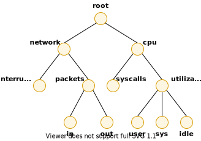

.. _CustomizingAndExtendingPcpServices:

Customizing and Extending PCP Services
########################################

.. contents::

Performance Co-Pilot (PCP) has been developed to be fully extensible. The following sections summarize the various facilities provided to allow you to extend and 
customize PCP for your site:

Section 8.1, “`PMDA Customization`_”, describes the procedure for customizing the summary PMDA to export derived metrics formed by aggregation of base PCP metrics 
from one or more collector hosts.

Section 8.2, “`PCP Tool Customization`_”, describes the various options available for customizing and extending the basic PCP tools.

Section 8.3, “`PMNS Management`_”, covers the concepts and tools provided for updating the PMNS (Performance Metrics Name Space).

Section 8.4, “`PMDA Development`_”, details where to find further information to assist in the development of new PMDAs to extend the range of performance metrics available through the PCP infrastructure.

Section 8.5, “`PCP Tool Development`_”, outlines how new tools may be developed to process performance data from the PCP infrastructure.

PMDA Customization
********************

The generic procedures for installing and activating the optional PMDAs have been described in Section 2.3, “:ref:`Managing Optional PMDAs`”. In some cases, these 
procedures prompt the user for information based upon the local system or network configuration, application deployment, or processing profile to customize the PMDA 
and hence the performance metrics it exports.

The summary PMDA is a special case that warrants further discussion.

Customizing the Summary PMDA
==============================

The summary PMDA exports performance metrics derived from performance metrics made available by other PMDAs. It is described completely in the **pmdasummary(1)** man page.

The summary PMDA consists of two processes:

1. **pmie** process

   Periodically samples the base metrics and compute values for the derived metrics. This dedicated instance of the PCP **pmie** inference engine is launched with special 
   command line arguments by the main process. See Section 5.1, “:ref:`Introduction to pmie`”, for a complete discussion of the **pmie** feature set.

2. **main** process

   Reads and buffers the values computed by the **pmie** process and makes them available to the Performance Metrics Collection Daemon (PMCD).

All of the metrics exported by the summary PMDA have a singular instance and the values are instantaneous; the exported value is the correct value as of the last time 
the corresponding expression was evaluated by the **pmie** process.

The summary PMDA resides in the ``${PCP_PMDAS_DIR}/summary`` directory and may be installed with a default configuration by following the steps described in 
Section 2.3.1, “:ref:`PMDA Installation on a PCP Collector Host`”.

Alternatively, you may customize the summary PMDA to export your own derived performance metrics by following the steps in `Procedure 8.1. Customizing the Summary PMDA`_:

.. _Procedure 8.1. Customizing the Summary PMDA:

**Procedure 8.1. Customizing the Summary PMDA**

1. Check that the symbolic constant **SYSSUMMARY** is defined in the ``${PCP_VAR_DIR}/pmns/stdpmid`` file. If it is not, perform the postinstall update of this file, as superuser::

     cd ${PCP_VAR_DIR}/pmns ./Make.stdpmid

2. Choose Performance Metric Name Space (PMNS) names for the new metrics. These must begin with **summary** and follow the rules described in the **pmns(5)** man page. 
   For example, you might use **summary.fs.cache_write** and **summary.fs.cache_hit**.

3. Edit the **pmns** file in the ``${PCP_PMDAS_DIR}/summary`` directory to add the new metric names in the format described in the **pmns(5)** man page. You must choose 
   a unique performance metric identifier (PMID) for each metric. In the **pmns** file, these appear as **SYSSUMMARY:0:x**. The value of x is arbitrary in the range 0 
   to 1023 and unique in this file. Refer to Section 8.3, “`PMNS Management`_”, for a further explanation of the rules governing PMNS updates.

   For example:

   .. sourcecode:: none

       summary {
                 cpu
                 disk
                 netif
                 fs              /*new*/
       }
       summary.fs {
                 cache_write     SYSSUMMARY:0:10
                 cache_hit       SYSSUMMARY:0:11
       }

4. Use the local test PMNS **root** and validate that the PMNS changes are correct.

   For example, enter this command::

     pminfo -n root -m summary.fs

   You see output similar to the following::

     summary.fs.cache_write PMID: 27.0.10
     summary.fs.cache_hit PMID: 27.0.11

5. Edit the ``${PCP_PMDAS_DIR}/summary/expr.pmie`` file to add new **pmie** expressions. If the name to the left of the assignment operator (=) is one of the PMNS 
   names, then the **pmie** expression to the right will be evaluated and returned by the summary PMDA. The expression must return a numeric value. Additional 
   description of the **pmie** expression syntax may be found in Section 5.3, “:ref:`Specification Language for pmie`”.

   For example, consider this expression:

   .. sourcecode:: none

     // filesystem buffer cache hit percentages
     prefix = "kernel.all.io";          // macro, not exported
     summary.fs.cache_write =
                     100 - 100 * $prefix.bwrite / $prefix.lwrite;
     summary.fs.cache_hit =
                     100 - 100 * $prefix.bread / $prefix.lread;

6. Run **pmie** in debug mode to verify that the expressions are being evaluated correctly, and the values make sense.

   For example, enter this command:

   .. sourcecode:: none

     pmie -t 2sec -v expr.pmie

   You see output similar to the following::

     summary.fs.cache_write:      ?
     summary.fs.cache_hit:      ?
     summary.fs.cache_write:  45.83
     summary.fs.cache_hit:   83.2
     summary.fs.cache_write:  39.22
     summary.fs.cache_hit:  84.51

7. Install the new PMDA.

   From the ``${PCP_PMDAS_DIR}/summary`` directory, use this command::

     ./Install

   You see the following output:

   .. sourcecode:: none

     Interval between summary expression evaluation (seconds)? [10] 10
     Updating the Performance Metrics Name Space...
     Installing pmchart view(s) ...
     Terminate PMDA if already installed ...
     Installing files ..
     Updating the PMCD control file, and notifying PMCD ...
     Wait 15 seconds for the agent to initialize ...
     Check summary metrics have appeared ... 8 metrics and 8 values

8. Check the metrics.

   For example, enter this command:

   .. sourcecode:: none

     pmval -t 5sec -s 8 summary.fs.cache_write

   You see a response similar to the following:

   .. sourcecode:: none

     metric:    summary.fs.cache_write
     host:      localhost
     semantics: instantaneous value
     units:     none
     samples:   8
     interval:  5.00 sec
     63.60132158590308
     62.71878646441073
     62.71878646441073
     58.73968492123031
     58.73968492123031
     65.33822758259046
     65.33822758259046
     72.6099706744868

   Note that the values are being sampled here by **pmval** every 5 seconds, but **pmie** is passing only new values to the summary PMDA every 10 seconds. Both rates 
   could be changed to suit the dynamics of your new metrics.

9. You may now create **pmchart** views, **pmie** rules, and **pmlogger** configurations to monitor and archive your new performance metrics.

PCP Tool Customization
************************

Performance Co-Pilot (PCP) has been designed and implemented with a philosophy that embraces the notion of toolkits and encourages extensibility.

In most cases, the PCP tools provide orthogonal services, based on external configuration files. It is the creation of new and modified configuration files that 
enables PCP users to customize tools quickly and meet the needs of the local environment, in many cases allowing personal preferences to be established for individual 
users on the same PCP monitor system.

The material in this section is intended to act as a checklist of pointers to detailed documentation found elsewhere in this guide, in the man pages, and in the 
files that are made available as part of the PCP installation.

Archive Logging Customization
===============================

The PCP archive logger is presented in Chapter 6, :ref:`Archive Logging`, and documented in the **pmlogger(1)** man page.

The following global files and directories influence the behavior of **pmlogger**:

``${PCP_SYSCONF_DIR}/pmlogger``

Enable/disable state for the primary logger facility using this command::

 chkconfig pmlogger on

``${PCP_SYSCONF_DIR}/pmlogger/config.default``

The default **pmlogger** configuration file that is used for the primary logger when this facility is enabled.

``${PCP_VAR_DIR}/config/pmlogconf/tools``

Every PCP tool with a fixed group of performance metrics contributes a **pmlogconf** configuration file that includes each of the performance metrics used in the tool, 
for example, ``${PCP_VAR_DIR}/config/pmlogconf/pmstat`` for **pmstat**.

``${PCP_PMLOGGERCONTROL_PATH}`` or ``${PCP_PMLOGGERCONTROL_PATH}.d`` files

Defines which PCP collector hosts require **pmlogger** to be launched on the local host, where the configuration file comes from, where the archive files should 
be created, and **pmlogger** startup options.

These **control** files support the starting and stopping of multiple **pmlogger** instances that monitor local or remote hosts.

``/etc/cron.d/pcp-pmlogger`` or ``${PCP_VAR_DIR}/config/pmlogger/crontab``

Default **crontab** entries that may be merged with the **crontab** entries for the **pcp** user to schedule the periodic execution of the archive management scripts, 
for example, **pmlogger_daily**.

``${PCP_LOG_DIR}/pmlogger/somehost``

The default behavior of the archive management scripts create archive files for the host *somehost* in this directory.

``${PCP_LOG_DIR}/pmlogger/somehost/Latest``

A PCP archive folio for the most recent archive for the host *somehost*. This folio is created and maintained by the **cron**-driven periodic archive management 
scripts, for example, **pmlogger_check**. Archive folios may be processed with the **pmafm** tool.

⁠Inference Engine Customization
================================

The PCP inference engine is presented in Chapter 5, :ref:`Performance Metrics Inference Engine`, and documented in the **pmie(1)** man page.

The following global files and directories influence the behavior of **pmie**:

``${PCP_SYSCONF_DIR}/pmie``

Controls the pmie daemon facility. Enable using this command:

.. sourcecode:: none

   chkconfig pmie on

``${PCP_SYSCONF_DIR}/pmie/config.default``

The **pmie** configuration file that is used for monitoring the local host when the **pmie** daemon facility is enabled in the default configuration. 
This file is created using **pmieconf** the first time the daemon facility is activated.

``${PCP_PMIECONTROL_PATH}`` and ``${PCP_PMIECONTROL_PATH}.d`` files

Defines which PCP collector hosts require a daemon **pmie** to be monitoring from the local host, where the configuration files comes from, where the **pmie** 
log file should be created, and **pmie** startup options.

These **control** files support the starting and stopping of multiple **pmie** instances that are each monitoring one or more hosts.

``${PCP_VAR_DIR}/config/pmieconf/*/*``

Each **pmieconf** rule definition can be found below one of these subdirectories.

``/etc/cron.d/pcp-pmie`` or ``${PCP_VAR_DIR}/config/pmie/crontab``

Default **crontab** entries that may be merged with the **crontab** entries for the **pcp** user to schedule the periodic execution of the **pmie_check** and **pmie_daily** 
scripts, for verifying that **pmie** instances are running and logs rotated.

``${PCP_LOG_DIR}/pmie/somehost``

The default behavior of the ``${PCP_RC_DIR}/pmie`` startup scripts create **pmie** log files for the host *somehost* in this directory.

``pmie_check`` and ``pmie_daily``

These commands are similar to the **pmlogger** support scripts, **pmlogger_check** and **pmlogger_daily**.

``${PCP_TMP_DIR}/pmie``

The statistics that **pmie** gathers are maintained in binary data structure files. These files can be found in the ``${PCP_TMP_DIR}/pmie`` directory.

**pmcd.pmie** metrics

The PMCD PMDA exports information about executing **pmie** processes and their progress in terms of rule evaluations and action execution rates.

If **pmie** is running on a system with a PCP collector deployment, the **pmcd** PMDA exports these metrics via the **pmcd.pmie** group of metrics.

PMNS Management
*****************

This section describes the syntax, semantics, and processing framework for the external specification of a Performance Metrics Name Space (PMNS) as it might be 
loaded by the PMAPI routine **pmLoadNameSpace**; see the **pmLoadNameSpace(3)** man page. This is usually done only by **pmcd**, except in rare circumstances such as 
Section 8.1.1, “`Customizing the Summary PMDA`_”.

The PMNS specification is a simple text source file that can be edited easily. For reasons of efficiency, a binary format is also supported; the utility **pmnscomp** 
translates the ASCII source format into binary format; see the **pmnscomp(1)** man page.

PMNS Processing Framework
===========================

The PMNS specification is initially passed through **pmcpp(1)**. This means the following facilities may be used in the specification:

* C-style comments
* **#include** directives
* **#define** directives and macro substitution
* Conditional processing with **#ifdef, #ifndef, #endif**, and **#undef**

When **pmcpp(1)** is executed, the standard include directories are the current directory and ``${PCP_VAR_DIR}/pmns``, where some standard macros and default 
specifications may be found.

PMNS Syntax
============

Every PMNS is tree structured. The paths to the leaf nodes are the performance metric names. The general syntax for a non-leaf node in PMNS is as follows:

.. sourcecode:: none

   pathname {
           name    [pmid]
           ...
   }

Here **pathname** is the full pathname from the root of the PMNS to this non-leaf node, with each component in the path separated by a period. The root node for the 
PMNS has the special name **root**, but the prefix string **root**. must be omitted from all other **pathnames**.

For example, refer to the PMNS shown in `Figure 8.1. Small Performance Metrics Name Space (PMNS)`_. The correct pathname for the rightmost non-leaf node is 
**cpu.utilization**, not **root.cpu.utilization**.

.. _Figure 8.1. Small Performance Metrics Name Space (PMNS):

   Figure 8.1. Small Performance Metrics Name Space (PMNS)

Each component in the pathname must begin with an alphabetic character and be followed by zero or more alphanumeric characters or the underscore (_) character. 
For alphabetic characters in a component, uppercase and lowercase are significant.

Non-leaf nodes in the PMNS may be defined in any order desired. The descendent nodes are defined by the set of **names**, relative to the pathname of their parent 
non-leaf node. For descendent nodes, leaf nodes have a **pmid** specification, but non-leaf nodes do not.

The syntax for the **pmid** specification was chosen to help manage the allocation of Performance Metric IDs (PMIDs) across disjoint and autonomous domains of 
administration and implementation. Each **pmid** consists of three integers separated by colons, for example, **14:27:11**. This is intended to mirror the 
implementation hierarchy of performance metrics. The first integer identifies the domain in which the performance metric lies. Within a domain, related metrics are 
often grouped into clusters. The second integer identifies the cluster, and the third integer, the metric within the cluster.

The PMNS specification for `Figure 8.1. Small Performance Metrics Name Space (PMNS)`_ is shown in `Example 8.1. PMNS Specification`_:

.. _Example 8.1. PMNS Specification:

Example 8.1. PMNS Specification

.. sourcecode:: none

 /*
 * PMNS Specification
 */
 #define KERNEL 1
 root {
        network
        cpu
 }
 #define NETWORK 26
 network {
        interrupts    KERNEL:NETWORK:1
        packets
 }
 network.packets {
        in     KERNEL:NETWORK:35
        out    KERNEL:NETWORK:36
 }
 #define CPU 10
 cpu {
        syscalls    KERNEL:CPU:10
        utilization
 }
 #define USER 20
 #define SYSTEM 21
 #define IDLE 22
 cpu.utilization {
        user    KERNEL:CPU:USER
        sys     KERNEL:CPU:SYSTEM
        idle    KERNEL:CPU:IDLE
 }

For complete documentation of the PMNS and associated utilities, see the **pmns(5), pmnsadd(1), pmnsdel(1)** and **pmnsmerge(1)** man pages.

PMDA Development
*****************

Performance Co-Pilot (PCP) is designed to be extensible at the collector site.

Application developers are encouraged to create new PMDAs to export performance metrics from the applications and service layers that are particularly relevant to 
a specific site, application suite, or processing environment.

These PMDAs use the routines of the **libpcp_pmda** library, which is discussed in detail in the *Performance Co-Pilot Programmer's Guide*.

PCP Tool Development
*********************

Performance Co-Pilot (PCP) is designed to be extensible at the monitor site.

Application developers are encouraged to create new PCP client applications to monitor or display performance metrics in a manner that is particularly relevant to 
a specific site, application suite, or processing environment.

Client applications use the routines of the PMAPI (performance metrics application programming interface) described in the *Performance Co-Pilot Programmer's Guide*. 
At the time of writing, native PMAPI interfaces are available for the C, C++ and Python languages.
