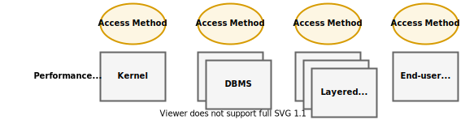
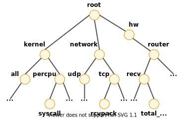

.. _IntroductionToPcp:

Introduction to PCP
####################

.. contents::

This chapter provides an introduction to Performance Co-Pilot (PCP), an overview of its individual components, and conceptual information to help you use this software.  

The following sections are included:

Section 1.1, “`Objectives`_” covers the intended purposes of PCP.  

Section 1.2, “`Conceptual Foundations`_”, discusses the design theories behind PCP.  

Section 1.3, “`Overview of Component Software`_”, describes PCP tools and agents.  

Objectives
**********

Performance Co-Pilot (PCP) provides a range of services that may be used to monitor and manage system performance. These services are distributed and scalable to accommodate the most complex system configurations and performance problems.  

PCP Target Usage
================

PCP is targeted at the performance analyst, benchmarker, capacity planner, developer, database administrator, or system administrator with an interest in overall system performance and a need to quickly isolate and understand performance behavior, resource utilization, activity levels, and bottlenecks in complex systems. Platforms that can benefit from this level of performance analysis include large servers, server clusters, or multiserver sites delivering Database Management Systems (DBMS), compute, Web, file, or video services.

Empowering the PCP User
=======================

To deal efficiently with the dynamic behavior of complex systems, performance analysts need to filter out noise from the overwhelming stream of performance data, and focus on exceptional scenarios. Visualization of current and historical performance data, and automated reasoning about performance data, effectively provide this filtering.  

From the PCP end user's perspective, PCP presents an integrated suite of tools, user interfaces, and services that support real-time and retrospective performance analysis, with a bias towards eliminating mundane information and focusing attention on the exceptional and extraordinary performance behaviors. When this is done, the user can concentrate on in-depth analysis or target management procedures for those critical system performance problems.  

Unification of Performance Metric Domains
==========================================

At the lowest level, performance metrics are collected and managed in autonomous performance domains such as the operating system kernel, a DBMS, a layered service, or an end-user application. These domains feature a multitude of access control policies, access methods, data semantics, and multiversion support. All this detail is irrelevant to the developer or user of a performance monitoring tool, and is hidden by the PCP infrastructure.  

Performance Metrics Domain Agents (PMDAs) within PCP encapsulate the knowledge about, and export performance information from, autonomous performance domains.  

Uniform Naming and Access to Performance Metrics
================================================

Usability and extensibility of performance management tools mandate a single scheme for naming performance metrics. The set of defined names constitutes a Performance Metrics Name Space (PMNS). Within PCP, the PMNS is adaptive so it can be extended, reshaped, and pruned to meet the needs of particular applications and users.  

PCP provides a single interface to name and retrieve values for all performance metrics, independently of their source or location.  

PCP Distributed Operation
=========================

From a purely pragmatic viewpoint, a single workstation must be able to monitor the concurrent performance of multiple remote hosts. At the same time, a single host may be subject to monitoring from multiple remote workstations.

These requirements suggest a classic client-server architecture, which is exactly what PCP uses to provide concurrent and multiconnected access to performance metrics, independent of their host location.

Dynamic Adaptation to Change
============================

Complex systems are subject to continual changes as network connections fail and are reestablished; nodes are taken out of service and rebooted; hardware is added and removed; and software is upgraded, installed, or removed. Often these changes are asynchronous and remote (perhaps in another geographic region or domain of administrative control).

The distributed nature of the PCP (and the modular fashion in which performance metrics domains can be installed, upgraded, and configured on different hosts) enables PCP to adapt concurrently to changes in the monitored system(s). Variations in the available performance metrics as a consequence of configuration changes are handled automatically and become visible to all clients as soon as the reconfigured host is rebooted or the responsible agent is restarted.

PCP also detects loss of client-server connections, and most clients support subsequent automated reconnection.

Logging and Retrospective Analysis
==================================

A range of tools is provided to support flexible, adaptive logging of performance metrics for archive, playback, remote diagnosis, and capacity planning. PCP archives may be accumulated either at the host being monitored, at a monitoring workstation, or both.

A universal replay mechanism, modeled on `media controls <https://en.wikipedia.org/wiki/Media_control_symbols>`_, supports play, step, rewind, fast forward and variable speed processing of archived performance data. Replay for multiple archives, from multiple hosts, is facilitated by an archive aggregation concept.

Most PCP applications are able to process archives and real-time performance data with equal facility. Unification of real-time access and access to the archives, in conjunction with the media controls, provides powerful mechanisms for building performance tools and to review both current and historical performance data.

Automated Operational Support
=============================

For operational and production environments, PCP provides a framework with scripts to customize in order to automate the execution of ongoing tasks such as these:

* Centralized archive logging for multiple remote hosts
* Archive rotation, consolidation, and culling
* Web-based publishing of charts showing snapshots of performance activity levels in the recent past
* Flexible alarm monitoring: parameterized rules to address common critical performance scenarios and facilities to customize and refine this monitoring
* Retrospective performance audits covering the recent past; for example, daily or weekly checks for performance regressions or quality of service problems

PCP Extensibility
=================

PCP permits the integration of new performance metrics into the PMNS, the collection infrastructure, and the logging framework. The guiding principle is, “if it is important for monitoring system performance, and you can measure it, you can easily integrate it into the PCP framework.”

For many PCP users, the most important performance metrics are not those already supported, but new performance metrics that characterize the essence of good or bad performance at their site, or within their particular application environment.

One example is an application that measures the round-trip time for a benign “probe” transaction against some mission-critical application.

For application developers, a library is provided to support easy-to-use insertion of trace and monitoring points within an application, and the automatic export of resultant performance data into the PCP framework. Other libraries and tools aid the development of customized and fully featured Performance Metrics Domain Agents (PMDAs).

Extensive source code examples are provided in the distribution, and by using the PCP toolkit and interfaces, these customized measures of performance or quality of service can be easily and seamlessly integrated into the PCP framework.

Metric Coverage
===============

The core PCP modules support export of performance metrics that include kernel instrumentation, hardware instrumentation, process-level resource utilization, database and other system services instrumentation, and activity in the PCP collection infrastructure.

The supplied agents support thousands of distinct performance metrics, many of which can have multiple values, for example, per disk, per CPU, or per process.

Conceptual Foundations
**********************

The following sections provide a detailed overview of concepts that underpin Performance Co-Pilot (PCP).

Performance Metrics
===================

Across all of the supported performance metric domains, there are a large number of performance metrics. Each metric has its own structure and semantics. PCP presents a uniform interface to these metrics, independent of the underlying metric data source.

The Performance Metrics Name Space (PMNS) provides a hierarchical classification of human-readable metric names, and a mapping from these external names to internal metric identifiers. See Section 1.2.6, “`Performance Metrics Name Space`_”, for a description of the PMNS.

Performance Metric Instances
============================

When performance metric values are returned to a requesting application, there may be more than one value instance for a particular metric; for example, independent counts for each CPU, process, disk, or local filesystem. Internal instance identifiers correspond one to one with external (human-readable) descriptions of the members of an instance domain.

Transient performance metrics (such as per-process information) cause repeated requests for the same metric to return different numbers of values, or changes in the particular instance identifiers returned. These changes are expected and fully supported by the PCP infrastructure; however, metric instantiation is guaranteed to be valid only at the time of collection.

Current Metric Context
=======================

When performance metrics are retrieved, they are delivered in the context of a particular source of metrics, a point in time, and a profile of desired instances. This means that the application making the request has already negotiated to establish the context in which the request should be executed.

A metric source may be the current performance data from a particular host (a live or real-time source), or a set of archives of performance data collected by **pmlogger** at some distant host or at an earlier time (a retrospective or archive source).

By default, the collection time for a performance metric is the current time of day for real-time sources, or current point within an archive source. For archives, the collection time may be reset to an arbitrary time within the bounds of the set of archives.

Sources of Performance Metrics and Their Domains
================================================

Instrumentation for the purpose of performance monitoring typically consists of counts of activity or events, attribution of resource consumption, and service-time or response-time measures. This instrumentation may exist in one or more of the functional domains as shown in :ref:`Figure 1.1. Performance Metric Domains as Autonomous Collections of Data`.  

.. _Figure 1.1. Performance Metric Domains as Autonomous Collections of Data:

   Figure 1.1. Performance Metric Domains as Autonomous Collections of Data

Each domain has an associated access method:

* The operating system kernel, including sub-system data structures - per-process resource consumption, network statistics, disk activity, or memory management instrumentation.
* A layered software service such as activity logs for a World Wide Web server or an email delivery server.
* An application program such as measured response time for a production application running a periodic and benign probe transaction (as often required in service level agreements), or rate of computation and throughput in jobs per minute for a batch stream.
* External equipment such as network routers and bridges.

For each domain, the set of performance metrics may be viewed as an abstract data type, with an associated set of methods that may be used to perform the following tasks:

* Interrogate the metadata that describes the syntax and semantics of the performance metrics
* Control (enable or disable) the collection of some or all of the metrics
* Extract instantiations (current values) for some or all of the metrics

We refer to each functional domain as a performance metrics domain and assume that domains are functionally, architecturally, and administratively independent and autonomous. Obviously the set of performance metrics domains available on any host is variable, and changes with time as software and hardware are installed and removed.

The number of performance metrics domains may be further enlarged in cluster-based or network-based configurations, where there is potentially an instance of each performance metrics domain on each node. Hence, the management of performance metrics domains must be both extensible at a particular host and distributed across a number of hosts.

Each performance metrics domain on a particular host must be assigned a unique Performance Metric Identifier (PMID). In practice, this means unique identifiers are assigned globally for each performance metrics domain type. For example, the same identifier would be used for the Apache Web Server performance metrics domain on all hosts.

Distributed Collection
=======================

The performance metrics collection architecture is distributed, in the sense that any performance tool may be executing remotely. However, a PMDA usually runs on the system for which it is collecting performance measurements. In most cases, connecting these tools together on the collector host is the responsibility of the PMCD process, as shown in :ref:`Figure 1.2. Process Structure for Distributed Operation`.  

.. _Figure 1.2. Process Structure for Distributed Operation:

.. figure:: ../../images/remote-collector.svg

    Figure 1.2. Process Structure for Distributed Operation

The host running the monitoring tools does not require any collection tools, including **pmcd**, because all requests for metrics are sent to the **pmcd** process on the collector host. These requests are then forwarded to the appropriate PMDAs, which respond with metric descriptions, help text, and most importantly, metric values.

The connections between monitor clients and **pmcd** processes are managed in **libpcp**, below the PMAPI level; see the **pmapi(3)** man page. Connections between PMDAs and **pmcd** are managed by the PMDA routines; see the **pmda(3)** man page. There can be multiple monitor clients and multiple PMDAs on the one host, but normally there would be only one **pmcd** process.  

Performance Metrics Name Space
==============================

Internally, each unique performance metric is identified by a Performance Metric Identifier (PMID) drawn from a universal set of identifiers, including some that are reserved for site-specific, application-specific, and customer-specific use.  

An external name space - the Performance Metrics Name Space (PMNS) - maps from a hierarchy (or tree) of human-readable names to PMIDs.  

Performance Metrics Name Space Diagram
---------------------------------------  

Each node in the PMNS tree is assigned a label that must begin with an alphabet character, and be followed by zero or more alphanumeric characters or the underscore (_) character. The root node of the tree has the special label of **root**.  

A metric name is formed by traversing the tree from the root to a leaf node with each node label on the path separated by a period. The common prefix **root.** is omitted from all names. For example, :ref:`Figure 1.3. Small Performance Metrics Name Space (PMNS)` shows the nodes in a small subsection of a PMNS.  

.. _Figure 1.3. Small Performance Metrics Name Space (PMNS):

    Figure 1.3. Small Performance Metrics Name Space (PMNS)

In this subsection, the following are valid names for performance metrics:: 
 
 kernel.percpu.syscall
 network.tcp.rcvpack
 hw.router.recv.total_util

Descriptions for Performance Metrics
====================================

Through the various performance metric domains, the PCP must support a wide range of formats and semantics for performance metrics. This *metadata* describing the performance metrics includes the following:

* The internal identifier, Performance Metric Identifier (PMID), for the metric
* The format and encoding for the values of the metric, for example, an unsigned 32-bit integer or a string or a 64-bit IEEE format floating point number 
* The semantics of the metric, particularly the interpretation of the values as free-running counters or instantaneous values 
* The dimensionality of the values, in the dimensions of events, space, and time 
* The scale of values; for example, bytes, kilobytes (KB), or megabytes (MB) for the space dimension 
* An indication if the metric may have one or many associated values 
* Short (and extended) help text describing the metric 

For each metric, this metadata is defined within the associated PMDA, and PCP arranges for the information to be exported to performance tools that use the metadata when interpreting the values for each metric.

Values for Performance Metrics
===============================

The following sections describe two types of performance metrics, single-valued and set-valued.

Single-Valued Performance Metrics
---------------------------------

Some performance metrics have a singular value within their performance metric domains. For example, available memory (or the total number of context switches) has only one value per performance metric domain, that is, one value per host. The metadata describing the metric makes this fact known to applications that process values for these metrics.

Set-Valued Performance Metrics
------------------------------

Some performance metrics have a set of values or instances in each implementing performance metric domain. For example, one value for each disk, one value for each process, one value for each CPU, or one value for each activation of a given application.

When a metric has multiple instances, the PCP framework does not pollute the Name Space with additional metric names; rather, a single metric may have an associated set of values. These multiple values are associated with the members of an *instance domain*, such that each instance has a unique instance identifier within the associated instance domain. For example, the “per CPU” instance domain may use the instance identifiers 0, 1, 2, 3, and so on to identify the configured processors in the system.

Internally, instance identifiers are encoded as binary values, but each performance metric domain also supports corresponding strings as external names for the instance identifiers, and these names are used at the user interface to the PCP utilities.

For example, the performance metric **disk.dev.total** counts I/O operations for each disk spindle, and the associated instance domain contains one member for each disk spindle. On a system with five specific disks, one value would be associated with each of the external and internal instance identifier pairs shown in Table 1.1. Sample Instance Identifiers for Disk Statistics.

**Table 1.1. Sample Instance Identifiers for Disk Statistics**

+------------------------------+------------------------------+
| External Instance Identifier | Internal Instance Identifier |
+==============================+==============================+
| disk0                        | 131329                       |
+------------------------------+------------------------------+
| disk1	                       | 131330                       |
+------------------------------+------------------------------+
| disk2	                       | 131331                       |
+------------------------------+------------------------------+
| disk3	                       | 131841                       |
+------------------------------+------------------------------+
| disk4                        | 131842                       |
+------------------------------+------------------------------+

Multiple performance metrics may be associated with a single instance domain.  

Each performance metric domain may dynamically establish the instances within an instance domain. For example, there may be one instance for the metric **kernel.percpu.idle** on a workstation, but multiple instances on a multiprocessor server. Even more dynamic is **filesys.free**, where the values report the amount of free space per file system, and the number of values tracks the mounting and unmounting of local filesystems.

PCP arranges for information describing instance domains to be exported from the performance metric domains to the applications that require this information. Applications may also choose to retrieve values for all instances of a performance metric, or some arbitrary subset of the available instances.

Collector and Monitor Roles
===========================

Hosts supporting PCP services are broadly classified into two categories:  

1. Collector : Hosts that have **pmcd** and one or more performance metric domain agents (PMDAs) running to collect and export performance metrics  
2. Monitor : Hosts that import performance metrics from one or more collector hosts to be consumed by tools to monitor, manage, or record the performance of the collector hosts
 
Each PCP enabled host can operate as a collector, a monitor, or both.

Retrospective Sources of Performance Metrics
=============================================

The PMAPI also supports delivery of performance metrics from a historical source in the form of a PCP archive. Archives are created using the **pmlogger** utility, and are replayed in an architecture as shown in :ref:`Figure 1.4. Architecture for Retrospective Analysis`.  

.. _Figure 1.4. Architecture for Retrospective Analysis:

.. figure:: ../../images/retrospective-architecture.svg

            Figure 1.4. Architecture for Retrospective Analysis  

The PMAPI has been designed to minimize the differences required for an application to process performance data from an archive or from a real-time source. As a result, most PCP tools support live and retrospective monitoring with equal facility.  

Product Extensibility
=====================

Much of the PCP software's potential for attacking difficult performance problems in production environments comes from the design philosophy that considers extensibility to be critically important.  

The performance analyst can take advantage of the PCP infrastructure to deploy value-added performance monitoring tools and services. Here are some examples: 

* Easy extension of the PCP collector to accommodate new performance metrics and new sources of performance metrics, in particular using the interfaces of a special-purpose library to develop new PMDAs (see the **pmda(3)** man page)
* Use of libraries (**libpcp_pmda** and **libpcp_mmv**) to aid in the development of new capabilities to export performance metrics from local applications
* Operation on any performance metric using generalized toolkits
* Distribution of PCP components such as collectors across the network, placing the service where it can do the most good
* Dynamic adjustment to changes in system configuration
* Flexible customization built into the design of all PCP tools
* Creation of new monitor applications, using the routines described in the **pmapi(3)** man page

Overview of Component Software
*******************************

Performance Co-Pilot (PCP) is composed of both text-based and graphical tools. Each tool is fully documented by a man page. These man pages are named after the tools or commands they describe, and are accessible through the **man** command. For example, to see the **pminfo(1)** man page for the **pminfo** command, enter this command:: 

 man pminfo

A representative list of PCP tools and commands, grouped by functionality, is provided in the following four sections.  

Performance Monitoring and Visualization
=========================================

The following tools provide the principal services for the PCP end-user with an interest in monitoring, visualizing, or processing performance information collected either in real time or from PCP archives:  

**pcp-atop**

Full-screen monitor of the load on a system from a kernel, hardware and processes point of view. It is modeled on the Linux **atop(1)** tool (`home page <https://www.atoptool.nl/>`_) and provides a showcase for the variety of data available using PCP services and the Python scripting interfaces.

**pmchart**

Strip chart tool for arbitrary performance metrics. Interactive graphical utility that can display multiple charts simultaneously, from multiple hosts or set of archives, aligned on a unified time axis (X-axis), or on multiple tabs.  

**pcp-collectl**

Statistics collection tool with good coverage of a number of Linux kernel subsystems, with the everything-in-one-tool approach pioneered by **sar(1)**. It is modeled on the Linux **collectl(1)** utility (`home page <http://collectl.sourceforge.net/>`_) and provides another example of use of the Python scripting interfaces to build more complex functionality with relative ease, with PCP as a foundation.

**pmrep**

Outputs the values of arbitrary performance metrics collected live or from a single PCP archive, in textual format.

**pmevent**

Reports on event metrics, decoding the timestamp and event parameters for text-based reporting.

**pmie**

Evaluates predicate-action rules over performance metrics for alarms, automated system management tasks, dynamic configuration tuning, and so on. It is an inference engine.

**pmieconf**  

Creates parameterized rules to be used with the PCP inference engine (**pmie**). It can be run either interactively or from scripts for automating the setup of inference (the PCP start scripts do this, for example, to generate a default configuration).

**pminfo**

Displays information about arbitrary performance metrics available from PCP, including help text with **-T**.

**pmlogsummary**

Calculates and reports various statistical summaries of the performance metric values from a set of PCP archives.

**pmprobe**

Probes for performance metric availability, values, and instances.

**pmstat**

Provides a text-based display of metrics that summarize the performance of one or more systems at a high level.

**pmval**

Provides a text-based display of the values for arbitrary instances of a selected performance metric, suitable for ASCII logs or inquiry over a slow link.

Collecting, Transporting, and Archiving Performance Information
================================================================

PCP provides the following tools to support real-time data collection, network transport, and archive creation services for performance data:

**mkaf** 

Aggregates an arbitrary collection of PCP archives into a *folio* to be used with **pmafm**.

**pmafm**

Interrogates, manages, and replays an archive folio as created by **mkaf**, or the periodic archive management scripts, or the record mode of other PCP tools.

**pmcd**

Is the Performance Metrics Collection Daemon (PMCD). This daemon must run on each system being monitored, to collect and export the performance information necessary to monitor the system.

**pmcd_wait**

Waits for **pmcd** to be ready to accept client connections.

**pmdaapache**

Exports performance metrics from the Apache Web Server. It is a Performance Metrics Domain Agent (PMDA).

**pmdacisco**

Extracts performance metrics from one or more Cisco routers.

**pmdaelasticseach**

Extracts performance metrics from an elasticsearch cluster.

**pmdagfs2**

Exports performance metrics from the GFS2 clustered filesystem.

**pmdagluster**

Extracts performance metrics from the Gluster filesystem.

**pmdainfiniband**

Exports performance metrics from the Infiniband kernel driver.

**pmdakvm**

Extracts performance metrics from the Linux Kernel Virtual Machine (KVM) infrastructure.

**pmdalustrecomm**

Exports performance metrics from the Lustre clustered filesystem.

**pmdamailq**

Exports performance metrics describing the current state of items in the **sendmail** queue.

**pmdamemcache**

Extracts performance metrics from memcached, a distributed memory caching daemon commonly used to improve web serving performance.

**pmdammv**

Exports metrics from instrumented applications linked with the **pcp_mmv** shared library or the `Parfait <https://code.google.com/archive/p/parfait/>`_ framework for Java instrumentation. These metrics are custom developed per application, and in the case of Parfait, automatically include numerous JVM, Tomcat and other server or container statistics.

**pmdamysql**

Extracts performance metrics from the MySQL relational database.

**pmdanamed**

Exports performance metrics from the Internet domain name server, named.

**pmdanginx**

Extracts performance metrics from the nginx HTTP and reverse proxy server.

**pmdapostfix**

Export performance metrics from the Postfix mail transfer agent.

**pmdapostgres**

Extracts performance metrics from the PostgreSQL relational database.

**pmdaproc**

Exports performance metrics for running processes.

**pmdarsyslog**

Extracts performance metrics from the Reliable System Log daemon.

**pmdasamba**

Extracts performance metrics from Samba, a Windows SMB/CIFS server.

**pmdasendmail**

Exports mail activity statistics from **sendmail**.

**pmdashping**

Exports performance metrics for the availability and quality of service (response-time) for arbitrary shell commands.

**pmdasnmp**

Extracts SNMP performance metrics from local or remote SNMP-enabled devices.

**pmdasummary**

Derives performance metrics values from values made available by other PMDAs. It is a PMDA itself.

**pmdasystemd**

Extracts performance metrics from the systemd and journald services.

**pmdatrace**

Exports transaction performance metrics from application processes that use the **pcp_trace** library.

**pmdavmware**

Extracts performance metrics from a VMWare virtualization host.

**pmdaweblog**

Scans Web-server logs to extract metrics characterizing.

**pmdaxfs**

Extracts performance metrics from the Linux kernel XFS filesystem implementation.

**pmdumplog**

Displays selected state information, control data, and metric values from a set of PCP archives created by **pmlogger**.

**pmlc**

Exercises control over an instance of the PCP archive logger **pmlogger**, to modify the profile of which metrics are logged and/or how frequently their values are logged.

**pmlogcheck**

Performs integrity check for individual PCP archives.

**pmlogconf**

Creates or modifies **pmlogger** configuration files for many common logging scenarios, optionally probing for available metrics and enabled functionality. It can be run either interactively or from scripts for automating the setup of data logging (the PCP start scripts do this, for example, to generate a default configuration).

**pmlogextract**

Reads one or more PCP archives and creates a temporally merged and reduced PCP archive as output.

**pmlogger**

Creates PCP archives of performance metrics over time. Many tools accept these PCP archives as alternative sources of metrics for retrospective analysis.

**pmproxy**

Provides REST APIs, archive discovery, and both PCP and Redis protocol proxying when executing PCP or Redis client tools through a network firewall system.

**pmtrace**

Provides a simple command line interface to the trace PMDA and its associated **pcp_trace** library.

Operational and Infrastructure Support
=======================================

PCP provides the following tools to support the PCP infrastructure and assist operational procedures for PCP deployment in a production environment:

**pcp**

Summarizes that state of a PCP installation.

**pmdbg**

Describes the available facilities and associated control flags. PCP tools include internal diagnostic and debugging facilities that may be activated by run-time flags.

**pmerr**

Translates PCP error codes into human-readable error messages.

**pmhostname**

Reports hostname as returned by **gethostbyname**. Used in assorted PCP management scripts.

**pmie_check**

Administration of the Performance Co-Pilot inference engine (**pmie**).

**pmlock**

Attempts to acquire an exclusive lock by creating a file with a mode of 0.

**\pmlogger_***

Allows you to create a customized regime of administration and management for PCP archive files. The **pmlogger_check**, **pmlogger_daily**, and **pmlogger_merge** scripts are intended for periodic execution via the **cron** command.

**pmnewlog**

Performs archive rotation by stopping and restarting an instance of **pmlogger**.

**pmnsadd**

Adds a subtree of new names into a PMNS, as used by the components of PCP.

**pmnsdel**

Removes a subtree of names from a PMNS, as used by the components of the PCP.

**pmnsmerge**

Merges multiple PMNS files together, as used by the components of PCP.

**pmstore**

Reinitializes counters or assigns new values to metrics that act as control variables. The command changes the current values for the specified instances of a single performance metric.  

Application and Agent Development
==================================

The following PCP tools aid the development of new programs to consume performance data, and new agents to export performance data within the PCP framework:

**chkhelp**

Checks the consistency of performance metrics help database files.

**dbpmda**

Allows PMDA behavior to be exercised and tested. It is an interactive debugger for PMDAs.

**newhelp**

Generates the database files for one or more source files of PCP help text.

**pmapi**

Defines a procedural interface for developing PCP client applications. It is the Performance Metrics Application Programming Interface (PMAPI).

**pmclient**

Is a simple client that uses the PMAPI to report some high-level system performance metrics.

**pmda**

Is a library used by many shipped PMDAs to communicate with a **pmcd** process. It can expedite the development of new and custom PMDAs.

**pmgenmap**

Generates C declarations and **cpp(1)** macros to aid the development of customized programs that use the facilities of PCP. It is a PMDA development tool.

