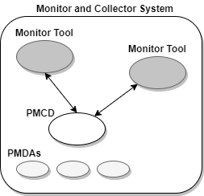
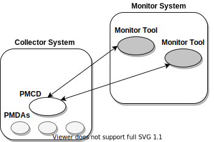
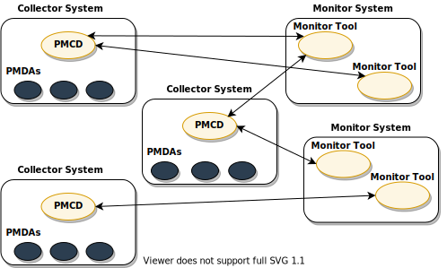
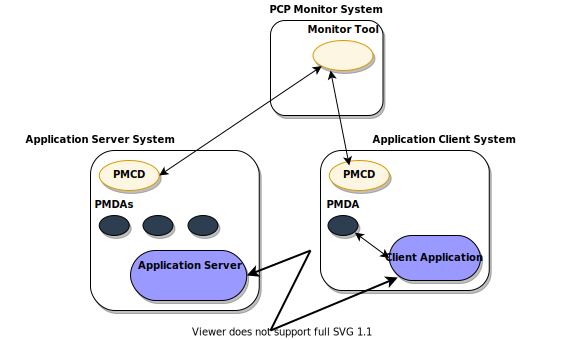
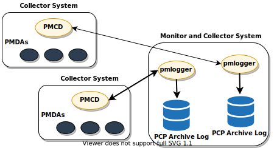
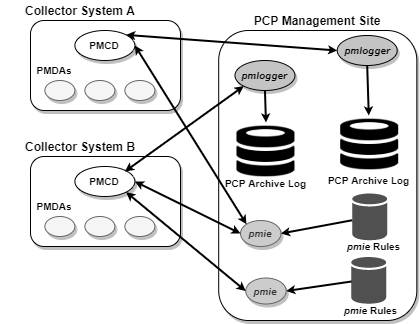

.. _PcpDeploymentStrategies:

Performance Co-Pilot Deployment Strategies
###########################################

.. contents::

Performance Co-Pilot (PCP) is a coordinated suite of tools and utilities allowing you to monitor performance and make automated judgements and initiate actions based on those judgements. PCP is designed to be fully configurable for custom implementation and deployed to meet specific needs in a variety of operational environments.

Because each enterprise and site is different and PCP represents a new way of managing performance information, some discussion of deployment strategies is useful.

The most common use of performance monitoring utilities is a scenario where the PCP tools are executed on a workstation (the PCP monitoring system), while the 
interesting performance data is collected on remote systems (PCP collector systems) by a number of processes, specifically the Performance Metrics Collection Daemon 
(PMCD) and the associated Performance Metrics Domain Agents (PMDAs). These processes can execute on both the monitoring system and one or more collector systems, or 
only on collector systems. However, collector systems are the real objects of performance investigations.

The material in this chapter covers the following areas:

Section 7.1, “`Basic Deployment`_”, presents the spectrum of deployment architectures at the highest level.

Section 7.2, “`PCP Collector Deployment`_”, describes alternative deployments for PMCD and the PMDAs.

Section 7.3, “`PCP Archive Logger Deployment`_”, covers alternative deployments for the **pmlogger** tool.

Section 7.4, “`PCP Inference Engine Deployment`_”, presents the options that are available for deploying the **pmie** tool.

The options shown in this chapter are merely suggestions. They are not comprehensive, and are intended to demonstrate some possible ways of deploying the PCP tools for 
specific network topologies and purposes. You are encouraged to use them as the basis for planning your own deployment, consistent with your needs.

Basic Deployment
*****************

In the simplest PCP deployment, one system is configured as both a collector and a monitor, as shown in `Figure 7.1. PCP Deployment for a Single System`_. Because some 
of the PCP monitor tools make extensive use of visualization, this suggests the monitor system should be configured with a graphical display.

.. _Figure 7.1. PCP Deployment for a Single System:

   Figure 7.1. PCP Deployment for a Single System

However, most PCP deployments involve at least two systems. For example, the setup shown in `Figure 7.2. Basic PCP Deployment for Two Systems`_ would be representative 
of many common scenarios.

.. _Figure 7.2. Basic PCP Deployment for Two Systems:

    Figure 7.2. Basic PCP Deployment for Two Systems

But the most common site configuration would include a mixture of systems configured as PCP collectors, as PCP monitors, and as both PCP monitors and collectors, as 
shown in `Figure 7.3. General PCP Deployment for Multiple Systems`_.

With one or more PCP collector systems and one or more PCP monitor systems, there are a number of decisions that need to be made regarding the deployment of PCP 
services across multiple hosts. For example, in `Figure 7.3. General PCP Deployment for Multiple Systems`_ there are several ways in which both the inference engine 
(**pmie**) and the PCP archive logger (**pmlogger**) could be deployed. These options are discussed in the following sections of this chapter.

.. _Figure 7.3. General PCP Deployment for Multiple Systems:

   Figure 7.3. General PCP Deployment for Multiple Systems
     
PCP Collector Deployment
*************************

Each PCP collector system must have an active **pmcd** and, typically, a number of PMDAs installed.

Principal Server Deployment
============================

The first hosts selected as PCP collector systems are likely to provide some class of service deemed to be critical to the information processing activities of the 
enterprise. These hosts include:

* Database servers
* Web servers for an Internet or Intranet presence
* NFS or other central storage server
* A video server
* A supercomputer
* An infrastructure service provider, for example, print, DNS, LDAP, gateway, firewall, router, or mail services
* Any system running a mission-critical application

Your objective may be to improve quality of service on a system functioning as a server for many clients. You wish to identify and repair critical performance 
bottlenecks and deficiencies in order to maintain maximum performance for clients of the server.

For some of these services, the PCP base product or the PCP add-on packages provide the necessary collector components. Others would require customized PMDA development, 
as described in the companion *Performance Co-Pilot Programmer's Guide*.

Quality of Service Measurement
=================================

Applications and services with a client-server architecture need to monitor performance at both the server side and the client side.

The arrangement in `Figure 7.4. PCP Deployment to Measure Client-Server Quality of Service`_ illustrates one way of measuring quality of service for client-server applications.

.. _Figure 7.4. PCP Deployment to Measure Client-Server Quality of Service:

   Figure 7.4. PCP Deployment to Measure Client-Server Quality of Service

The configuration of the PCP collector components on the Application Server System is standard. The new facility is the deployment of some PCP collector components on 
the Application Client System; this uses a customized PMDA and a generalization of the ICMP “ping” tool as follows:

* The **Client App** is specially developed to periodically make typical requests of the **App Server**, and to measure the response time for these requests 
  (this is an application-specific “ping”).
* The PMDA on the Application Client System captures the response time measurements from the **Client App** and exports these into the PCP framework.

At the PCP monitor system, the performance of the system running the **App Server** and the end-user quality of service measurements from the system where the **Client App** 
is running can be monitored concurrently.

PCP contains a number of examples of this architecture, including the **shping** PMDA for IP-based services (including HTTP), and the **dbping** PMDA for database servers.

The source code for each of these PMDAs is readily available; users and administrators are encouraged to adapt these agents to the needs of the local application environment.

It is possible to exploit this arrangement even further, with these methods:

* Creating new instances of the **Client App** and PMDA to measure service quality for your own mission-critical services.
* Deploying the **Client App** and associated PCP collector components in a number of strategic hosts allows the quality of service over the enterprise's network to be 
  monitored. For example, service can be monitored on the Application Server System, on the same LAN segment as the Application Server System, on the other side of a 
  firewall system, or out in the WAN.
  
PCP Archive Logger Deployment
*******************************

PCP archives are created by the **pmlogger** utility, as discussed in Chapter 6, :ref:`Archive Logging`. They provide a critical capability to perform retrospective 
performance analysis, for example, to detect performance regressions, for problem analysis, or to support capacity planning. The following sections discuss the options 
and trade-offs for **pmlogger** deployment.

Deployment Options
=====================

The issue is relatively simple and reduces to “On which host(s) should **pmlogger** be running?” The options are these:

* Run **pmlogger** on each PCP collector system to capture local performance data.
* Run **pmlogger** on some of the PCP monitor systems to capture performance data from remote PCP collector systems.

As an extension of the previous option, designate one system to act as the PCP archive site to run all **pmlogger** instances. This arrangement is shown in 
`Figure 7.5. Designated PCP Archive Site`_.

.. _Figure 7.5. Designated PCP Archive Site:

    Figure 7.5. Designated PCP Archive Site
     
Resource Demands for the Deployment Options
============================================

The **pmlogger** process is very lightweight in terms of computational demand; most of the (very small) CPU cost is associated with extracting performance metrics at 
the PCP collector system (PMCD and the PMDAs), which are independent of the host on which **pmlogger** is running.

A local **pmlogger** consumes disk bandwidth and disk space on the PCP collector system. A remote **pmlogger** consumes disk space on the site where it is running and 
network bandwidth between that host and the PCP collector host.

The archives typically grow at a rate of anywhere between a few kilobytes (KB) to tens of megabytes (MB) per day, depending on how many performance metrics are 
logged and the choice of sampling frequencies. There are some advantages in minimizing the number of hosts over which the disk resources for PCP archives must be 
allocated; however, the aggregate requirement is independent of where the **pmlogger** processes are running.

Operational Management
========================

There is an initial administrative cost associated with configuring each **pmlogger** instance, and an ongoing administrative investment to monitor these configurations, 
perform regular housekeeping (such as rotation, compression, and culling of PCP archive files), and execute periodic tasks to process the archives (such as nightly 
performance regression checking with **pmie**).

Many of these tasks are handled by the supplied **pmlogger** administrative tools and scripts, as described in Section 6.2.3, “:ref:`Archive File Management`”. 
However, the necessity and importance of these tasks favor a centralized  pmlogger deployment, as shown in `Figure 7.5. Designated PCP Archive Site`_.

⁠Exporting PCP Archives
============================

Collecting PCP archives is of little value unless the archives are processed as part of the ongoing performance monitoring and management functions. This processing 
typically involves the use of the tools on a PCP monitor system, and hence the archives may need to be read on a host different from the one they were created on.

NFS mounting is obviously an option, but the PCP tools support random access and both forward and backward temporal motion within an archive. If an archive is to 
be subjected to intensive and interactive processing, it may be more efficient to copy the files of the archive to the PCP monitor system first.

.. note::
   Each PCP archive consists of at least three separate files (see Section 6.2.3, “:ref:`Archive File Management`” for details). You must have concurrent 
   access to all of these files before a PCP tool is able to process an archive correctly.
   
PCP Inference Engine Deployment
*********************************

The **pmie** utility supports automated reasoning about system performance, as discussed in Chapter 5, :ref:`Performance Metrics Inference Engine`, and plays a key 
role in monitoring system performance for both real-time and retrospective analysis, with the performance data being retrieved respectively from a PCP collector system 
and a PCP archive.

The following sections discuss the options and trade-offs for **pmie** deployment.

Deployment Options
===================

The issue is relatively simple and reduces to “On which host(s) should **pmie** be running?” You must consider both real-time and retrospective uses, and the options are as follows:

* For real-time analysis, run **pmie** on each PCP collector system to monitor local system performance.

* For real-time analysis, run **pmie** on some of the PCP monitor systems to monitor the performance of remote PCP collector systems.

* For retrospective analysis, run **pmie** on the systems where the PCP archives reside. The problem then reduces to **pmlogger** deployment as discussed in 
  Section 7.3, “`PCP Archive Logger Deployment`_”.

* As an example of the “distributed management with centralized control” philosophy, designate some system to act as the PCP Management Site to run all **pmlogger** and 
  **pmie** instances. This arrangement is shown in `Figure 7.6. PCP Management Site Deployment`_.

One **pmie** instance is capable of monitoring multiple PCP collector systems; for example, to evaluate some universal rules that apply to all hosts. At the same time a 
single PCP collector system may be monitored by multiple **pmie** instances; for example, for site-specific and universal rule evaluation, or to support both tactical 
performance management (operations) and strategic performance management (capacity planning). Both situations are depicted in `Figure 7.6. PCP Management Site Deployment`_.

.. _Figure 7.6. PCP Management Site Deployment:

    Figure 7.6. PCP Management Site Deployment
     
Resource Demands for the Deployment Options
=============================================

Depending on the complexity of the rule sets, the number of hosts being monitored, and the evaluation frequency, **pmie** may consume CPU cycles significantly above the 
resources required to simply fetch the values of the performance metrics. If this becomes significant, then real-time deployment of **pmie** away from the PCP collector 
systems should be considered in order to avoid the “you're part of the problem, not the solution” scenario in terms of CPU utilization on a heavily loaded server.

Operational Management
=========================

An initial administrative cost is associated with configuring each **pmie** instance, particularly in the development of the rule sets that accurately capture and classify 
“good” versus “bad” performance in your environment. These rule sets almost always involve some site-specific knowledge, particularly in respect to the “normal” levels 
of activity and resource consumption. The pmieconf tool (see Section 5.7, “:ref:`Creating pmie Rules with pmieconf`”) may be used to help develop localized rules based 
upon parameterized templates covering many common performance scenarios. In complex environments, customizing these rules may occur over an extended period and require 
considerable performance analysis insight.

One of the functions of **pmie** provides for continual detection of adverse performance and the automatic generation of alarms (visible, audible, e-mail, pager, and 
so on). Uncontrolled deployment of this alarm initiating capability throughout the enterprise may cause havoc.

These considerations favor a centralized **pmie** deployment at a small number of PCP monitor sites, or in a PCP Management Site as shown in `Figure 7.6. PCP Management Site Deployment`_.

However, it is most likely that knowledgeable users with specific needs may find a local deployment of **pmie** most useful to track some particular class of service 
difficulty or resource utilization. In these cases, the alarm propagation is unlikely to be required or is confined to the system on which **pmie** is running.

Configuration and management of a number of **pmie** instances is made much easier with the scripts and control files described in Section 5.8, “:ref:`Management of pmie Processes`”.
