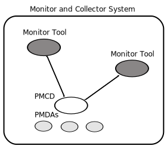
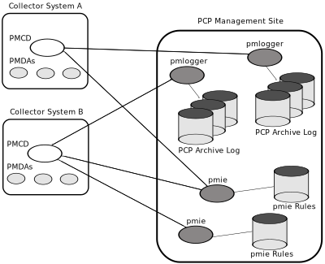

======================================================
Performance Co-Pilot™ User's and Administrator's Guide
======================================================

.. _id5178699:

About This Guide
================

This guide describes the Performance Co-Pilot (PCP) performance analysis
toolkit. PCP provides a systems-level suite of tools that cooperate to
deliver distributed performance monitoring and performance management
services spanning hardware platforms, operating systems, service layers,
database internals, user applications and distributed architectures.

PCP is a cross-platform, open source software package - customizations,
extensions, source code inspection, and tinkering in general is actively
encouraged.

“About This Guide” includes short descriptions of the chapters in this
book, directs you to additional sources of information, and explains
typographical conventions.

.. _id5178738:

What This Guide Contains
------------------------

This guide contains the following chapters:

-  `Introduction to PCP <#introduction-to-pcp>`__, provides an introduction,
   a brief overview of the software components, and conceptual
   foundations of the PCP software.

-  `Installing and Configuring Performance
   Co-Pilot <#installing-and-configuring-performance-co-pilot>`__, describes the basic installation and
   configuration steps necessary to get PCP running on your systems.

-  `Common Conventions and Arguments <#common-conventions-and-arguments>`__, describes the
   user interface components that are common to most of the text-based
   utilities that make up the monitor portion of PCP.

-  `Monitoring System Performance <#monitoring-system-performance>`__, describes the
   performance monitoring tools available in Performance Co-Pilot (PCP).

-  `Performance Metrics Inference Engine <#performance-metrics-inference-engine>`__, describes
   the Performance Metrics Inference Engine (``pmie``) tool that
   provides automated monitoring of, and reasoning about, system
   performance within the PCP framework.

-  `Archive Logging <#archive-logging>`__, covers the PCP services and
   utilities that support archive logging for capturing accurate
   historical performance records.

-  `Performance Co-Pilot Deployment Strategies <#performance-co-pilot-deployment-strategies>`__,
   presents the various options for deploying PCP functionality across
   cooperating systems.

-  `Customizing and Extending PCP Services <#customizing-and-extending-pcp-services>`__,
   describes the procedures necessary to ensure that the PCP
   configuration is customized in ways that maximize the coverage and
   quality of performance monitoring and management services.

-  `Acronyms <#acronyms>`__, provides a comprehensive list
   of the acronyms used in this guide and in the man pages for
   Performance Co-Pilot.

.. _id5178921:

Audience for This Guide
-----------------------

This guide is written for the system administrator or performance
analyst who is directly using and administering PCP applications.

.. _id5178935:

Related Resources
-----------------

The Performance Co-Pilot Programmer's Guide, a companion document to the
Performance Co-Pilot User's and Administrator's Guide, is intended for
developers who want to use the PCP framework and services for exporting
additional collections of performance metrics, or for delivering new or
customized applications to enhance performance management.

The Performance Co-Pilot Tutorials and Case Studies provides a series of
real-world examples of using various PCP tools, and lessons learned from
deploying the toolkit in production environments. It serves to provide
reinforcement of the general concepts discussed in the other two books
with additional case studies, and in some cases very detailed discussion
of specifics of individual tools.

Additional resources include man pages and the project web site.

.. _id5178967:

Man Pages
---------

The operating system man pages provide concise reference information on
the use of commands, subroutines, and system resources. There is usually
a man page for each PCP command or subroutine. To see a list of all the
PCP man pages, start from the following command:

::

   man PCPIntro

Each man page usually has a "SEE ALSO" section, linking to other,
related entries.

To see a particular man page, supply its name to the ``man`` command,
for example:

::

   man pcp

The man pages are arranged in different sections - user commands,
programming interfaces, and so on. For a complete list of manual
sections on a platform enter the command:

::

   man man

When referring to man pages, this guide follows a standard convention:
the section number in parentheses follows the item. For example,
``pminfo(1)`` refers to the man page in section 1 for the ``pminfo``
command.

.. _id5178968:

Web Site
--------

The following web site is accessible to everyone:

**URL**
   **Description**

https://pcp.io
   PCP is open source software released under the GNU General Public
   License (GPL) and GNU Lesser General Public License (LGPL)

.. _id5179060:

Conventions
-----------

The following conventions are used throughout this document:

**Convention**
   **Meaning**

``${PCP_VARIABLE}``
   A brace-enclosed all-capital-letters syntax indicates a variable that
   has been sourced from the global ``${PCP_DIR}/etc/pcp.conf`` file.
   These special variables indicate parameters that affect all PCP
   commands, and are likely to be different between platforms.

``command``
   This fixed-space font denotes literal items such as commands, files,
   routines, path names, signals, messages, and programming language
   structures.

variable
   Italic typeface denotes variable entries and words or concepts being
   defined.

``user input``
   This bold, fixed-space font denotes literal items that the user
   enters in interactive sessions. (Output is shown in nonbold,
   fixed-space font.)

[ ]
   Brackets enclose optional portions of a command or directive line.

...
   Ellipses indicate that a preceding element can be repeated.

ALL CAPS
   All capital letters denote environment variables, operator names,
   directives, defined constants, and macros in C programs.

()
   Parentheses that follow function names surround function arguments or
   are empty if the function has no arguments; parentheses that follow
   commands surround man page section numbers.

.. _z825546061melby:

Reader Comments
---------------

If you have comments about the technical accuracy, content, or
organization of this document, contact the PCP maintainers using either
the email address or the web site listed earlier.

We value your comments and will respond to them promptly.

.. _LE91944-PARENT:

Introduction to PCP
===================

This chapter provides an introduction to Performance Co-Pilot (PCP), 
an overview of its individual components, and conceptual information 
to help you use this software.

The following sections are included:

-  `Objectives <#objectives>`__ covers the intended purposes of PCP.

-  `Overview of Component Software <#overview-of-component-software>`__, describes PCP
   tools and agents.

-  `Conceptual Foundations <#conceptual-foundations>`__, discusses the design
   theories behind PCP.

.. _LE92676-PARENT:

Objectives
----------

Performance Co-Pilot (PCP) provides a range of services that may be used
to monitor and manage system performance. These services are distributed
and scalable to accommodate the most complex system configurations and
performance problems.

.. _LE67354-PARENT:

PCP Target Usage
~~~~~~~~~~~~~~~~

PCP is targeted at the performance analyst, benchmarker,
capacity planner, developer, database administrator, or system
administrator with an interest in overall system performance and a need
to quickly isolate and understand performance behavior, resource
utilization, activity levels, and bottlenecks in complex systems.
Platforms that can benefit from this level of performance analysis
include large servers, server clusters, or multiserver sites delivering
Database Management Systems (DBMS), compute, Web, file, or video
services.

.. _LE79006-PARENT:

Empowering the PCP User
~~~~~~~~~~~~~~~~~~~~~~~

To deal efficiently with the dynamic behavior of complex
systems, performance analysts need to filter out noise from the
overwhelming stream of performance data, and focus on exceptional
scenarios. Visualization of current and historical performance data, and
automated reasoning about performance data, effectively provide this
filtering.

From the PCP end user's perspective, PCP presents an integrated suite of
tools, user interfaces, and services that support real-time and
retrospective performance analysis, with a bias towards eliminating
mundane information and focusing attention on the exceptional and
extraordinary performance behaviors. When this is done, the user can
concentrate on in-depth analysis or target management procedures for
those critical system performance problems.

.. _LE35382-PARENT:

Unification of Performance Metric Domains
~~~~~~~~~~~~~~~~~~~~~~~~~~~~~~~~~~~~~~~~~

At the lowest level, performance metrics are
collected and managed in autonomous performance domains such as the
operating system kernel, a DBMS, a layered service, or an end-user
application. These domains feature a multitude of access control
policies, access methods, data semantics, and multiversion support. All
this detail is irrelevant to the developer or user of a performance
monitoring tool, and is hidden by the PCP infrastructure.

PMDAunificationPerformance Metrics Domain Agent PMDAPerformance Metrics
Domain Agents (PMDAs) within PCP encapsulate the knowledge about, and
export performance information from, autonomous performance domains.

.. _LE83994-PARENT:

Uniform Naming and Access to Performance Metrics
~~~~~~~~~~~~~~~~~~~~~~~~~~~~~~~~~~~~~~~~~~~~~~~~

Usability and extensibility of performance management tools
mandate a single scheme for naming performance metrics. The set of
defined names constitutes a Performance Metrics Name Space (PMNS).
Within PCP, the PMNS is adaptive so it can be extended, reshaped, and
pruned to meet the needs of particular applications and users.

PCP provides a single interface to name and retrieve values for all
performance metrics, independently of their source or location.

.. _LE85063-PARENT:

PCP Distributed Operation
~~~~~~~~~~~~~~~~~~~~~~~~~

From a purely pragmatic viewpoint, a single
workstation must be able to monitor the concurrent performance of
multiple remote hosts. At the same time, a single host may be subject to
monitoring from multiple remote workstations.

These requirements suggest a classic
client-server architecture, which is exactly what PCP uses to provide
concurrent and multiconnected access to performance metrics, independent
of their host location.

.. _LE87326-PARENT:

Dynamic Adaptation to Change
~~~~~~~~~~~~~~~~~~~~~~~~~~~~

Complex systems are subject to continual
changes as network connections fail and are reestablished; nodes are
taken out of service and rebooted; hardware is added and removed; and
software is upgraded, installed, or removed. Often these changes are
asynchronous and remote (perhaps in another geographic region or domain
of administrative control).

The distributed nature of the PCP (and the modular fashion in which
performance metrics domains can be installed, upgraded, and configured
on different hosts) enables PCP to adapt concurrently to changes in the
monitored system(s). Variations in the available performance metrics as
a consequence of configuration changes are handled automatically and
become visible to all clients as soon as the reconfigured host is
rebooted or the responsible agent is restarted.

PCP also detects loss of client-server connections, and most clients
support subsequent automated reconnection.

.. _LE13859-PARENT:

Logging and Retrospective Analysis
~~~~~~~~~~~~~~~~~~~~~~~~~~~~~~~~~~

A range of tools is provided to
support flexible, adaptive logging of performance metrics for archive,
playback, remote diagnosis, and capacity planning. PCP archive logs may
be accumulated either at the host being monitored, at a monitoring
workstation, or both.

A universal replay mechanism, modeled on `media
controls <http://en.wikipedia.org/wiki/Media_controls>`__, supports
play, step, rewind, fast forward and variable speed processing of
archived performance data. Replay for multiple archives, from multiple
hosts, is facilitated by an archive aggregation concept.

Most PCP applications are able to process archive logs and real-time
performance data with equal facility. Unification of real-time access
and access to the archive logs, in conjunction with the media controls,
provides powerful mechanisms for building performance tools and to
review both current and historical performance data.

.. _LE36677-PARENT:

Automated Operational Support
~~~~~~~~~~~~~~~~~~~~~~~~~~~~~

For operational and production
environments, PCP provides a framework with scripts to customize in
order to automate the execution of ongoing tasks such as these:

-  centralized archive loggingCentralized archive logging for multiple
   remote hosts

-  archive logscustomizationArchive log rotation, consolidation, and
   culling

-  Web-based publishing of charts showing snapshots of performance
   activity levels in the recent past

-  Flexible alarm monitoring: parameterized rules to address common
   critical performance scenarios and facilities to customize and refine
   this monitoring

-  auditsRetrospective performance audits covering the recent past; for
   example, daily or weekly checks for performance regressions or
   quality of service problems

.. _LE38522-PARENT:

PCP Extensibility
~~~~~~~~~~~~~~~~~

PCP permits the integration of new
performance metrics into the PMNS, the collection infrastructure, and
the logging framework. The guiding principle is, “if it is important for
monitoring system performance, and you can measure it, you can easily
integrate it into the PCP framework.”

For many PCP users, the most important performance metrics are not those
already supported, but new performance metrics that characterize the
essence of good or bad performance at their site, or within their
particular application environment.

One example is an application that measures the round-trip time for a
benign “probe” transaction against some mission-critical application.

For application developers, a library is provided to
support easy-to-use insertion of trace and monitoring points within an
application, and the automatic export of resultant performance data into
the PCP framework. Other libraries and tools aid the development of
customized and fully featured Performance Metrics Domain Agents (PMDAs).

Extensive source code examples are provided in the distribution, and by
using the PCP toolkit and interfaces, these customized measures of
performance or quality of service can be easily and seamlessly
integrated into the PCP framework.

.. _LE40772-PARENT:

Metric Coverage
~~~~~~~~~~~~~~~

The core PCP modules support export of performance metrics that
include kernel instrumentation, hardware instrumentation, process-level
resource utilization, database and other system services
instrumentation, and activity in the PCP collection infrastructure.

The supplied agents support thousands of distinct performance metrics,
many of which can have multiple values, for example, per disk, per CPU,
or per process.

.. _LE79836-PARENT:

Conceptual Foundations
----------------------

The following sections provide a detailed overview
of concepts that underpin Performance Co-Pilot (PCP).

.. _id5188366:

Performance Metrics
~~~~~~~~~~~~~~~~~~~

Across all of the supported performance metric domains, there are a large number of
performance metrics. Each metric has its own structure and semantics.
PCP presents a uniform interface to these metrics, independent of the
underlying metric data source.

The Performance Metrics Name Space (PMNS) provides
a hierarchical classification of human-readable metric names, and a
mapping from these external names to internal metric identifiers. See
`Performance Metrics Name Space <#performance-metrics-name-space>`__, for a description
of the PMNS.

.. _id5188440:

Performance Metric Instances
~~~~~~~~~~~~~~~~~~~~~~~~~~~~

When performance metric values are returned to a requesting application,
there may be more than one value instance for a particular metric; for
example, independent counts for each CPU, process, disk, or local
filesystem. Internal instance identifiers correspond one to one with
external (human-readable) descriptions of the members of an instance
domain.

Transient performance metrics (such as per-process information) cause
repeated requests for the same metric to return different numbers of
values, or changes in the particular instance identifiers returned.
These changes are expected and fully supported by the PCP
infrastructure; however, metric instantiation is guaranteed to be valid
only at the time of collection.

.. _id5188469:

Current Metric Context
~~~~~~~~~~~~~~~~~~~~~~

When performance metrics are retrieved, they are delivered in the
context of a particular source of metrics, a point in time, and a
profile of desired instances. This means that the application making the
request has already negotiated to establish the context in which the
request should be executed.

A metric source may be the current
performance data from a particular host (a live or real-time source), or
a set of archive logs of performance data collected by ``pmlogger`` at
some distant host or at an earlier time (a retrospective or archive
source).

By default, the collection time for a performance metric
is the current time of day for real-time sources, or current point
within an archive source. For archives, the collection time may be reset
to an arbitrary time within the bounds of the set of archive
logs.archive logs collection time

.. _id5188562:

Sources of Performance Metrics and Their Domains
~~~~~~~~~~~~~~~~~~~~~~~~~~~~~~~~~~~~~~~~~~~~~~~~

Instrumentation for the
purpose of performance monitoring typically consists of counts of
activity or events, attribution of resource consumption, and
service-time or response-time measures. This instrumentation may exist
in one or more of the functional domains as shown in
`figure_title <#id5188602>`__.

.. figure:: images/metric-domains.svg
   :alt: Performance Metric Domains as Autonomous Collections of Data

   Performance Metric Domains as Autonomous Collections of Data

Each domain has an associated access method:

-  Kernel data structuresThe operating system kernel, including
   sub-system data structures - per-process resource consumption,
   network statistics, disk activity, or memory management
   instrumentation.

-  Mail serverslayered software servicesA layered software service such
   as activity logs for a World Wide Web server or an email delivery
   server.application programs

-  An application program such as measured response time for a
   production application running a periodic and benign probe
   transaction (as often required in service level agreements), or rate
   of computation and throughput in jobs per minute for a batch stream.

-  network routers and bridgesexternal equipmentExternal equipment such
   as network routers and bridges.

For each domain, the set of performance
metrics may be viewed as an abstract data type, with an associated set
of methods that may be used to perform the following tasks:

-  Interrogate the metadata that describes the syntax and semantics of
   the performance metrics

-  Control (enable or disable) the collection of some or all of the
   metrics

-  Extract instantiations (current values) for some or all of the
   metrics

We refer to each functional domain as a performance metrics domain and
assume that domains are functionally, architecturally, and
administratively independent and autonomous. Obviously the set of
performance metrics domains available on any host is variable, and
changes with time as software and hardware are installed and removed.

The number of performance metrics domains may be further enlarged in
cluster-based or network-based configurations, where there is
potentially an instance of each performance metrics domain on each node.
Hence, the management of performance metrics domains must be both
extensible at a particular host and distributed across a number of
hosts.

Each performance metrics domain on a particular host must be assigned a unique
Performance Metric Identifier (PMID). In practice, this means unique
identifiers are assigned globally for each performance metrics domain
type. For example, the same identifier would be used for the Apache Web
Server performance metrics domain on all hosts.

.. _id5188837:

Distributed Collection
~~~~~~~~~~~~~~~~~~~~~~

The performance metrics collection architecture is distributed, in the sense
that any performance tool may be executing remotely. However, a PMDA
usually runs on the system for which it is collecting performance
measurements. In most cases, connecting these tools together on the
collector host is the responsibility of the PMCD process, as shown in
`figure_title <#id5188883>`__.

.. figure:: images/remote-collector.svg
   :alt: Process Structure for Distributed Operation

   Process Structure for Distributed Operation

The host running the monitoring tools does not require any collection
tools, including ``pmcd``, because all requests for metrics are sent to
the ``pmcd`` process on the collector host. These requests are then
forwarded to the appropriate PMDAs, which respond with metric
descriptions, help text, and most importantly, metric values.

The connections between monitor clients and
``pmcd`` processes are managed in ``libpcp``, below the PMAPI level; see
the ``pmapi(3)`` man page. Connections between PMDAs and ``pmcd`` are
managed by the PMDA routines; see the ``pmda(3)`` man page. There can be
multiple monitor clients and multiple PMDAs on the one host, but
normally there would be only one ``pmcd`` process.

.. _LE94677-PARENT:

Performance Metrics Name Space
~~~~~~~~~~~~~~~~~~~~~~~~~~~~~~

Internally, each unique performance
metric is identified by a Performance Metric Identifier (PMID) drawn
from a universal set of identifiers, including some that are reserved
for site-specific, application-specific, and customer-specific use.

An external name space - the Performance Metrics
Name Space (PMNS) - maps from a hierarchy (or tree) of human-readable
names to PMIDs.

.. _id5189100:

Performance Metrics Name Space Diagram
^^^^^^^^^^^^^^^^^^^^^^^^^^^^^^^^^^^^^^

Each node in the PMNS tree is assigned a label that must begin with an
alphabet character, and be followed by zero or more alphanumeric
characters or the underscore (_) character. The root node of the tree
has the special label of ``root``.

A metric name is formed by traversing the tree from the root to a leaf
node with each node label on the path separated by a period. The common
prefix ``root``\ **.** is omitted from all names. For example,
`figure_title <#id5189137>`__ shows the nodes in a small subsection of a
PMNS.

.. figure:: images/pmns-small.svg
   :alt: Small Performance Metrics Name Space (PMNS)

   Small Performance Metrics Name Space (PMNS)

In this subsection, the following are valid names for performance
metrics:

::

   kernel.percpu.syscall
   network.tcp.rcvpack
   hw.router.recv.total_util

.. _id5189172:

Descriptions for Performance Metrics
~~~~~~~~~~~~~~~~~~~~~~~~~~~~~~~~~~~~

Through the various performance
metric domains, the PCP must support a wide range of formats and
semantics for performance metrics. This metadata describing the
performance metrics includes the following:

-  The internal identifier, Performance Metric Identifier (PMID), for
   the metric

-  64-bit IEEE formatThe format and encoding for the values of the
   metric, for example, an unsigned 32-bit integer or a string or a
   64-bit IEEE format floating point number

-  The semantics of the metric, particularly the interpretation of the
   values as free-running counters or instantaneous values

-  The dimensionality of the values, in the dimensions of events, space,
   and time

-  The scale of values; for example, bytes, kilobytes (KB), or megabytes
   (MB) for the space dimension

-  An indication if the metric may have one or many associated values

-  Short (and extended) help text describing the metric

For each metric, this metadata is defined within the associated PMDA,
and PCP arranges for the information to be exported to performance tools
that use the metadata when interpreting the values for each metric.

.. _id5189302:

Values for Performance Metrics
~~~~~~~~~~~~~~~~~~~~~~~~~~~~~~

The following sections describe two types of performance metrics,
single-valued and set-valued.

.. _id5189314:

Single-Valued Performance Metrics
^^^^^^^^^^^^^^^^^^^^^^^^^^^^^^^^^

Some performance metrics have a
singular value within their performance metric domains. For example,
available memory (or the total number of context switches) has only one
value per performance metric domain, that is, one value per host. The
metadata describing the metric makes this fact known to applications
that process values for these metrics.

.. _id5189346:

Set-Valued Performance Metrics
^^^^^^^^^^^^^^^^^^^^^^^^^^^^^^

Some performance metrics have a set of
values or instances in each implementing performance metric domain. For
example, one value for each disk, one value for each process, one value
for each CPU, or one value for each activation of a given application.

When a metric has multiple instances, the PCP framework does not pollute
the Name Space with additional metric names; rather, a single metric may
have an associated set of values. These multiple values are associated
with the members of an instance domain, such that each instance has a
unique instance identifier within the associated instance domain. For
example, the “per CPU” instance domain may use the instance identifiers
0, 1, 2, 3, and so on to identify the configured processors in the
system.

Internally, instance identifiers are encoded as binary values, but each
performance metric domain also supports corresponding strings as
external names for the instance identifiers, and these names are used at
the user interface to the PCP utilities.

For example, the performance metric ``disk.dev.total`` counts I/O
operations for each disk spindle, and the associated instance domain
contains one member for each disk spindle. On a system with five
specific disks, one value would be associated with each of the external
and internal instance identifier pairs shown in
`Sample Instance Identifiers for Disk Statistics <#id11>`__.

.. table:: Sample Instance Identifiers for Disk Statistics

   +-----------------------------------+-----------------------------------+
   | External Instance Identifier      | Internal Instance Identifier      |
   +===================================+===================================+
   | disk0                             | 131329                            |
   +-----------------------------------+-----------------------------------+
   | disk1                             | 131330                            |
   +-----------------------------------+-----------------------------------+
   | disk2                             | 131331                            |
   +-----------------------------------+-----------------------------------+
   | disk3                             | 131841                            |
   +-----------------------------------+-----------------------------------+
   | disk4                             | 131842                            |
   +-----------------------------------+-----------------------------------+

Multiple performance metrics may be associated with a single instance
domain.

Each performance metric domain may dynamically establish the instances
within an instance domain. For example, there may be one instance for
the metric ``kernel.percpu.idle`` on a workstation, but multiple
instances on a multiprocessor server. Even more dynamic is
``filesys.free``, where the values report the amount of free space per
file system, and the number of values tracks the mounting and unmounting
of local filesystems.

PCP arranges for information describing instance domains to be exported
from the performance metric domains to the applications that require
this information. Applications may also choose to retrieve values for
all instances of a performance metric, or some arbitrary subset of the
available instances.

.. _id5189653:

Collector and Monitor Roles
~~~~~~~~~~~~~~~~~~~~~~~~~~~

Hosts supporting PCP services are broadly
classified into two categories:

Collector
   collector hostsPMDAcollectorsHosts that have ``pmcd`` and one or more
   performance metric domain agents (PMDAs) running to collect and
   export performance metrics

Monitor
   monitor hostsHosts that import performance metrics from one or more
   collector hosts to be consumed by tools to monitor, manage, or record
   the performance of the collector hosts

Each PCP enabled host can operate as a collector, a monitor, or both.

.. _id5189901:

Retrospective Sources of Performance Metrics
~~~~~~~~~~~~~~~~~~~~~~~~~~~~~~~~~~~~~~~~~~~~

The PMAPI also supports
delivery of performance metrics from a historical source in the form of
a PCP archive log. Archive logs are created using the ``pmlogger``
utility, and are replayed in an architecture as shown in
`figure_title <#id5189940>`__.

.. figure:: images/retrospective-architecture.svg
   :alt: Architecture for Retrospective Analysis

   Architecture for Retrospective Analysis

The PMAPI has been designed to minimize the differences required for an
application to process performance data from an archive or from a
real-time source. As a result, most PCP tools support live and
retrospective monitoring with equal facility.

.. _id5189964:

Product Extensibility
~~~~~~~~~~~~~~~~~~~~~

Much of the PCP software's potential for attacking
difficult performance problems in production environments comes from the
design philosophy that considers extensibility to be critically
important.

The performance analyst can take advantage of the PCP infrastructure to
deploy value-added performance monitoring tools and services. Here are
some examples:

-  Easy extension of the PCP collector to accommodate new performance
   metrics and new sources of performance metrics, in particular using
   the interfaces of a special-purpose library to develop new PMDAs (see
   the ``pmda(3)`` man page)

-  libpcp_pmda librarylibpcp_mmv libraryUse of libraries
   (``libpcp_pmda`` and ``libpcp_mmv``) to aid in the development of new
   capabilities to export performance metrics from local applications

-  Operation on any performance metric using generalized toolkits

-  Distribution of PCP components such as collectors across the network,
   placing the service where it can do the most good

-  Dynamic adjustment to changes in system configuration

-  Flexible customization built into the design of all PCP tools

-  Creation of new monitor applications, using the routines described in
   the ``pmapi(3)`` man page

.. _LE13618-PARENT:

Overview of Component Software
------------------------------

Performance Co-Pilot (PCP) is composed of both
text-based and graphical tools. Each tool is fully documented by a man
page. These man pages are named after the tools or commands they
describe, and are accessible through the ``man`` command. For example,
to see the ``pminfo(1)`` man page for the ``pminfo`` command, enter this
command:

::

   man pminfo

A representative list of PCP tools and commands, grouped by
functionality, is provided in the following four sections.

.. _id5177430:

Performance Monitoring and Visualization
~~~~~~~~~~~~~~~~~~~~~~~~~~~~~~~~~~~~~~~~

The following tools provide the
principal services for the PCP end-user with an interest in monitoring,
visualizing, or processing performance information collected either in
real time or from PCP archive logs:

``pcp-atop``
   pcp-atop tool brief descriptionFull-screen monitor of the load on a
   system from a kernel, hardware and processes point of view. It is
   modeled on the Linux ``atop(1)`` tool (`home
   page <http://www.atoptool.nl/>`__) and provides a showcase for the
   variety of data available using PCP services and the Python scripting
   interfaces.

``pmchart``
   pmchart tool brief descriptionStrip chart tool for arbitrary
   performance metrics. Interactive graphical utility that can display
   multiple charts simultaneously, from multiple hosts or set of
   archives, aligned on a unified time axis (X-axis), or on multiple
   tabs.

``pcp-collectl``
   pcp-collectl tool brief descriptionStatistics collection tool with
   good coverage of a number of Linux kernel subsystems, with the
   everything-in-one-tool approach pioneered by ``sar(1)``. It is
   modeled on the Linux ``collectl(1)`` utility (`home
   page <http://collectl.sourceforge.net/>`__) and provides another
   example of use of the Python scripting interfaces to build more
   complex functionality with relative ease, with PCP as a foundation.

``pmrep``
   pmrep tool brief descriptionOutputs the values of arbitrary
   performance metrics collected live or from a single PCP archive, in
   textual format.

``pmevent``
   pmevent tool brief descriptionReports on event metrics, decoding the
   timestamp and event parameters for text-based reporting.

``pmie``
   pmie tool brief descriptionEvaluates predicate-action rules over
   performance metrics for alarms, automated system management tasks,
   dynamic configuration tuning, and so on. It is an inference engine.

``pmieconf``
   pmieconf toolbrief descriptionpmie toolpmieconf rulesCreates
   parameterized rules to be used with the PCP inference engine
   (``pmie``). It can be run either interactively or from scripts for
   automating the setup of inference (the PCP start scripts do this, for
   example, to generate a default configuration).

``pminfo``
   pminfo tool brief descriptionDisplays information about arbitrary
   performance metrics available from PCP, including help text with
   ``-T``.

``pmlogsummary``
   pmlogsummary toolCalculates and reports various statistical summaries
   of the performance metric values from a set of PCP archives.

``pmprobe``
   pmprobe toolProbes for performance metric availability, values, and
   instances.

``pmstat``
   pmstat tool brief descriptionProvides a text-based display of metrics
   that summarize the performance of one or more systems at a high
   level.

``pmval``
   pmval tool brief descriptionProvides a text-based display of the
   values for arbitrary instances of a selected performance metric,
   suitable for ASCII logs or inquiry over a slow link.

.. _id5177776:

Collecting, Transporting, and Archiving Performance Information
~~~~~~~~~~~~~~~~~~~~~~~~~~~~~~~~~~~~~~~~~~~~~~~~~~~~~~~~~~~~~~~

PCP provides the following tools to support
real-time data collection, network transport, and archive log creation
services for performance data:

``mkaf``
   mkaf toolAggregates an arbitrary collection of PCP archive logs into
   a folio to be used with ``pmafm``.

``pmafm``
   pmafm tool brief descriptionInterrogates, manages, and replays an
   archive folio as created by ``mkaf``, or the periodic archive log
   management scripts, or the record mode of other PCP tools.

``pmcd``
   PMCDbrief descriptionPerformance Metrics Collection DaemonPMCDpmcd
   toolPMCDIs the Performance Metrics Collection Daemon (PMCD). This
   daemon must run on each system being monitored, to collect and export
   the performance information necessary to monitor the system.

``pmcd_wait``
   pmcd_wait toolWaits for ``pmcd`` to be ready to accept client
   connections.

``pmdaapache``
   pmdaapache toolExports performance metrics from the Apache Web
   Server. It is a Performance Metrics Domain Agent (PMDA).

``pmdacisco``
   pmdacisco toolExtracts performance metrics from one or more Cisco
   routers.

``pmdaelasticseach``
   pmdaelasticsearch toolExtracts performance metrics from an
   elasticsearch cluster.

``pmdagfs2``
   pmdagfs2 toolExports performance metrics from the GFS2 clustered
   filesystem.

``pmdagluster``
   pmdagluster toolExtracts performance metrics from the Gluster
   filesystem.

``pmdainfiniband``
   pmdainfiniband toolExports performance metrics from the Infiniband
   kernel driver.

``pmdakvm``
   pmdakvm toolExtracts performance metrics from the Linux Kernel
   Virtual Machine (KVM) infrastructure.

``pmdalustrecomm``
   pmdalustrecomm toolExports performance metrics from the Lustre
   clustered filesystem.

``pmdamailq``
   pmdamailq toolExports performance metrics describing the current
   state of items in the ``sendmail`` queue.

``pmdamemcache``
   pmdamemcache toolExtracts performance metrics from memcached, a
   distributed memory caching daemon commonly used to improve web
   serving performance.

``pmdammv``
   pmdammv tool
   Exports metrics from instrumented applications linked with the
   ``pcp_mmv`` shared library or the
   `Parfait <http://code.google.com/p/parfait/>`__ framework for Java
   instrumentation. These metrics are custom developed per application,
   and in the case of Parfait, automatically include numerous JVM,
   Tomcat and other server or container statistics.

``pmdamysql``
   pmdamysql toolExtracts performance metrics from the MySQL relational
   database.

``pmdanamed``
   pmdanamed toolExports performance metrics from the Internet domain
   name server, named.

``pmdanginx``
   pmdanginx toolExtracts performance metrics from the nginx HTTP and
   reverse proxy server.

``pmdapostfix``
   pmdapostfix toolExport performance metrics from the Postfix mail
   transfer agent.

``pmdapostgres``
   pmdapostgres toolExtracts performance metrics from the PostgreSQL
   relational database.

``pmdaproc``
   pmdaproc toolExports performance metrics for running processes.

``pmdarsyslog``
   pmdarsyslog toolExtracts performance metrics from the Reliable System
   Log daemon.

``pmdasamba``
   pmdasamba toolExtracts performance metrics from Samba, a Windows
   SMB/CIFS server.

``pmdasendmail``
   pmdasendmail toolExports mail activity statistics from ``sendmail``.

``pmdashping``
   pmdashping toolExports performance metrics for the availability and
   quality of service (response-time) for arbitrary shell commands.

``pmdasnmp``
   pmdasnmp toolExtracts SNMP performance metrics from local or remote
   SNMP-enabled devices.

``pmdasummary``
   pmdasummary toolDerives performance metrics values from values made
   available by other PMDAs. It is a PMDA itself.

``pmdasystemd``
   pmdasystemd toolExtracts performance metrics from the systemd and
   journald services.

``pmdatrace``
   pmdatrace toolExports transaction performance metrics from
   application processes that use the ``pcp_trace`` library.

``pmdavmware``
   pmdavmware toolExtracts performance metrics from a VMWare
   virtualization host.

``pmdaweblog``
   pmdaweblog tool
   Scans Web-server logs to extract metrics characterizing.

``pmdaxfs``
   pmdaxfs toolExtracts performance metrics from the Linux kernel XFS
   filesystem implementation.

``pmdumplog``
   pmdumplog tool brief descriptionDisplays selected state information,
   control data, and metric values from a set of PCP archive logs
   created by ``pmlogger``.

``pmlc``
   pmlc tool brief descriptionExercises control over an instance of the
   PCP archive logger ``pmlogger``, to modify the profile of which
   metrics are logged and/or how frequently their values are logged.

``pmlogcheck``
   pmlogcheck toolPerforms integrity check for individual PCP archives.

``pmlogconf``
   pmlogconf toolCreates or modifies ``pmlogger`` configuration files
   for many common logging scenarios, optionally probing for available
   metrics and enabled functionality. It can be run either interactively
   or from scripts for automating the setup of data logging (the PCP
   start scripts do this, for example, to generate a default
   configuration).

``pmlogextract``
   pmlogextract toolReads one or more PCP archive logs and creates a
   temporally merged and reduced PCP archive log as output.

``pmlogger``
   pmlogger toolbrief descriptionCreates PCP archive logs of performance
   metrics over time. Many tools accept these PCP archive logs as
   alternative sources of metrics for retrospective analysis.

``pmproxy``
   pmproxy tool brief descriptionProvides REST APIs, archive discovery,
   and both PCP and Redis protocol proxying when executing PCP or Redis
   client tools through a network firewall system.

``pmtrace``
   pmtrace toolProvides a simple command line interface to the trace
   PMDA and its associated ``pcp_trace`` library.

.. _id5187554:

Operational and Infrastructure Support
~~~~~~~~~~~~~~~~~~~~~~~~~~~~~~~~~~~~~~

PCP provides the following tools to support the PCP infrastructure
and assist operational procedures for PCP deployment in a production
environment:

``pcp``
   pcp toolSummarizes that state of a PCP installation.

``pmdbg``
   pmdbg facilitydiagnostic toolsdebugging toolsDescribes the available
   facilities and associated control flags. PCP tools include internal
   diagnostic and debugging facilities that may be activated by run-time
   flags.

``pmerr``
   pmerr toolTranslates PCP error codes into human-readable error
   messages.

``pmhostname``
   pmhostname toolReports hostname as returned by ``gethostbyname``.
   Used in assorted PCP management scripts.

``pmie_check``
   pmie toolbrief descriptionAdministration of the Performance Co-Pilot
   inference engine (``pmie``).

``pmlock``
   pmlock toolAttempts to acquire an exclusive lock by creating a file
   with a mode of 0.

``pmlogger_*``
   pmlogger_check scriptpmlogger_daily scriptpmlogger_merge scriptpmsnap
   toolbrief descriptionscriptsAllows you to create a customized regime
   of administration and management for PCP archive log files. The
   ``pmlogger_check``, ``pmlogger_daily``, and ``pmlogger_merge``
   scripts are intended for periodic execution via the ``cron`` command.

``pmnewlog``
   pmnewlog toolPerforms archive log rotation by stopping and restarting
   an instance of ``pmlogger``.

``pmnsadd``
   pmnsadd toolAdds a subtree of new names into a PMNS, as used by the
   components of PCP.

``pmnsdel``
   pmnsdel toolRemoves a subtree of names from a PMNS, as used by the
   components of the PCP.

``pmnsmerge``
   pcp toolMerges multiple PMNS files together, as used by the
   components of PCP.

``pmstore``
   pmstore tool brief descriptionReinitializes counters or assigns new
   values to metrics that act as control variables. The command changes
   the current values for the specified instances of a single
   performance metric.

.. _id5188066:

Application and Agent Development
~~~~~~~~~~~~~~~~~~~~~~~~~~~~~~~~~

application programsPCPtool summariesThe following PCP tools aid the
development of new programs to consume performance data, and new agents
to export performance data within the PCP framework:

``chkhelp``
   chkhelp toolChecks the consistency of performance metrics help
   database files.

``dbpmda``
   dbpmda toolAllows PMDA behavior to be exercised and tested. It is an
   interactive debugger for PMDAs.

``newhelp``
   newhelp toolGenerates the database files for one or more source files
   of PCP help text.

``pmapi``
   pmclient toolPMAPIbrief descriptionPerformance Metrics Application
   Programming InterfacePMAPIDefines a procedural interface for
   developing PCP client applications. It is the Performance Metrics
   Application Programming Interface (PMAPI).

``pmclient``
   pmclient toolIs a simple client that uses the PMAPI to report some
   high-level system performance metrics.

``pmda``
   dbpmda tool PMDAIs a library used by many shipped PMDAs to
   communicate with a ``pmcd`` process. It can expedite the development
   of new and custom PMDAs.

``pmgenmap``
   pmgenmap toolGenerates C declarations and ``cpp(1)`` macros to aid
   the development of customized programs that use the facilities of
   PCP. It is a PMDA development tool.

.. _LE17127-PARENT:

Installing and Configuring Performance Co-Pilot
===============================================

The sections in this chapter describe the basic installation and configuration steps
necessary to run Performance Co-Pilot (PCP) on your systems. The
following major sections are included:

-  `Product Structure <#LE18649-PARENT>`__ describes the main packages
   of PCP software and how they must be installed on each system.

-  `Performance Metrics Collection Daemon (PMCD) <#LE26146-PARENT>`__,
   describes the fundamentals of maintaining the performance data
   collector.

-  `Managing Optional PMDAs <#LE43202-PARENT>`__, describes the basics
   of installing a new Performance Metrics Domain Agent (PMDA) to
   collect metric data and pass it to the PMCD.

-  `Troubleshooting <#LE70712-PARENT>`__, offers advice on problems
   involving the PMCD.

.. _LE18649-PARENT:

Product Structure
-----------------

In a typical deployment, Performance Co-Pilot (PCP) would be installed in a collector
configuration on one or more hosts, from which the performance
information could then be collected, and in a monitor configuration on
one or more workstations, from which the performance of the server
systems could then be monitored.

On some platforms Performance Co-Pilot is presented as multiple
packages; typically separating the server components from graphical user
interfaces and documentation.

pcp-X.Y.Z-rev
   package for core PCP

pcp-gui-X.Y.Z-rev
   package for graphical PCP client tools

pcp-doc-X.Y.Z-rev
   package for online PCP documentation

.. _LE26146-PARENT:

Performance Metrics Collection Daemon (PMCD)
--------------------------------------------

On each Performance Co-Pilot (PCP) collection system, you must be certain that
the ``pmcd`` daemon is running. This daemon coordinates the gathering
and exporting of performance statistics in response to requests from the
PCP monitoring tools.

.. _id5190406:

Starting and Stopping the PMCD
~~~~~~~~~~~~~~~~~~~~~~~~~~~~~~

To start the daemon, enter the following
commands as ``root`` on each PCP collection system:

::

   chkconfig pmcd on 
   ${PCP_RC_DIR}/pmcd start 

These commands instruct the system to start the daemon immediately, and
again whenever the system is booted. It is not necessary to start the
daemon on the monitoring system unless you wish to collect performance
information from it as well.

To stop ``pmcd`` immediately on a PCP collection system, enter the
following command:

::

   ${PCP_RC_DIR}/pmcd stop

.. _LE58493-PARENT:

Restarting an Unresponsive PMCD
~~~~~~~~~~~~~~~~~~~~~~~~~~~~~~~

Sometimes, if a daemon is not responding on a PCP collection system, the
problem can be resolved by stopping and then immediately restarting a
fresh instance of the daemon. If you need to stop and then immediately
restart PMCD on a PCP collection system, use the ``start`` argument
provided with the script in ``${PCP_RC_DIR}``. The command syntax is, as
follows:

::

   ${PCP_RC_DIR}/pmcd start 

On startup, ``pmcd`` looks for a configuration file at
``${PCP_PMCDCONF_PATH}``. This file specifies which agents cover which
performance metrics domains and how PMCD should make contact with the
agents. A comprehensive description of the configuration file syntax and
semantics can be found in the ``pmcd(1)`` man page.

If the configuration is changed, ``pmcd`` reconfigures itself when it
receives the ``SIGHUP`` signal. Use the following command to send the
``SIGHUP`` signal to the daemon:

::

   ${PCP_BINADM_DIR}/pmsignal -a -s HUP pmcd

This is also useful when one of the PMDAs managed by ``pmcd`` has failed
or has been terminated by ``pmcd``. Upon receipt of the ``SIGHUP``
signal, ``pmcd`` restarts any PMDA that is configured but inactive. The
exception to this rule is the case of a PMDA which must run with
superuser privileges (where possible, this is avoided) - for these
PMDAs, a full ``pmcd`` restart must be performed, using the process
described earlier (not SIGHUP).

.. _id5190621:

PMCD Diagnostics and Error Messages
~~~~~~~~~~~~~~~~~~~~~~~~~~~~~~~~~~~

If there is a problem with ``pmcd``,
the first place to investigate should be the ``pmcd.log`` file. By
default, this file is in the ``${PCP_LOG_DIR}/pmcd`` directory.

.. _id5190661:

PMCD Options and Configuration Files
~~~~~~~~~~~~~~~~~~~~~~~~~~~~~~~~~~~~

There are two files that control PMCD operation.
These are the ``${PCP_PMCDCONF_PATH}`` and ``${PCP_PMCDOPTIONS_PATH}``
files. The ``pmcd.options`` file contains the command line options used
with PMCD; it is read when the daemon is invoked by
``${PCP_RC_DIR}/pmcd``. The ``pmcd.conf`` file contains configuration
information regarding domain agents and the metrics that they monitor.
These configuration files are described in the following sections.

.. _id5190706:

The ``pmcd.options`` File
^^^^^^^^^^^^^^^^^^^^^^^^^

Command line options for the PMCD are stored in the
``${PCP_PMCDOPTIONS_PATH}`` file. The PMCD can be invoked directly from
a shell prompt, or it can be invoked by\ `` ${PCP_RC_DIR}/pmcd`` as part
of the boot process. It is usual and normal to invoke it using
``${PCP_RC_DIR}/pmcd``, reserving shell invocation for debugging
purposes.

The PMCD accepts certain command line options to control its execution,
and these options are placed in the ``pmcd.options`` file when
``${PCP_RC_DIR}/pmcd`` is being used to start the daemon. The following
options (amongst others) are available:

``-i`` address
   For hosts with more than one network interface, this option specifies
   the interface on which this instance of the PMCD accepts connections.
   Multiple ``-i`` options may be specified. The default in the absence
   of any ``-i`` option is for PMCD to accept connections on all
   interfaces.

``-l`` file
   Specifies a log file. If no ``-l`` option is specified, the log file
   name is ``pmcd.log`` and it is created in the directory
   ``${PCP_LOG_DIR}/pmcd/``.

``-s`` file
   Specifies the path to a local unix domain socket (for platforms
   supporting this socket family only). The default value is
   ``${PCP_RUN_DIR}/pmcd.socket``.

``-t`` seconds
   PDUprotocol data unitsPDUSpecifies the amount of time, in seconds,
   before PMCD times out on protocol data unit (PDU) exchanges with
   PMDAs. If no time out is specified, the default is five seconds.
   Setting time out to zero disables time outs (not recommended, PMDAs
   should always respond quickly).

   The time out may be dynamically modified by storing the number of
   seconds into the metric ``pmcd.control.timeout`` using ``pmstore``.

``-T`` mask
   Specifies whether connection and PDU tracing are turned on for
   debugging purposes.

See the ``pmcd(1)`` man page for complete information on these options.

The default ``pmcd.options`` file shipped with PCP is similar to the
following:

::

   # command-line options to pmcd, uncomment/edit lines as required

   # longer timeout delay for slow agents
   # -t 10

   # suppress timeouts
   # -t 0

   # make log go someplace else
   # -l /some/place/else

   # debugging knobs, see pmdbg(1)
   # -D N
   # -f

   # Restricting (further) incoming PDU size to prevent DOS attacks
   # -L 16384 

   # enable event tracing bit fields
   #   1   trace connections
   #   2   trace PDUs
   # 256   unbuffered tracing
   # -T 3

   # setting of environment variables for pmcd and
   # the PCP rc scripts. See pmcd(1) and PMAPI(3).
   # PMCD_WAIT_TIMEOUT=120

The most commonly used options have been placed in this file for your
convenience. To uncomment and use an option, simply remove the pound
sign (#) at the beginning of the line with the option you wish to use.
Restart ``pmcd`` for the change to take effect; that is, as superuser,
enter the command:

::

   ${PCP_RC_DIR}/pmcd start

.. _LE63226-PARENT:

The ``pmcd.conf`` File
^^^^^^^^^^^^^^^^^^^^^^

When the PMCD is invoked, it reads its configuration file,
which is ``${PCP_PMCDCONF_PATH}``. This file contains entries that
specify the PMDAs used by this instance of the PMCD and which metrics
are covered by these PMDAs. Also, you may specify access control rules
in this file for the various hosts, users and groups on your network.
This file is described completely in the ``pmcd(1)`` man page.

With standard PCP operation (even if you have not created and added your
own PMDAs), you might need to edit this file in order to add any
additional access control you wish to impose. If you do not add access
control rules, all access for all operations is granted to the local
host, and read-only access is granted to remote hosts. The ``pmcd.conf``
file is automatically generated during the software build process and on
Linux, for example, is similar to the following:

::

    Performance Metrics Domain Specifications
   # 
   # This file is automatically generated during the build
   # Name  Id      IPC     IPC Params      File/Cmd
   root    1   pipe    binary      /var/lib/pcp/pmdas/root/pmdaroot
   pmcd    2       dso     pmcd_init       ${PCP_PMDAS_DIR}/pmcd/pmda_pmcd.so
   proc    3       pipe    binary          ${PCP_PMDAS_DIR}/proc/pmdaproc -d 3
   xfs     11      pipe    binary          ${PCP_PMDAS_DIR}/xfs/pmdaxfs -d 11
   linux   60      dso     linux_init      ${PCP_PMDAS_DIR}/linux/pmda_linux.so
   mmv 70  dso mmv_init    /var/lib/pcp/pmdas/mmv/pmda_mmv.so

   [access]
   disallow ".*" : store;
   disallow ":*" : store;
   allow "local:*" : all;

..

   **Note**

   Even though PMCD does not run with ``root`` privileges, you must be
   very careful not to configure PMDAs in this file if you are not sure
   of their action. This is because all PMDAs are initially started as
   ``root`` (allowing them to assume alternate identities, such as
   ``postgres`` for example), after which ``pmcd`` drops its privileges.
   Pay close attention that permissions on this file are not
   inadvertently downgraded to allow public write access.

Each entry in this configuration file contains rules that specify how to
connect the PMCD to a particular PMDA and which metrics the PMDA
monitors. A PMDA may be attached as a Dynamic Shared Object (DSO) or by
using a socket or a pair of pipes. The distinction between these
attachment methods is described below.

An entry in the ``pmcd.conf`` file looks like this:

::

   label_name   domain_number   type   path

The label_name field specifies a name for the PMDA. The domain_number is
an integer value that specifies a domain of metrics for the PMDA. The
type field indicates the type of entry (DSO, socket, or pipe). The path
field is for additional information, and varies according to the type of
entry.

The following rules are common to DSO, socket, and pipe syntax:

label_name
   An alphanumeric string identifying the agent.

domain_number
   An unsigned integer specifying the agent's domain.

DSO entries follow this syntax:

label_name
domain_number
dso
entry-point
path
The following rules apply to the DSO syntax:

``dso``
   The entry type.

entry-point
   The name of an initialization function called when the DSO is loaded.

path
   Designates the location of the DSO. An absolute path must be used. On
   most platforms this will be a ``so`` suffixed file, on Windows it is
   a ``dll``, and on Mac OS X it is a ``dylib`` file.

Socket entries in the ``pmcd.conf`` file follow this syntax:

label_name
domain_number
socket
addr_family
address
command
args
The following rules apply to the socket syntax:

``socket``
   The entry type.

addr_family
   Specifies if the socket is ``AF_INET``, ``AF_IPV6`` or ``AF_UNIX``.
   If the socket is ``INET``, the word ``inet`` appears in this place.
   If the socket is ``IPV6``, the word ``ipv6`` appears in this place.
   If the socket is ``UNIX``, the word ``unix`` appears in this place.

address
   Specifies the address of the socket. For INET or IPv6 sockets, this
   is a port number or port name. For UNIX sockets, this is the name of
   the PMDA's socket on the local host.

command
   Specifies a command to start the PMDA when the PMCD is invoked and
   reads the configuration file.

args
   Optional arguments for command.

Pipe entries in the ``pmcd.conf`` file follow this syntax:

label_name
domain_number
pipe
protocol
command
args
The following rules apply to the pipe syntax:

``pipe``
   The entry type.

protocol
   Specifies whether a text-based or a binary PCP protocol should be
   used over the pipes. Historically, this parameter was able to be
   “text” or “binary.” The text-based protocol has long since been
   deprecated and removed, however, so nowadays “binary” is the only
   valid value here.

command
   Specifies a command to start the PMDA when the PMCD is invoked and
   reads the configuration file.

args
   Optional arguments for command.

.. _id5191707:

Controlling Access to PMCD with ``pmcd.conf``
^^^^^^^^^^^^^^^^^^^^^^^^^^^^^^^^^^^^^^^^^^^^^

pmcd.conf fileYou can place this option extension in the ``pmcd.conf``
file to control access to performance metric data based on hosts, users
and groups. To add an access control section, begin by placing the
following line at the end of your ``pmcd.conf`` file:

::

   [access] 

Below this line, you can add entries of the following forms:

::

   allow hosts hostlist : operations ;   disallow hosts hostlist : operations ;
   allow users userlist : operations ;   disallow users userlist : operations ;
   allow groups grouplist : operations ;   disallow groups grouplist : operations ;

The keywords users, groups and hosts can be used in either plural or
singular form.

The userlist and grouplist fields are comma-separated lists of
authenticated users and groups from the local ``/etc/passwd`` and
``/etc/groups`` files, NIS (network information service) or LDAP
(lightweight directory access protocol) service.

The hostlist is a comma-separated list of host identifiers; the
following rules apply:

-  Host names must be in the local system's ``/etc/hosts`` file or known
   to the local DNS (domain name service).

-  IP and IPv6 addresses may be given in the usual numeric notations.

-  A wildcarded IP or IPv6 address may be used to specify groups of
   hosts, with the single wildcard character \* as the last-given
   component of the address. The wildcard .\* refers to all IP (IPv4)
   addresses. The wildcard :\* refers to all IPv6 addresses. If an IPv6
   wildcard contains a :: component, then the final \* refers to the
   final 16 bits of the address only, otherwise it refers to the
   remaining unspecified bits of the address.

The wildcard \``*'' refers to all users, groups or host addresses. Names
of users, groups or hosts may not be wildcarded.

For example, the following hostlist entries are all valid:

::

   babylon
   babylon.acme.com
   123.101.27.44
   localhost
   155.116.24.*
   192.*
   .*
   fe80::223:14ff:feaf:b62c
   fe80::223:14ff:feaf:*
   fe80:*
   :*
   *

The operations field can be any of the following:

-  A comma-separated list of the operation types described below.

-  The word all to allow or disallow all operations as specified in the
   first field.

-  The words all except and a list of operations. This entry allows or
   disallows all operations as specified in the first field except those
   listed.

-  The phrase maximum N connections to set an upper bound (N) on the
   number of connections an individual host, user or group of users may
   make. This can only be added to the operations list of an allow
   statement.

The operations that can be allowed or disallowed are as follows:

``fetch``
   Allows retrieval of information from the PMCD. This may be
   information about a metric (such as a description, instance domain,
   or help text) or an actual value for a metric.

``store``
   Allows the PMCD to store metric values in PMDAs that permit store
   operations. Be cautious in allowing this operation, because it may be
   a security opening in large networks, although the PMDAs shipped with
   the PCP package typically reject store operations, except for
   selected performance metrics where the effect is benign.

For example, here is a sample access control portion of a
``${PCP_PMCDCONF_PATH}`` file:

::

   allow hosts babylon, moomba : all ; 
   disallow user sam : all ;
   allow group dev : fetch ; 
   allow hosts 192.127.4.* : fetch ; 
   disallow host gate-inet : store ; 

Complete information on access control syntax rules in the ``pmcd.conf``
file can be found in the ``pmcd(1)`` man page.

.. _LE43202-PARENT:

Managing Optional PMDAs
-----------------------

Performance Metrics Domain Agents
(PMDAs) shipped with Performance Co-Pilot (PCP) are designed to be
installed and activated on every collector host, for example, ``linux``,
``windows``, ``darwin``, ``pmcd``, and ``process`` PMDAs.

Other PMDAs are designed for optional activation and require some user
action to make them operational. In some cases these PMDAs expect local
site customization to reflect the operational environment, the system
configuration, or the production workload. This customization is
typically supported by interactive installation scripts for each PMDA.

Each PMDA has its own directory located below ``${PCP_PMDAS_DIR}``. Each
directory contains a ``Remove`` script to unconfigure the PMDA, remove
the associated metrics from the PMNS, and restart the ``pmcd`` daemon;
and an ``Install`` script to install the PMDA, update the PMNS, and
restart the PMCD daemon.

As a shortcut mechanism to support automated PMDA installation, a file
named ``.NeedInstall`` can be created in a PMDA directory below
``${PCP_PMDAS_DIR}``. The next restart of PCP services will invoke that
PMDAs installation automatically, with default options taken.

.. _LE31599-PARENT:

PMDA Installation on a PCP Collector Host
~~~~~~~~~~~~~~~~~~~~~~~~~~~~~~~~~~~~~~~~~

To install a PMDA you must perform a collector
installation for each host on which the PMDA is required to export
performance metrics. PCP provides a distributed metric namespace (PMNS)
and metadata, so it is not necessary to install PMDAs (with their
associated PMNS) on PCP monitor hosts.

You need to update the PMNS, configure the PMDA, and
notify PMCD. The ``Install`` script for each PMDA automates these
operations, as follows:

1. Log in as ``root`` (the superuser).

2. Change to the PMDA's directory as shown in the following example:

   ::

      cd ${PCP_PMDAS_DIR}/cisco

3. PMDPerformance Metrics DomainPMDIn the unlikely event that you wish
   to use a non-default Performance Metrics Domain (PMD) assignment,
   determine the current PMD assignment:

   ::

      cat domain.h

   ${PCP_VAR_DIR}/pmns/stdpmid file${PCP_PMCDCONF_PATH} fileCheck that
   there is no conflict in the PMDs as defined in
   ``${PCP_VAR_DIR}/pmns/stdpmid`` and the other PMDAs currently in use
   (listed in ``${PCP_PMCDCONF_PATH}``). Edit ``domain.h`` to assign the
   new domain number if there is a conflict (this is highly unlikely to
   occur in a regular PCP installation).

4. Enter the following command:

   ::

      ./Install

   You may be prompted to enter some local parameters or configuration
   options. The script applies all required changes to the control files
   and to the PMNS, and then notifies PMCD.
   `example_title <#Z929138022sdc>`__ is illustrative of the
   interactions:

   ::

      Cisco hostname or IP address? [return to quit] wanmelb

      A user-level password may be required for Cisco “show int” command.
          If you are unsure, try the command
              $ telnet wanmelb
          and if the prompt “Password:” appears, a user-level password is
          required; otherwise answer the next question with an empty line.

      User-level Cisco password? ********
      Probing Cisco for list of interfaces ...

      Enter interfaces to monitor, one per line in the format
      tX where “t” is a type and one of “e” (Ethernet), or “f” (Fddi), or
      “s” (Serial), or “a” (ATM), and “X” is an interface identifier
      which is either an integer (e.g.  4000 Series routers) or two
      integers separated by a slash (e.g. 7000 Series routers).

      The currently unselected interfaces for the Cisco “wanmelb” are:
          e0 s0 s1
      Enter “quit” to terminate the interface selection process.
      Interface? [e0] s0

      The currently unselected interfaces for the Cisco “wanmelb” are:
             e0 s1
      Enter “quit” to terminate the interface selection process.
      Interface? [e0] s1

      The currently unselected interfaces for the Cisco “wanmelb” are:
          e0
      Enter “quit” to terminate the interface selection process.
      Interface? [e0] quit

      Cisco hostname or IP address? [return to quit]
      Updating the Performance Metrics Name Space (PMNS) ...
      Installing pmchart view(s) ...
      Terminate PMDA if already installed ...
      Installing files ...
      Updating the PMCD control file, and notifying PMCD ...
      Check cisco metrics have appeared ... 5 metrics and 10 values

.. _id5192380:

PMDA Removal on a PCP Collector Host
~~~~~~~~~~~~~~~~~~~~~~~~~~~~~~~~~~~~

To remove a PMDA, you must perform a collector removal for
each host on which the PMDA is currently installed.

The PMNS needs to be updated, the PMDA unconfigured, and PMCD notified.
The ``Remove`` script for each PMDA automates these operations, as
follows:

1. Log in as ``root`` (the superuser).

2. Change to the PMDA's directory as shown in the following example:

   ::

      cd ${PCP_PMDAS_DIR}/elasticsearch

3. Enter the following command:

   ::

      ./Remove

   The following output illustrates the result:

   ::

      Culling the Performance Metrics Name Space ...
      elasticsearch ... done
      Updating the PMCD control file, and notifying PMCD ...
      Removing files ...
      Check elasticsearch metrics have gone away ... OK

.. _LE70712-PARENT:

Troubleshooting
---------------

The following sections offer troubleshooting advice
on the Performance Metrics Name Space (PMNS), missing and incomplete
values for performance metrics, kernel metrics and the PMCD.

Advice for troubleshooting the archive logging system is provided in
`Archive Logging <#LE93354-PARENT>`__.

.. _LE97133-PARENT:

Performance Metrics Name Space
~~~~~~~~~~~~~~~~~~~~~~~~~~~~~~

To display the active
PMNS, use the ``pminfo`` command; see the ``pminfo(1)`` man page.

The PMNS at the collector host is updated whenever a PMDA is installed
or removed, and may also be updated when new versions of PCP are
installed. During these operations, the PMNS is typically updated by
merging the (plaintext) namespace components from each installed PMDA.
These separate PMNS components reside in the ``${PCP_VAR_DIR}/pmns``
directory and are merged into the ``root`` file there.

.. _LE90170-PARENT:

Missing and Incomplete Values for Performance Metrics
~~~~~~~~~~~~~~~~~~~~~~~~~~~~~~~~~~~~~~~~~~~~~~~~~~~~~

Missing or incomplete
performance metric values are the result of their unavailability.

.. _LE89271-PARENT:

Metric Values Not Available
^^^^^^^^^^^^^^^^^^^^^^^^^^^

The following symptom has a known cause and resolution:

Symptom:
   Values for some or all of the instances of a performance metric are
   not available.

Cause:
   This can occur as a consequence of changes in the installation of
   modules (for example, a DBMS or an application package) that provide
   the performance instrumentation underpinning the PMDAs. Changes in
   the selection of modules that are installed or operational, along
   with changes in the version of these modules, may make metrics appear
   and disappear over time.

   In simple terms, the PMNS contains a metric name, but when that
   metric is requested, no PMDA at the collector host supports the
   metric.

   For archive logs, the collection of metrics to be logged is a subset
   of the metrics available, so utilities replaying from a PCP archive
   log may not have access to all of the metrics available from a live
   (PMCD) source.

Resolution:
   Make sure the underlying instrumentation is available and the module
   is active. Ensure that the PMDA is running on the host to be
   monitored. If necessary, create a new archive log with a wider range
   of metrics to be logged.

.. _LE76751-PARENT:

Kernel Metrics and the PMCD
~~~~~~~~~~~~~~~~~~~~~~~~~~~

The following issues
involve the kernel metrics and the PMCD:

-  Cannot connect to remote PMCD

-  PMCD not reconfiguring after hang-up

-  PMCD does not start

.. _id5192807:

Cannot Connect to Remote PMCD
^^^^^^^^^^^^^^^^^^^^^^^^^^^^^

The following
symptom has a known cause and resolution:

Symptom:
   pmchart toolremote PMCDpmie toolremote PMCDpmlogger tool remote PMCDA
   PCP client tool (such as ``pmchart``, ``pmie``, or ``pmlogger``)
   complains that it is unable to connect to a remote PMCD (or establish
   a PMAPI context), but you are sure that PMCD is active on the remote
   host.

Cause:
   TCP/IPremote PMCDTo avoid hanging applications for the duration of
   TCP/IP time outs, the PMAPI library implements its own time out when
   trying to establish a connection to a PMCD. If the connection to the
   host is over a slow network, then successful establishment of the
   connection may not be possible before the time out, and the attempt
   is abandoned.

   Alternatively, there may be a firewall in-between the client tool and
   PMCD which is blocking the connection attempt.

   Finally, PMCD may be running in a mode where it does not acept remote
   connections, or only listening on certain interface.

Resolution:
   Establish that the PMCD on far-away-host is really alive, by
   connecting to its control port (TCP port number 44321 by
   default):\ ``telnet far-away-host 44321``

   This response indicates the PMCD is not running and needs restarting:

   ::

      Unable to connect to remote host: Connection refused

   To restart the PMCD on that host, enter the following
   command:\ ``${PCP_RC_DIR}/pmcd start``

   This response indicates the PMCD is running:Connected to
   far-away-host

   PMCD_CONNECT_TIMEOUT variableInterrupt the ``telnet`` session,
   increase the PMAPI time out by setting the ``PMCD_CONNECT_TIMEOUT``
   environment variable to some number of seconds (60 for instance), and
   try the PCP client tool again.

   Verify that PMCD is not running in local-only mode, by looking for an
   enabled value (one) from: ``pminfo -f pmcd.feature.local``

   This setting is controlled from the ``PMCD_LOCAL`` environment
   variable usually set via ``${PCP_SYSCONFIG_DIR}/pmcd``.

   If these techniques are ineffective, it is likely an intermediary
   firewall is blocking the client from accessing the PMCD port -
   resolving such issues is firewall-host platform-specific and cannot
   practically be covered here.

.. _id5193049:

PMCD Not Reconfiguring after ``SIGHUP``
^^^^^^^^^^^^^^^^^^^^^^^^^^^^^^^^^^^^^^^

The following symptom has a known cause and resolution:

Symptom
   PMCD does not reconfigure itself after receiving the ``SIGHUP``
   signal.

Cause:
   pmcd.conf fileIf there is a syntax error in ``${PCP_PMCDCONF_PATH}``,
   PMCD does not use the contents of the file. This can lead to
   situations in which the configuration file and PMCD's internal state
   do not agree.

Resolution:
   Always monitor PMCD's log. For example, use the following command in
   another window when reconfiguring PMCD, to watch errors
   occur:\ ``tail -f ${PCP_LOG_DIR}/pmcd/pmcd.log``

.. _id5193138:

PMCD Does Not Start
^^^^^^^^^^^^^^^^^^^

PMCDnot startingThe following symptom has a known cause and resolution:

Symptom:
   ${PCP_LOGDIR}/pmcd/pmcd.log file
   If the following messages appear in the PMCD log
   (``${PCP_LOG_DIR}/pmcd/pmcd.log``), consider the cause and
   resolution:

   ::

      pcp[27020] Error: OpenRequestSocket(44321) bind: Address already in
      use
      pcp[27020] Error: pmcd is already running
      pcp[27020] Error: pmcd not started due to errors!

Cause:
   PMCD is already running or was terminated before it could clean up
   properly. The error occurs because the socket it advertises for
   client connections is already being used or has not been cleared by
   the kernel.

Resolution:
   Start PMCD as ``root`` (superuser) by
   typing:\ ``${PCP_RC_DIR}/pmcd start``

   Any existing PMCD is shut down, and a new one is started in such a
   way that the symptomatic message should not appear.

   If you are starting PMCD this way and the symptomatic message
   appears, a problem has occurred with the connection to one of the
   deceased PMCD's clients.

   This could happen when the network connection to a remote client is
   lost and PMCD is subsequently terminated. The system may attempt to
   keep the socket open for a time to allow the remote client a chance
   to reestablish the connection and read any outstanding data.

   netstat commandThe only solution in these circumstances is to wait
   until the socket times out and the kernel deletes it. This
   ``netstat`` command displays the status of the socket and any
   connections:\ ``netstat -ant | grep 44321``

   If the socket is in the ``FIN_WAIT`` or ``TIME_WAIT`` state, then you
   must wait for it to be deleted. Once the command above produces no
   output, PMCD may be restarted. Less commonly, you may have another
   program running on your system that uses the same Internet port
   number (44321) that PMCD uses.

   PCPIntro commandPMCD_PORT variableRefer to the ``PCPIntro(1)`` man
   page for a description of how to override the default PMCD port
   assignment using the ``PMCD_PORT`` environment variable.

.. _LE94335-PARENT:

Common Conventions and Arguments
================================

This chapter deals
with the user interface components that are common to most text-based
utilities that make up the monitor portion of Performance Co-Pilot
(PCP). These are the major sections in this chapter:

-  `Alternate Metrics Source Options <#LE85600-PARENT>`__, details some
   basic standards used in the development of PCP tools.

-  `General PCP Tool Options <#LE68596-PARENT>`__, details other options
   to use with PCP tools.

-  `Time Duration and Control <#LE76997-PARENT>`__, describes the time
   control dialog and time-related command line options available for
   use with PCP tools.

-  `PCP Environment Variables <#LE61303-PARENT>`__, describes the
   environment variables supported by PCP tools.

-  `Running PCP Tools through a Firewall <#LE12082-PARENT>`__, describes
   how to execute PCP tools that must retrieve performance data from the
   Performance Metrics Collection Daemon (PMCD) on the other side of a
   TCP/IP security firewall.

-  `Transient Problems with Performance Metric
   Values <#LE17322-PARENT>`__, covers some uncommon scenarios that may
   compromise performance metric integrity over the short term.

Many of the utilities provided with PCP conform to
a common set of naming and syntactic conventions for command line
arguments and options. This section outlines these conventions and their
meaning. The options may be generally assumed to be honored for all
utilities supporting the corresponding functionality.

In all cases, the man pages for each utility fully describe the
supported command arguments and options.

Command line options are also relevant when starting PCP
applications from the desktop using the Alt double-click method. This
technique launches the ``pmrun`` program to collect additional arguments
to pass along when starting a PCP application.

.. _LE85600-PARENT:

Alternate Metrics Source Options
--------------------------------

The default source of performance metrics is from PMCD on the local
host. This default ``pmcd`` connection will be made using the Unix
domain socket, if the platform supports that, else a localhost Inet
socket connection is made. This section describes how to obtain metrics
from sources other than this default.

.. _id5193612:

Fetching Metrics from Another Host
~~~~~~~~~~~~~~~~~~~~~~~~~~~~~~~~~~

The option ``-h`` host directs any PCP utility (such as ``pmchart`` or
``pmie``) to make a connection with the PMCD instance running on host.
Once established, this connection serves as the principal real-time
source of performance metrics and metadata. The host specification may
be more than a simple host name or address - it can also contain
decorations specifying protocol type (secure or not), authentication
information, and other connection attributes. Refer to the
``PCPIntro(1)`` man page for full details of these, and examples of use
of these specifications can also be found in the PCP Tutorials and Case
Studies companion document.

.. _id5193712:

Fetching Metrics from an Archive Log
~~~~~~~~~~~~~~~~~~~~~~~~~~~~~~~~~~~~

The option ``-a`` archive directs the utility to treat the set of PCP
archive logs designated by archive as the principal source of
performance metrics and metadata. archive is a comma-sparated list of
names, each of which may be the base name of an archive or the name of a
directory containing archives.

PCP archive logs are created with ``pmlogger``.
Most PCP utilities operate with equal facility for performance
information coming from either a real-time feed via PMCD on some host,
or for historical data from a set of PCP archive logs. For more
information on archive logs and their use, see `Archive
Logging <#LE93354-PARENT>`__.

The list of names (``archive``) used with
the ``-a`` option implies the existence of the files created
automatically by ``pmlogger``, as listed in
`Physical Filenames for Components of a PCP Archive Log <#id13>`__.

.. table:: Physical Filenames for Components of a PCP Archive Log

   +-----------------+----------------------------------------------------+
   | Filename        | Contents                                           |
   +=================+====================================================+
   | ``archive.``\ i | Temporal index for rapid access to archive         |
   | ndex            | contents                                           |
   +-----------------+----------------------------------------------------+
   | ``archive.``\ m | Metadata descriptions for performance metrics and  |
   | eta             | instance domains appearing in the archive          |
   +-----------------+----------------------------------------------------+
   | ``archive.N``   | Volumes of performance metrics values, for ``N`` = |
   |                 | 0,1,2,...                                          |
   +-----------------+----------------------------------------------------+

Most tools are able to concurrently process multiple PCP archive logs
(for example, for retrospective analysis of performance across multiple
hosts), and accept either multiple ``-a`` options or a comma separated
list of archive names following the ``-a`` option.

   **Note**

   The ``-h`` and ``-a`` options are almost always mutually exclusive.
   Currently, ``pmchart`` is the exception to this rule but other tools
   may continue to blur this line in the future.

.. _LE68596-PARENT:

General PCP Tool Options
------------------------

The following sections provide information relevant to most
of the PCP tools. It is presented here in a single place for
convenience.

.. _id5194103:

Common Directories and File Locations
~~~~~~~~~~~~~~~~~~~~~~~~~~~~~~~~~~~~~

common directoriesfile locationsThe following files and directories are
used by the PCP tools as repositories for option and configuration files
and for binaries:

``${PCP_DIR}/etc/pcp.env``
   ${PCP_DIR}/etc/pcp.env fileScript to set PCP run-time environment
   variables.

``${PCP_DIR}/etc/pcp.conf``
   ${PCP_DIR}/etc/pcp.conf filePCP configuration and environment file.

``${PCP_PMCDCONF_PATH}``
   ${PCP_PMCDCONF_PATH} file PMCD${PCP_PMCDCONF_PATH} fileConfiguration
   file for Performance Metrics Collection Daemon (PMCD). Sets
   environment variables, including ``PATH``.

``${PCP_BINADM_DIR}/pmcd``
   ${PCP_BINADM_DIR}/pmcd fileThe PMCD binary.

``${PCP_PMCDOPTIONS_PATH}``
   ${PCP_PMCDOPTIONS_PATH} fileCommand line options for PMCD.

``${PCP_RC_DIR}/pmcd``
   ${PCP_RC_DIR}/pmcd fileThe PMCD startup script.

``${PCP_BIN_DIR}/pcptool``
   Directory containing PCP tools such as ``pmstat``, ``pminfo``,
   ``pmlogger``, ``pmlogsummary``, ``pmchart``, ``pmie``, and so on.

``${PCP_SHARE_DIR}``
   Directory containing shareable PCP-specific files and repository
   directories such as ``bin``, ``demos``, ``examples`` and ``lib``.

``${PCP_VAR_DIR}``
   Directory containing non-shareable (that is, per-host) PCP specific
   files and repository directories.

``${PCP_BINADM_DIR}/pcptool``
   PCP tools that are typically not executed directly by the end user
   such as ``pmcd_wait``.

``${PCP_SHARE_DIR}/lib/pcplib``
   Miscellaneous PCP libraries and executables.

``${PCP_PMDAS_DIR}``
   Performance Metric Domain Agents (PMDAs), one directory per PMDA.

``${PCP_VAR_DIR}/config``
   Configuration files for PCP tools, typically with one directory per
   tool.

``${PCP_DEMOS_DIR}``
   Demonstration data files and example programs.

``${PCP_LOG_DIR}``
   By default, diagnostic and trace log files generated by PMCD and
   PMDAs. Also, the PCP archive logs are managed in one directory per
   logged host below here.

``${PCP_VAR_DIR}/pmns``
   Files and scripts for the Performance Metrics Name Space (PMNS).

.. _id5194616:

Alternate Performance Metric Name Spaces
~~~~~~~~~~~~~~~~~~~~~~~~~~~~~~~~~~~~~~~~

The Performance Metrics Name Space (PMNS) defines a mapping from
a collection of human-readable names for performance metrics (convenient
to the user) into corresponding internal identifiers (convenient for the
underlying implementation).

The distributed PMNS used in PCP avoids most requirements for an
alternate PMNS, because clients' PMNS operations are supported at the
Performance Metrics Collection Daemon (PMCD) or by means of PMNS data in
a PCP archive log. The distributed PMNS is the default, but alternates
may be specified using the ``-n`` namespace argument to the PCP tools.
When a PMNS is maintained on a host, it is likely to reside in the
``${PCP_VAR_DIR}/pmns`` directory.

.. _LE76997-PARENT:

Time Duration and Control
-------------------------

The periodic nature of sampling performance metrics and
refreshing the displays of the PCP tools makes specification and control
of the temporal domain a common operation. In the following sections,
the services and conventions for specifying time positions and intervals
are described.

.. _LE96583-PARENT:

Performance Monitor Reporting Frequency and Duration
~~~~~~~~~~~~~~~~~~~~~~~~~~~~~~~~~~~~~~~~~~~~~~~~~~~~

Many of the performance monitoring utilities
have periodic reporting patterns. The ``-t`` interval and ``-s`` samples
options are used to control the sampling (reporting) interval, usually
expressed as a real number of seconds (interval), and the number of
samples to be reported, respectively. In the absence of the ``-s`` flag,
the default behavior is for the performance monitoring utilities to run
until they are explicitly stopped.

PCPIntro commandThe interval argument may also be expressed in terms of
minutes, hours, or days, as described in the ``PCPIntro(1)`` man page.

.. _LE14729-PARENT:

Time Window Options
~~~~~~~~~~~~~~~~~~~

time window optionswindow optionsThe following options may be used with
most PCP tools (typically when the source of the performance metrics is
a PCP archive log) to tailor the beginning and end points of a display,
the sample origin, and the sample time alignment to your convenience.

The ``-S``, ``-T``, ``-O`` and ``-A`` command line options are used by
PCP applications to define a time window of interest.

``-S`` duration
   The start option may be used to request that the display start at the
   nominated time. By default, the first sample of performance data is
   retrieved immediately in real-time mode, or coincides with the first
   sample of data of the first archive in a set of PCP archive logs in
   archive mode. For archive mode, the ``-S`` option may be used to
   specify a later time for the start of sampling. By default, if
   duration is an integer, the units are assumed to be seconds.

   To specify an offset from the beginning of a set of PCP archives (in
   archive mode) simply specify the offset as the duration. For example,
   the following entry retrieves the first sample of data at exactly 30
   minutes from the beginning of a set of PCP archives.

   -S 30min

   To specify an offset from the end of a set of PCP archives, prefix
   the duration with a minus sign. In this case, the first sample time
   precedes the end of archived data by the given duration. For example,
   the following entry retrieves the first sample exactly one hour
   preceding the last sample in a set of PCP archives.

   -S -1hour

   To specify the calendar date and time (local time in the reporting
   timezone) for the first sample, use the ``ctime(3)`` syntax preceded
   by an “at” sign (@). For example, the following entry specifies the
   date and time to be used.

   -S '@ Mon Mar 4 13:07:47 2017'

   Note that this format corresponds to the output format of the
   ``date`` command for easy “cut and paste.” However, be sure to
   enclose the string in quotes so it is preserved as a single argument
   for the PCP tool.

   For more complete information on the date and time syntax, see the
   ``PCPIntro(1)`` man page.

``-T`` duration
   The terminate option may be used to request that the display stop at
   the time designated by duration. By default, the PCP tools keep
   sampling performance data indefinitely (in real-time mode) or until
   the end of a set of PCP archives (in archive mode). The ``-T`` option
   may be used to specify an earlier time to terminate sampling.

   The interpretation for the duration argument in a ``-T`` option is
   the same as for the ``-S`` option, except for an unsigned time
   interval that is interpreted as being an offset from the start of the
   time window as defined by the default (now for real time, else start
   of archive set) or by a ``-S`` option. For example, these options
   define a time window that spans 45 minutes, after an initial offset
   (or delay) of 1 hour:-S 1hour -T 45mins

``-O`` duration
   By default, samples are fetched from the start time (see the
   description of the ``-S`` option) to the terminate time (see the
   description of the ``-T`` option). The offset ``-O`` option allows
   the specification of a time between the start time and the terminate
   time where the tool should position its initial sample time. This
   option is useful when initial attention is focused at some point
   within a larger time window of interest, or when one PCP tool wishes
   to launch another PCP tool with a common current point of time within
   a shared time window.

   The duration argument accepted by ``-O`` conforms to the same syntax
   and semantics as the duration argument for ``-T``. For example, these
   options specify that the initial position should be the end of the
   time window:-O -0

   This is most useful with the ``pmchart`` command to display the
   tail-end of the history up to the end of the time window.

``-A`` alignment
   By default, performance data samples do not necessarily happen at any
   natural unit of measured time. The ``-A`` switch may be used to force
   the initial sample to be on the specified alignment. For example,
   these three options specify alignment on seconds, half hours, and
   whole hours:-A 1sec -A 30min -A 1hour

   The ``-A`` option advances the time to achieve the desired alignment
   as soon as possible after the start of the time window, whether this
   is the default window, or one specified with some combination of
   ``-A`` and ``-O`` command line options.

Obviously the time window may be overspecified by using multiple options
from the set ``-t``, ``-s``, ``-S``, ``-T``, ``-A``, and ``-O``.
Similarly, the time window may shrink to nothing by injudicious choice
of options.

In all cases, the parsing of these options applies heuristics guided by
the principal of “least surprise”; the time window is always
well-defined (with the end never earlier than the start), but may shrink
to nothing in the extreme.

.. _id5195323:

Timezone Options
~~~~~~~~~~~~~~~~

All utilities that report time of day use the local
timezone by default. The following timezone options are available:

``-z``
   Forces times to be reported in the timezone of the host that provided
   the metric values (the PCP collector host). When used in conjunction
   with ``-a`` and multiple archives, the convention is to use the
   timezone from the first named archive.

``-Z`` timezone
   environ man pageSets the TZ variable to a timezone string, as defined
   in ``environ(7)``, for example, ``-Z UTC`` for universal time.

.. _LE61303-PARENT:

PCP Environment Variables
-------------------------

When you are using PCP tools
and utilities and are calling PCP library functions, a standard set of
defined environment variables are available in the
``${PCP_DIR}/etc/pcp.conf`` file. These variables are generally used to
specify the location of various PCP pieces in the file system and may be
loaded into shell scripts by sourcing the ``${PCP_DIR}/etc/pcp.env``
shell script. They may also be queried by C, C++, perl and python
programs using the ``pmGetConfig`` library function. If a variable is
already defined in the environment, the values in the ``pcp.conf`` file
do not override those values; that is, the values in ``pcp.conf`` serve
only as installation defaults. For additional information, see the
``pcp.conf(5)``, ``pcp.env(5)``, and ``pmGetConfig(3)`` man pages.

The following environment variables are recognized by PCP (these
definitions are also available on the ``PCPIntro(1)`` man page):

``PCP_COUNTER_WRAP``
   PCP_COUNTER_WRAP variableMany of the performance metrics exported
   from PCP agents expect that counters increase monotonically. Under
   some circumstances, one value of a metric may be smaller than the
   previously fetched value. This can happen when a counter of finite
   precision overflows, when the PCP agent has been reset or restarted,
   or when the PCP agent exports values from an underlying
   instrumentation that is subject to asynchronous discontinuity.

   If set, the ``PCP_COUNTER_WRAP`` environment variable indicates that
   all such cases of a decreasing counter should be treated as a counter
   overflow; and hence the values are assumed to have wrapped once in
   the interval between consecutive samples. Counter wrapping was the
   default in versions before the PCP release 1.3.

``PCP_STDERR``
   PCP_STDERR variablepmprintf toolpmconfirm commanderror
   messagesSpecifies whether ``pmprintf()`` error messages are sent to
   standard error, an ``pmconfirm`` dialog box, or to a named file; see
   the ``pmprintf(3)`` man page. Messages go to standard error if
   ``PCP_STDERR`` is unset or set without a value. If this variable is
   set to ``DISPLAY``, then messages go to an ``pmconfirm`` dialog box;
   see the ``pmconfirm(1)`` man page. Otherwise, the value of
   ``PCP_STDERR`` is assumed to be the name of an output file.

``PMCD_CONNECT_TIMEOUT``
   PMCD_CONNECT_TIMEOUT variablePMCDPMCD_CONNECT_TIMEOUT variableWhen
   attempting to connect to a remote PMCD on a system that is booting or
   at the other end of a slow network link, some PMAPI routines could
   potentially block for a long time until the remote system responds.
   These routines abort and return an error if the connection has not
   been established after some specified interval has elapsed. The
   default interval is 5 seconds. This may be modified by setting this
   variable in the environment to a larger number of seconds for the
   desired time out. This is most useful in cases where the remote host
   is at the end of a slow network, requiring longer latencies to
   establish the connection correctly.

``PMCD_PORT``
   PMCD_PORT variablePMCDPMCD_PORT variableTCP/IPsocketsThis TCP/IP port
   is used by PMCD to create the socket for incoming connections and
   requests. The default is port number 44321, which you may override by
   setting this variable to a different port number. If a non-default
   port is in effect when PMCD is started, then every monitoring
   application connecting to that PMCD must also have this variable set
   in its environment before attempting a connection.

``PMCD_LOCAL``
   PMCD_LOCAL variablePMCDPMCD_LOCAL variableThis setting indicates that
   PMCD must only bind to the loopback interface for incoming
   connections and requests. In this mode, connections from remote hosts
   are not possible.

``PMCD_RECONNECT_TIMEOUT``
   PMCD_RECONNECT_TIMEOUT variablePMCDPMCD_RECONNECT_TIMEOUT
   variableWhen a monitor or client application loses its connection to
   a PMCD, the connection may be reestablished by calling the
   ``pmReconnectContext(3)`` PMAPI function. However, attempts to
   reconnect are controlled by a back-off strategy to avoid flooding the
   network with reconnection requests. By default, the back-off delays
   are 5, 10, 20, 40, and 80 seconds for consecutive reconnection
   requests from a client (the last delay is repeated for any further
   attempts after the last delay in the list). Setting this environment
   variable to a comma-separated list of positive integers redefines the
   back-off delays. For example, setting the delays to ``1,2`` will back
   off for 1 second, then back off every 2 seconds thereafter.

``PMCD_REQUEST_TIMEOUT``
   PMCD_REQUEST_TIMEOUT variablePMCDPMCD_REQUEST_TIMEOUT variableFor
   monitor or client applications connected to PMCD, there is a
   possibility of the application hanging on a request for performance
   metrics or metadata or help text. These delays may become severe if
   the system running PMCD crashes or the network connection is lost or
   the network link is very slow. By setting this environment variable
   to a real number of seconds, requests to PMCD timeout after the
   specified number of seconds. The default behavior is to wait 10
   seconds for a response from every PMCD for all applications.

``PMLOGGER_PORT``
   PMLOGGER_PORT variablepmlogger toolpmlc toolPMLOGGER_PORT
   variableThis environment variable may be used to change the base
   TCP/IP port number used by ``pmlogger`` to create the socket to which
   ``pmlc`` instances try to connect. The default base port number is
   4330. If used, this variable should be set in the environment before
   ``pmlogger`` is executed. If ``pmlc`` and ``pmlogger`` are on
   different hosts, then obviously ``PMLOGGER_PORT`` must be set to the
   same value in both places.

``PMLOGGER_LOCAL``
   PMLOGGER_LOCAL variablepmlc toolPMLOGGER_LOCAL variableThis
   environment variable indicates that ``pmlogger`` must only bind to
   the loopback interface for ``pmlc`` connections and requests. In this
   mode, ``pmlc`` connections from remote hosts are not possible. If
   used, this variable should be set in the environment before
   ``pmlogger`` is executed.

``PMPROXY_PORT``
   PMPROXY_PORT variablepmproxy port This environment variable may be
   used to change the base TCP/IP port number used by ``pmproxy`` to
   create the socket to which proxied clients connect, on their way to a
   distant ``pmcd``.

``PMPROXY_LOCAL``
   PMPROXY_LOCAL variablepmproxy local This setting indicates that
   ``pmproxy`` must only bind to the loopback interface for incoming
   connections and requests. In this mode, connections from remote hosts
   are not possible.

.. _LE12082-PARENT:

Running PCP Tools through a Firewall
------------------------------------

In some production
environments, the Performance Co-Pilot (PCP) monitoring hosts are on one
side of a TCP/IP firewall, and the PCP collector hosts may be on the
other side.

If the firewall service sits between the
monitor and collector tools, the ``pmproxy`` service may be used to
perform both packet forwarding and DNS proxying through the firewall;
see the ``pmproxy(1)`` man page. Otherwise, it is necessary to arrange
for packet forwarding to be enabled for those TCP/IP ports used by PCP,
namely 44321 (or the value of the ``PMCD_PORT`` environment variable)
for connections to PMCD.

.. _id5196469:

The ``pmproxy`` service
~~~~~~~~~~~~~~~~~~~~~~~

The ``pmproxy`` service allows PCP clients running on hosts located on
one side of a firewall to monitor remote hosts on the other side. The
basic connection syntax is as follows, where tool is an arbitrary PCP
application, typically a monitoring tool:

::

   pmprobe -h remotehost@proxyhost

This extended host specification syntax is part of a larger set of
available extensions to the basic host naming syntax - refer to the
``PCPIntro(1)`` man page for further details.

.. _LE17322-PARENT:

Transient Problems with Performance Metric Values
-------------------------------------------------

Sometimes the values for a performance metric as
reported by a PCP tool appear to be incorrect. This is typically caused
by transient conditions such as metric wraparound or time skew,
described below. These conditions result from design decisions that are
biased in favor of lightweight protocols and minimal resource demands
for PCP components.

In all cases, these events are expected to occur infrequently, and
should not persist beyond a few samples.

.. _id5196702:

Performance Metric Wraparound
~~~~~~~~~~~~~~~~~~~~~~~~~~~~~

Performance metrics are usually expressed as numbers with finite precision. For
metrics that are cumulative counters of events or resource consumption,
the value of the metric may occasionally overflow the specified range
and wraparound to zero.

Because the value of these counter metrics is computed from the rate of
change with respect to the previous sample, this may result in a
transient condition where the rate of change is an unknown value. If the
``PCP_COUNTER_WRAP`` environment variable is set, this condition is
treated as an overflow, and speculative rate calculations are made. In
either case, the correct rate calculation for the metric returns with
the next sample.

.. _id5196749:

Time Dilation and Time Skew
~~~~~~~~~~~~~~~~~~~~~~~~~~~

If a PMDA is tardy in returning results, or the PCP
monitoring tool is connected to PMCD via a slow or congested network, an
error might be introduced in rate calculations due to a difference
between the time the metric was sampled and the time PMCD sends the
result to the monitoring tool.

In practice, these errors are usually so small as to be insignificant,
and the errors are self-correcting (not cumulative) over consecutive
samples.

A related problem may occur when the system time is not synchronized
between multiple hosts, and the time stamps for the results returned
from PMCD reflect the skew in the system times. In this case, it is
recommended that NTP (network time protocol) be used to keep the system
clocks on the collector systems synchronized; for information on NTP
refer to the ``ntpd(1)`` man page.

.. _LE38515-PARENT:

Monitoring System Performance
=============================

This chapter describes the
performance monitoring tools available in Performance Co-Pilot (PCP).
This product provides a group of commands and tools for measuring system
performance. Each tool is described completely by its own man page. The
man pages are accessible through the ``man`` command. For example, the
man page for the tool ``pmrep`` is viewed by entering the following
command:

::

   man pmrep

The following major sections are covered in this chapter:

-  `The Command <#LE91266-PARENT>`__, discusses ``pmstat``, a utility
   that provides a periodic one-line summary of system performance.

-  `The Command <#Z926977852sdc>`__, discusses ``pmrep``, a utility that
   shows the current values for named performance metrics.

-  `The Command <#LE35315-PARENT>`__, describes ``pmval``, a utility
   that displays performance metrics in a textual format.

-  `The Command <#LE60452-PARENT>`__, describes ``pminfo``, a utility
   that displays information about performance metrics.

-  pmstore toolsetting metric values\ `The Command <#LE10170-PARENT>`__,
   describes the use of the ``pmstore`` utility to arbitrarily set or
   reset selected performance metric values.

text-based tools2D toolsThe following sections describe the various
graphical and text-based PCP tools used to monitor local or remote
system performance.

.. _LE91266-PARENT:

The ``pmstat`` Command
----------------------

The ``pmstat`` command provides a periodic,
one-line summary of system performance. This command is intended to
monitor system performance at the highest level, after which other tools
may be used for examining subsystems to observe potential performance
problems in greater detail. After entering the ``pmstat`` command, you
see output similar to the following, with successive lines appearing
periodically:

::

   pmstat
   @ Thu Aug 15 09:25:56 2017
    loadavg                      memory      swap        io    system         cpu
      1 min   swpd   free   buff  cache   pi   po   bi   bo   in   cs  us  sy  id
       1.29 833960  5614m 144744 265824    0    0    0 1664  13K  23K   6   7  81
       1.51 833956  5607m 144744 265712    0    0    0 1664  13K  24K   5   7  83
       1.55 833956  5595m 145196 271908    0    0  14K 1056  13K  24K   7   7  74

An additional line of output is added every five seconds. The
``-t``\ interval option may be used to vary the update interval (i.e.
the sampling interval).

The output from ``pmstat`` is directed to standard output, and the
columns in the report are interpreted as follows:

``loadavg``
   The 1-minute load average (runnable processes).

``memory``
   The swpd column indicates average swap space used during the interval
   (all columns reported in Kbytes unless otherwise indicated). The
   ``free`` column indicates average free memory during the interval.
   The ``buff`` column indicates average buffer memory in use during the
   interval. The ``cache`` column indicates average cached memory in use
   during the interval.

``swap``
   Reports the average number of pages that are paged-in (``pi``) and
   paged-out (``po``) per second during the interval. It is normal for
   the paged-in values to be non-zero, but the system is suffering
   memory stress if the paged-out values are non-zero over an extended
   period.

``io``
   The ``bi`` and ``bo`` columns indicate the average rate per second of
   block input and block output operations respectfully, during the
   interval. These rates are independent of the I/O block size. If the
   values become large, they are reported as thousands of operations per
   second (K suffix) or millions of operations per second (M suffix).

``system``
   Context switch rate (``cs``) and interrupt rate (``in``). Rates are
   expressed as average operations per second during the interval. Note
   that the interrupt rate is normally at least HZ (the clock interrupt
   rate, and ``kernel.all.hz`` metric) interrupts per second.

``cpu``
   Percentage of CPU time spent executing user code (``us``), system and
   interrupt code (``sy``), idle loop (``id``).

As with most PCP utilities, real-time metric, and archive logs are
interchangeable.

For example, the following command uses a local system PCP archive log
20170731 and the timezone of the host (``smash``) from which performance
metrics in the archive were collected:

::

   pmstat -a ${PCP_LOG_DIR}/pmlogger/smash/20170731 -t 2hour -A 1hour -z
   Note: timezone set to local timezone of host "smash"
   @ Wed Jul 31 10:00:00 2017
    loadavg                      memory      swap        io    system         cpu
      1 min   swpd   free   buff  cache   pi   po   bi   bo   in   cs  us  sy  id
       3.90  24648  6234m 239176  2913m    ?    ?    ?    ?    ?    ?   ?   ?   ?
       1.72  24648  5273m 239320  2921m    0    0    4   86  11K  19K   5   5  84
       3.12  24648  5194m 241428  2969m    0    0    0   84  10K  19K   5   5  85
       1.97  24644  4945m 244004  3146m    0    0    0   84  10K  19K   5   5  84
       3.82  24640  4908m 244116  3147m    0    0    0   83  10K  18K   5   5  85
       3.38  24620  4860m 244116  3148m    0    0    0   83  10K  18K   5   4  85
       2.89  24600  4804m 244120  3149m    0    0    0   83  10K  18K   5   4  85
   pmFetch: End of PCP archive log

For complete information on ``pmstat`` usage and command line options,
see the ``pmstat(1)`` man page.

.. _Z926977852sdc:

The ``pmrep`` Command
---------------------

The ``pmrep`` command displays performance metrics
in ASCII tables, suitable for export into databases or report
generators. It is a flexible command. For example, the following command
provides continuous memory statistics on a host named ``surf``:

::

   pmrep -p -h surf kernel.all.load kernel.all.pswitch
             k.a.load  k.a.load  k.a.load  k.a.pswitch
             1 minute  5 minute  15 minut             
                                               count/s
   10:41:37     0.160     0.170     0.180          N/A
   10:41:38     0.160     0.170     0.180     1427.016
   10:41:39     0.160     0.170     0.180     2129.040
   10:41:40     0.160     0.170     0.180     5335.163
   10:41:41     0.160     0.170     0.180      723.125
   10:41:42     0.140     0.160     0.180      591.859

See the ``pmrep(1)`` man page for more information.

.. _LE35315-PARENT:

The ``pmval`` Command
---------------------

pmval tooldescription The ``pmval`` command dumps the current values for
the named performance metrics. For example, the following command
reports the value of performance metric ``proc.nprocs`` once per second
(by default), and produces output similar to this:

::

   pmval proc.nprocs
   metric:    proc.nprocs
   host:      localhost
   semantics: instantaneous value
   units:     none
   samples:   all
   interval:  1.00 sec
            81
            81
            82
            81

In this example, the number of running processes was reported once per
second.

Where the semantics of the underlying performance metrics indicate that
it would be sensible, ``pmval`` reports the rate of change or resource
utilization.

For example, the following command reports idle processor utilization
for each of four CPUs on the remote host ``dove``, each five seconds
apart, producing output of this form:

::

   pmval -h dove -t 5sec -s 4 kernel.percpu.cpu.idle
   metric:    kernel.percpu.cpu.idle
   host:      dove
   semantics: cumulative counter (converting to rate)
   units:     millisec (converting to time utilization)
   samples:   4
   interval:  5.00 sec

   cpu:1.1.0.a cpu:1.1.0.c cpu:1.1.1.a cpu:1.1.1.c 
        1.000       0.9998      0.9998      1.000  
        1.000       0.9998      0.9998      1.000  
        0.8989      0.9987      0.9997      0.9995 
        0.9568      0.9998      0.9996      1.000  

Similarly, the following command reports disk I/O read rate every minute
for just the disk ``/dev/disk1``, and produces output similar to the
following:

::

   pmval -t 1min -i disk1 disk.dev.read
   metric:    disk.dev.read
   host:      localhost
   semantics: cumulative counter (converting to rate)
   units:     count (converting to count / sec)
   samples:   indefinite
   interval:  60.00 sec
           disk1 
            33.67 
            48.71 
            52.33 
            11.33 
            2.333 

The ``-r`` flag may be used to suppress the rate calculation (for
metrics with counter semantics) and display the raw values of the
metrics.

In the example below, manipulation of the time within the archive is
achieved by the exchange of time control messages between ``pmval`` and
``pmtime``.

::

   pmval -g -a ${PCP_LOG_DIR}/pmlogger/myserver/20170731 kernel.all.load

PCP Tutorials and Case Studiespmval commandThe ``pmval`` command is
documented by the ``pmval(1)`` man page, and annotated examples of the
use of ``pmval`` can be found in the PCP Tutorials and Case Studies
companion document.

.. _LE60452-PARENT:

The ``pminfo`` Command
----------------------

pminfo tooldescriptionThe ``pminfo`` command displays various types of
information about performance metrics available through the Performance
Co-Pilot (PCP) facilities.

The ``-T`` option is extremely useful; it provides help text about
performance metrics:

::

   pminfo -T mem.util.cached
   mem.util.cached
   Help:
   Memory used by the page cache, including buffered file data.
   This is in-memory cache for files read from the disk (the pagecache)
   but doesn't include SwapCached.

The ``-t`` option displays the one-line help text associated with the
selected metrics. The ``-T`` option prints more verbose help text.

Without any options, ``pminfo`` verifies that the specified metrics
exist in the namespace, and echoes those names. Metrics may be specified
as arguments to ``pminfo`` using their full metric names. For example,
this command returns the following response:

::

   pminfo hinv.ncpu network.interface.total.bytes
   hinv.ncpu 
   network.interface.total.bytes 

A group of related metrics in the namespace may also be specified. For
example, to list all of the ``hinv`` metrics you would use this command:

::

   pminfo hinv
   hinv.physmem
   hinv.pagesize
   hinv.ncpu
   hinv.ndisk
   hinv.nfilesys
   hinv.ninterface
   hinv.nnode
   hinv.machine
   hinv.map.scsi
   hinv.map.cpu_num
   hinv.map.cpu_node
   hinv.map.lvname
   hinv.cpu.clock
   hinv.cpu.vendor
   hinv.cpu.model
   hinv.cpu.stepping
   hinv.cpu.cache
   hinv.cpu.bogomips

If no metrics are specified, ``pminfo`` displays the entire collection
of metrics. This can be useful for searching for metrics, when only part
of the full name is known. For example, this command returns the
following response:

::

   pminfo | grep nfs
   nfs.client.calls
   nfs.client.reqs
   nfs.server.calls
   nfs.server.reqs
   nfs3.client.calls
   nfs3.client.reqs
   nfs3.server.calls
   nfs3.server.reqs
   nfs4.client.calls
   nfs4.client.reqs
   nfs4.server.calls
   nfs4.server.reqs

The ``-d`` option causes ``pminfo`` to display descriptive information
about metrics (refer to the ``pmLookupDesc(3)`` man page for an
explanation of this metadata information). The following command and
response show use of the ``-d`` option:

::

   pminfo -d proc.nprocs disk.dev.read filesys.free
   proc.nprocs
       Data Type: 32-bit unsigned int  InDom: PM_INDOM_NULL 0xffffffff
       Semantics: instant  Units: none

   disk.dev.read
       Data Type: 32-bit unsigned int  InDom: 60.1 0xf000001
       Semantics: counter  Units: count

   filesys.free
       Data Type: 64-bit unsigned int  InDom: 60.5 0xf000005
       Semantics: instant  Units: Kbyte

The ``-l`` option causes ``pminfo`` to display labels about metrics
(refer to the ``pmLookupLabels(3)`` man page for an explanation of this
metadata information). If the metric has an instance domain, the labels
associated with each instance of the metric is printed. The following
command and response show use of the ``-l`` option:

::

   pminfo -l -h shard kernel.pernode.cpu.user
   kernel.percpu.cpu.sys
       inst [0 or "cpu0"] labels {"agent":"linux","cpu":0,"device_type":"cpu","domainname":"acme.com","groupid":1000,"hostname":"shard","indom_name":"per cpu","userid":1000}
       inst [1 or "cpu1"] labels {"agent":"linux","cpu":1,"device_type":"cpu","domainname":"acme.com","groupid":1000,"hostname":"shard","indom_name":"per cpu","userid":1000}
       inst [2 or "cpu2"] labels {"agent":"linux","cpu":2,"device_type":"cpu","domainname":"acme.com","groupid":1000,"hostname":"shard","indom_name":"per cpu","userid":1000}
       inst [3 or "cpu3"] labels {"agent":"linux","cpu":3,"device_type":"cpu","domainname":"acme.com","groupid":1000,"hostname":"shard","indom_name":"per cpu","userid":1000}
       inst [4 or "cpu4"] labels {"agent":"linux","cpu":4,"device_type":"cpu","domainname":"acme.com","groupid":1000,"hostname":"shard","indom_name":"per cpu","userid":1000}
       inst [5 or "cpu5"] labels {"agent":"linux","cpu":5,"device_type":"cpu","domainname":"acme.com","groupid":1000,"hostname":"shard","indom_name":"per cpu","userid":1000}
       inst [6 or "cpu6"] labels {"agent":"linux","cpu":6,"device_type":"cpu","domainname":"acme.com","groupid":1000,"hostname":"shard","indom_name":"per cpu","userid":1000}
       inst [7 or "cpu7"] labels {"agent":"linux","cpu":7,"device_type":"cpu","domainname":"acme.com","groupid":1000,"hostname":"shard","indom_name":"per cpu","userid":1000}

The ``-f`` option to ``pminfo`` forces the current value of each named
metric to be fetched and printed. In the example below, all metrics in
the group ``hinv`` are selected:

::

   pminfo -f hinv
   hinv.physmem
       value 15701

   hinv.pagesize
       value 16384

   hinv.ncpu
       value 4

   hinv.ndisk
       value 6

   hinv.nfilesys
       value 2

   hinv.ninterface
       value 8

   hinv.nnode
       value 2

   hinv.machine
       value "IP35"

   hinv.map.cpu_num
       inst [0 or "cpu:1.1.0.a"] value 0
       inst [1 or "cpu:1.1.0.c"] value 1
       inst [2 or "cpu:1.1.1.a"] value 2
       inst [3 or "cpu:1.1.1.c"] value 3

   hinv.map.cpu_node
       inst [0 or "node:1.1.0"] value "/dev/hw/module/001c01/slab/0/node"
       inst [1 or "node:1.1.1"] value "/dev/hw/module/001c01/slab/1/node"

   hinv.cpu.clock
       inst [0 or "cpu:1.1.0.a"] value 800
       inst [1 or "cpu:1.1.0.c"] value 800
       inst [2 or "cpu:1.1.1.a"] value 800
       inst [3 or "cpu:1.1.1.c"] value 800

   hinv.cpu.vendor
       inst [0 or "cpu:1.1.0.a"] value "GenuineIntel"
       inst [1 or "cpu:1.1.0.c"] value "GenuineIntel"
       inst [2 or "cpu:1.1.1.a"] value "GenuineIntel"
       inst [3 or "cpu:1.1.1.c"] value "GenuineIntel"

   hinv.cpu.model
       inst [0 or "cpu:1.1.0.a"] value "0"
       inst [1 or "cpu:1.1.0.c"] value "0"
       inst [2 or "cpu:1.1.1.a"] value "0"
       inst [3 or "cpu:1.1.1.c"] value "0"

   hinv.cpu.stepping
       inst [0 or "cpu:1.1.0.a"] value "6"
       inst [1 or "cpu:1.1.0.c"] value "6"
       inst [2 or "cpu:1.1.1.a"] value "6"
       inst [3 or "cpu:1.1.1.c"] value "6"

   hinv.cpu.cache
       inst [0 or "cpu:1.1.0.a"] value 0
       inst [1 or "cpu:1.1.0.c"] value 0
       inst [2 or "cpu:1.1.1.a"] value 0
       inst [3 or "cpu:1.1.1.c"] value 0

   hinv.cpu.bogomips
       inst [0 or "cpu:1.1.0.a"] value 1195.37
       inst [1 or "cpu:1.1.0.c"] value 1195.37
       inst [2 or "cpu:1.1.1.a"] value 1195.37
       inst [3 or "cpu:1.1.1.c"] value 1195.37

The ``-h`` option directs ``pminfo`` to retrieve information from the
specified host. If the metric has an instance domain, the value
associated with each instance of the metric is printed:

::

   pminfo -h dove -f filesys.mountdir
   filesys.mountdir
       inst [0 or "/dev/xscsi/pci00.01.0/target81/lun0/part3"] value "/"
       inst [1 or "/dev/xscsi/pci00.01.0/target81/lun0/part1"] value "/boot/efi"

The ``-m`` option prints the Performance Metric Identifiers
(PMIDs) of the selected metrics. This is useful for finding out which
PMDA supplies the metric. For example, the output below identifies the
PMDA supporting domain 4 (the leftmost part of the PMID) as the one
supplying information for the metric ``environ.extrema.mintemp``:

::

   pminfo -m environ.extrema.mintemp 
   environ.extrema.mintemp PMID: 4.0.3 

The ``-v`` option verifies that metric definitions in the PMNS
correspond with supported metrics, and checks that a value is available
for the metric. Descriptions and values are fetched, but not printed.
Only errors are reported.

PCP Tutorials and Case StudiesPCP Tutorials and Case
Studiespminfo commandComplete information on the ``pminfo`` command is
found in the ``pminfo(1)`` man page. There are further examples of the
use of ``pminfo`` in the PCP Tutorials and Case Studies.

.. _LE10170-PARENT:

The ``pmstore`` Command
-----------------------

From time to time you may wish to change the
value of a particular metric. Some metrics are counters that may need to
be reset, and some are simply control variables for agents that collect
performance metrics. When you need to change the value of a metric for
any reason, the command to use is ``pmstore``.

   **Note**

   For obvious reasons, the ability to arbitrarily change the value of a
   performance metric is not supported. Rather, PCP collectors
   selectively allow some metrics to be modified in a very controlled
   fashion.

The basic syntax of the command is as follows:

::

   pmstore metricname value 

There are also command line flags to further specify the action. For
example, the ``-i`` option restricts the change to one or more instances
of the performance metric.

The value may be in one of several forms, according to the following
rules:

1. If the metric has an integer type, then value should consist of an
   optional leading hyphen, followed either by decimal digits or “0x”
   and some hexadecimal digits; “0X” is also acceptable instead of “0x.”

2. If the metric has a floating point type, then value should be in the
   form of an integer (described above), a fixed point number, or a
   number in scientific notation.

3. If the metric has a string type, then value is interpreted as a
   literal string of ASCII characters.

4. If the metric has an aggregate type, then an attempt is made to
   interpret value as an integer, a floating point number, or a string.
   In the first two cases, the minimal word length encoding is used; for
   example, “123” would be interpreted as a four-byte aggregate, and
   “0x100000000” would be interpreted as an eight-byte aggregate.

The following example illustrates the use of ``pmstore`` to enable
performance metrics collection in the ``txmon`` PMDA (see
``${PCP_PMDAS_DIR}/txmon`` for the source code of the txmon PMDA). When
the metric ``txmon.control.level`` has the value 0, no performance
metrics are collected. Values greater than 0 enable progressively more
verbose instrumentation.

::

   pminfo -f txmon.count
   txmon.count
   No value(s) available!
   pmstore txmon.control.level 1
   txmon.control.level old value=0 new value=1
   pminfo -f txmon.count
   txmon.count
          inst [0 or "ord-entry"] value 23
          inst [1 or "ord-enq"] value 11
          inst [2 or "ord-ship"] value 10
          inst [3 or "part-recv"] value 3
          inst [4 or "part-enq"] value 2
          inst [5 or "part-used"] value 1
          inst [6 or "b-o-m"] value 0

For complete information on ``pmstore`` usage and syntax, see the
``pmstore(1)`` man page.

.. _LE21414-PARENT:

Performance Metrics Inference Engine
====================================

The Performance Metrics Inference
Engine (``pmie``) is a tool that provides automated monitoring of, and
reasoning about, system performance within the Performance Co-Pilot
(PCP) framework.

The major sections in this chapter are as follows:

-  `Introduction to <#LE41170-PARENT>`__, provides an introduction to
   the concepts and design of ``pmie``.

-  `Basic Usage <#LE15993-PARENT>`__, describes the basic syntax and
   usage of ``pmie``.

-  `Specification Language for <#LE90227-PARENT>`__, discusses the
   complete ``pmie`` rule specification language.

-  `Examples <#LE60280-PARENT>`__, provides an example, covering several
   common performance scenarios.

-  `Developing and Debugging Rules <#LE31514-PARENT>`__, presents some
   tips and techniques for ``pmie`` rule development.

-  `Caveats and Notes on <#LE91221-PARENT>`__, presents some important
   information on using ``pmie``.

-  `Creating Rules with <#Z927039566sdc>`__, describes how to use the
   ``pmieconf`` command to generate ``pmie`` rules.

-  `Management of Processes <#Z927039824sdc>`__, provides support for
   running ``pmie`` as a daemon.

.. _LE41170-PARENT:

Introduction to ``pmie``
------------------------

Automated reasoning within Performance
Co-Pilot (PCP) is provided by the Performance Metrics Inference Engine,
(``pmie``), which is an applied artificial intelligence application.

The ``pmie`` tool accepts expressions describing adverse performance
scenarios, and periodically evaluates these against streams of
performance metric values from one or more sources. When an expression
is found to be true, ``pmie`` is able to execute arbitrary actions to
alert or notify the system administrator of the occurrence of an adverse
performance scenario. These facilities are very general, and are
designed to accommodate the automated execution of a mixture of generic
and site-specific performance monitoring and control functions.

The stream of performance metrics to be evaluated may be from one or
more hosts, or from one or more PCP archive logs. In the latter case,
``pmie`` may be used to retrospectively identify adverse performance
conditions.

Using ``pmie``, you can
filter, interpret, and reason about the large volume of performance data
made available from PCP collector systems or PCP archives.

Typical ``pmie`` uses include the following:

-  Automated real-time monitoring of a host, a set of hosts, or
   client-server pairs of hosts to raise operational alarms when poor
   performance is detected in a production environment

-  Nightly processing of archive logs to detect and report performance
   regressions, or quantify quality of service for service level
   agreements or management reports, or produce advance warning of
   pending performance problems

-  Strategic performance management, for example, detection of slightly
   abnormal to chronic system behavior, trend analysis, and capacity
   planning

The ``pmie`` expressions are described in a language
with expressive power and operational flexibility. It includes the
following operators and functions:

-  Generalized predicate-action pairs, where a predicate is a logical
   expression over the available performance metrics, and the action is
   arbitrary. Predefined actions include the following:

   -  pmconfirm command visible alarmLaunch a visible alarm with
      ``pmconfirm``; see the ``pmconfirm(1)`` man page.

   -  syslog functionsystem log filePost an entry to the system log
      file; see the ``syslog(3)`` man page.

   -  ${PCP_LOG_DIR}/NOTICES filePost an entry to the PCP noticeboard
      file ``${PCP_LOG_DIR}/NOTICES``; see the ``pmpost(1)`` man page.

   -  Execute a shell command or script, for example, to send e-mail,
      initiate a pager call, warn the help desk, and so on.

   -  Echo a message on standard output; useful for scripts that
      generate reports from retrospective processing of PCP archive
      logs.

-  Arithmetic and logical expressions in a C-like syntax.

-  Expression groups may have an independent evaluation frequency, to
   support both short-term and long-term monitoring.

-  Canonical scale and rate conversion of performance metric values to
   provide sensible expression evaluation.

-  Aggregation functions of ``sum``, ``avg``, ``min``, and ``max``, that
   may be applied to collections of performance metrics values clustered
   over multiple hosts, or multiple instances, or multiple consecutive
   samples in time.

-  Universal and existential quantification, to handle expressions of
   the form “for every....” and “at least one...”.

-  Percentile aggregation to handle statistical outliers, such as “for
   at least 80% of the last 20 samples, ...”.

-  Macro processing to expedite repeated use of common subexpressions or
   specification components.

-  Transparent operation against either live-feeds of performance metric
   values from PMCD on one or more hosts, or against PCP archive logs of
   previously accumulated performance metric values.

The power of ``pmie`` may be harnessed to automate the most common of
the deterministic system management functions that are responses to
changes in system performance. For example, disable a batch stream if
the DBMS transaction commit response time at the ninetieth percentile
goes over two seconds, or stop accepting uploads and send e-mail to the
sysadmin alias if free space in a storage system falls below five
percent.

Moreover, the power of ``pmie`` can be directed towards the exceptional
and sporadic performance problems. For example, if a network packet
storm is expected, enable IP header tracing for ten seconds, and send
e-mail to advise that data has been collected and is awaiting analysis.
Or, if production batch throughput falls below 50 jobs per minute,
activate a pager to the systems administrator on duty.

Obviously, ``pmie``
customization is required to produce meaningful filtering and actions in
each production environment. The ``pmieconf`` tool provides a convenient
customization method, allowing the user to generate parameterized
``pmie`` rules for some of the more common performance scenarios.

.. _LE15993-PARENT:

Basic ``pmie`` Usage
--------------------

This section presents and explains some basic
examples of ``pmie`` usage. The ``pmie`` tool accepts the common PCP
command line arguments, as described in `Common Conventions and
Arguments <#LE94335-PARENT>`__. In addition, ``pmie`` accepts the
following command line arguments:

``-d``
   Enables interactive debug mode.

``-v``
   Verbose mode: expression values are displayed.

``-V``
   Verbose mode: annotated expression values are displayed.

``-W``
   When-verbose mode: when a condition is true, the satisfying
   expression bindings are displayed.

One of the most basic invocations of this tool is this form:

::

   pmie filename

In this form, the expressions to be evaluated are read from filename. In
the absence of a given filename, expressions are read from standard
input, which may be your system keyboard.

.. _LE23271-PARENT:

``pmie`` use of PCP services
~~~~~~~~~~~~~~~~~~~~~~~~~~~~

Before you use ``pmie``, it is strongly recommended that you
familiarize yourself with the concepts from the `Conceptual
Foundations <#LE79836-PARENT>`__. The discussion in this section serves
as a very brief review of these concepts.

pminfo toolpmie argumentsPCP makes available thousands of performance
metrics that you can use when formulating expressions for ``pmie`` to
evaluate. If you want to find out which metrics are currently available
on your system, use this command:

::

   pminfo 

Use the ``pmie`` command line arguments to find out more about a
particular metric. In `example_title <#Z983825969sdc>`__, to fetch new
metric values from host ``dove``, you use the ``-f`` flag:

::

   pminfo -f -h dove disk.dev.total

This produces the following response:

::

   disk.dev.total
       inst [0 or "xscsi/pci00.01.0/target81/lun0/disc"] value 131233
       inst [4 or "xscsi/pci00.01.0/target82/lun0/disc"] value 4
       inst [8 or "xscsi/pci00.01.0/target83/lun0/disc"] value 4
       inst [12 or "xscsi/pci00.01.0/target84/lun0/disc"] value 4
       inst [16 or "xscsi/pci00.01.0/target85/lun0/disc"] value 4
       inst [18 or "xscsi/pci00.01.0/target86/lun0/disc"] value 4

This reveals that on the host ``dove``, the metric ``disk.dev.total``
has six instances, one for each disk on the system.

Use the following command to request help text (specified with the
``-T`` flag) to provide more information about performance metrics:

::

   pminfo -T network.interface.in.packets

The metadata associated with a performance metric is used by ``pmie`` to
determine how the value should be interpreted. You can examine the
descriptor that encodes the metadata by using the ``-d`` flag for
``pminfo``, as shown in `example_title <#Z983826092sdc>`__:

::

   pminfo -d -h somehost mem.util.cached kernel.percpu.cpu.user

In response, you see output similar to this:

::

   mem.util.cached
       Data Type: 64-bit unsigned int  InDom: PM_INDOM_NULL 0xffffffff
       Semantics: instant  Units: Kbyte

   kernel.percpu.cpu.user
       Data Type: 64-bit unsigned int  InDom: 60.0 0xf000000
       Semantics: counter  Units: millisec

..

   **Note**

   PM_INDOM_NULLA cumulative counter such as ``kernel.percpu.cpu.user``
   is automatically converted by ``pmie`` into a rate (measured in
   events per second, or count/second), while instantaneous values such
   as ``mem.util.cached`` are not subjected to rate conversion. Metrics
   with an instance domain (``InDom`` in the ``pminfo`` output) of
   ``PM_INDOM_NULL`` are singular and always produce one value per
   source. However, a metric like ``kernel.percpu.cpu.user`` has an
   instance domain, and may produce multiple values per source (in this
   case, it is one value for each configured CPU).

.. _id5199666:

Simple ``pmie`` Usage
~~~~~~~~~~~~~~~~~~~~~

pmie toolexamples\ `example_title <#Z983823607sdc>`__ directs the
inference engine to evaluate and print values (specified with the ``-v``
flag) for a single performance metric (the simplest possible
expression), in this case ``disk.dev.total``, collected from the local
PMCD:

::

   pmie -v
   iops = disk.dev.total;
   Ctrl+D
   iops:      ?      ?
   iops:   14.4      0
   iops:   25.9  0.112
   iops:   12.2      0
   iops:   12.3   64.1
   iops:  8.594  52.17
   iops:  2.001  71.64

On this system, there are two disk spindles, hence two values of the
expression ``iops`` per sample. Notice that the values for the first
sample are unknown (represented by the question marks [?] in the first
line of output), because rates can be computed only when at least two
samples are available. The subsequent samples are produced every ten
seconds by default. The second sample reports that during the preceding
ten seconds there was an average of 14.4 transfers per second on one
disk and no transfers on the other disk.

Rates are computed using time stamps delivered by PMCD. Due to
unavoidable inaccuracy in the actual sampling time (the sample interval
is not exactly 10 seconds), you may see more decimal places in values
than you expect. Notice, however, that these errors do not accumulate
but cancel each other out over subsequent samples.

In `example_title <#Z983823607sdc>`__, the expression to be evaluated
was entered using the keyboard, followed by the end-of-file character
[Ctrl+D]. Usually, it is more convenient to enter expressions into a
file (for example, ``myrules``) and ask ``pmie`` to read the file. Use
this command syntax:

::

   pmie -v myrules 

Please refer to the ``pmie(1)`` man page for a complete description of
``pmie`` command line options.

.. _id5199841:

Complex ``pmie`` Examples
~~~~~~~~~~~~~~~~~~~~~~~~~

This section illustrates more complex ``pmie``
expressions of the specification language. `Specification Language
for <#LE90227-PARENT>`__, provides a complete description of the
``pmie`` specification language.

The following arithmetic expression computes the percentage of write
operations over the total number of disk transfers.

::

   (disk.all.write / disk.all.total) * 100; 

The ``disk.all`` metrics are singular, so this expression produces
exactly one value per sample, independent of the number of disk devices.

   **Note**

   If there is no disk activity,\ `` disk.all.total`` will be zero and
   ``pmie`` evaluates this expression to be not a number. When ``-v`` is
   used, any such values are displayed as question marks.

The following logical expression has the value ``true`` or ``false`` for
each disk:

::

   disk.dev.total > 10 && 
   disk.dev.write > disk.dev.read; 

The value is true if the number of writes exceeds the number of reads,
and if there is significant disk activity (more than 10 transfers per
second). `example_title <#Z983824038sdc>`__ demonstrates a simple
action:

::

   some_inst disk.dev.total > 60
              -> print "[%i] high disk i/o";

This prints a message to the standard output whenever the total number
of transfers for some disk (``some_inst``) exceeds 60 transfers per
second. The ``%i`` (instance) in the message is replaced with the
name(s) of the disk(s) that caused the logical expression to be
``true``.

Using ``pmie`` to evaluate the above expressions every 3 seconds, you
see output similar to `example_title <#Z983824037sdc>`__. Notice the
introduction of labels for each ``pmie`` expression.

::

   pmie -v -t 3sec
   pct_wrt = (disk.all.write / disk.all.total) * 100;
   busy_wrt = disk.dev.total > 10 &&
              disk.dev.write > disk.dev.read;
   busy = some_inst disk.dev.total > 60
              -> print "[%i] high disk i/o ";
   Ctrl+D
   pct_wrt:       ? 
   busy_wrt:      ?      ?
   busy:          ?

   pct_wrt:   18.43
   busy_wrt:  false  false
   busy:      false

   Mon Aug  5 14:56:08 2012: [disk2] high disk i/o
   pct_wrt:   10.83
   busy_wrt:  false  false
   busy:      true

   pct_wrt:   19.85
   busy_wrt:   true  false
   busy:      false

   pct_wrt:       ?
   busy_wrt:  false  false
   busy:      false

   Mon Aug  5 14:56:17 2012: [disk1] high disk i/o [disk2] high disk i/o
   pct_wrt:   14.8
   busy_wrt:  false  false
   busy:   true

The first sample contains unknowns, since all expressions depend on
computing rates. Also notice that the expression ``pct_wrt`` may have an
undefined value whenever all disks are idle, as the denominator of the
expression is zero. If one or more disks is busy, the expression
``busy`` is true, and the message from the ``print`` in the action part
of the rule appears (before the ``-v`` values).

.. _LE90227-PARENT:

Specification Language for ``pmie``
-----------------------------------

This section describes the complete syntax of the
``pmie`` specification language, as well as macro facilities and the
issue of sampling and evaluation frequency. The reader with a preference
for learning by example may choose to skip this section and go straight
to the examples in `Examples <#LE60280-PARENT>`__.

Complex expressions are built up recursively from simple elements:

1. Performance metric values are obtained from PMCD for real-time
   sources, otherwise from PCP archive logs.

2. Metrics values may be combined using arithmetic operators to produce
   arithmetic expressions.

3. Arithmetic expressions may be compared using relational operators to
   produce logical expressions.

4. Logical expressions may be combined using Boolean operators,
   including powerful quantifiers.

5. Aggregation operators may be used to compute summary expressions, for
   either arithmetic or logical operands.

6. The final logical expression may be used to initiate a sequence of
   actions.

.. _LE51927-PARENT:

Basic ``pmie`` Syntax
~~~~~~~~~~~~~~~~~~~~~

The ``pmie`` rule specification language supports a
number of basic syntactic elements.

.. _id5200293:

Lexical Elements
^^^^^^^^^^^^^^^^

lexical elementsAll ``pmie`` expressions are composed of the following
lexical elements:

Identifier
   Begins with an alphabetic character (either upper or lowercase),
   followed by zero or more letters, the numeric digits, and the special
   characters period (``.``) and underscore (``_``), as shown in the
   following example:\ ``x``, ``disk.dev.total`` and ``my_stuff``

   As a special case, an arbitrary sequence of letters enclosed by
   apostrophes (``'``) is also interpreted as an identifier; for
   example:'vms$slow_response'

Keyword
   The aggregate operators, units, and predefined actions are
   represented by keywords; for example, ``some_inst``, ``print``, and
   ``hour``.

Numeric constant
   Any likely representation of a decimal integer or floating point
   number; for example, 124, 0.05, and -45.67

String constant
   An arbitrary sequence of characters, enclosed by double quotation
   marks (``"x"``).

Within quotes of any sort, the backslash (``\``) may be used as an
escape character as shown in the following example:

::

   "A \"gentle\" reminder"

.. _id5200461:

Comments
^^^^^^^^

Comments may be embedded anywhere in the source, in either of
these forms:

``/* text */``
   Comment, optionally spanning multiple lines, with no nesting of
   comments.

``// text``
   Comment from here to the end of the line.

.. _id5200514:

Macros
^^^^^^

When they are fully specified, expressions in ``pmie`` tend to be
verbose and repetitive. The use of macros can reduce repetition and
improve readability and modularity. Any statement of the following form
associates the macro name ``identifier`` with the given string constant.

::

   identifier = "string";

Any subsequent occurrence of the macro name ``identifier`` is replaced
by the string most recently associated with a macro definition for
``identifier``.

::

   $identifier 

For example, start with the following macro definition:

::

   disk = "disk.all"; 

You can then use the following syntax:

::

   pct_wrt = ($disk.write / $disk.total) * 100;

..

   **Note**

   Macro expansion is performed before syntactic parsing; so macros may
   only be assigned constant string values.

.. _id5200653:

Units
^^^^^

unitsThe inference engine converts all numeric values to canonical units
(seconds for time, bytes for space, and events for count). To avoid
surprises, you are encouraged to specify the units for numeric
constants. If units are specified, they are checked for dimension
compatibility against the metadata for the associated performance
metrics.

The syntax for a ``units`` specification is a sequence of one or more of
the following keywords separated by either a space or a slash (``/``),
to denote per: ``byte``, ``KByte``, ``MByte``, ``GByte``, ``TByte``,
``nsec``, ``nanosecond``, ``usec``, ``microsecond``, ``msec``,
``millisecond``, ``sec``, ``second``, ``min``, ``minute``, ``hour``,
``count``, ``Kcount``, ``Mcount``, ``Gcount``, or ``Tcount``. Plural
forms are also accepted.

The following are examples of units usage:

::

   disk.dev.blktotal > 1 Mbyte / second; 
   mem.util.cached < 500 Kbyte;

..

   **Note**

   If you do not specify the units for numeric constants, it is assumed
   that the constant is in the canonical units of seconds for time,
   bytes for space, and events for count, and the dimensionality of the
   constant is assumed to be correct. Thus, in the following expression,
   the ``500`` is interpreted as 500 bytes.

   ::

      mem.util.cached < 500

.. _LE88708-PARENT:

Setting Evaluation Frequency
~~~~~~~~~~~~~~~~~~~~~~~~~~~~

The identifier
name ``delta`` is reserved to denote the interval of time between
consecutive evaluations of one or more expressions. Set ``delta`` as
follows:

::

   delta = number [units];

If present, ``units`` must be one of the time units described in the
preceding section. If absent, ``units`` are assumed to be ``seconds``.
For example, the following expression has the effect that any subsequent
expressions (up to the next expression that assigns a value to
``delta``) are scheduled for evaluation at a fixed frequency, once every
five minutes.

::

   delta = 5 min; 

The default value for ``delta`` may be specified using the ``-t``
command line option; otherwise ``delta`` is initially set to be 10
seconds.

.. _LE73508-PARENT:

``pmie`` Metric Expressions
~~~~~~~~~~~~~~~~~~~~~~~~~~~

The
performance metrics namespace (PMNS) provides a means of naming
performance metrics, for example, ``disk.dev.read``. PCP allows an
application to retrieve one or more values for a performance metric from
a designated source (a collector host running PMCD, or a set of PCP
archive logs). To specify a single value for some performance metric
requires the metric name to be associated with all three of the
following:

-  A particular host (or source of metrics values)

-  A particular instance (for metrics with multiple values)

-  A sample time

The permissible values for hosts are the range of valid hostnames as
provided by Internet naming conventions.

The names for instances are provided by the
Performance Metrics Domain Agents (PMDA) for the instance domain
associated with the chosen performance metric.

The sample time specification is defined as the set of natural numbers
0, 1, 2, and so on. A number refers to one of a sequence of sampling
events, from the current sample 0 to its predecessor 1, whose
predecessor was 2, and so on. This scheme is illustrated by the time
line shown in `figure_title <#id5201070>`__.

.. figure:: images/sampling-timeline.svg
   :alt: Sampling Time Line

   Sampling Time Line

Each sample point is assumed to be separated from its predecessor by a
constant amount of real time, the ``delta``. The most recent sample
point is always zero. The value of ``delta`` may vary from one
expression to the next, but is fixed for each expression; for more
information on the sampling interval, see `Setting Evaluation
Frequency <#LE88708-PARENT>`__.

For ``pmie``, a metrics expression is the name of a metric, optionally
qualified by a host, instance and sample time specification. Special
characters introduce the qualifiers: colon (``:``) for hosts, hash or
pound sign (``#``) for instances, and at (``@``) for sample times. The
following expression refers to the previous value (``@1``) of the
counter for the disk read operations associated with the disk instance
``#disk1`` on the host ``moomba``.

::

   disk.dev.read :moomba #disk1 @1 

In fact, this expression defines a point in the three-dimensional (3D)
parameter space of {``host``} x {``instance``} x {``sample time``} as
shown in `figure_title <#id5201194>`__.

.. figure:: images/parameter-space.svg
   :alt: Three-Dimensional Parameter Space

   Three-Dimensional Parameter Space

A metric expression may also identify sets of values corresponding to
one-, two-, or three-dimensional slices of this space, according to the
following rules:

1. A metric expression consists of a PCP metric name, followed by
   optional host specifications, followed by optional instance
   specifications, and finally, optional sample time specifications.

2. A host specification consists of one or more host names, each
   prefixed by a colon (``:``). For example:
   ``:indy :far.away.domain.com :localhost``

3. A missing host specification implies the default ``pmie`` source of
   metrics, as defined by a ``-h`` option on the command line, or the
   first named archive in an ``-a`` option on the command line, or PMCD
   on the local host.

4. An instance specification consists of one or more instance names,
   each prefixed by a hash or pound (``#``) sign. For example:
   ``#eth0 #eth2``

   Recall that you can discover the instance names for a particular
   metric, using the ``pminfo`` command. See `use of PCP
   services <#LE23271-PARENT>`__.

   Within the ``pmie`` grammar, an instance name is an identifier. If
   the instance name contains characters other than alphanumeric
   characters, enclose the instance name in single quotes; for example,
   ``#'/boot' #'/usr'``

5. A missing instance specification implies all instances for the
   associated performance metric from each associated ``pmie`` source of
   metrics.

6. A sample time specification consists of either a single time or a
   range of times. A single time is represented as an at (``@``)
   followed by a natural number. A range of times is an at (``@``),
   followed by a natural number, followed by two periods (``..``)
   followed by a second natural number. The ordering of the end points
   in a range is immaterial. For example, ``@0..9`` specifies the last
   10 sample times.

7. A missing sample time specification implies the most recent sample
   time.

The following metric expression refers to a three-dimensional set of
values, with two hosts in one dimension, five sample times in another,
and the number of instances in the third dimension being determined by
the number of configured disk spindles on the two hosts.

::

   disk.dev.read :foo :bar @0..4

.. _LE59099-PARENT:

``pmie`` Rate Conversion
~~~~~~~~~~~~~~~~~~~~~~~~

pmie toolrate conversionrate conversionMany of the metrics delivered by
PCP are cumulative counters. Consider the following metric:

::

   disk.all.total 

A single value for this metric tells you only that a certain number of
disk I/O operations have occurred since boot time, and that information
may be invalid if the counter has exceeded its 32-bit range and wrapped.
You need at least two values, sampled at known times, to compute the
recent rate at which the I/O operations are being executed. The required
syntax would be this:

::

   (disk.all.total @0 - disk.all.total @1) / delta 

The accuracy of ``delta`` as a measure of actual inter-sample delay is
an issue. ``pmie`` requests samples, at intervals of approximately
``delta``, while the results exported from PMCD are time stamped with
the high-resolution system clock time when the samples were extracted.
For these reasons, a built-in and implicit rate conversion using
accurate time stamps is provided by ``pmie`` for performance metrics
that have counter semantics. For example, the following expression is
unconditionally converted to a rate by ``pmie``.

::

   disk.all.total 

.. _id5201567:

``pmie`` Arithmetic Expressions
~~~~~~~~~~~~~~~~~~~~~~~~~~~~~~~

pmie toolarithmetic expressionsarithmetic expressionsWithin ``pmie``,
simple arithmetic expressions are constructed from metrics expressions
(see `Metric Expressions <#LE73508-PARENT>`__) and numeric constants,
using all of the arithmetic operators and precedence rules of the C
programming language.

All ``pmie`` arithmetic is performed in double precision.

`Intrinsic Operators <#LE87294-PARENT>`__, describes additional
operators that may be used for aggregate operations to reduce the
dimensionality of an arithmetic expression.

.. _id5201630:

``pmie`` Logical Expressions
~~~~~~~~~~~~~~~~~~~~~~~~~~~~

pmie toollogical expressionslogical expressionsA number of logical
expression types are supported:

-  Logical constants

-  Relational expressions

-  Boolean expressions

-  Quantification operators

.. _id5201707:

Logical Constants
^^^^^^^^^^^^^^^^^

logical constantsLike in the C programming language, ``pmie`` interprets
an arithmetic value of zero to be false, and all other arithmetic values
are considered true.

.. _id5201731:

Relational Expressions
^^^^^^^^^^^^^^^^^^^^^^

relational expressionsRelational expressions are the simplest form of
logical expression, in which values may be derived from arithmetic
expressions using ``pmie`` relational operators. For example, the
following is a relational expression that is true or false, depending on
the aggregate total of disk read operations per second being greater
than 50.

::

   disk.all.read > 50 count/sec

All of the relational logical operators and precedence rules of the C
programming language are supported in ``pmie``.

As described in `Metric Expressions <#LE73508-PARENT>`__, arithmetic
expressions in ``pmie`` may assume set values. The relational operators
are also required to take constant, singleton, and set-valued
expressions as arguments. The result has the same dimensionality as the
operands. Suppose the rule in `example_title <#Z983832287sdc>`__ is
given:

::

   hosts = ":gonzo";
   intfs = "#eth0 #eth2";
   all_intf = network.interface.in.packets
                  $hosts $intfs @0..2 > 300 count/sec;

Then the execution of ``pmie`` may proceed as follows:

::

   pmie -V uag.11
   all_intf: 
          gonzo: [eth0]      ?      ?      ? 
          gonzo: [eth2]      ?      ?      ?
   all_intf:
          gonzo: [eth0]  false      ?      ?
          gonzo: [eth2]  false      ?      ?
   all_intf:
          gonzo: [eth0]   true  false      ?
          gonzo: [eth2]  false  false      ?
   all_intf:
          gonzo: [eth0]   true   true  false
          gonzo: [eth2]  false  false  false

At each sample, the relational operator greater than (>) produces six
truth values for the cross-product of the ``instance`` and
``sample time`` dimensions.

`Quantification Operators <#LE97708-PARENT>`__, describes additional
logical operators that may be used to reduce the dimensionality of a
relational expression.

.. _id5201927:

Boolean Expressions
^^^^^^^^^^^^^^^^^^^

Boolean expressionsThe regular Boolean operators from the C programming
language are supported: conjunction (``&&``), disjunction (``||``) and
negation (``!``).

As with the relational operators, the Boolean operators accommodate
set-valued operands, and set-valued results.

.. _LE97708-PARENT:

Quantification Operators
^^^^^^^^^^^^^^^^^^^^^^^^

quantification operatorsoperatorsBoolean and relational operators may
accept set-valued operands and produce set-valued results. In many
cases, rules that are appropriate for performance management require a
set of truth values to be reduced along one or more of the dimensions of
hosts, instances, and sample times described in `Metric
Expressions <#LE73508-PARENT>`__. The ``pmie`` quantification operators
perform this function.

Each quantification operator takes a one-, two-, or three-dimension set
of truth values as an operand, and reduces it to a set of smaller
dimension, by quantification along a single dimension. For example,
suppose the expression in the previous example is simplified and
prefixed by ``some_sample``, to produce the following expression:

::

   intfs = "#eth0 #eth2"; 
   all_intf = some_sample network.interface.in.packets
                        $intfs @0..2 > 300 count/sec;

Then the expression result is reduced from six values to two (one per
interface instance), such that the result for a particular instance will
be false unless the relational expression for the same interface
instance is true for at least one of the preceding three sample times.

There are existential, universal, and percentile quantification
operators in each of the host, instance, and sample time dimensions to
produce the nine operators as follows:

``some_host``
   True if the expression is true for at least one host for the same
   instance and ``sample time``.

``all_host``
   True if the expression is true for every host for the same instance
   and sample time.

N\ ``%``\ ``_host``
   True if the expression is true for at least N% of the hosts for the
   same instance and sample time.

``some_inst``
   True if the expression is true for at least one instance for the same
   host and sample time.

``all_instance``
   True if the expression is true for every instance for the same host
   and sample time.

N\ ``%``\ ``_instance``
   True if the expression is true for at least N% of the instances for
   the same host and sample time.

``some_sample time``
   True if the expression is true for at least one sample time for the
   same host and instance.

``all_sample time``
   True if the expression is true for every sample time for the same
   host and instance.

N\ ``%``\ ``_sample time``
   True if the expression is true for at least N% of the sample times
   for the same host and instance.

These operators may be nested. For example, the following expression
answers the question: “Are all hosts experiencing at least 20% of their
disks busy either reading or writing?”

::

   Servers = ":moomba :babylon";
   all_host ( 
       20%_inst disk.dev.read $Servers > 40 || 
       20%_inst disk.dev.write $Servers > 40
   ); 

The following expression uses different syntax to encode the same
semantics:

::

   all_host (
       20%_inst (
           disk.dev.read $Servers > 40 ||
           disk.dev.write $Servers > 40
       )
   );

..

   **Note**

   To avoid confusion over precedence and scope for the quantification
   operators, use explicit parentheses.

Two additional quantification operators are available for the instance
dimension only, namely ``match_inst`` and ``nomatch_inst``, that take a
regular expression and a boolean expression. The result is the boolean
AND of the expression and the result of matching (or not matching) the
associated instance name against the regular expression.

For example, this rule evaluates error rates on various 10BaseT Ethernet
network interfaces (such as ecN, ethN, or efN):

::

   some_inst
           match_inst "^(ec|eth|ef)"
                   network.interface.total.errors > 10 count/sec
   -> syslog "Ethernet errors:" " %i"

.. _id5202519:

``pmie`` Rule Expressions
~~~~~~~~~~~~~~~~~~~~~~~~~

rule expressionsRule expressions for ``pmie`` have the following syntax:

::

   lexpr -> actions ;

The semantics are as follows:

-  If the logical expression ``lexpr`` evaluates ``true``, then perform
   the actions that follow. Otherwise, do not perform the actions.

-  It is required that ``lexpr`` has a singular truth value. Aggregation
   and quantification operators must have been applied to reduce
   multiple truth values to a single value.

-  When executed, an action completes with a success/failure status.

-  One or more actions may appear; consecutive actions are separated by
   operators that control the execution of subsequent actions, as
   follows:

   action-1\ ``&``
      Always execute subsequent actions (serial execution).

   action-1\ ``|``
      If action-1 fails, execute subsequent actions, otherwise skip the
      subsequent actions (alternation).

An action is composed of a keyword to identify the action method, an
optional time specification, and one or more arguments.

A time specification uses the same syntax as a valid time interval that
may be assigned to ``delta``, as described in `Setting Evaluation
Frequency <#LE88708-PARENT>`__. If the action is executed and the time
specification is present, ``pmie`` will suppress any subsequent
execution of this action until the wall clock time has advanced by time.

The arguments are passed directly to the action method.

The following action methods are provided:

``shell``
   The single argument is passed to the shell for execution. This action
   is implemented using ``system`` in the background. The action does
   not wait for the system call to return, and succeeds unless the fork
   fails.

``alarm``
   DISPLAY variableA notifier containing a time stamp, a single argument
   as a message, and a Cancel button is posted on the current display
   screen (as identified by the ``DISPLAY`` environment variable). Each
   alarm action first checks if its notifier is already active. If there
   is an identical active notifier, a duplicate notifier is not posted.
   The action succeeds unless the fork fails.

``syslog``
   pmlogger toolsyslog functionA message is written into the system log.
   If the first word of the first argument is ``-p``, the second word is
   interpreted as the priority (see the ``syslog(3)`` man page); the
   message tag is ``pcp-pmie``. The remaining argument is the message to
   be written to the system log. This action always succeeds.

``print``
   time-stamped messageA message containing a time stamp in ``ctime(3)``
   format and the argument is displayed out to standard output
   (``stdout``). This action always succeeds.

Within the argument passed to an action method, the following expansions
are supported to allow some of the context from the logical expression
on the left to appear to be embedded in the argument:

``%h``
   The value of a host that makes the expression true.

``%i``
   The value of an instance that makes the expression true.

``%v``
   The value of a performance metric from the logical expression.

pmie tool%-tokenSome ambiguity may occur in respect to which host,
instance, or performance metric is bound to a %-token. In most cases,
the leftmost binding in the top-level subexpression is used. You may
need to use ``pmie`` in the interactive debugging mode (specify the
``-d`` command line option) in conjunction with the ``-W`` command line
option to discover which subexpressions contributes to the %-token
bindings.

`example_title <#Z983833504sdc>`__ illustrates some of the options when
constructing rule expressions:

::

   some_inst ( disk.dev.total > 60 ) 
          -> syslog 10 mins "[%i] busy, %v IOPS " & 
             shell 1 hour "echo \ 
                  'Disk %i is REALLY busy. Running at %v I/Os per second' \ 
                  | Mail -s 'pmie alarm' sysadm"; 

system log fileIn this case, ``%v`` and ``%i`` are both associated with
the instances for the metric ``disk.dev.total`` that make the expression
true. If more than one instance makes the expression true (more than one
disk is busy), then the argument is formed by concatenating the result
from each %-token binding. The text added to the system log file might
be as shown in `example_title <#Z983833442sdc>`__:

::

   Aug 6 08:12:44 5B:gonzo pcp-pmie[3371]:
                            [disk1] busy, 3.7 IOPS [disk2] busy, 0.3 IOPS

..

   **Note**

   When ``pmie`` is processing performance metrics from a set of PCP
   archive logs, the actions will be processed in the expected manner;
   however, the action methods are modified to report a textual
   facsimile of the action on the standard output.

Consider the rule in `example_title <#Z983833364sdc>`__:

::

   delta = 2 sec;  // more often for demonstration purposes 
   percpu  = "kernel.percpu"; 
   // Unusual usr-sys split when some CPU is more than 20% in usr mode 
   // and sys mode is at least 1.5 times usr mode 
   // 
   cpu_usr_sys = some_inst ( 
           $percpu.cpu.sys > $percpu.cpu.user * 1.5 && 
           $percpu.cpu.user > 0.2 
      ) ->  alarm "Unusual sys time: " "%i "; 

When evaluated against an archive, the following output is generated
(the alarm action produces a message on standard output):

::

   pmafm ${HOME}/f4 pmie cpu.head cpu.00
   alarm Wed Aug  7 14:54:48 2012: Unusual sys time: cpu0 
   alarm Wed Aug  7 14:54:50 2012: Unusual sys time: cpu0 
   alarm Wed Aug  7 14:54:52 2012: Unusual sys time: cpu0 
   alarm Wed Aug  7 14:55:02 2012: Unusual sys time: cpu0 
   alarm Wed Aug  7 14:55:06 2012: Unusual sys time: cpu0 

.. _LE87294-PARENT:

``pmie`` Intrinsic Operators
~~~~~~~~~~~~~~~~~~~~~~~~~~~~

pmie toolintrinsic operatorsintrinsic operatorsThe following sections
describe some other useful intrinsic operators for ``pmie``. These
operators are divided into three groups:

-  Arithmetic aggregation

-  The ``rate`` operator

-  Transitional operators

.. _id5203384:

Arithmetic Aggregation
^^^^^^^^^^^^^^^^^^^^^^

pmie toolarithmetic aggregationarithmetic aggregationFor set-valued
arithmetic expressions, the following operators reduce the
dimensionality of the result by arithmetic aggregation along one of the
host, instance, or sample time dimensions. For example, to aggregate in
the host dimension, the following operators are provided:

``avg_host``
   avg_host operatorComputes the average value across all instances for
   the same host and sample time

``sum_host``
   sum_host operatorComputes the total value across all instances for
   the same host and sample time

``count_host``
   count_host operatorComputes the number of values across all instances
   for the same host and sample time

``min_host``
   min_host operatorComputes the minimum value across all instances for
   the same host and sample time

``max_host``
   max_host operatorComputes the maximum value across all instances for
   the same host and sample time

\*_inst operator*_sample operatorTen additional operators correspond to
the forms ``*_inst`` and ``*_sample``.

The following example illustrates the use of an aggregate operator in
combination with an existential operator to answer the question “Does
some host currently have two or more busy processors?”

::

   // note '' to escape - in host name 
   poke = ":moomba :'mac-larry' :bitbucket"; 
   some_host ( 
       count_inst ( kernel.percpu.cpu.user $poke + 
                    kernel.percpu.cpu.sys $poke > 0.7 ) >= 2 
       ) 
          -> alarm "2 or more busy CPUs"; 

.. _id5203682:

The ``rate`` Operator
^^^^^^^^^^^^^^^^^^^^^

pmie toolrate operatorrate operatorThe ``rate`` operator computes the
rate of change of an arithmetic expression as shown in the following
example:

::

   rate mem.util.cached 

It returns the rate of change for the ``mem.util.cached`` performance
metric; that is, the rate at which page cache memory is being allocated
and released.

The ``rate`` intrinsic operator is most useful for metrics with
instantaneous value semantics. For metrics with counter semantics,
``pmie`` already performs an implicit rate calculation (see the `Rate
Conversion <#LE59099-PARENT>`__) and the ``rate`` operator would produce
the second derivative with respect to time, which is less likely to be
useful.

.. _id5203810:

Transitional Operators
^^^^^^^^^^^^^^^^^^^^^^

pmie tooltransitional operatorstransitional operatorsIn some cases, an
action needs to be triggered when an expression changes from true to
false or vice versa. The following operators take a logical expression
as an operand, and return a logical expression:

``rising``
   Has the value ``true`` when the operand transitions from ``false`` to
   ``true`` in consecutive samples.

``falling``
   Has the value ``false`` when the operand transitions from ``true`` to
   ``false`` in consecutive samples.

.. _LE60280-PARENT:

``pmie`` Examples
-----------------

pmie toolreal examplesThe examples presented in this section are
task-oriented and use the full power of the ``pmie`` specification
language as described in `Specification Language
for <#LE90227-PARENT>`__.

${PCP_DEMOS_DIR}Source code for the ``pmie`` examples in this chapter,
and many more examples, is provided within the PCP Tutorials and Case
Studies. `example_title <#Z928441343sdc>`__ and
`example_title <#Z928441176sdc>`__ illustrate monitoring CPU utilization
and disk activity.

::

   // Some Common Performance Monitoring Scenarios
   //
   // The CPU Group
   //
   delta = 2 sec;  // more often for demonstration purposes
   // common prefixes
   //
   percpu  = "kernel.percpu";
   all     = "kernel.all";
   // Unusual usr-sys split when some CPU is more than 20% in usr mode
   // and sys mode is at least 1.5 times usr mode
   //
   cpu_usr_sys =
          some_inst (
              $percpu.cpu.sys > $percpu.cpu.user * 1.5 &&
              $percpu.cpu.user > 0.2
          )
              ->  alarm "Unusual sys time: " "%i ";
   // Over all CPUs, syscall_rate > 1000 * no_of_cpus
   //
   cpu_syscall =
          $all.syscall > 1000 count/sec * hinv.ncpu
          ->  print "high aggregate syscalls: %v";
   // Sustained high syscall rate on a single CPU
   //
   delta = 30 sec;
   percpu_syscall =
          some_inst (
              $percpu.syscall > 2000 count/sec
          )
              -> syslog "Sustained syscalls per second? " "[%i] %v ";
   // the 1 minute load average exceeds 5 * number of CPUs on any host
   hosts = ":gonzo :moomba";   // change as required
   delta = 1 minute;           // no need to evaluate more often than this
   high_load =
        some_host (
              $all.load $hosts #'1 minute' > 5 * hinv.ncpu
          )
              -> alarm "High Load Average? " "%h: %v ";

::

   // Some Common Performance Monitoring Scenarios
   //
   // The Disk Group
   //
   delta = 15 sec;         // often enough for disks?
   // common prefixes
   //
   disk    = "disk";
   // Any disk performing more than 40 I/Os per second, sustained over
   // at least 30 seconds is probably busy
   //
   delta = 30 seconds;
   disk_busy =
          some_inst (
              $disk.dev.total > 40 count/sec
          )
   ]      -> shell "Mail -s 'Heavy systained disk traffic' sysadm";
   // Try and catch bursts of activity ... more than 60 I/Os per second
   // for at least 25% of 8 consecutive 3 second samples
   //
   delta = 3 sec;
   disk_burst =
          some_inst (
              25%_sample (
                  $disk.dev.total @0..7 > 60 count/sec
              )
          )
          -> alarm "Disk Burst? " "%i ";
   // any SCSI disk controller performing more than 3 Mbytes per
   // second is busy
   // Note: the obscure 512 is to convert blocks/sec to byte/sec,
   //       and pmie handles the rest of the scale conversion
   //
   some_inst $disk.ctl.blktotal * 512 > 3 Mbyte/sec
              -> alarm "Busy Disk Controller: " "%i ";

.. _LE31514-PARENT:

Developing and Debugging ``pmie`` Rules
---------------------------------------

pmie tooldeveloping rulesGiven the ``-d`` command line option, ``pmie``
executes in interactive mode, and the user is presented with a menu of
options:

::

   pmie debugger commands
        f [file-name]      - load expressions from given file or stdin
        l [expr-name]      - list named expression or all expressions
        r [interval]       - run for given or default interval
        S time-spec        - set start time for run
        T time-spec        - set default interval for run command
        v [expr-name]      - print subexpression for %h, %i and %v bindings
        h or ?             - print this menu of commands
        q                  - quit
   pmie> 

If both the ``-d`` option and a filename are present, the expressions in
the given file are loaded before entering interactive mode. Interactive
mode is useful for debugging new rules.

.. _LE91221-PARENT:

Caveats and Notes on ``pmie``
-----------------------------

caveatsThe following sections provide important information for users of
``pmie``.

.. _id5204255:

Performance Metrics Wraparound
~~~~~~~~~~~~~~~~~~~~~~~~~~~~~~

Performance metrics that are cumulative counters may
occasionally overflow their range and wraparound to 0. When this
happens, an unknown value (printed as ``?``) is returned as the value of
the metric for one sample (recall that the value returned is normally a
rate). You can have PCP interpolate a value based on expected rate of
change by setting the ``PCP_COUNTER_WRAP`` environment variable.

.. _id5204304:

``pmie`` Sample Intervals
~~~~~~~~~~~~~~~~~~~~~~~~~

The sample interval (``delta``)
should always be long enough, particularly in the case of rates, to
ensure that a meaningful value is computed. Interval may vary according
to the metric and your needs. A reasonable minimum is in the range of
ten seconds or several minutes. Although PCP supports sampling rates up
to hundreds of times per second, using small sample intervals creates
unnecessary load on the monitored system.

.. _id5204396:

``pmie`` Instance Names
~~~~~~~~~~~~~~~~~~~~~~~

When you specify a metric instance name
(``#``\ identifier) in a ``pmie`` expression, it is compared against the
instance name looked up from either a live collector system or an
archive as follows:

-  If the given instance name and the looked up name are the same, they
   are considered to match.

-  Otherwise, the first two space separated tokens are extracted from
   the looked up name. If the given instance name is the same as either
   of these tokens, they are considered a match.

For some metrics, notably the per process (``proc.xxx.xxx``) metrics,
the first token in the looked up instance name is impossible to
determine at the time you are writing ``pmie`` expressions. The above
policy circumvents this problem.

.. _id5204468:

``pmie`` Error Detection
~~~~~~~~~~~~~~~~~~~~~~~~

The parser used in ``pmie`` is
not particularly robust in handling syntax errors. It is suggested that
you check any problematic expressions individually in interactive mode:

::

   pmie -v -d
   pmie> f
   expression
   Ctrl+D

If the expression was parsed, its internal representation is shown:

::

   pmie> l

The expression is evaluated twice and its value printed:

::

   pmie> r 10sec

Then quit:

::

   pmie> q

It is not always possible to detect semantic errors at parse time. This
happens when a performance metric descriptor is not available from the
named host at this time. A warning is issued, and the expression is put
on a wait list. The wait list is checked periodically (about every five
minutes) to see if the metric descriptor has become available. If an
error is detected at this time, a message is printed to the standard
error stream (``stderr``) and the offending expression is set aside.

.. _Z927039566sdc:

Creating ``pmie`` Rules with ``pmieconf``
-----------------------------------------

The ``pmieconf`` tool is a
command line utility that is designed to aid the specification of
``pmie`` rules from parameterized versions of the rules. ``pmieconf`` is
used to display and modify variables or parameters controlling the
details of the generated ``pmie`` rules.

``pmieconf`` reads two different forms of supplied input files and
produces a localized ``pmie`` configuration file as its output.

The first input form is a generalized ``pmie`` rule file such as those
found below ``${PCP_VAR_DIR}/config/pmieconf``. These files contain the
generalized rules which ``pmieconf`` is able to manipulate. Each of the
rules can be enabled or disabled, or the individual variables associated
with each rule can be edited.

The second form is an actual ``pmie`` configuration file (that is, a
file which can be interpreted by ``pmie``, conforming to the ``pmie``
syntax described in `Specification Language for <#LE90227-PARENT>`__).
This file is both input to and output from ``pmieconf``.

The input version of the file contains any changed variables or rule
states from previous invocations of ``pmieconf``, and the output version
contains both the changes in state (for any subsequent ``pmieconf``
sessions) and the generated ``pmie`` syntax. The ``pmieconf`` state is
embedded within a ``pmie`` comment block at the head of the output file
and is not interpreted by ``pmie`` itself.

pmie toolprocedures\ ``pmieconf`` is an integral part of the ``pmie``
daemon management process described in `Management of
Processes <#Z927039824sdc>`__. `procedure_title <#Z930357839sdc>`__ and
`procedure_title <#Z930357878sdc>`__ introduce the ``pmieconf`` tool
through a series of typical operations.

Start ``pmieconf`` interactively (as the
superuser).\ ``pmieconf -f ${PCP_SYSCONF_DIR}/pmie/config.demo`` Updates
will be made to ${PCP_SYSCONF_DIR}/pmie/config.demo pmieconf>

List the set of available ``pmieconf`` rules by using the ``rules``
command.

List the set of rule groups using the ``groups`` command.

List only the enabled rules, using the ``rules enabled`` command.

List a single rule:

::

   pmieconf> list memory.swap_low
      rule: memory.swap_low  [Low free swap space]
      help: There is only threshold percent swap space remaining - the system
            may soon run out of virtual memory.  Reduce the number and size of
            the running programs or add more swap(1) space before it
   completely
            runs out.
            predicate =
              some_host (
                  ( 100 * ( swap.free $hosts$ / swap.length $hosts$ ) )
                    < $threshold$
                  && swap.length $hosts$ > 0        // ensure swap in use
               )
      vars: enabled = no
            threshold = 10%

   pmieconf>

List one rule variable:pmieconf> ``list memory.swap_low threshold``
rule: memory.swap_low [Low free swap space] threshold = 10% pmieconf>

Lower the threshold for the ``memory.swap_low`` rule, and also change
the ``pmie`` sample interval affecting just this rule. The ``delta``
variable is special in that it is not associated with any particular
rule; it has been defined as a global ``pmieconf`` variable. Global
variables can be displayed using the ``list global`` command to
``pmieconf``, and can be modified either globally or local to a specific
rule. pmieconf> ``modify memory.swap_low threshold 5`` pmieconf>
``modify memory.swap_low delta "1 sec"`` pmieconf>

Disable all of the rules except for the ``memory.swap_low`` rule so that
you can see the effects of your change in isolation.

This produces a relatively simple ``pmie`` configuration file:pmieconf>
``disable all`` pmieconf> ``enable memory.swap_low`` pmieconf>
``status`` verbose: off enabled rules: 1 of 35 pmie configuration file:
${PCP_SYSCONF_DIR}/pmie/config.demo pmie processes (PIDs) using this
file: (none found) pmieconf> quit

You can also use the ``status`` command to verify that only one rule is
enabled at the end of this step.

Run ``pmie`` with the new configuration file. Use a text editor to view
the newly generated ``pmie`` configuration file
(``${PCP_SYSCONF_DIR}/pmie/config.demo``), and then run the
command:\ ``pmie -T "1.5 sec" -v -l ${HOME}/demo.log ${PCP_SYSCONF_DIR}/pmie/config.demo``
memory.swap_low: false memory.swap_low: false ``cat ${HOME}/demo.log``
Log for pmie on venus started Mon Jun 21 16:26:06 2012 pmie: PID =
21847, default host = venus [Mon Jun 21 16:26:07] pmie(21847) Info:
evaluator exiting Log finished Mon Jun 21 16:26:07 2012

Notice that both of the ``pmieconf`` files used in the previous step are
simple text files, as described in the ``pmieconf(5)`` man page:

::

   file ${PCP_SYSCONF_DIR}/pmie/config.demo
   ${PCP_SYSCONF_DIR}/pmie/config.demo:  PCP pmie config (V.1)
   file ${PCP_VAR_DIR}/config/pmieconf/memory/swap_low
   ${PCP_VAR_DIR}/config/pmieconf/memory/swap_low:       PCP pmieconf rules (V.1)

.. _Z927039824sdc:

Management of ``pmie`` Processes
--------------------------------

pmie toolproceduresThe ``pmie`` process can be run as a daemon as part
of the system startup sequence, and can thus be used to perform
automated, live performance monitoring of a running system. To do this,
run these commands (as superuser):

::

   chkconfig pmie on
   ${PCP_RC_DIR}/pmie start

By default, these enable a single ``pmie`` process monitoring the local
host, with the default set of ``pmieconf`` rules enabled (for more
information about ``pmieconf``, see `Creating Rules
with <#Z927039566sdc>`__). `procedure_title <#Z930363467sdc>`__
illustrates how you can use these commands to start any number of
``pmie`` processes to monitor local or remote machines.

Use a text editor (as superuser) to edit the ``pmie``
``${PCP_PMIECONTROL_PATH}`` and ``${PCP_PMIECONTROL_PATH}.d`` control
files. Notice the default entry, which looks like this:

::

   #Host           P?  S?  Log File                                  Arguments
   LOCALHOSTNAME   y   n   PCP_LOG_DIR/pmie/LOCALHOSTNAME/pmie.log   -c config.default

This entry is used to enable a local ``pmie`` process. Add a new entry
for a remote host on your local network (for example, ``venus``), by
using your ``pmie`` configuration file (see `Creating Rules
with <#Z927039566sdc>`__):

::

   #Host           P?  S?  Log File                                  Arguments
   venus           n   n   PCP_LOG_DIR/pmie/venus/pmie.log           -c config.demo

..

   **Note**

   Without an absolute path, the configuration file (``-c`` above) will
   be resolved using ``${PCP_SYSCONF_DIR}/pmie`` - if ``config.demo``
   was created in `procedure_title <#Z930357878sdc>`__ it would be used
   here for host ``venus``, otherwise a new configuration file will be
   generated using the default rules (at
   ``${PCP_SYSCONF_DIR}/pmie/config.demo``).

Enable ``pmie`` daemon management: ``chkconfig pmie on``

This simple step allows ``pmie`` to be started as part of your machine's
boot process.

Start the two ``pmie`` daemons. At the end of this step, you should see
two new ``pmie`` processes monitoring the local and remote hosts:

::

   ${PCP_RC_DIR}/pmie start
   Performance Co-Pilot starting inference engine(s) ...

Wait a few moments while the startup scripts run. The ``pmie`` start
script uses the ``pmie_check`` script to do most of its work.

Verify that the ``pmie`` processes have started:

::

   pcp
   Performance Co-Pilot configuration on pluto:

    platform: Linux pluto 3.10.0-0.rc7.64.el7.x86_64 #1 SMP
    hardware: 8 cpus, 2 disks, 23960MB RAM
    timezone: EST-10
        pmcd: Version 3.11.3-1, 8 agents
        pmda: pmcd proc xfs linux mmv infiniband gluster elasticsearch
        pmie: pluto: ${PCP_LOG_DIR}/pmie/pluto/pmie.log
              venus: ${PCP_LOG_DIR}/pmie/venus/pmie.log

If a remote host is not up at the time when ``pmie`` is started, the
``pmie`` process may exit. ``pmie`` processes may also exit if the local
machine is starved of memory resources. To counter these adverse cases,
it can be useful to have a ``crontab`` entry running. Adding an entry as
shown in `Add a Entry <#id5208584>`__ ensures that if one of the
configured ``pmie`` processes exits, it is automatically restarted.

   **Note**

   Depending on your platform, the ``crontab`` entry discussed here may
   already have been installed for you, as part of the package
   installation process. In this case, the file ``/etc/cron.d/pcp-pmie``
   will exist, and the rest of this section can be skipped.

.. _id5208584:

Add a ``pmie`` ``crontab`` Entry
~~~~~~~~~~~~~~~~~~~~~~~~~~~~~~~~

To activate the maintenance and housekeeping scripts for a collection of
inference engines, execute the following tasks while logged into the
local host as the superuser (``root``):

1. Augment the ``crontab`` file for the ``pcp`` user. For example:

   ::

      crontab -l -u pcp > ${HOME}/crontab.txt

2. Edit ``${HOME}/crontab.txt``, adding lines similar to those from the
   sample ``${PCP_VAR_DIR}/config/pmie/crontab`` file for ``pmie_daily``
   and ``pmie_check``; for example:

   ::

      # daily processing of pmie logs
      10     0     *     *     *    ${PCP_BINADM_DIR}/pmie_daily
      # every 30 minutes, check pmie instances are running
      25,55  *     *     *     *    ${PCP_BINADM_DIR}/pmie_check

3. Make these changes permanent with this command:

   ::

      crontab -u pcp < ${HOME}/crontab.txt

.. _id5205585:

Global Files and Directories
~~~~~~~~~~~~~~~~~~~~~~~~~~~~

pmie toolglobal files and directoriesThe following global files and
directories influence the behavior of ``pmie`` and the ``pmie``
management scripts:

``${PCP_DEMOS_DIR}/pmie/*``
   Contains sample ``pmie`` rules that may be used as a basis for
   developing local rules.

``${PCP_SYSCONF_DIR}/pmie/config.default``
   Is the default ``pmie`` configuration file that is used when the
   ``pmie`` daemon facility is enabled. Generated by ``pmieconf`` if not
   manually setup beforehand.

``${PCP_VAR_DIR}/config/pmieconf/*/*``
   Contains the ``pmieconf`` rule definitions (templates) in its
   subdirectories.

``${PCP_PMIECONTROL_PATH}`` and ``${PCP_PMIECONTROL_PATH}.d`` files
   Defines which PCP collector hosts require a daemon ``pmie`` to be
   launched on the local host, where the configuration file comes from,
   where the ``pmie`` log file should be created, and ``pmie`` startup
   options.

``${PCP_VAR_DIR}/config/pmlogger/crontab``
   Contains default ``crontab`` entries that may be merged with the
   ``crontab`` entries for root to schedule the periodic execution of
   the ``pmie_check`` script, for verifying that ``pmie`` instances are
   running. Only for platforms where a default ``crontab`` is not
   automatically installed during the initial PCP package installation.

``${PCP_LOG_DIR}/pmie/*``
   Contains the ``pmie`` log files for the host. These files are created
   by the default behavior of the ``${PCP_RC_DIR}/pmie`` startup
   scripts.

.. _id5205812:

``pmie`` Instances and Their Progress
~~~~~~~~~~~~~~~~~~~~~~~~~~~~~~~~~~~~~

The PMCD PMDA exports information about executing ``pmie`` instances and
their progress in terms of rule evaluations and action execution rates.

``pmie_check``
   This command is similar to the ``pmlogger`` support script,
   ``pmlogger_check``.

``${PCP_RC_DIR}/pmie``
   This start script supports the starting and stopping of multiple
   ``pmie`` instances that are monitoring one or more hosts.

``${PCP_TMP_DIR}/pmie``
   The statistics that ``pmie`` gathers are maintained in binary data
   structure files. These files are located in this directory.

``pmcd.pmie`` metrics
   If ``pmie`` is running on a system with a PCP collector deployment,
   the PMCD PMDA exports these metrics via the ``pmcd.pmie`` group of
   metrics.

.. _LE93354-PARENT:

Archive Logging
===============

Performance monitoring and management in complex
systems demands the ability to accurately capture performance
characteristics for subsequent review, analysis, and comparison.
Performance Co-Pilot (PCP) provides extensive support for the creation
and management of archive logs that capture a user-specified profile of
performance information to support retrospective performance analysis.

The following major sections are included in this chapter:

-  `Introduction to Archive Logging <#LE43411-PARENT>`__, presents the
   concepts and issues involved with creating and using archive logs.

-  `Using Archive Logs with Performance Tools <#LE46764-PARENT>`__,
   describes the interaction of the PCP tools with archive logs.

-  `Cookbook for Archive Logging <#LE57424-PARENT>`__, shows some
   shortcuts for setting up useful PCP archive logs.

-  `Other Archive Logging Features and Services <#Z930642977sdc>`__,
   provides information about other archive logging features and
   sevices.

-  `Archive Logging Troubleshooting <#LE80113-PARENT>`__, presents
   helpful directions if your archive logging implementation is not
   functioning correctly.

.. _LE43411-PARENT:

Introduction to Archive Logging
-------------------------------

pmlogger toolarchive logsWithin the PCP, the ``pmlogger`` utility may be
configured to collect archives of performance metrics. The archive
creation process is simple and very flexible, incorporating the
following features:

-  Archive log creation at either a PCP collector (typically a server)
   or a PCP monitor system (typically a workstation), or at some
   designated PCP archive logger host.

-  Concurrent independent logging, both local and remote. The
   performance analyst can activate a private ``pmlogger`` instance to
   collect only the metrics of interest for the problem at hand,
   independent of other logging on the workstation or remote host.

-  Independent determination of logging frequency for individual metrics
   or metric instances. For example, you could log the “5 minute” load
   average every half hour, the write I/O rate on the DBMS log spindle
   every 10 seconds, and aggregate I/O rates on the other disks every
   minute.

-  pmlc tooldynamic adjustmentpmlogger tool pmlc controlDynamic
   adjustment of what is to be logged, and how frequently, via ``pmlc``.
   This feature may be used to disable logging or to increase the sample
   interval during periods of low activity or chronic high activity. A
   local ``pmlc`` may interrogate and control a remote ``pmlogger``,
   subject to the access control restrictions implemented by
   ``pmlogger``.

-  Self-contained logs that include all system configuration and
   metadata required to interpret the values in the log. These logs can
   be kept for analysis at a much later time, potentially after the
   hardware or software has been reconfigured and the logs have been
   stored as discrete, autonomous files for remote analysis. The logs
   are endian-neutral and platform independent - there is no requirement
   that the monitor host machine used for analysis be similar to the
   collector machine in any way, nor do they have to have the same
   versions of PCP. PCP archives created over 15 years ago can still be
   replayed with the current versions of PCP!

-  cron scripts\ ``cron``-based scripts to expedite the operational
   management, for example, log rotation, consolidation, and culling.
   Another helper tool, ``pmlogconf`` can be used to generate suitable
   logging configurations for a variety of situations.

-  mkaf toolpmafm toolarchive foliosArchive folios as a convenient
   aggregation of multiple archive logs. Archive folios may be created
   with the ``mkaf`` utility and processed with the ``pmafm`` tool.

.. _id5206288:

Archive Logs and the PMAPI
~~~~~~~~~~~~~~~~~~~~~~~~~~

archive logsPMAPICritical to the success of the PCP archive logging
scheme is the fact that the library routines providing access to
real-time feeds of performance metrics also provide access to the
archive logs.

PMAPIarchive logsLive feeds (or real-time) sources of performance
metrics and archives are literally interchangeable, with a single
Performance Metrics Application Programming Interface (PMAPI) that
preserves the same semantics for both styles of metric source. In this
way, applications and tools developed against the PMAPI can
automatically process either live or historical performance data.

.. _id5206362:

Retrospective Analysis Using Archive Logs
~~~~~~~~~~~~~~~~~~~~~~~~~~~~~~~~~~~~~~~~~

archive logsretrospective analysisretrospective analysisOne of the most
important applications of archive logging services provided by PCP is in
the area of retrospective analysis. In many cases, understanding today's
performance problems can be assisted by side-by-side comparisons with
yesterday's performance. With routine creation of performance archive
logs, you can concurrently replay pictures of system performance for two
or more periods in the past.

Archive logs are also an invaluable source of intelligence when trying
to diagnose what went wrong, as in a performance post-mortem. Because
the PCP archive logs are entirely self-contained, this analysis can be
performed off-site if necessary.

Each archive log contains metric values from only one host. However,
many PCP tools can simultaneously visualize values from multiple
archives collected from different hosts.

The archives can be replayed using the inference engine (``pmie`` is an
application that uses the PMAPI). This allows you to automate the
regular, first-level analysis of system performance.

Such analysis can be performed by constructing suitable expressions to
capture the essence of common resource saturation problems, then
periodically creating an archive and playing it against the expressions.
For example, you may wish to create a daily performance audit (perhaps
run by the ``cron`` command) to detect performance regressions.

For more about ``pmie``, see `Performance Metrics Inference
Engine <#LE21414-PARENT>`__.

.. _id5206454:

Using Archive Logs for Capacity Planning
~~~~~~~~~~~~~~~~~~~~~~~~~~~~~~~~~~~~~~~~

archive logscapacity planningcapacity planningBy collecting performance
archives with relatively long sampling periods, or by reducing the daily
archives to produce summary logs, the capacity planner can collect the
base data required for forward projections, and can estimate resource
demands and explore “what if” scenarios by replaying data using
visualization tools and the inference engine.

.. _LE46764-PARENT:

Using Archive Logs with Performance Tools
-----------------------------------------

performance visualization toolsMost PCP tools default to real-time
display of current values for performance metrics from PCP collector
host(s). However, most PCP tools also have the capability to display
values for performance metrics retrieved from PCP archive log(s). The
following sections describe plans, steps, and general issues involving
archive logs and the PCP tools.

.. _id5206523:

Coordination between ``pmlogger`` and PCP tools
~~~~~~~~~~~~~~~~~~~~~~~~~~~~~~~~~~~~~~~~~~~~~~~

pmlogger toolPCP tool coordinationMost commonly, a PCP tool would be
invoked with the ``-a`` option to process sets of archive logs some time
after ``pmlogger`` had finished creating the archive. However, a tool
such as ``pmchart`` that uses a Time Control dialog (see `Time Duration
and Control <#LE76997-PARENT>`__) stops when the end of a set of
archives is reached, but could resume if more data is written to the PCP
archive log.

   **Note**

   SIGUSR1 signalflush commandpmlc toolflush command\ ``pmlogger`` uses
   buffered I/O to write the archive log so that the end of the archive
   may be aligned with an I/O buffer boundary, rather than with a
   logical archive log record. If such an archive was read by a PCP
   tool, it would appear truncated and might confuse the tool. These
   problems may be avoided by sending ``pmlogger`` a ``SIGUSR1`` signal,
   or by using the ``flush`` command of ``pmlc`` to force ``pmlogger``
   to flush its output buffers.

.. _id5206675:

Administering PCP Archive Logs Using ``cron`` Scripts
~~~~~~~~~~~~~~~~~~~~~~~~~~~~~~~~~~~~~~~~~~~~~~~~~~~~~

cron scriptsscriptsMany operating systems support the ``cron`` process
scheduling system.

pmlogger_check scriptpmlogger_daily scriptpmsnap toolscript
usagepmlogger_merge scriptPCP supplies shell scripts to use the ``cron``
functionality to help manage your archive logs. The following scripts
are supplied:

**Script**
   **Description**

``pmlogger_daily(1)``
   Performs a daily housecleaning of archive logs and notices.

``pmlogger_merge(1)``
   ````\ Merges archive logs and is called by ``pmlogger_daily``.

``pmlogger_check(1)``
   Checks to see that all desired ``pmlogger`` processes are running on
   your system, and invokes any that are missing for any reason.

``pmlogconf(1)``
   Generates suitable ``pmlogger`` configuration files based on a
   pre-defined set of templates. It can probe the state of the system
   under observation to make informed decisions about which metrics to
   record. This is an extensible facility, allowing software upgrades
   and new PMDA installations to add to the existing set of templates.

``pmsnap(1)``
   Generates graphic image snapshots of ``pmchart`` performance charts
   at regular intervals.

${PCP_PMLOGGERCONTROL_PATH} fileThe configuration files used by these
scripts can be edited to suit your particular needs, and are generally
controlled by the ``${PCP_PMLOGGERCONTROL_PATH}`` and
``${PCP_PMLOGGERCONTROL_PATH}.d`` files (``pmsnap`` has an additional
control file, ``${PCP_PMSNAPCONTROL_PATH}``). Complete information on
these scripts is available in the ``pmlogger_daily(1)`` and
``pmsnap(1)`` man pages.

.. _LE92914-PARENT:

Archive Log File Management
~~~~~~~~~~~~~~~~~~~~~~~~~~~

archive logsfile managementPCP archive log files can occupy a great deal
of disk space, and management of archive logs can be a large task in
itself. The following sections provide information to assist you in PCP
archive log file management.

.. _id5206941:

Basename Conventions
^^^^^^^^^^^^^^^^^^^^

basename conventionsWhen a PCP archive is created by ``pmlogger``, an
archive basename must be specified and several physical files are
created, as shown in `Filenames for PCP Archive Log Components <#id16>`__.

.. table:: Filenames for PCP Archive Log Components (``archive``.*)

   +-----------------+----------------------------------------------------+
   | Filename        | Contents                                           |
   +=================+====================================================+
   | ``archive.``\ i | Temporal index for rapid access to archive         |
   | ndex            | contents.                                          |
   +-----------------+----------------------------------------------------+
   | ``archive.``\ m | Metadata descriptions for performance metrics and  |
   | eta             | instance domains appearing in the archive.         |
   +-----------------+----------------------------------------------------+
   | ``archive.N``   | Volumes of performance metrics values, for ``N`` = |
   |                 | 0,1,2,...                                          |
   +-----------------+----------------------------------------------------+

.. _id5207181:

Log Volumes
^^^^^^^^^^^

log volumesA single PCP archive may be partitioned into a number of
volumes. These volumes may expedite management of the archive; however,
the metadata file and at least one volume must be present before a PCP
tool can process the archive.

You can control the size of an archive log volume by using the ``-v``
command line option to ``pmlogger``. This option specifies how large a
volume should become before ``pmlogger`` starts a new volume. Archive
log volumes retain the same base filename as other files in the archive
log, and are differentiated by a numeric suffix that is incremented with
each volume change. For example, you might have a log volume sequence
that looks like this:

::

   netserver-log.0
   netserver-log.1
   netserver-log.2

SIGHUP signalpmlc toolSIGHUP signalYou can also cause an existing log to
be closed and a new one to be opened by sending a ``SIGHUP`` signal to
``pmlogger``, or by using the ``pmlc`` command to change the
``pmlogger`` instructions dynamically, without interrupting ``pmlogger``
operation. Complete information on log volumes is found in the
``pmlogger(1)`` man page.

.. _id5207300:

Basenames for Managed Archive Log Files
^^^^^^^^^^^^^^^^^^^^^^^^^^^^^^^^^^^^^^^

The PCP archive management tools support a consistent scheme for
selecting the basenames for the files in a collection of archives and
for mapping these files to a suitable directory hierarchy.

Once configured, the PCP tools that manage archive logs employ a
consistent scheme for selecting the basename for an archive each time
``pmlogger`` is launched, namely the current date and time in the format
YYYYMMDD.HH.MM. Typically, at the end of each day, all archives for a
particular host on that day would be merged to produce a single archive
with a basename constructed from the date, namely YYYYMMDD. The
``pmlogger_daily`` script performs this action and a number of other
routine housekeeping chores.

.. _id5207335:

Directory Organization for Archive Log Files
^^^^^^^^^^^^^^^^^^^^^^^^^^^^^^^^^^^^^^^^^^^^

If you are using a deployment of PCP tools and daemons to collect
metrics from a variety of hosts and storing them all at a central
location, you should develop an organized strategy for storing and
naming your log files.

   **Note**

   pmchart toolshort-term executionsThere are many possible
   configurations of ``pmlogger``, as described in `PCP Archive Logger
   Deployment <#LE56598-PARENT>`__. The directory organization described
   in this section is recommended for any system on which ``pmlogger``
   is configured for permanent execution (as opposed to short-term
   executions, for example, as launched from ``pmchart`` to record some
   performance data of current interest).

Typically, the filesystem structure can be used to reflect the number of
hosts for which a ``pmlogger`` instance is expected to be running
locally, obviating the need for lengthy and cumbersome filenames. It
makes considerable sense to place all logs for a particular host in a
separate directory named after that host. Because each instance of
``pmlogger`` can only log metrics fetched from a single host, this also
simplifies some of the archive log management and administration tasks.

For example, consider the filesystem and naming structure shown in
`figure_title <#id5207462>`__.

.. figure:: images/log-directory.svg
   :alt: Archive Log Directory Structure

   Archive Log Directory Structure

${PCP_PMLOGGERCONTROL_PATH} fileThe specification of where to place the
archive log files for particular ``pmlogger`` instances is encoded in
the ``${PCP_PMLOGGERCONTROL_PATH}`` and
``${PCP_PMLOGGERCONTROL_PATH}.d`` configuration files, and these files
should be customized on each host running an instance of ``pmlogger``.

If many archives are being created, and the associated PCP collector
systems form peer classes based upon service type (Web servers, DBMS
servers, NFS servers, and so on), then it may be appropriate to
introduce another layer into the directory structure, or use symbolic
links to group together hosts providing similar service types.

.. _id5207540:

Configuration of ``pmlogger``
^^^^^^^^^^^^^^^^^^^^^^^^^^^^^

pmlogger toolconfigurationThe configuration files used by ``pmlogger``
describe which metrics are to be logged. Groups of metrics may be logged
at different intervals to other groups of metrics. Two states, mandatory
and advisory, also apply to each group of metrics, defining whether
metrics definitely should be logged or not logged, or whether a later
advisory definition may change that state.

The mandatory state takes precedence if it is ``on`` or ``off``, causing
any subsequent request for a change in advisory state to have no effect.
If the mandatory state is ``maybe``, then the advisory state determines
if logging is enabled or not.

The mandatory states are ``on``, ``off``, and ``maybe``. The advisory
states, which only affect metrics that are mandatory ``maybe``, are
``on`` and ``off``. Therefore, a metric that is mandatory ``maybe`` in
one definition and advisory ``on`` in another definition would be logged
at the advisory interval. Metrics that are not specified in the
``pmlogger`` configuration file are mandatory ``maybe`` and advisory
``off`` by default and are not logged.

A complete description of the ``pmlogger`` configuration format can be
found on the ``pmlogger(1)`` man page.

.. _id5207708:

PCP Archive Contents
^^^^^^^^^^^^^^^^^^^^

archive logscontentspmdumplog toolarchive log contentsOnce a PCP archive
log has been created, the ``pmdumplog`` utility may be used to display
various information about the contents of the archive. For example,
start with the following command:

``pmdumplog -l ${PCP_LOG_DIR}/pmlogger/www.sgi.com/19960731``

It might produce the following output:

::

   Log Label (Log Format Version 1)
   Performance metrics from host www.sgi.com
        commencing Wed Jul 31 00:16:34.941 1996
        ending     Thu Aug  1 00:18:01.468 1996

The simplest way to discover what performance metrics are contained
within a set of archives is to use ``pminfo`` as shown in
`example_title <#Z984165598sdc>`__:

::

   pminfo -a ${PCP_LOG_DIR}/pmlogger/www.sgi.com/19960731 network.mbuf
   network.mbuf.alloc 
   network.mbuf.typealloc
   network.mbuf.clustalloc
   network.mbuf.clustfree
   network.mbuf.failed
   network.mbuf.waited
   network.mbuf.drained

.. _LE57424-PARENT:

Cookbook for Archive Logging
----------------------------

cookbookpmlogger toolcookbook tasksThe following sections present a
checklist of tasks that may be performed to enable PCP archive logging
with minimal effort. For a complete explanation, refer to the other
sections in this chapter and the man pages for ``pmlogger`` and related
tools.

.. _id5207850:

Primary Logger
~~~~~~~~~~~~~~

primary archiveAssume you wish to activate primary archive logging on
the PCP collector host ``pluto``. Execute the following while logged
into ``pluto`` as the superuser (``root``).

1. Start ``pmcd`` and ``pmlogger``:

   ::

      chkconfig pmcd on
      chkconfig pmlogger on
      ${PCP_RC_DIR}/pmcd start
      Starting pmcd ...
      ${PCP_RC_DIR}/pmlogger start
      Starting pmlogger ...

2. Verify that the primary ``pmlogger`` instance is running:

   ::

      pcp
      Performance Co-Pilot configuration on pluto:

       platform: Linux pluto 3.10.0-0.rc7.64.el7.x86_64 #1 SMP
       hardware: 8 cpus, 2 disks, 23960MB RAM
       timezone: EST-10
           pmcd: Version 4.0.0-1, 8 agents
           pmda: pmcd proc xfs linux mmv infiniband gluster elasticsearch
           pmlogger: primary logger: pluto/20170815.10.00
           pmie: pluto: ${PCP_LOG_DIR}/pmie/pluto/pmie.log
                 venus: ${PCP_LOG_DIR}/pmie/venus/pmie.log

3. Verify that the archive files are being created in the expected
   place:

   ::

      ls ${PCP_LOG_DIR}/pmlogger/pluto
      20170815.10.00.0
      20170815.10.00.index
      20170815.10.00.meta
      Latest
      pmlogger.log

4. Verify that no errors are being logged, and the rate of expected
   growth of the archives:

   ::

      cat ${PCP_LOG_DIR}/pmlogger/pluto/pmlogger.log
      Log for pmlogger on pluto started Thu Aug 15 10:00:11 2017

      Config parsed
      Starting primary logger for host "pluto"
      Archive basename: 20170815.00.10

      Group [26 metrics] {
          hinv.map.lvname
          ...
          hinv.ncpu
      } logged once: 1912 bytes

      Group [11 metrics] {
          kernel.all.cpu.user
          ...
          kernel.all.load
      } logged every 60 sec: 372 bytes or 0.51 Mbytes/day

      ...

.. _id5208266:

Other Logger Configurations
~~~~~~~~~~~~~~~~~~~~~~~~~~~

Assume you wish to create archive logs on the local host for performance
metrics collected from the remote host ``venus``. Execute all of the
following tasks while logged into the local host as the superuser
(``root``).

Create a suitable ``pmlogger`` configuration file. There are several
options:

-  Run the ``pmlogconf(1)`` utility to generate a configuration file,
   and (optionally) interactively customize it further to suit local
   needs.

   ::

      ${PCP_BINADM_DIR}/pmlogconf ${PCP_SYSCONF_DIR}/pmlogger/config.venus
      Creating config file "${PCP_SYSCONF_DIR}/pmlogger/config.venus" using default settings

      ${PCP_BINADM_DIR}/pmlogconf ${PCP_SYSCONF_DIR}/pmlogger/config.venus

      Group: utilization per CPU
      Log this group? [n] y
      Logging interval? [default] 

      Group: utilization (usr, sys, idle, ...) over all CPUs
      Log this group? [y] y
      Logging interval? [default] 

      Group: per spindle disk activity
      Log this group? [n] y

      ...

-  Do nothing - a default configuration will be created in the following
   step, using ``pmlogconf(1)`` probing and automatic file generation
   based on the metrics available at the remote host. The
   ``${PCP_RC_DIR}/pmlogger`` start script handles this.

-  Manually - create a configuration file with a text editor, or arrange
   to have one put in place by configuration management tools like
   `Puppet <https://puppetlabs.com/>`__ or
   `Chef <http://www.opscode.com/chef/>`__.

Edit ``${PCP_PMLOGGERCONTROL_PATH}``, or one of the
``${PCP_PMLOGGERCONTROL_PATH}.d`` files. Using the line for ``remote``
as a template, add the following line:

::

   venus  n  n  PCP_LOG_DIR/pmlogger/venus  -r -T24h10m -c config.venus

Start ``pmlogger``:

::

   ${PCP_BINADM_DIR}/pmlogger_check
   Restarting pmlogger for host "venus" ..... done

Verify that the ``pmlogger`` instance is running:

::

   pcp
   Performance Co-Pilot configuration on pluto:

    platform: Linux pluto 3.10.0-0.rc7.64.el7.x86_64 #1 SMP
    hardware: 8 cpus, 2 disks, 23960MB RAM
    timezone: EST-10
        pmcd: Version 3.8.3-1, 8 agents
        pmda: pmcd proc linux xfs mmv infiniband gluster elasticsearch
        pmlogger: primary logger: pluto/20170815.10.00
              venus.redhat.com: venus/20170815.11.15
   pmlc
   pmlc> show loggers
   The following pmloggers are running on pluto:
           primary (19144) 5141
   pmlc> connect 5141
   pmlc> status
   pmlogger [5141] on host pluto is logging metrics from host venus
   log started      Thu Aug 15 11:15:39 2017 (times in local time)
   last log entry   Thu Aug 15 11:47:39 2017
   current time     Thu Aug 15 11:48:13 2017
   log volume       0
   log size         146160

To create archive logs on the local host for performance metrics
collected from multiple remote hosts, repeat the steps in
`procedure_title <#id5208288>`__ for each remote host (each with a new
``control`` file entry).

.. _id5208588:

Archive Log Administration
~~~~~~~~~~~~~~~~~~~~~~~~~~

Assume the local host has been set up to
create archive logs of performance metrics collected from one or more
hosts (which may be either the local host or a remote host).

   **Note**

   Depending on your platform, the ``crontab`` entry discussed here may
   already have been installed for you, as part of the package
   installation process. In this case, the file
   ``/etc/cron.d/pcp-pmlogger`` will exist, and the rest of this section
   can be skipped.

To activate the maintenance and housekeeping scripts for a collection of
archive logs, execute the following tasks while logged into the local
host as the superuser (``root``):

1. Augment the ``crontab`` file for the ``pcp`` user. For example:

   ::

      crontab -l -u pcp > ${HOME}/crontab.txt

2. Edit ``${HOME}/crontab.txt``, adding lines similar to those from the
   sample ``${PCP_VAR_DIR}/config/pmlogger/crontab`` file for
   ``pmlogger_daily`` and ``pmlogger_check``; for example:

   ::

      # daily processing of archive logs
      10     0     *     *     *    ${PCP_BINADM_DIR}/pmlogger_daily
      # every 30 minutes, check pmlogger instances are running
      25,55  *     *     *     *    ${PCP_BINADM_DIR}/pmlogger_check

3. Make these changes permanent with this command:

   ::

      crontab -u pcp < ${HOME}/crontab.txt

.. _Z930642977sdc:

Other Archive Logging Features and Services
-------------------------------------------

Other archive logging features and services include PCP archive folios,
manipulating archive logs, primary logger, and using ``pmlc``.

.. _LE73509-PARENT:

PCP Archive Folios
~~~~~~~~~~~~~~~~~~

A collection of one or more sets of PCP archive logs may be combined
with a control file to produce a PCP archive folio. Archive folios are
created using either ``mkaf`` or the interactive record mode services of
various PCP monitor tools (e.g. ``pmchart`` and ``pmrep``).

The automated archive log management services also
create an archive folio named ``Latest`` for each managed ``pmlogger``
instance, to provide a symbolic name to the most recent archive log.
With reference to `figure_title <#id5207462>`__, this would mean the
creation of the folios ``${PCP_LOG_DIR}/pmlogger/one/Latest`` and
``${PCP_LOG_DIR}/pmlogger/two/Latest``.

pmafm toolinteractive commandsThe ``pmafm`` utility is completely
described in the ``pmafm(1)`` man page, and provides the interactive
commands (single commands may also be executed from the command line)
for the following services:

-  Checking the integrity of the archives in the folio.

-  Displaying information about the component archives.

-  Executing PCP tools with their source of performance metrics assigned
   concurrently to all of the component archives (where the tool
   supports this), or serially executing the PCP tool once per component
   archive.

-  If the folio was created by a single PCP monitoring tool, replaying
   all of the archives in the folio with that monitoring tool.

-  Restricting the processing to particular archives, or the archives
   associated with particular hosts.

.. _id5208950:

Manipulating Archive Logs with ``pmlogextract``
~~~~~~~~~~~~~~~~~~~~~~~~~~~~~~~~~~~~~~~~~~~~~~~

pmlogextract tool The ``pmlogextract`` tool takes a number of PCP
archive logs from a single host and performs the following tasks:

-  Merges the archives into a single log, while maintaining the correct
   time stamps for all values.

-  Extracts all metric values within a temporal window that could
   encompass several archive logs.

-  Extracts only a configurable subset of metrics from the archive logs.

See the ``pmlogextract(1)`` man page for full information on this
command.

.. _id5208951:

Summarizing Archive Logs with ``pmlogsummary``
~~~~~~~~~~~~~~~~~~~~~~~~~~~~~~~~~~~~~~~~~~~~~~

pmlogsummary tool The ``pmlogsummary`` tool provides statistical
summaries of archives, or specific metrics within archives, or specific
time windows of interest in a set of archives. These summaries include
various averages, minima, maxima, sample counts, histogram bins, and so
on.

As an example, for Linux host ``pluto``, report on its use of anonymous
huge pages - average use, maximum, time at which maximum occured, total
number of samples in the set of archives, and the units used for the
values - as shown in `example_title <#Z984165598nat>`__:

::

   pmlogsummary -MIly ${PCP_LOG_DIR}/pmlogger/pluto/20170815 mem.util.anonhugepages
   Performance metrics from host pluto
     commencing Thu Aug 15 00:10:12.318 2017
     ending     Fri Aug 16 00:10:12.299 2017

   mem.util.anonhugepages  7987742.326 8116224.000 15:02:12.300 1437 Kbyte

   pminfo -t mem.util.anonhugepages
   mem.util.anonhugepages [amount of memory in anonymous huge pages]

See the ``pmlogsummary(1)`` man page for detailed information about this
commands many options.

.. _id5209027:

Primary Logger
~~~~~~~~~~~~~~

primary loggerpmlogger toolprimary instanceOn each system for which PMCD
is active (each PCP collector system), there is an option to have a
distinguished instance of the archive logger ``pmlogger`` (the “primary”
logger) launched each time PMCD is started. This may be used to ensure
the creation of minimalist archive logs required for ongoing system
management and capacity planning in the event of failure of a system
where a remote ``pmlogger`` may be running, or because the preferred
archive logger deployment is to activate ``pmlogger`` on each PCP
collector system.

Run the following command as superuser on each PCP collector system
where you want to activate the primary ``pmlogger``:

::

   chkconfig pmlogger on

The primary logger launches the next time the
``${PCP_RC_DIR}/pmlogger start`` script runs. If you wish this to happen
immediately, follow up with this command:

::

   ${PCP_BINADM_DIR}/pmlogger_check -V

${PCP_PMLOGGERCONTROL_PATH}
file${PCP_SYSCONF_DIR}/pmlogger/config.default fileWhen it is started in
this fashion, the ``${PCP_PMLOGGERCONTROL_PATH}`` file (or one of the
``${PCP_PMLOGGERCONTROL_PATH}.d`` files) must use the second field of
one configuration line to designate the primary logger, and usually will
also use the ``pmlogger`` configuration file
``${PCP_SYSCONF_DIR}/pmlogger/config.default`` (although the latter is
not mandatory).

.. _id5209191:

Using ``pmlc``
~~~~~~~~~~~~~~

pmlogger toolconfigurationpmlc tool descriptionYou may tailor
``pmlogger`` dynamically with the ``pmlc`` command (if it is configured
to allow access to this functionality). Normally, the ``pmlogger``
configuration is read at startup. If you choose to modify the ``config``
file to change the parameters under which ``pmlogger`` operates, you
must stop and restart the program for your changes to have effect.
Alternatively, you may change parameters whenever required by using the
``pmlc`` interface.

To run the ``pmlc`` tool, enter:

::

   pmlc

By default, ``pmlc`` acts on the primary instance of ``pmlogger`` on the
current host. See the ``pmlc(1)`` man page for a description of command
line options. When it is invoked, ``pmlc`` presents you with a prompt:

::

   pmlc> 

You may obtain a listing of the available commands by entering a
question mark (?) and pressing Enter. You see output similar to that in
`example_title <#Z984165791sdc>`__:

::

        show loggers [@<host>]           display <pid>s of running pmloggers
        connect _logger_id [@<host>]     connect to designated pmlogger
        status                           information about connected pmlogger
        query metric-list                show logging state of metrics
        new volume                       start a new log volume
        flush                            flush the log buffers to disk
        log { mandatory | advisory } on <interval> _metric-list
        log { mandatory | advisory } off _metric-list
        log mandatory maybe _metric-list
        timezone local|logger|'<timezone>' change reporting timezone
        help                               print this help message
        quit                               exit from pmlc
        _logger_id   is  primary | <pid> | port <n>
        _metric-list is  _metric-spec | { _metric-spec ... }
        _metric-spec is  <metric-name> | <metric-name> [ <instance> ... ]

Here is an example:

::

   pmlc
   pmlc> show loggers @babylon
   The following pmloggers are running on babylon:
          primary (1892)
   pmlc> connect 1892 @babylon
   pmlc> log advisory on 2 secs disk.dev.read
   pmlc> query disk.dev
   disk.dev.read
          adv  on  nl       5 min  [131073 or “disk1”]
          adv  on  nl       5 min  [131074 or “disk2”]
   pmlc> quit

..

   **Note**

   Any changes to the set of logged metrics made via ``pmlc`` are not
   saved, and are lost the next time ``pmlogger`` is started with the
   same configuration file. Permanent changes are made by modifying the
   ``pmlogger`` configuration file(s).

Refer to the ``pmlc(1)`` and ``pmlogger(1)`` man pages for complete
details.

.. _LE80113-PARENT:

Archive Logging Troubleshooting
-------------------------------

troubleshootingarchive loggingarchive logs troubleshootingpmlogger
tooltroubleshootingThe following issues concern the creation and use of
logs using ``pmlogger``.

.. _id5209540:

``pmlogger`` Cannot Write Log
~~~~~~~~~~~~~~~~~~~~~~~~~~~~~

Symptom:
   The ``pmlogger`` utility does not start, and you see this message:

   ::

      __pmLogNewFile: “foo.index” already exists, not over-written

Cause:
   Archive logs are considered sufficiently precious that ``pmlogger``
   does not empty or overwrite an existing set of archive log files. The
   log named ``foo`` actually consists of the physical file
   ``foo.index``, ``foo.meta``, and at least one file ``foo.N``, where
   ``N`` is in the range 0, 1, 2, 3, and so on.

   A message similar to the one above is produced when a new
   ``pmlogger`` instance encounters one of these files already in
   existence.

Resolution:
   Move the existing archive aside, or if you are sure, remove all of
   the parts of the archive log. For example, use the following
   command:\ ``rm -f foo.*``

   Then rerun ``pmlogger``.

.. _id5209654:

Cannot Find Log
~~~~~~~~~~~~~~~

Symptom:
   pmdumplog tool troubleshootingThe ``pmdumplog`` utility, or any tool
   that can read an archive log, displays this message:

   ::

      Cannot open archive mylog: No such file or directory

Cause:
   An archive consists of at least three physical files. If the base
   name for the archive is ``mylog``, then the archive actually consists
   of the physical files ``mylog.index``, ``mylog.meta``, and at least
   one file ``mylog.N``, where ``N`` is in the range 0, 1, 2, 3, and so
   on.

   The above message is produced if one or more of the files is missing.

Resolution:
   Use this command to check which files the utility is trying to open:

   ``ls mylog.*``

   Turn on the internal debug flag ``DBG_TRACE_LOG`` (``-D`` 128) to see
   which files are being inspected by the ``pmOpenLog`` routine as shown
   in the following example:\ ``pmdumplog -D 128 -l mylog``

   Locate the missing files and move them all to the same directory, or
   remove all of the files that are part of the archive, and recreate
   the archive log.

.. _id5209840:

Primary ``pmlogger`` Cannot Start
~~~~~~~~~~~~~~~~~~~~~~~~~~~~~~~~~

Symptom:
   The primary ``pmlogger`` cannot be started. A message like the
   following appears:

   ::

      pmlogger: there is already a primary pmlogger running

Cause:
   There is either a primary ``pmlogger`` already running, or the
   previous primary ``pmlogger`` was terminated unexpectedly before it
   could perform its cleanup operations.

Resolution:
   show commandpmlc toolshow commandSIGINT signalkill commandIf there is
   already a primary ``pmlogger`` running and you wish to replace it
   with a new ``pmlogger``, use the ``show`` command in ``pmlc`` to
   determine the process ID of the primary ``pmlogger``. The process ID
   of the primary ``pmlogger`` appears in parentheses after the word
   “primary.” Send a ``SIGINT`` signal to the process to shut it down
   (use either the ``kill`` command if the platform supports it, or the
   ``pmsignal`` command). If the process does not exist, proceed to the
   manual cleanup described in the paragraph below. If the process did
   exist, it should now be possible to start the new ``pmlogger``.

   If ``pmlc``'s ``show`` command displays a process ID for a process
   that does not exist, a ``pmlogger`` process was terminated before it
   could clean up. If it was the primary ``pmlogger``, the corresponding
   control files must be removed before one can start a new primary
   ``pmlogger``. It is a good idea to clean up any spurious control
   files even if they are not for the primary ``pmlogger``.

   ${PCP_TMP_DIR}/pmlogger filesThe control files are kept in
   ``${PCP_TMP_DIR}/pmlogger``. A control file with the process ID of
   the ``pmlogger`` as its name is created when the ``pmlogger`` is
   started. In addition, the primary ``pmlogger`` creates a symbolic
   link named ``primary`` to its control file.

   For the primary ``pmlogger``, remove both the symbolic link and the
   file (corresponding to its process ID) to which the link points. For
   other ``pmlogger``\ s, remove just the process ID file. Do not remove
   any other files in the directory. If the control file for an active
   ``pmlogger`` is removed, ``pmlc`` is not able to contact it.

.. _id5210097:

Identifying an Active ``pmlogger`` Process
~~~~~~~~~~~~~~~~~~~~~~~~~~~~~~~~~~~~~~~~~~

Symptom:
   active pmlogger processYou have a PCP archive log that is
   demonstrably growing, but do not know the identify of the associated
   ``pmlogger`` process.

Cause:
   The PID is not obvious from the log, or the archive name may not be
   obvious from the output of the ``ps`` command.

Resolution:
   If the archive basename is ``foo``, run the following commands:

   ::

      pmdumplog -l foo
      Log Label (Log Format Version 1)
      Performance metrics from host gonzo 
           commencing Wed Aug  7 00:10:09.214 1996 
           ending     Wed Aug  7 16:10:09.155 1996 

      pminfo -a foo -f pmcd.pmlogger 
      pmcd.pmlogger.host
           inst [10728 or "10728"] value "gonzo"
      pmcd.pmlogger.port
           inst [10728 or "10728"] value 4331
      pmcd.pmlogger.archive
           inst [10728 or "10728"] value "/usr/var/adm/pcplog/gonzo/foo"

   All of the information describing the creator of the archive is
   revealed and, in particular, the instance identifier for the PMCD
   metrics (``10728`` in the example above) is the PID of the
   ``pmlogger`` instance, which may be used to control the process via
   ``pmlc``.

.. _id5210268:

Illegal Label Record
~~~~~~~~~~~~~~~~~~~~

Symptom:
   illegal label recordPCP tools report:

   ::

      Illegal label record at start of PCP archive log file.

Cause:
   The label record at the start of each of the physical archive log
   files has become either corrupted or one is out of sync with the
   others.

Resolution:
   If you believe the log may have been corrupted, this can be verified
   using ``pmlogcheck``. If corruption is limited to just the label
   record at the start, the ``pmloglabel`` can be used to force the
   labels back in sync with each other, with known-good values that you
   supply.

   Refer to the ``pmlogcheck(1)`` and ``pmloglabel(1)`` man pages.

.. _id5210389:

Empty Archive Log Files or ``pmlogger`` Exits Immediately
~~~~~~~~~~~~~~~~~~~~~~~~~~~~~~~~~~~~~~~~~~~~~~~~~~~~~~~~~

Symptom:
   Archive log files are zero size, requested metrics are not being
   logged, or ``pmlogger`` exits immediately with no error messages.

Cause:
   Either ``pmlogger`` encountered errors in the configuration file, has
   not flushed its output buffers yet, or some (or all) metrics
   specified in the ``pmlogger`` configuration file have had their state
   changed to advisory ``off`` or mandatory ``off`` via ``pmlc``. It is
   also possible that the logging interval specified in the ``pmlogger``
   configuration file for some or all of the metrics is longer than the
   period of time you have been waiting since ``pmlogger`` started.

Resolution:
   If ``pmlogger`` exits immediately with no error messages, check the
   ``pmlogger.log`` file in the directory ``pmlogger`` was started in
   for any error messages. If ``pmlogger`` has not yet flushed its
   buffers, enter one of the following commands (depending on platform
   support): killall -SIGUSR1 pmlogger ${PCP_BINADM_DIR}/pmsignal -a -s
   USR1 pmlogger

   Otherwise, use the ``status`` command for ``pmlc`` to interrogate the
   internal ``pmlogger`` state of specific metrics.

.. _LE83321-PARENT:

Performance Co-Pilot Deployment Strategies
==========================================

Performance Co-Pilot (PCP) is a coordinated suite
of tools and utilities allowing you to monitor performance and make
automated judgments and initiate actions based on those judgments. PCP
is designed to be fully configurable for custom implementation and
deployed to meet specific needs in a variety of operational
environments.

Because each enterprise and site is different and PCP represents a new
way of managing performance information, some discussion of deployment
strategies is useful.

The most common use of
performance monitoring utilities is a scenario where the PCP tools are
executed on a workstation (the PCP monitoring system), while the
interesting performance data is collected on remote systems (PCP
collector systems) by a number of processes, specifically the
Performance Metrics Collection Daemon (PMCD) and the associated
Performance Metrics Domain Agents (PMDAs). These processes can execute
on both the monitoring system and one or more collector systems, or only
on collector systems. However, collector systems are the real objects of
performance investigations.

The material in this chapter covers the following areas:

-  `Basic Deployment <#LE85282-PARENT>`__, presents the spectrum of
   deployment architectures at the highest level.

-  `PCP Collector Deployment <#LE69500-PARENT>`__, describes alternative
   deployments for PMCD and the PMDAs.

-  `PCP Archive Logger Deployment <#LE56598-PARENT>`__, covers
   alternative deployments for the ``pmlogger`` tool.

-  `PCP Inference Engine Deployment <#LE62310-PARENT>`__, presents the
   options that are available for deploying the ``pmie`` tool.

The options shown in this chapter are merely suggestions. They are not
comprehensive, and are intended to demonstrate some possible ways of
deploying the PCP tools for specific network topologies and purposes.
You are encouraged to use them as the basis for planning your own
deployment, consistent with your needs.

.. _LE85282-PARENT:

Basic Deployment
----------------

In the simplest PCP deployment, one system is configured as both a
collector and a monitor, as shown in `figure_title <#id5210776>`__.
Because some of the PCP monitor tools make extensive use of
visualization, this suggests the monitor system should be configured
with a graphical display.



   PCP Deployment for a Single System

However, most PCP deployments involve at least two systems. For example,
the setup shown in `figure_title <#id5210808>`__ would be representative
of many common scenarios.

.. figure:: images/remote-deploy.svg
   :alt: Basic PCP Deployment for Two Systems

   Basic PCP Deployment for Two Systems

But the most common site configuration would include a mixture of
systems configured as PCP collectors, as PCP monitors, and as both PCP
monitors and collectors, as shown in `figure_title <#id5210866>`__.

With one or more PCP collector systems and one or more PCP monitor
systems, there are a number of decisions that need to be made regarding
the deployment of PCP services across multiple hosts. For example, in
`figure_title <#id5210866>`__ there are several ways in which both the
inference engine (``pmie``) and the PCP archive logger (``pmlogger``)
could be deployed. These options are discussed in the following sections
of this chapter.

.. figure:: images/multi-deploy.svg
   :alt: General PCP Deployment for Multiple Systems

   General PCP Deployment for Multiple Systems

.. _LE69500-PARENT:

PCP Collector Deployment
------------------------

Each PCP collector system must have an active
``pmcd`` and, typically, a number of PMDAs installed.

.. _id5210938:

Principal Server Deployment
~~~~~~~~~~~~~~~~~~~~~~~~~~~

The first hosts selected as PCP collector systems are likely to provide
some class of service deemed to be critical to the information
processing activities of the enterprise. These hosts include:

-  Database servers

-  Web servers for an Internet or Intranet presence

-  NFS or other central storage server

-  A video server

-  A supercomputer

-  An infrastructure service provider, for example, print, DNS, LDAP,
   gateway, firewall, router, or mail services

-  Any system running a mission-critical application

Your objective may be to improve quality of service on a system
functioning as a server for many clients. You wish to identify and
repair critical performance bottlenecks and deficiencies in order to
maintain maximum performance for clients of the server.

For some of these services, the PCP base product or the PCP add-on
packages provide the necessary collector components. Others would
require customized PMDA development, as described in the companion
Performance Co-Pilot Programmer's Guide.

.. _id5211030:

Quality of Service Measurement
~~~~~~~~~~~~~~~~~~~~~~~~~~~~~~

Applications and services with a client-server
architecture need to monitor performance at both the server side and the
client side.

The arrangement in `figure_title <#id5211102>`__ illustrates one way of
measuring quality of service for client-server applications.


   PCP Deployment to Measure Client-Server Quality of Service

The configuration of the PCP collector components on the Application
Server System is standard. The new facility is the deployment of some
PCP collector components on the Application Client System; this uses a
customized PMDA and a generalization of the ICMP “ping” tool as follows:

-  The ``Client App`` is specially developed to periodically make
   typical requests of the ``App Server``, and to measure the response
   time for these requests (this is an application-specific “ping”).

-  The PMDA on the Application Client System captures the response time
   measurements from the ``Client App`` and exports these into the PCP
   framework.

At the PCP monitor system, the performance of the system running the
``App Server`` and the end-user quality of service measurements from the
system where the ``Client App`` is running can be monitored
concurrently.

PCP contains a number of examples of this architecture, including the
``shping`` PMDA for IP-based services (including HTTP), and the
``dbping`` PMDA for database servers.

The source code for each of these PMDAs is readily available; users and
administrators are encouraged to adapt these agents to the needs of the
local application environment.

It is possible to exploit this arrangement even further, with these
methods:

-  Creating new instances of the ``Client App`` and PMDA to measure
   service quality for your own mission-critical services.

-  Deploying the ``Client App`` and associated PCP collector components
   in a number of strategic hosts allows the quality of service over the
   enterprise's network to be monitored. For example, service can be
   monitored on the Application Server System, on the same LAN segment
   as the Application Server System, on the other side of a firewall
   system, or out in the WAN.

.. _LE56598-PARENT:

PCP Archive Logger Deployment
-----------------------------

PCParchive logger deploymentPCP archive logs are created by the
``pmlogger`` utility, as discussed in `Archive
Logging <#LE93354-PARENT>`__. They provide a critical capability to
perform retrospective performance analysis, for example, to detect
performance regressions, for problem analysis, or to support capacity
planning. The following sections discuss the options and trade-offs for
``pmlogger`` deployment.

.. _id5211332:

Deployment Options
~~~~~~~~~~~~~~~~~~

The issue is relatively simple and reduces to “On which host(s) should
``pmlogger`` be running?” The options are these:

-  Run ``pmlogger`` on each PCP collector system to capture local
   performance data.

-  Run ``pmlogger`` on some of the PCP monitor systems to capture
   performance data from remote PCP collector systems.

-  As an extension of the previous option, designate one system to act
   as the PCP archive site to run all ``pmlogger`` instances. This
   arrangement is shown in `figure_title <#id5211413>`__.

   .. figure:: images/designated-logger.svg
      :alt: Designated PCP Archive Site

      Designated PCP Archive Site

.. _id5211434:

Resource Demands for the Deployment Options
~~~~~~~~~~~~~~~~~~~~~~~~~~~~~~~~~~~~~~~~~~~

The ``pmlogger`` process is very lightweight in terms of computational
demand; most of the (very small) CPU cost is associated with extracting
performance metrics at the PCP collector system (PMCD and the PMDAs),
which are independent of the host on which ``pmlogger`` is running.

A local ``pmlogger`` consumes disk bandwidth and disk space on the PCP
collector system. A remote ``pmlogger`` consumes disk space on the site
where it is running and network bandwidth between that host and the PCP
collector host.

The archive logs typically grow at a rate of anywhere between a few
kilobytes (KB) to tens of megabytes (MB) per day, depending on how many
performance metrics are logged and the choice of sampling frequencies.
There are some advantages in minimizing the number of hosts over which
the disk resources for PCP archive logs must be allocated; however, the
aggregate requirement is independent of where the ``pmlogger`` processes
are running.

.. _id5211489:

Operational Management
~~~~~~~~~~~~~~~~~~~~~~

There is an initial administrative cost associated with configuring each
``pmlogger`` instance, and an ongoing administrative investment to
monitor these configurations, perform regular housekeeping (such as
rotation, compression, and culling of PCP archive log files), and
execute periodic tasks to process the archives (such as nightly
performance regression checking with ``pmie``).

Many of these tasks are handled by the supplied ``pmlogger``
administrative tools and scripts, as described in `Archive Log File
Management <#LE92914-PARENT>`__. However, the necessity and importance
of these tasks favor a centralized ``pmlogger`` deployment, as shown in
`figure_title <#id5211413>`__.

.. _id5211573:

Exporting PCP Archive Logs
~~~~~~~~~~~~~~~~~~~~~~~~~~

archive logsexportCollecting PCP archive logs is of little value unless
the logs are processed as part of the ongoing performance monitoring and
management functions. This processing typically involves the use of the
tools on a PCP monitor system, and hence the archive logs may need to be
read on a host different from the one they were created on.

NFS mounting is obviously an option, but the PCP tools support random
access and both forward and backward temporal motion within an archive
log. If an archive is to be subjected to intensive and interactive
processing, it may be more efficient to copy the files of the archive
log to the PCP monitor system first.

   **Note**

   Each PCP archive log consists of at least three separate files (see
   `Archive Log File Management <#LE92914-PARENT>`__ for details). You
   must have concurrent access to all of these files before a PCP tool
   is able to process an archive log correctly.

.. _LE62310-PARENT:

PCP Inference Engine Deployment
-------------------------------

The ``pmie`` utility supports automated reasoning about system
performance, as discussed in `Performance Metrics Inference
Engine <#LE21414-PARENT>`__, and plays a key role in monitoring system
performance for both real-time and retrospective analysis, with the
performance data being retrieved respectively from a PCP collector
system and a PCP archive log.

The following sections discuss the options and trade-offs for ``pmie``
deployment.

.. _id5211669:

Deployment Options
~~~~~~~~~~~~~~~~~~

The issue is relatively simple and reduces to “On which host(s) should
``pmie`` be running?” You must consider both real-time and retrospective
uses, and the options are as follows:

-  For real-time analysis, run ``pmie`` on each PCP collector system to
   monitor local system performance.

-  For real-time analysis, run ``pmie`` on some of the PCP monitor
   systems to monitor the performance of remote PCP collector systems.

-  For retrospective analysis, run ``pmie`` on the systems where the PCP
   archive logs reside. The problem then reduces to ``pmlogger``
   deployment as discussed in `PCP Archive Logger
   Deployment <#LE56598-PARENT>`__.

-  As an example of the “distributed management with centralized
   control” philosophy, designate some system to act as the PCP
   Management Site to run all ``pmlogger`` and ``pmie`` instances. This
   arrangement is shown in `figure_title <#id5211805>`__.

One ``pmie`` instance is capable of monitoring multiple PCP collector
systems; for example, to evaluate some universal rules that apply to all
hosts. At the same time a single PCP collector system may be monitored
by multiple ``pmie`` instances; for example, for site-specific and
universal rule evaluation, or to support both tactical performance
management (operations) and strategic performance management (capacity
planning). Both situations are depicted in
`figure_title <#id5211805>`__.



   PCP Management Site Deployment

.. _id5211825:

Resource Demands for the Deployment Options
~~~~~~~~~~~~~~~~~~~~~~~~~~~~~~~~~~~~~~~~~~~

Depending on the complexity of the rule sets, the number of hosts being
monitored, and the evaluation frequency, ``pmie`` may consume CPU cycles
significantly above the resources required to simply fetch the values of
the performance metrics. If this becomes significant, then real-time
deployment of ``pmie`` away from the PCP collector systems should be
considered in order to avoid the “you're part of the problem, not the
solution” scenario in terms of CPU utilization on a heavily loaded
server.

.. _id5211850:

Operational Management
~~~~~~~~~~~~~~~~~~~~~~

An initial administrative cost is associated with configuring each
``pmie`` instance, particularly in the development of the rule sets that
accurately capture and classify “good” versus “bad” performance in your
environment. These rule sets almost always involve some site-specific
knowledge, particularly in respect to the “normal” levels of activity
and resource consumption. The ``pmieconf`` tool (see `Creating Rules
with <#Z927039566sdc>`__) may be used to help develop localized rules
based upon parameterized templates covering many common performance
scenarios. In complex environments, customizing these rules may occur
over an extended period and require considerable performance analysis
insight.

One of the functions of ``pmie`` provides for continual detection of
adverse performance and the automatic generation of alarms (visible,
audible, e-mail, pager, and so on). Uncontrolled deployment of this
alarm initiating capability throughout the enterprise may cause havoc.

These considerations favor a centralized ``pmie`` deployment at a small
number of PCP monitor sites, or in a PCP Management Site as shown in
`figure_title <#id5211805>`__.

However, it is most likely that knowledgeable users with specific needs
may find a local deployment of ``pmie`` most useful to track some
particular class of service difficulty or resource utilization. In these
cases, the alarm propagation is unlikely to be required or is confined
to the system on which ``pmie`` is running.

Configuration and management of a number of ``pmie`` instances is made
much easier with the scripts and control files described in `Management
of Processes <#Z927039824sdc>`__.

.. _LE62564-PARENT:

Customizing and Extending PCP Services
======================================

Performance Co-Pilot (PCP) has
been developed to be fully extensible. The following sections summarize
the various facilities provided to allow you to extend and customize PCP
for your site:

-  `PMDA Customization <#LE61335-PARENT>`__, describes the procedure for
   customizing the summary PMDA to export derived metrics formed by
   aggregation of base PCP metrics from one or more collector hosts.

-  `PCP Tool Customization <#LE80685-PARENT>`__, describes the various
   options available for customizing and extending the basic PCP tools.

-  `PMNS Management <#LE50224-PARENT>`__, covers the concepts and tools
   provided for updating the PMNS (Performance Metrics Name Space).

-  `PMDA Development <#LE10270-PARENT>`__, details where to find further
   information to assist in the development of new PMDAs to extend the
   range of performance metrics available through the PCP
   infrastructure.

-  `PCP Tool Development <#LE31248-PARENT>`__, outlines how new tools
   may be developed to process performance data from the PCP
   infrastructure.

.. _LE61335-PARENT:

PMDA Customization
------------------

The generic procedures for installing and activating the optional PMDAs
have been described in `Managing Optional PMDAs <#LE43202-PARENT>`__. In
some cases, these procedures prompt the user for information based upon
the local system or network configuration, application deployment, or
processing profile to customize the PMDA and hence the performance
metrics it exports.

The summary PMDA is a special case that warrants further discussion.

.. _LE43074-PARENT:

Customizing the Summary PMDA
~~~~~~~~~~~~~~~~~~~~~~~~~~~~

The summary PMDA exports performance metrics derived from
performance metrics made available by other PMDAs. It is described
completely in the ``pmdasummary(1)`` man page.

The summary PMDA consists of two processes:

``pmie`` process
   Periodically samples the base metrics and compute values for the
   derived metrics. This dedicated instance of the PCP ``pmie``
   inference engine is launched with special command line arguments by
   the main process. See `Introduction to <#LE41170-PARENT>`__, for a
   complete discussion of the ``pmie`` feature set.

``main`` process
   Reads and buffers the values computed by the ``pmie`` process and
   makes them available to the Performance Metrics Collection Daemon
   (PMCD).

All of the metrics exported by the summary PMDA have a singular instance
and the values are instantaneous; the exported value is the correct
value as of the last time the corresponding expression was evaluated by
the ``pmie`` process.

The summary PMDA resides in the ``${PCP_PMDAS_DIR}/summary`` directory
and may be installed with a default configuration by following the steps
described in `PMDA Installation on a PCP Collector
Host <#LE31599-PARENT>`__.

Alternatively, you may customize the summary PMDA to export your own
derived performance metrics by following the steps in
`procedure_title <#id5212322>`__:

Check that the symbolic constant ``SYSSUMMARY`` is defined in the
``${PCP_VAR_DIR}/pmns/stdpmid`` file. If it is not, perform the
postinstall update of this file, as superuser: ``cd ${PCP_VAR_DIR}/pmns
./Make.stdpmid``

Choose Performance Metric Name Space (PMNS) names for the new
metrics. These must begin with ``summary`` and follow the rules
described in the ``pmns(5)`` man page. For example, you might use
``summary.fs.cache_write`` and ``summary.fs.cache_hit``.

Edit the ``pmns`` file in the ``${PCP_PMDAS_DIR}/summary``
directory to add the new metric names in the format described in the
``pmns(5)`` man page. You must choose a unique performance metric
identifier (PMID) for each metric. In the ``pmns`` file, these appear as
``SYSSUMMARY:0:x``. The value of x is arbitrary in the range 0 to 1023
and unique in this file. Refer to `PMNS Management <#LE50224-PARENT>`__,
for a further explanation of the rules governing PMNS updates.

For example:

::

   summary {
             cpu
             disk
             netif
             fs              /*new*/
   }
   summary.fs {
             cache_write     SYSSUMMARY:0:10
             cache_hit       SYSSUMMARY:0:11
   }

Use the local test PMNS ``root`` and validate that the PMNS changes are
correct.

For example, enter this command:

::

   pminfo -n root -m summary.fs

You see output similar to the following:

::

   summary.fs.cache_write PMID: 27.0.10
   summary.fs.cache_hit PMID: 27.0.11

Edit the ``${PCP_PMDAS_DIR}/summary/expr.pmie`` file to add new ``pmie``
expressions. If the name to the left of the assignment operator (=) is
one of the PMNS names, then the ``pmie`` expression to the right will be
evaluated and returned by the summary PMDA. The expression must return a
numeric value. Additional description of the ``pmie`` expression syntax
may be found in `Specification Language for <#LE90227-PARENT>`__.

For example, consider this expression:

::

   // filesystem buffer cache hit percentages
   prefix = "kernel.all.io";          // macro, not exported
   summary.fs.cache_write =
                   100 - 100 * $prefix.bwrite / $prefix.lwrite;
   summary.fs.cache_hit =
                   100 - 100 * $prefix.bread / $prefix.lread;

Run ``pmie`` in debug mode to verify that the expressions are being
evaluated correctly, and the values make sense.

For example, enter this command:

::

   pmie -t 2sec -v expr.pmie

You see output similar to the following:

::

   summary.fs.cache_write:      ?
   summary.fs.cache_hit:      ?
   summary.fs.cache_write:  45.83
   summary.fs.cache_hit:   83.2
   summary.fs.cache_write:  39.22
   summary.fs.cache_hit:  84.51

Install the new PMDA.

From the ``${PCP_PMDAS_DIR}/summary`` directory, use this command:

::

   ./Install

You see the following output:

::

   Interval between summary expression evaluation (seconds)? [10] 10
   Updating the Performance Metrics Name Space...
   Installing pmchart view(s) ...
   Terminate PMDA if already installed ...
   Installing files ..
   Updating the PMCD control file, and notifying PMCD ...
   Wait 15 seconds for the agent to initialize ...
   Check summary metrics have appeared ... 8 metrics and 8 values

Check the metrics.

For example, enter this command:

::

   pmval -t 5sec -s 8 summary.fs.cache_write

You see a response similar to the following:

::

   metric:    summary.fs.cache_write
   host:      localhost
   semantics: instantaneous value
   units:     none
   samples:   8
   interval:  5.00 sec
   63.60132158590308
   62.71878646441073
   62.71878646441073
   58.73968492123031
   58.73968492123031
   65.33822758259046
   65.33822758259046
   72.6099706744868

Note that the values are being sampled here by ``pmval`` every 5
seconds, but ``pmie`` is passing only new values to the summary PMDA
every 10 seconds. Both rates could be changed to suit the dynamics of
your new metrics.

You may now create ``pmchart`` views, ``pmie`` rules, and ``pmlogger``
configurations to monitor and archive your new performance metrics.

.. _LE80685-PARENT:

PCP Tool Customization
----------------------

Performance Co-Pilot (PCP) has
been designed and implemented with a philosophy that embraces the notion
of toolkits and encourages extensibility.

In most cases, the PCP tools provide orthogonal services, based on
external configuration files. It is the creation of new and modified
configuration files that enables PCP users to customize tools quickly
and meet the needs of the local environment, in many cases allowing
personal preferences to be established for individual users on the same
PCP monitor system.

The material in this section is intended to act as a checklist of
pointers to detailed documentation found elsewhere in this guide, in the
man pages, and in the files that are made available as part of the PCP
installation.

.. _id5212794:

Archive Logging Customization
~~~~~~~~~~~~~~~~~~~~~~~~~~~~~

The PCP archive logger
is presented in `Archive Logging <#LE93354-PARENT>`__, and documented in
the ``pmlogger(1)`` man page.

The following global files and directories influence the behavior of
``pmlogger``:

``${PCP_SYSCONF_DIR}/pmlogger``
   Enable/disable state for the primary logger facility using this
   command:\ ``chkconfig pmlogger on``

``${PCP_SYSCONF_DIR}/pmlogger/config.default``
   The default ``pmlogger`` configuration file that is used for the
   primary logger when this facility is enabled.

``${PCP_VAR_DIR}/config/pmlogconf/tools``
   Every PCP tool with a fixed group of performance metrics contributes
   a ``pmlogconf`` configuration file that includes each of the
   performance metrics used in the tool, for example,
   ``${PCP_VAR_DIR}/config/pmlogconf/pmstat`` for ``pmstat``.

``${PCP_PMLOGGERCONTROL_PATH}`` or ``${PCP_PMLOGGERCONTROL_PATH}.d`` files
   Defines which PCP collector hosts require ``pmlogger`` to be launched
   on the local host, where the configuration file comes from, where the
   archive log files should be created, and ``pmlogger`` startup
   options.

   These ``control`` files support the starting and stopping of multiple
   ``pmlogger`` instances that monitor local or remote hosts.

``/etc/cron.d/pcp-pmlogger`` or ``${PCP_VAR_DIR}/config/pmlogger/crontab``
   Default ``crontab`` entries that may be merged with the ``crontab``
   entries for the ``pcp`` user to schedule the periodic execution of
   the archive log management scripts, for example, ``pmlogger_daily``.

``${PCP_LOG_DIR}/pmlogger/somehost``
   The default behavior of the archive log management scripts create
   archive log files for the host somehost in this directory.

``${PCP_LOG_DIR}/pmlogger/somehost/Latest``
   A PCP archive folio for the most recent archive for the host
   somehost. This folio is created and maintained by the ``cron``-driven
   periodic archive log management scripts, for example,
   ``pmlogger_check``. Archive folios may be processed with the
   ``pmafm`` tool.

.. _id5213167:

Inference Engine Customization
~~~~~~~~~~~~~~~~~~~~~~~~~~~~~~

The PCP inference engine is
presented in `Performance Metrics Inference Engine <#LE21414-PARENT>`__,
and documented in the ``pmie(1)`` man page.

The following global files and directories influence the behavior of
``pmie``:

``${PCP_SYSCONF_DIR}/pmie``
   Controls the pmie daemon facility. Enable using this
   command:chkconfig pmie on

``${PCP_SYSCONF_DIR}/pmie/config.default``
   The ``pmie`` configuration file that is used for monitoring the local
   host when the ``pmie`` daemon facility is enabled in the default
   configuration. This file is created using ``pmieconf`` the first time
   the daemon facility is activated.

``${PCP_PMIECONTROL_PATH}`` and ``${PCP_PMIECONTROL_PATH}.d`` files
   Defines which PCP collector hosts require a daemon ``pmie`` to be
   monitoring from the local host, where the configuration files comes
   from, where the ``pmie`` log file should be created, and ``pmie``
   startup options.

   These ``control`` files support the starting and stopping of multiple
   ``pmie`` instances that are each monitoring one or more hosts.

``${PCP_VAR_DIR}/config/pmieconf/*/*``
   Each ``pmieconf`` rule definition can be found below one of these
   subdirectories.

``/etc/cron.d/pcp-pmie`` or ``${PCP_VAR_DIR}/config/pmie/crontab``
   Default ``crontab`` entries that may be merged with the ``crontab``
   entries for the ``pcp`` user to schedule the periodic execution of
   the ``pmie_check`` and ``pmie_daily`` scripts, for verifying that
   ``pmie`` instances are running and logs rotated.

``${PCP_LOG_DIR}/pmie/somehost``
   The default behavior of the ``${PCP_RC_DIR}/pmie`` startup scripts
   create ``pmie`` log files for the host somehost in this directory.

``pmie_check`` and ``pmie_daily``
   These commands are similar to the ``pmlogger`` support scripts,
   ``pmlogger_check`` and ``pmlogger_daily``.

``${PCP_TMP_DIR}/pmie``
   The statistics that ``pmie`` gathers are maintained in binary data
   structure files. These files can be found in the
   ``${PCP_TMP_DIR}/pmie`` directory.

``pmcd.pmie`` metrics
   The PMCD PMDA exports information about executing ``pmie`` processes
   and their progress in terms of rule evaluations and action execution
   rates.

   If ``pmie`` is running on a system with a PCP collector deployment,
   the ``pmcd`` PMDA exports these metrics via the ``pmcd.pmie`` group
   of metrics.

.. _LE50224-PARENT:

PMNS Management
---------------

PMNSmanagementThis section describes the syntax, semantics, and
processing framework for the external specification of a Performance
Metrics Name Space (PMNS) as it might be loaded by the PMAPI routine
``pmLoadNameSpace``; see the ``pmLoadNameSpace(3)`` man page. This is
usually done only by ``pmcd``, except in rare circumstances such as
`Customizing the Summary PMDA <#LE43074-PARENT>`__.

The PMNS specification is a simple text source file that can be edited
easily. For reasons of efficiency, a binary format is also supported;
the utility ``pmnscomp`` translates the ASCII source format into binary
format; see the ``pmnscomp(1)`` man page.

.. _id5213650:

PMNS Processing Framework
~~~~~~~~~~~~~~~~~~~~~~~~~

The PMNS specification is initially passed through ``pmcpp(1)``. This
means the following facilities may be used in the specification:

-  C-style comments

-  ``#include`` directives

-  ``#define`` directives and macro substitution

-  Conditional processing with ``#ifdef``, ``#ifndef``, ``#endif``, and
   ``#undef``

When ``pmcpp(1)`` is executed, the standard include directories are the
current directory and ``${PCP_VAR_DIR}/pmns``, where some standard
macros and default specifications may be found.

.. _id5213751:

PMNS Syntax
~~~~~~~~~~~

PMNSsyntaxsyntaxEvery PMNS is tree structured. The paths to the leaf
nodes are the performance metric names. The general syntax for a
non-leaf node in PMNS is as follows:

::

   pathname {
           name    [pmid]
           ...
   }

Here ``pathname`` is the full pathname from the root of the PMNS to this
non-leaf node, with each component in the path separated by a period.
The root node for the PMNS has the special name ``root``, but the prefix
string ``root.`` must be omitted from all other ``pathnames``.

For example, refer to the PMNS shown in `figure_title <#id5213846>`__.
The correct pathname for the rightmost non-leaf node is
``cpu.utilization``, not ``root.cpu.utilization``.


   Small Performance Metrics Name Space (PMNS)

Each component in the pathname must begin with an alphabetic character
and be followed by zero or more alphanumeric characters or the
underscore (_) character. For alphabetic characters in a component,
uppercase and lowercase are significant.

Non-leaf nodes in the PMNS may be defined in any order desired. The
descendent nodes are defined by the set of ``names``, relative to the
pathname of their parent non-leaf node. For descendent nodes, leaf nodes
have a ``pmid`` specification, but non-leaf nodes do not.

The syntax for the ``pmid`` specification was chosen to help manage the
allocation of Performance Metric IDs (PMIDs) across disjoint and
autonomous domains of administration and implementation. Each ``pmid``
consists of three integers separated by colons, for example,
``14:27:11``. This is intended to mirror the implementation hierarchy of
performance metrics. The first integer identifies the domain in which
the performance metric lies. Within a domain, related metrics are often
grouped into clusters. The second integer identifies the cluster, and
the third integer, the metric within the cluster.

The PMNS specification for `figure_title <#id5213846>`__ is shown in
`example_title <#Z928447759sdc>`__:

::

   /*
   * PMNS Specification
   */
   #define KERNEL 1
   root {
          network
          cpu
   }
   #define NETWORK 26
   network {
          interrupts    KERNEL:NETWORK:1
          packets
   }
   network.packets {
          in     KERNEL:NETWORK:35
          out    KERNEL:NETWORK:36
   }
   #define CPU 10
   cpu {
          syscalls    KERNEL:CPU:10
          utilization
   }
   #define USER 20
   #define SYSTEM 21
   #define IDLE 22
   cpu.utilization {
          user    KERNEL:CPU:USER
          sys     KERNEL:CPU:SYSTEM
          idle    KERNEL:CPU:IDLE
   }

For complete documentation of the PMNS and associated utilities, see the
``pmns(5)``, ``pmnsadd(1)``, ``pmnsdel(1)`` and ``pmnsmerge(1)`` man
pages.

.. _LE10270-PARENT:

PMDA Development
----------------

PMDAdevelopmentPerformance Co-Pilot (PCP) is designed to be extensible
at the collector site.

Application developers are encouraged to create new PMDAs to export
performance metrics from the applications and service layers that are
particularly relevant to a specific site, application suite, or
processing environment.

These PMDAs use the routines of the ``libpcp_pmda`` library, which is
discussed in detail in the Performance Co-Pilot Programmer's Guide.

.. _LE31248-PARENT:

PCP Tool Development
--------------------

PCPtool developmenttool developmentPerformance Co-Pilot (PCP) is
designed to be extensible at the monitor site.

Application developers are encouraged to create new PCP client
applications to monitor or display performance metrics in a manner that
is particularly relevant to a specific site, application suite, or
processing environment.

Client applications use the routines of the PMAPI (performance metrics
application programming interface) described in the Performance Co-Pilot
Programmer's Guide. At the time of writing, native PMAPI interfaces are
available for the C, C++ and Python languages.

.. _LE65325-PARENT:

Acronyms
========

`Performance Co-Pilot Acronyms and Their Meanings <#id25>`__ provides a list of the
acronyms used in the Performance Co-Pilot (PCP) documentation, help
cards, man pages, and user interface.

.. table:: Performance Co-Pilot Acronyms and Their Meanings

   +--------------------+-------------------------------------------------+
   | Acronym            | Meaning                                         |
   +====================+=================================================+
   | API                | Application Programming Interface               |
   +--------------------+-------------------------------------------------+
   | DBMS               | Database Management System                      |
   +--------------------+-------------------------------------------------+
   | DNS                | Domain Name Service                             |
   +--------------------+-------------------------------------------------+
   | DSO DSO            | Dynamic Shared Object                           |
   +--------------------+-------------------------------------------------+
   | I/O I/O            | Input/Output                                    |
   +--------------------+-------------------------------------------------+
   | IPC IPC            | Interprocess Communication                      |
   +--------------------+-------------------------------------------------+
   | PCPacronym PCP     | Performance Co-Pilot                            |
   +--------------------+-------------------------------------------------+
   | PDU PDU            | Protocol data unit                              |
   +--------------------+-------------------------------------------------+
   | PMAPIacronym PMAPI | Performance Metrics Application Programming     |
   |                    | Interface                                       |
   +--------------------+-------------------------------------------------+
   | PMCDacronym PMCD   | Performance Metrics Collection Daemon           |
   +--------------------+-------------------------------------------------+
   | PMD PMD            | Performance Metrics Domain                      |
   +--------------------+-------------------------------------------------+
   | PMDAacronym PMDA   | Performance Metrics Domain Agent                |
   +--------------------+-------------------------------------------------+
   | PMIDacronym PMID   | Performance Metric Identifier                   |
   +--------------------+-------------------------------------------------+
   | PMNSacronym PMNS   | Performance Metrics Name Space                  |
   +--------------------+-------------------------------------------------+
   | TCP/IPacronym      | Transmission Control Protocol/Internet Protocol |
   | TCP/IP             |                                                 |
   +--------------------+-------------------------------------------------+

